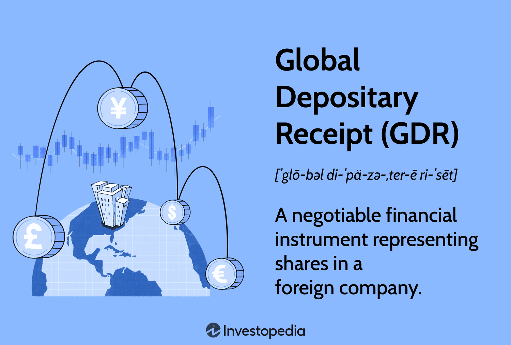

## Table of Contents

## What is an International Depository Receipt (IDR)?

An International Depository Receipt (IDR) is a type of financial instrument that allows investors to own shares in a foreign company without actually buying the shares directly on a foreign stock exchange. Instead, a bank buys the shares and then issues IDRs, which represent those shares. This makes it easier for investors to invest in foreign companies because they can buy and sell IDRs in their own country's currency and on their own country's stock exchange.

IDRs are similar to other depository receipts like American Depository Receipts (ADRs) and Global Depository Receipts (GDRs), but they are specifically designed for trading outside the company's home country and the U.S. They help companies raise money from international investors and can increase the liquidity of the company's shares. For investors, IDRs provide a way to diversify their investment portfolio by including foreign stocks without dealing with the complexities of foreign markets.

## How does an IDR differ from a traditional stock?

An International Depository Receipt (IDR) is different from a traditional stock because it represents ownership in a foreign company, but it's easier for investors to buy and sell. With a traditional stock, you directly own a piece of a company and buy or sell it on that company's home stock exchange. But with an IDR, a bank buys the foreign company's stock and then issues IDRs that represent those stocks. This means you can buy and sell IDRs on your own country's stock exchange, using your own currency, without having to deal with foreign markets.

Another key difference is that IDRs help make investing in foreign companies simpler and more accessible. Traditional stocks from foreign companies can be hard to buy because of different rules, languages, and currencies. IDRs solve these problems by letting investors buy into foreign companies in a familiar way. This can also help the foreign company raise money from more investors around the world, which they might not be able to do as easily with just their traditional stock.

## What are the benefits of investing in IDRs for individual investors?

Investing in International Depository Receipts (IDRs) can be a great way for individual investors to spread their money across different countries without too much hassle. When you buy an IDR, you're actually buying a piece of a foreign company, but you can do it on your own country's stock exchange and with your own currency. This makes it a lot easier than trying to buy stocks directly from a foreign market, which can be tricky because of different rules, languages, and currencies.

Another big benefit is that IDRs let you diversify your investments. By putting your money into companies from different parts of the world, you can reduce the risk that comes with having all your money in one country's economy. If one country's market goes down, your investments in other countries might still do well. This can help keep your overall investment more stable and potentially grow your money over time.

## Can you explain the process of issuing an IDR?

When a company wants to issue an International Depository Receipt (IDR), they work with a bank that acts as a depository. The company gives their shares to this bank, and the bank then creates IDRs that represent those shares. The bank keeps the actual shares in a safe place, often in the company's home country. The IDRs are then sold to investors in other countries through their local stock exchanges.

Once the IDRs are issued, investors can buy and sell them just like regular stocks on their own country's stock exchange. This makes it easier for people from different countries to invest in the company without having to deal with foreign markets directly. The bank handles all the details, like converting money between currencies and making sure everything follows the rules in both the company's home country and the countries where the IDRs are sold.

## Which countries commonly issue IDRs?

Some countries where companies often issue IDRs are India, Russia, and China. These countries see IDRs as a way to let their companies reach more investors around the world. For example, Indian companies like Reliance Industries have issued IDRs to attract investors from other countries. This helps these companies get more money to grow their business.

Russia and China also use IDRs a lot. Russian companies like Gazprom have issued IDRs to make it easier for people outside Russia to invest in them. In China, big companies sometimes issue IDRs to tap into international markets. This not only helps the companies raise money but also makes it simpler for investors from other countries to buy into these growing economies.

## What are the regulatory requirements for issuing an IDR?

Issuing an International Depository Receipt (IDR) involves meeting specific regulatory requirements that can vary from country to country. The company wanting to issue IDRs must work with a bank that acts as a depository. This bank will need to follow the rules set by the regulatory bodies in both the company's home country and the countries where the IDRs will be sold. This often includes getting approval from the home country's securities regulator, like the Securities and Exchange Board of India (SEBI) for Indian companies, and also from the regulators in the countries where the IDRs will be listed.

The process also involves detailed disclosures. The company has to provide a lot of information about its business, financial health, and risks to investors. This information needs to be translated into the languages of the countries where the IDRs will be sold and meet the disclosure standards of those countries' regulatory bodies. Additionally, the company and the depository bank must comply with ongoing reporting requirements, ensuring that investors have up-to-date information about the company's performance. This helps maintain transparency and trust in the IDR market.

## How do IDRs impact the global financial market?

IDRs help make the global financial market more connected. When companies from different countries issue IDRs, they let investors from all over the world buy into their business. This means money can flow more easily between countries, helping companies grow and reach new markets. It also makes it easier for investors to spread their money across different countries, which can help them manage risk better. By doing this, IDRs help make the global economy more stable and dynamic.

At the same time, IDRs can bring more money into a country's stock market. When foreign companies issue IDRs, they attract investors who might not have considered buying into that market before. This can increase the amount of trading and make the market more lively. But it's important to keep in mind that IDRs also come with some risks, like changes in currency values or political issues in the home country of the company. Still, overall, IDRs play a big role in making the global financial market more open and connected.

## What are the risks associated with investing in IDRs?

Investing in IDRs can be risky because they are tied to foreign companies. One big risk is currency changes. If the value of the foreign company's currency goes down compared to your own currency, the value of your IDR might go down too, even if the company is doing well. Another risk is political or economic problems in the company's home country. If there's a crisis or new laws that hurt the company, it can affect the value of the IDR.

There's also the risk that comes with not knowing as much about the foreign company. It can be harder to get good information about how the company is doing, especially if the information is in another language or follows different rules. This can make it harder to make smart investment choices. Plus, IDRs might not be as easy to sell quickly as regular stocks in your own country, which can be a problem if you need your money back fast.

## How can IDRs be used as a tool for international diversification?

IDRs are a great way for investors to spread their money across different countries. When you buy an IDR, you're investing in a foreign company but you can do it easily on your own country's stock exchange. This means you don't have to worry about the hassles of dealing with foreign markets, like different rules or languages. By putting your money into companies from different parts of the world, you can lower the risk that comes from having all your money in one country's economy. If one country's market goes down, your investments in other countries might still do well, which can help keep your overall investment more stable.

Using IDRs for international diversification also helps you tap into growth in other countries. Sometimes, economies in other parts of the world might be growing faster than your own country's economy. By investing in IDRs, you can take advantage of these opportunities without leaving your home market. This can potentially lead to better returns over time because you're not limited to just the companies in your own country. Overall, IDRs make it easier and more accessible for you to spread your investments globally and manage risk more effectively.

## What role do banks and financial institutions play in the IDR market?

Banks and financial institutions are really important in the IDR market. They act as the go-between for the company that wants to issue IDRs and the investors who want to buy them. When a company decides to issue IDRs, they give their shares to a bank, which then creates the IDRs. The bank keeps the actual shares safe, often in the company's home country, and sells the IDRs to investors in other countries. This makes it easier for people from different places to invest in the company without having to deal with foreign markets directly.

These banks also handle all the details, like changing money between currencies and making sure everything follows the rules in both the company's home country and the countries where the IDRs are sold. They need to get approvals from regulators and make sure all the information about the company is shared with investors. By doing all this work, banks and financial institutions help make the IDR market run smoothly and help companies reach more investors around the world.

## How do tax implications vary for IDR investors across different jurisdictions?

When you invest in IDRs, the taxes you have to pay can be different depending on where you live and where the company is from. In some countries, you might have to pay taxes on the money you make from IDRs, like dividends or when you sell them for a profit. But, the rules can be different. For example, in one country, you might get a tax credit for taxes you paid in the company's home country, which can lower your tax bill. In another country, you might have to pay taxes twice, once in the company's home country and again in your own country.

It can get pretty complicated because tax laws change a lot and you have to know the rules in both your country and the company's country. Sometimes, there are special agreements between countries that can help you avoid paying taxes twice. It's a good idea to talk to a tax expert who knows about international investments. They can help you understand what you need to pay and how to make sure you're following all the rules.

## What are some case studies or examples of successful IDR implementations?

One good example of a successful IDR is when Reliance Industries, a big company from India, issued IDRs in 2010. They wanted to let investors from other countries buy into their business easily. By doing this, Reliance was able to raise a lot of money from international investors. It also helped them become more known around the world. Investors liked it because they could buy into a growing Indian company without having to deal with the Indian stock market directly.

Another example is Gazprom, a Russian energy company. They issued IDRs to attract investors from outside Russia. This helped Gazprom raise money to grow their business and reach more people. Investors were happy because they could invest in a big Russian company using their own country's stock exchange. This made it easier for them to diversify their investments and take advantage of opportunities in Russia without the usual hassles of foreign markets.

## What are the risks and considerations?

Investors in International Depository Receipts (IDRs) encounter several risks that require careful consideration. One significant risk is the exchange rate risk, which arises due to the fluctuation in currency values between domestic and foreign markets. For instance, if an investor in the United States holds IDRs of a company based in Europe, any devaluation of the Euro against the US Dollar can lead to a reduction in the asset's value when converted back to USD. To understand this mathematically, consider the formula for converting foreign currency revenue to domestic currency:

$$
\text{Value in Domestic Currency} = \frac{\text{Value in Foreign Currency}}{\text{Exchange Rate}}
$$

Where a lower exchange rate results in a decreased value in domestic currency, highlighting the importance of monitoring currency trends.

Another concern is the regulatory risk, which pertains to the potential impact of changes in domestic and foreign regulations on IDR performance. Different countries have varying regulatory frameworks governing corporate disclosures, tax policies, and trading practices. Any amendments or shifts in these regulations can affect the operations and valuation of companies issuing IDRs, thereby influencing investor returns.

Despite these risks, [algorithmic trading](/wiki/algorithmic-trading) offers strategic avenues to mitigate some of these challenges, maintaining IDRs as a viable investment option. Algorithmic trading technology can detect and exploit [arbitrage](/wiki/arbitrage) opportunities promptly, compensating for unfavorable currency movements. For example, algorithms can automatically execute trades to capitalize on small price discrepancies found in different markets, thus preserving investment value. Additionally, they can assist in adapting quickly to regulatory changes by analyzing large data sets to identify trends and potential regulatory impacts, enabling timely adjustments to trading strategies.

In summary, while exchange rate and regulatory risks are inherent in investing in IDRs, leveraging algorithmic trading can provide investors with tools to manage and potentially reduce these risks, enhancing the attractiveness of IDRs as investment instruments.

## References & Further Reading

[1]: Hallwood, P., & MacDonald, R. (2000). ["International Money and Finance"](https://archive.org/details/internationalmon0000hall_x2j6). Blackwell Publishing.

[2]: Lopez de Prado, M. (2018). ["Advances in Financial Machine Learning"](https://www.amazon.com/Advances-Financial-Machine-Learning-Marcos/dp/1119482089). Wiley.

[3]: Singh, M. (2003). ["The Impact of Algorithmic Trading on Liquidity and Volatility"](https://ijrpr.com/uploads/V5ISSUE6/IJRPR30540.pdf). Financial Analysts Journal.

[4]: Dragu, G., & Litan, C. R. (2006). ["International Depository Receipts and the Cross-listing Process"](https://www.researchgate.net/publication/268527671_Cross-listing_as_a_Global_Depository_Receipt_The_influence_of_emerging_markets_regulation_and_accounting_regime). Journal of Multinational Financial Management.

[5]: Jansen, S. (2020). ["Machine Learning for Algorithmic Trading"](https://github.com/stefan-jansen/machine-learning-for-trading). Packt Publishing.