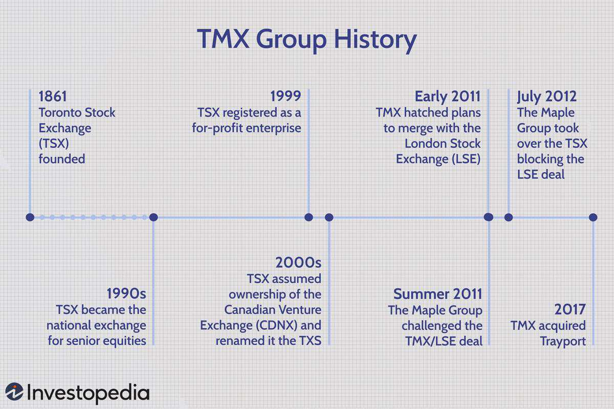

The financial services industry has experienced substantial transformation in recent years, significantly influenced by advances in technology and automation. Central to this evolution are derivatives clearinghouses and algorithmic trading, which have become integral to the functionality and efficiency of modern financial markets.

Derivatives clearinghouses serve as crucial intermediaries in trading, providing a backbone that ensures the secure and reliable settlement of financial transactions. By effectively managing counterparty risks and ensuring smooth transaction completions, these entities enhance the stability of financial markets. Their role in risk mitigation becomes increasingly important as the complexity and volume of trades continue to grow. Clearinghouses bring transparency and reliability, building trust essential for the markets' participants.

Algorithmic trading, on the other hand, has revolutionized the manner in which market transactions are conducted. Leveraging advanced algorithms, this form of trading automates decision-making and execution, facilitating trades executed at lightning speeds of milliseconds. The capability of algorithmic trading to minimize human error and capitalize on minor pricing discrepancies allows for enhanced market efficiency. This method is particularly prominent in high-frequency trading, where the ability to swiftly respond to fleeting market conditions is invaluable.

This article will explore how the integration of clearinghouses and algorithmic trading has collectively impacted financial markets. It will cover the mechanisms by which clearinghouses mitigate risk and bolster market stability, along with examining the rise and advantages of algorithmic trading. The discussion will continue into the challenges facing these innovations right now and the prospects for future developments, promising a comprehensive understanding of their roles and synergies in the financial ecosystem.

## Table of Contents

## Understanding Derivatives Clearinghouses

Clearinghouses play a pivotal role in financial markets by acting as intermediaries that ensure the seamless and secure completion of transactions. Their primary function is to mitigate counterparty risk by standing between buyers and sellers, thus guaranteeing that trade settlements are fulfilled. This reduces the risk of default by either party in a transaction.

One of the core functionalities of a clearinghouse is settlement validation. This process involves verifying the accuracy and authenticity of transactions before they are finalized. By doing so, clearinghouses ensure that all parties involved comply with the agreed terms, preventing potential disputes and fostering a culture of trust within financial markets.

Risk management is another critical function performed by clearinghouses. They actively monitor and assess the risks associated with each transaction, employing strategies to hedge against potential market fluctuations. By maintaining a buffer against adverse market movements, clearinghouses contribute significantly to the overall stability of the financial system.

Clearinghouses also engage in transaction reporting, where they maintain detailed records of all trades processed. This provides transparency and allows regulatory bodies to monitor market activities for compliance with financial regulations. Accurate reporting functions as a deterrent against fraudulent activities and contributes to the integrity of financial markets.

Margin collection and netting are key processes that help clearinghouses maintain market stability. Margins are collateral deposits that traders must maintain to cover potential losses, effectively acting as a safety net. Netting allows for the consolidation of multiple trades into a single obligation, reducing the total number of transactions that need to be settled. This efficiency in processing lowers the systemic risk associated with financial markets.

By providing transparency and reliability, clearinghouses are fundamental to the trust necessary for efficient financial markets. Their operations ensure that investors can participate with confidence, knowing that risks are being managed effectively and that the systems in place support fair and orderly trading.

## Algorithmic Trading: Transforming Market Transactions

Algorithmic trading, commonly referred to as algo trading, involves the use of complex algorithms to automate trading decisions and executions. This technological advancement has fundamentally transformed modern financial markets. By processing large volumes of data and executing orders at substantially increased speeds, [algorithmic trading](/wiki/algorithmic-trading) enhances both the efficiency and effectiveness of market transactions.

One of the primary benefits of algorithmic trading is its ability to execute transactions at a rate far faster than human capabilities, often completing multiple trades within milliseconds. This speed advantage allows market participants to respond to market conditions promptly, capitalizing on short-lived opportunities that may arise due to minor price discrepancies in market securities.

Human error, a notable [factor](/wiki/factor-investing) in traditional trading, is significantly minimized through the deployment of computer algorithms. These algorithms are designed to operate on predefined criteria and rules, which can range from simple strategies based on technical indicators to complex models incorporating [machine learning](/wiki/machine-learning). The precision and automation provided by these algorithms ensure that trading decisions are made logically and consistently, devoid of emotional influences.

Algorithmic trading is particularly prevalent in high-frequency trading ([HFT](/wiki/high-frequency-trading-strategies)), which involves the rapid buying and selling of securities in large volumes. HFT exploits temporary imbalances in the market, such as [arbitrage](/wiki/arbitrage) opportunities, by executing trades at extreme speeds made possible by advanced technology. This rapid approach ensures that traders can efficiently take advantage of brief market fluctuations before these opportunities close.

The success of algorithmic trading is heavily reliant on sophisticated software and hardware infrastructure. Cutting-edge technology is required to process immense quantities of market data in real-time and to execute trades as quickly as possible. Additionally, this technological framework often integrates directly with clearinghouses, organizations that ensure the correct settlement of trades. Such integration is crucial to maintaining the reliability and security of high-speed transactions, as clearinghouses serve as the backbone of trade verification and settlement.

In summary, algorithmic trading has brought unprecedented speed and precision to financial markets. By leveraging advanced technology and sophisticated algorithms, traders can make more informed decisions and execute them with unparalleled efficiency, positioning themselves advantageously in a highly dynamic trading environment.

## The Interplay Between Clearinghouses and Algo Trading

Clearinghouses play a critical role in the ecosystem of algorithmic trading (algo trading) by providing the essential infrastructure that enables high-speed, reliable trade execution. One of their primary functions is netting, where they consolidate multiple trades into a single net position. This process significantly reduces the number of transactions that need to be settled, thereby enhancing the efficiency of large-scale trading operations characteristic of algo trading. By diminishing the sheer [volume](/wiki/volume-trading-strategy) of transactions, clearinghouses lower the costs and operational complexities involved in trade execution.

In addition to netting, clearinghouses engage in rigorous risk assessments to manage potential default risks associated with trading parties. This involves calculating and collecting margin requirements from traders, which serves as collateral to cover potential losses. By doing so, clearinghouses maintain a buffer against market [volatility](/wiki/volatility-trading-strategies), ensuring that even in situations of extreme market movements, the systemic risk is mitigated. This stability is essential for algo trading systems that rely heavily on executing multiple trades within tight time frames.

The synchronization of clearinghouses with algo trading systems augments market reliability and boosts stakeholder confidence. Algo trading, which depends on the precision and speed of automated systems, benefits from the security assurances provided by clearinghouse mechanisms. The risk mitigation and transparency ensured by clearinghouses help maintain orderly market conditions, hence supporting the seamless operation of algorithm-driven transactions.

For market participants, understanding the interplay between clearinghouses and algo trading systems is crucial for optimizing trading strategies and effectively managing risks. The transparency and dependability introduced by clearinghouses make it possible for traders to leverage the full potential of algo trading strategies, executing trades at optimal conditions without the fear of counterparties defaulting. This synergy supports the overarching goal of maintaining market integrity and operational efficiency in modern financial markets.

## Challenges in Derivatives Clearing and Algo Trading

Clearinghouses and algorithmic trading, despite their transformative role in financial markets, face several challenges that necessitate constant adaptation and innovation. Derivatives clearinghouses are central to mitigating counterparty risk, yet they must navigate complex risk management scenarios, especially during periods of market stress or extreme volatility. The evolving regulatory environment presents additional hurdles, requiring these institutions to continually update their processes and ensure compliance. Regulations often demand increased transparency and higher standards for risk management, adding layers of complexity to clearinghouse operations. This regulatory pressure is intended to safeguard the markets but can also strain resources, requiring the development of more sophisticated risk assessment tools and methodologies.

Algorithmic trading, characterized by its reliance on sophisticated algorithms and fast execution speeds, also encounters significant technical and strategic challenges. The infrastructure required for algo trading must be robust, handling vast amounts of data accurately and securely in real-time. Issues such as latency, data integrity, and cybersecurity threats can severely impact the effectiveness of trading strategies. 

Moreover, market volatility can influence the performance of algorithmic strategies. High levels of unpredictability may render certain algorithms ineffective, as they are typically designed based on historical data and market conditions. To mitigate these risks, continuous innovation and the tweaking of algorithms are necessary to adapt to unforeseen market movements.

Both clearinghouses and traders are under pressure to balance compliance with innovation. Regulatory bodies often aim to mitigate systemic risks by imposing stringent requirements, which can sometimes stifle technological advancement. Consequently, firms must strive to achieve compliance while fostering an environment that encourages the development of new solutions. Balancing the need for regulation with the freedom to innovate remains a critical challenge for stakeholders in derivatives clearing and algorithmic trading.

## Future Prospects and Innovations

The future of derivatives clearinghouses and algorithmic trading is increasingly intertwined with advancements in technologies such as blockchain and [artificial intelligence](/wiki/ai-artificial-intelligence) (AI). These technologies are poised to redefine the landscape of financial markets, offering opportunities for enhanced transparency, efficiency, and cost-effectiveness.

Blockchain technology, with its decentralized nature, presents a potential shift toward more decentralized clearing systems. A decentralized clearing system could facilitate peer-to-peer transaction validation and settlement, reducing the dependency on centralized entities and thereby lowering transaction costs. The immutable ledger characteristic of blockchain enhances transparency and traceability, which are crucial for maintaining trust in financial operations. By distributing the ledger across multiple nodes, blockchain ensures that all parties have access to the same data, significantly reducing the possibility of fraud or discrepancies.

AI, on the other hand, can revolutionize the decision-making process in algorithmic trading. AI-driven algorithms have the capacity to analyze vast amounts of data at unprecedented speeds, identifying patterns and trends that may be indistinguishable to human traders. This ability allows for the creation of more sophisticated and customized trading strategies tailored to specific market conditions. Machine learning models can continuously enhance their effectiveness by learning from past trading data, thus optimizing trading opportunities.

Regulatory bodies are likely to adapt their frameworks to better accommodate these technological advancements. As blockchain and AI become more integrated into financial systems, regulators will need to address new challenges such as data privacy, security, and the ethical use of AI. Developing a regulatory environment that supports innovation while ensuring the integrity and stability of the financial system will be crucial. 

For market participants, staying informed about such technological trends and maintaining adaptability is vital. The rapid pace of innovation requires continuous learning and adaptation to harness the benefits while navigating potential risks. By proactively engaging with technological advancements, stakeholders can optimize their market strategies and maintain competitive advantages.

In conclusion, the integration of blockchain and AI into clearinghouses and algo trading signifies a transformative potential for the financial markets. These technologies promise to increase operational efficiency and reduce costs, thus fostering an environment ripe for innovation and growth. Market participants who effectively adapt to these changes are likely to benefit significantly in this evolving landscape.

## Conclusion

The convergence of derivatives clearinghouses and algorithmic trading is integral to the modern financial landscape. Clearinghouses provide a secure and efficient settlement platform, which is essential for the fast-paced operations of algorithmic trading. This relationship ensures that high-frequency trades are executed with minimal risk and high precision, capitalizing on market opportunities that appear and disappear in fractions of a second.

Both clearinghouses and algorithmic trading systems are subject to continual evolution, driven by technological advancements and regulatory changes. Innovations in technology, such as improvements in computing power and data processing, enable faster and more complex trading strategies. Concurrently, regulatory landscapes are constantly shifting, requiring both systems to adapt to new rules and standards designed to enhance market transparency and stability.

To sustain and grow within this environment, stakeholders in the financial market must proactively address challenges and embrace advancements. This involves maintaining a balance between technological innovation and compliance with regulatory requirements. Stakeholders need to focus on establishing clear regulations and developing robust technological infrastructures. This approach not only mitigates risks associated with algorithmic trading but also upholds the stability and integrity of financial markets.

The interaction between derivatives clearinghouses and algorithmic trading underscores the critical need for strategic adaptation. As both systems continue to evolve, the ability to effectively integrate and leverage new technologies will determine the success of market participants. This dynamic interplay is vital for the future of financial markets, defining the path toward more secure, efficient, and equitable trading environments.

## References & Further Reading

1. **International Derivatives Clearing Group, LLC. MarketsWiki**: This source offers comprehensive insights into the function and impact of derivatives clearinghouses within financial markets. It highlights the role these entities play in risk mitigation and market efficiency.

2. **The Role of Clearinghouses in Financial Markets. Algo Trading**: A detailed exploration of how clearinghouses support algorithmic trading, this source examines the integration and operational efficiencies achieved through these collaborative mechanisms.

3. **Traders' Survey on Algorithmic Trading Strategies in Volatile Markets**: This survey provides valuable data on how traders utilize algorithmic strategies in different market conditions, particularly during periods of volatility. It sheds light on the adaptability and precision of algorithmic trading technologies.

4. **Integration of Blockchain and Clearinghouse Operations. Financial Times**: This article discusses the potential for blockchain technology to transform clearinghouse operations, potentially leading to enhanced transparency, reduced costs, and improved transactional efficiency.

5. **Future Trends in Algorithmic Trading and Clearinghouse Partnerships. The TRADE**: This analysis identifies emerging trends in the collaboration between algorithmic trading platforms and clearinghouses. It covers technological advancements and strategic partnerships poised to shape the future of financial markets.