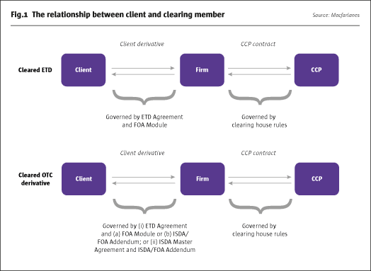

## Table of Contents

## What is the International Derivatives Clearing Group (IDCG)?

The International Derivatives Clearing Group (IDCG) is a company that helps people and businesses trade financial products called derivatives safely. Derivatives are like bets on how things like stocks, interest rates, or currencies will change in the future. IDCG makes sure these bets are fair and secure by standing between the two sides of the trade. This means if one side can't pay, IDCG will cover it, reducing the risk for everyone involved.

IDCG is part of a bigger company called Eurex, which is based in Europe. Eurex is known for its work in the financial markets, especially in Europe. By being part of Eurex, IDCG can use its resources and expertise to help its customers around the world. This connection helps IDCG to be trusted and reliable in the global market for derivatives.

## When was the IDCG established?

The International Derivatives Clearing Group (IDCG) was set up in 2009. It was created to help people and businesses trade derivatives safely. Derivatives are financial products that are like bets on how things like stocks or interest rates will change in the future.

IDCG is a part of a bigger company called Eurex, which is based in Europe. Being part of Eurex helps IDCG because it can use Eurex's resources and knowledge. This makes IDCG trusted and reliable in the global market for derivatives.

## What types of derivatives does the IDCG clear?

The International Derivatives Clearing Group (IDCG) clears different kinds of derivatives. These include [interest rate](/wiki/interest-rate-trading-strategies) swaps, which are agreements to exchange interest payments between two parties. They also clear credit default swaps, which are like insurance policies against someone not paying back a loan. These products help people and businesses manage risks related to interest rates and credit.

IDCG also works with equity derivatives, which are bets on how stock prices will change. This can include options, which give the right to buy or sell stocks at a certain price, and futures, which are agreements to buy or sell stocks at a future date. By clearing these derivatives, IDCG makes sure that trades are safe and fair for everyone involved.

## Who are the main participants in the IDCG?

The main participants in the International Derivatives Clearing Group (IDCG) are banks, financial institutions, and big companies. These groups use IDCG to trade derivatives safely. Banks and financial institutions often use derivatives to manage risks related to interest rates, credit, and stock prices. Big companies might use derivatives to protect themselves from changes in currency values or interest rates that could affect their business.

IDCG also works with smaller companies and individual investors, but they are less common. These smaller participants might use IDCG to trade derivatives for their own investment strategies or to hedge against risks. By including a wide range of participants, IDCG helps create a fair and efficient market for derivatives trading.

## How does the IDCG ensure the safety and stability of the derivatives market?

The International Derivatives Clearing Group (IDCG) helps keep the derivatives market safe and stable by acting as a middleman between buyers and sellers. When someone wants to trade a derivative, like an interest rate swap or a credit default swap, IDCG steps in to make sure the trade is fair. If one side of the trade can't pay, IDCG will cover the cost. This reduces the risk for everyone involved because they know IDCG will handle any problems that come up.

IDCG also uses strict rules and checks to make sure everyone follows the rules. They keep an eye on the market to spot any unusual activity that might be risky. By doing this, IDCG helps prevent big problems that could shake up the market. This way, people and businesses can trade derivatives with more confidence, knowing that IDCG is working to keep the market safe and stable.

## What are the membership requirements for joining the IDCG?

To become a member of the International Derivatives Clearing Group (IDCG), a company needs to meet certain requirements. First, they must show that they are financially stable. This means they need to have enough money and assets to cover any risks that come with trading derivatives. They also need to follow all the rules and regulations set by IDCG and any other relevant financial authorities. This helps make sure that all members are trustworthy and can handle the responsibilities of trading derivatives.

Once a company meets these basic requirements, they need to go through a detailed application process. This involves filling out forms, providing financial statements, and sometimes even going through an interview or audit. IDCG wants to make sure that new members understand how the market works and are ready to trade safely. By having strict membership requirements, IDCG helps keep the derivatives market stable and secure for everyone involved.

## What is the process for clearing and settling derivatives through the IDCG?

When someone wants to trade a derivative through the International Derivatives Clearing Group (IDCG), they first find another party to trade with. Once they agree on the terms, they send their trade details to IDCG. IDCG then steps in as the middleman, becoming the buyer to the seller and the seller to the buyer. This means if one side can't pay, IDCG will cover it, making the trade safer for everyone. IDCG also checks the trade to make sure it follows all the rules and is fair.

After the trade is cleared, IDCG handles the settlement process. This means they make sure the money and the derivative change hands correctly. They keep track of who owes what and when payments are due. If there are any issues, like someone not paying on time, IDCG steps in to fix it. By doing all this, IDCG helps make sure that trading derivatives is smooth and secure for all involved parties.

## How does the IDCG handle risk management and default procedures?

The International Derivatives Clearing Group (IDCG) manages risk by keeping a close eye on all trades and making sure everyone follows the rules. They check how much money and assets each member has to make sure they can cover any losses. If a member's situation changes and they can't cover their risks anymore, IDCG will ask them to put in more money or assets. This helps prevent big problems that could affect the whole market.

If a member can't pay and defaults, IDCG has a plan to handle it. They use the money and assets that the defaulting member put in to cover any losses. If that's not enough, IDCG uses a special fund that all members contribute to. This fund helps make sure that other members are protected and don't lose money because of one member's default. By having these steps in place, IDCG helps keep the derivatives market safe and stable for everyone involved.

## What are the fees associated with using the IDCG's services?

When you use the International Derivatives Clearing Group (IDCG) to trade derivatives, you have to pay some fees. These fees help cover the costs of making sure your trades are safe and fair. The main fee is a clearing fee, which you pay every time you make a trade. This fee can change depending on what kind of derivative you're trading and how much you're trading. There might also be other fees, like membership fees if you want to be a member of IDCG, and fees for using their special services.

IDCG also charges fees to help manage risks. For example, they might ask you to put in more money or assets if they think your trades are risky. This is called a margin requirement, and it's not exactly a fee, but it's something you need to pay attention to. All these fees and requirements help IDCG keep the market stable and protect everyone involved in trading derivatives.

## How does the IDCG compare to other major derivatives clearing organizations globally?

The International Derivatives Clearing Group (IDCG) is one part of a bigger company called Eurex, which is based in Europe. This connection helps IDCG because it can use Eurex's resources and knowledge. IDCG focuses on clearing different kinds of derivatives like interest rate swaps, credit default swaps, and equity derivatives. It works with banks, financial institutions, and big companies to make sure their trades are safe and fair. Compared to other major clearing organizations like the Chicago Mercantile Exchange (CME) or the London Clearing House (LCH), IDCG is smaller but still important in the global market. It's known for its strong risk management and for being part of the trusted Eurex group.

Other major clearing organizations like CME and LCH are bigger and handle a wider range of products. CME, for example, is very big in the United States and clears many types of derivatives, including futures and options on everything from agricultural products to financial instruments. LCH, based in London, is also very large and clears a lot of interest rate swaps and other financial derivatives. Both CME and LCH have been around for a long time and have a lot of members. IDCG, while smaller, focuses on providing high-quality service and strong risk management, which makes it a good choice for some companies and financial institutions looking for a reliable clearing partner.

## What technological innovations has the IDCG implemented to improve its operations?

The International Derivatives Clearing Group (IDCG) has used new technology to make its work better and safer. They have a special computer system that helps them keep track of all the trades happening in real time. This system can spot any problems or unusual activity quickly, which helps IDCG manage risks better. They also use strong security measures to protect all the information they handle, making sure that the trades and the data are safe from hackers.

Another way IDCG has improved is by making it easier for people to use their services. They have created a simple online platform where members can see their trades, check their accounts, and do other tasks without needing to call or email. This platform is easy to use and helps save time. By using these new technologies, IDCG can work more efficiently and provide better service to its members.

## What future developments or expansions are planned for the IDCG?

The International Derivatives Clearing Group (IDCG) is looking to grow its business in the future. They want to offer more types of derivatives for people to trade. This means they might start clearing new products like commodity derivatives or more complex financial instruments. By doing this, IDCG hopes to attract more members and help more people and businesses manage their risks.

IDCG also plans to use more advanced technology to make their services even better. They are thinking about using [artificial intelligence](/wiki/ai-artificial-intelligence) to help them spot risks faster and make their systems more secure. They also want to make their online platform easier to use, so members can do more things on their own without needing help. These changes will help IDCG stay competitive and keep the derivatives market safe and stable.

## References & Further Reading

1. **International Derivatives Clearing Group, LLC. MarketsWiki**: This source offers comprehensive insights into the function and impact of derivatives clearinghouses within financial markets. It highlights the role these entities play in risk mitigation and market efficiency.

2. **The Role of Clearinghouses in Financial Markets. Algo Trading**: A detailed exploration of how clearinghouses support algorithmic trading, this source examines the integration and operational efficiencies achieved through these collaborative mechanisms.

3. **Traders' Survey on Algorithmic Trading Strategies in Volatile Markets**: This survey provides valuable data on how traders utilize algorithmic strategies in different market conditions, particularly during periods of volatility. It sheds light on the adaptability and precision of algorithmic trading technologies.

4. **Integration of Blockchain and Clearinghouse Operations. Financial Times**: This article discusses the potential for blockchain technology to transform clearinghouse operations, potentially leading to enhanced transparency, reduced costs, and improved transactional efficiency.

5. **Future Trends in Algorithmic Trading and Clearinghouse Partnerships. The TRADE**: This analysis identifies emerging trends in the collaboration between algorithmic trading platforms and clearinghouses. It covers technological advancements and strategic partnerships poised to shape the future of financial markets.

