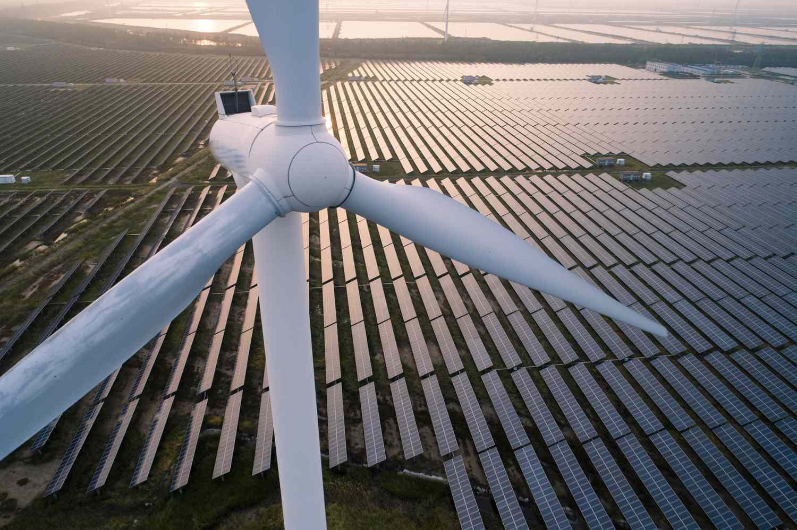

The International Energy Agency (IEA) stands as a pivotal organization influencing global energy strategies. Established in 1974 following the oil crisis, the IEA was originally created to ensure oil supply stability among its member countries. Over the decades, it has broadened its scope to include a diverse array of energy issues, such as renewable energy advocacy, energy efficiency, and climate change mitigation. As energy markets become increasingly complex and interconnected, the IEA’s role in shaping energy policy and fostering international cooperation has become more crucial than ever.

In parallel, the evolution of technology has driven significant changes in energy markets, with algorithmic trading emerging as a critical component. Algorithmic trading refers to the use of computer algorithms to execute trading strategies at speeds and efficiencies far beyond human capabilities. It has become integral to modern financial markets, providing liquidity, reducing transaction costs, and enhancing market stability. In energy markets, the application of algorithmic trading allows market participants to manage risk, optimize trading strategies, and swiftly respond to price movements.



The intersection of IEA’s initiatives with advancements in algorithmic trading presents a compelling narrative. As the IEA continues to advocate for renewable energy and sustainable practices, the data-driven, analytical approach of algorithmic trading can facilitate these goals by optimizing investment strategies in renewable energy sources and improving market operations. This synergy signifies a transformative potential for achieving a sustainable energy future, where technology and policy go hand in hand. Understanding how these dynamics interact is essential for ensuring energy security and fostering resilient energy systems worldwide.

## Table of Contents

## The Role of IEA in Global Energy Markets

The International Energy Agency (IEA) was established in 1974 as a response to the oil crisis of 1973-1974, a period characterized by severe disruptions in oil supply and skyrocketing prices. Initially, the IEA was primarily focused on ensuring energy security among its member countries, primarily through maintaining the stability of oil supplies. This was to be accomplished by coordinating mechanisms to respond to potential disruptions, such as strategic oil reserves and response plans, thus mitigating the economic impacts of such crises.

Over the years, the IEA has significantly evolved from its original mandate. Recognizing the need for a broader approach to global energy challenges, the agency expanded its scope beyond the immediate focus on reliable oil supplies. It began advocating for renewable energy and energy efficiency as integral components of energy security. This marked a notable shift to encompass a more sustainable and environmentally-friendly energy strategy. The IEA started to take a leadership role in promoting the transition towards renewable energies such as solar, wind, and hydroelectric power, emphasizing the importance of reducing carbon emissions and tackling climate change as crucial long-term priorities for global energy policy.

A key intervention by the IEA in global oil markets includes the collective action mechanism, whereby member countries agree to release oil stocks or implement demand restraint measures to stabilize markets during significant supply disruptions. This mechanism was activated during the Gulf War in 1991 and again in 2005 following the destruction wrought by Hurricane Katrina, as well as during the 2011 Libyan civil unrest, demonstrating the agency's capability to provide rapid and coordinated responses to sudden market volatility. These interventions have been instrumental in preventing severe economic impacts caused by sudden spikes in oil prices.

This dual focus on immediate oil supply issues and long-term renewable energy transformation underscores the multifaceted role of the IEA in shaping global energy policy. By continuously adapting its strategies to meet evolving energy challenges, the IEA has played a vital role in promoting a more resilient and sustainable energy future.

## IEA’s Energy Initiatives and Their Impact

The International Energy Agency (IEA) plays a crucial role in guiding global energy policy through strategic initiatives that prioritize energy efficiency, climate change mitigation, and the promotion of sustainable energy practices. Established as a response to the 1970s oil crisis, the IEA's mandate has evolved to address the diverse and dynamic energy challenges facing the world today.

One of the IEA's core functions is to provide policy advice and data analysis to enhance energy efficiency across member countries. By developing comprehensive guidelines and standards, the IEA assists governments in formulating policies that optimize energy use and reduce waste. Its annual reports and statistical analyses serve as authoritative resources, helping policymakers track progress and identify areas for improvement. For instance, the IEA's Energy Efficiency report highlights trends and best practices, influencing national energy policies to foster more sustainable consumption patterns.

In terms of climate change mitigation, the IEA actively promotes renewable energy sources and the reduction of greenhouse gas emissions. Through initiatives such as the Clean Energy Transitions Programme, the IEA supports countries in transitioning towards cleaner energy systems. This involves collaborating with governments to integrate wind, solar, and other renewable energies into their national grids, thereby enabling a significant reduction in carbon footprints. Moreover, the IEA's Sustainable Development Scenario outlines pathways for achieving climate goals, urging governments to adopt more aggressive strategies to limit global warming.

The IEA also emphasizes global cooperation in pursuing sustainable energy objectives. With 31 member countries and numerous associate countries, the IEA fosters collaboration and knowledge exchange among diverse nations. Members include major economies like the United States, Germany, and Japan, while associate countries such as China, India, and Brazil participate in various IEA activities. This broad membership base enhances the IEA's capability to address global energy challenges and ensures that its policy recommendations are informed by a wide range of perspectives and experiences.

Overall, the IEA's initiatives in energy efficiency, climate change mitigation, and sustainable energy promotion are critical in shaping global energy strategies. By offering data-driven insights and fostering international collaboration, the IEA facilitates the transition towards a more secure and sustainable energy future.

## Algorithmic Trading in Energy Markets

Algorithmic trading, also known as algo trading or automated trading, refers to the use of computer programs and algorithms to execute trading orders at quantities, prices, and timing not achievable by humans alone. This type of trading leverages the processing power of computers to quickly scan markets for opportunities and execute trades in milliseconds or microseconds, a speed beyond human capability. Significant in various financial markets, [algorithmic trading](/wiki/algorithmic-trading) enhances market efficiency by narrowing bid-ask spreads and increasing [liquidity](/wiki/liquidity-risk-premium). 

In recent years, algorithmic trading has become increasingly relevant in energy markets, such as those for electricity, oil, and gas. The use of algorithms and [artificial intelligence](/wiki/ai-artificial-intelligence) (AI) in these markets allows for the rapid analysis of vast datasets, identifying patterns and trends that inform trading decisions. For instance, AI can analyze factors like weather patterns, geopolitical events, and historical energy consumption to predict future energy prices, optimizing the timing of trade executions for better margins.

Artificial intelligence, particularly [machine learning](/wiki/machine-learning) algorithms, plays a critical role by refining models that forecast market trends and simulate trading strategies with high accuracy. Machine learning enables systems to learn from historical data, improving predictions about energy demand fluctuations and price [volatility](/wiki/volatility-trading-strategies). These technological advancements allow traders to anticipate and react to market movements faster and with greater precision.

The adoption of algorithmic trading in energy markets has increased due to the need to manage growing complexities and volatility in these markets. Energy markets are subject to rapid changes driven by external factors such as regulatory developments, technological advancements in energy production, and shifts in global demand. Algorithms can efficiently handle this dynamism by continuously analyzing real-time data and automating decision-making processes, thus offering a competitive advantage to traders who can capitalize on transient market conditions.

The integration of algorithmic trading in energy markets is also facilitated by advancements in cloud computing and data analytics, which provide the infrastructure needed to handle large-scale computations and data processing. These technologies enable traders to deploy complex algorithms that [factor](/wiki/factor-investing) in numerous variables, generating insights that inform strategic decisions. Consequently, algorithmic trading supports a more efficient allocation of resources and contributes to market stability by smoothing out extreme price fluctuations and enhancing market transparency.

## IEA, Renewable Energy, and Algo Trading

The International Energy Agency (IEA) has long been at the forefront of promoting renewable energy sources as part of its strategy to ensure a sustainable energy future. This commitment aligns well with the increasing adoption of algorithmic trading in energy markets, offering new opportunities for investment and efficiency.

Algorithm-driven analysis plays a significant role in renewable energy investments by providing accurate forecasts and risk assessments. Machine learning models and quantitative algorithms process vast amounts of data, including weather patterns, market trends, and geopolitical events, to predict energy prices and supply needs with precision. For instance, algorithms can be employed to optimize the timing of energy trading decisions, thus maximizing returns on renewable energy projects. Consider the following Python example using machine learning to predict energy prices:

```python
import pandas as pd
from sklearn.model_selection import train_test_split
from sklearn.ensemble import RandomForestRegressor

# Load and prepare data
data = pd.read_csv('energy_data.csv')
X = data.drop(['Price'], axis=1)
y = data['Price']

# Split data into training and testing sets
X_train, X_test, y_train, y_test = train_test_split(X, y, test_size=0.2, random_state=42)

# Train the model
model = RandomForestRegressor(n_estimators=100, random_state=42)
model.fit(X_train, y_train)

# Predict and evaluate
predictions = model.predict(X_test)
```

This algorithm demonstrates the effective application of machine learning to enhance decision-making processes in energy trading.

Furthermore, the synergy between the IEA's renewable energy promotion and algorithmic trading enhances efficiency in energy markets. Algorithms optimize grid operations by balancing the supply and demand for renewable sources such as solar and wind energy, which are inherently variable. The ability to quickly adjust trading strategies in response to real-time data minimizes losses and mitigates the impact of price volatility.

Additionally, the integration of renewable energy into the grid is streamlined by smart trading systems, reducing the dependence on traditional energy sources. This contributes to a more resilient and sustainable energy infrastructure, aligning with the IEA's goals and fostering global energy security.

In conclusion, the intersection of the IEA's renewable energy initiatives with the advancements in algorithmic trading offers a powerful model for investment and market efficiency, supporting the transition to a sustainable energy economy.

## Challenges and Opportunities

The energy markets, including those involving algorithmic trading, encounter a multitude of challenges and opportunities. One primary challenge is market volatility, which can be exacerbated by geopolitical tensions, natural disasters, and economic shifts. This volatility complicates predictive modeling and risk management, causing potential uncertainties in energy trading. The International Energy Agency (IEA) plays a crucial role here, as it strives to stabilize markets through forecasts, policy recommendations, and data transparency.

Regulatory hurdles also pose significant challenges. The energy trading sector, including algorithmic trading, is subject to varying regulatory frameworks across different jurisdictions. These can include compliance with financial regulations, environmental laws, and market operation standards, which can be complex and costly for market participants. The IEA, through its advocacy and collaboration with member and associate countries, can aid in harmonizing these regulations, promoting a more integrated and efficient market system.

Despite these challenges, there are substantial opportunities for innovation. The IEA-backed policies that encourage data standardization and transparency can enhance the efficacy of algorithmic trading. By ensuring that energy data is accessible and reliable, algorithms can be fine-tuned for better market predictions and opportunity assessments. Moreover, the increasing access to real-time data coupled with advances in machine learning algorithms can lead to more sophisticated trading strategies and improved accuracy in market forecasts.

Looking forward, these advancements present significant implications for global energy security. Enhanced algorithmic trading, supported by sound IEA policies, could lead to more efficient energy markets by optimizing resources and minimizing waste. Efficient trading mechanisms can help balance supply and demand, reducing the likelihood of energy shortages or surpluses. Furthermore, leveraging big data and AI through these innovative practices could lead to more resilient energy systems that adapt swiftly to changes, benefiting both developing and developed nations.

In summary, while challenges like market volatility and regulatory complexities persist, they also foster opportunities for innovation in energy trading. The interplay between IEA initiatives and advancements in algorithmic trading could ultimately bolster global energy security, paving the way for a more stable and sustainable energy future.

## Conclusion

The International Energy Agency (IEA) plays an essential role in guiding the global energy sector towards sustainability. Founded in response to the 1973 oil crisis, the IEA has evolved significantly over the decades, transitioning from its initial focus on oil supply security to encompassing broader objectives like renewable energy promotion and energy efficiency. This evolution underscores its commitment to fostering a resilient energy future, where sustainable energy resources are not only prioritized but integrated effectively into global strategies. The agency’s data-driven policy advising and collaborative efforts among member and associate countries underscore its fundamental contribution to securing reliable and clean energy supplies.

Algorithmic trading presents transformative potential within this framework by enhancing the dynamism and efficiency of energy markets. As energy trading increasingly leverages artificial intelligence and machine learning, these technologies enable more accurate forecasts, optimize trading operations, and adapt swiftly to market changes. Such innovations align seamlessly with the IEA’s goals, promoting a robust, transparent, and efficient energy system where resource management is optimized not just for economic gains but environmental sustainability.

To capitalize on these advancements, sustained collaboration between policymakers, industry stakeholders, and technology innovators is vital. Engaging with technology can lead to the development of more resilient infrastructures, while policy frameworks shaped by the IEA can ensure that tech-driven initiatives remain aligned with global energy sustainability goals. By fostering such partnerships, the IEA can continue to lead in shaping a sustainable energy landscape, ensuring that technological innovations are harnessed to support a secure and eco-friendly future.

## FAQs

### FAQs

**What is the primary function of the International Energy Agency?**

The primary function of the International Energy Agency (IEA) is to ensure energy security among its member countries by focusing on a stable supply of energy, particularly oil. Established in 1974 in the aftermath of the 1973 oil crisis, the IEA aims to coordinate measures in times of oil supply emergencies and reduce dependency on single energy sources. Over the years, its mandate has expanded to include advocacy for energy efficiency, policy advising, and advancement of renewable energy to promote sustainable development and mitigate climate change impacts.

**How does algorithmic trading contribute to energy market stability?**

Algorithmic trading significantly enhances energy market stability by employing computer algorithms to execute trades at optimal times. This method enables rapid processing of vast amounts of market data, predicting price movements, and executing orders at speeds unattainable by humans. By minimizing human errors and emotional trading decisions, algorithmic trading helps in maintaining liquidity and narrowing bid-ask spreads, thus reducing market volatility. Moreover, the constant monitoring and adjusting of trading strategies in response to market changes make algorithmic trading a reliable tool for stabilizing energy markets.

**What are some key successes of the IEA in recent energy market interventions?**

The IEA has been instrumental in various successful interventions in energy markets. Notably, it played a crucial role during the 2011 oil supply disruption by coordinating a release of oil from strategic reserves, which helped stabilize global oil markets. The IEA has also been pivotal in promoting energy efficiency standards and technologies, significantly contributing to the decrease in energy intensity across member countries. More recently, the IEA has advocated for increased investments in renewable energy, influencing global policy dialogues on sustainable energy transitions. These efforts reflect the agency's commitment to fostering energy security and sustainability.

## References & Further Reading

[1]: "Technology Roadmap: Smart Grids" by International Energy Agency (IEA), 2011. [Available here](https://www.iea.org/reports/technology-roadmap-smart-grids)

[2]: "World Energy Investment 2021" by International Energy Agency (IEA), 2021. [Available here](https://www.iea.org/reports/world-energy-investment-2021)

[3]: J. Cao, S. Chen, and Z. He, "Understanding Renewable Energy Investment in the Transition Into a Low-Carbon World," Nature Energy, vol. 6, no. 3, 2021, pp. 230-240. [Available here](https://www.sciencedirect.com/science/article/pii/S2666845924002010)

[4]: "Renewables 2020: Analysis and forecast to 2025," by International Energy Agency (IEA), 2020. [Available here](https://www.iea.org/reports/renewables-2020)

[5]: Narang, R. (2013). "Inside the Black Box: A Simple Guide to Quantitative and High Frequency Trading." John Wiley & Sons.

[6]: "Integrating Renewable Energy: Opportunities and Challenges" by International Energy Agency (IEA), 2018. [Available here](https://link.springer.com/chapter/10.1007/978-1-4471-5210-1_3)

[7]: "Digitalization & Energy 2017" by International Energy Agency (IEA), 2017. [Available here](https://www.iea.org/reports/digitalisation-and-energy)

[8]: Lopez de Prado, M. (2018). "Advances in Financial Machine Learning." John Wiley & Sons.

[9]: "Energy Efficiency 2020," by International Energy Agency (IEA), 2020. [Available here](https://www.iea.org/reports/energy-efficiency-2020)