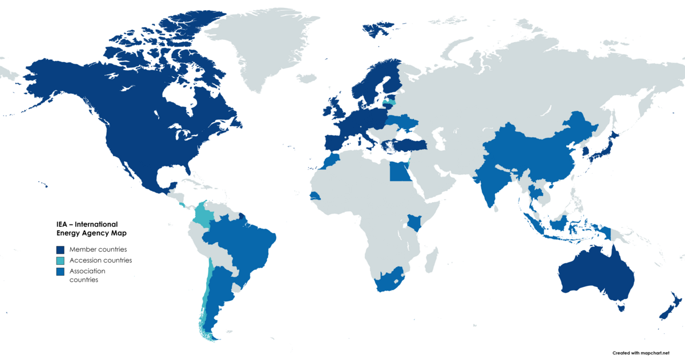

## Table of Contents

## What is the International Energy Agency (IEA)?

The International Energy Agency (IEA) is an organization that helps countries work together on energy issues. It was created in 1974 after an oil crisis to make sure countries could share oil if there was another shortage. The IEA's main goal is to help keep the world's energy supply safe and reliable.

The IEA also gives advice to countries on how to use energy better and how to use more clean energy, like wind and solar power. It does research and shares information to help countries make smart energy choices. The IEA works with many countries, even those that are not members, to solve global energy problems.

## When was the IEA founded and why?

The IEA was founded in 1974. It started because of an oil crisis that happened in the early 1970s. During that time, there was a big problem with oil supply, and many countries realized they needed to work together to make sure they could get oil if there was another crisis.

The main reason for starting the IEA was to make sure countries could share oil with each other if there was another shortage. This was important because oil is a big part of how countries keep their economies running. The IEA helps countries plan and work together so they can handle energy problems better.

## What is the primary purpose of the IEA?

The main goal of the IEA is to keep the world's energy supply safe and reliable. It was created after an oil crisis to make sure countries could help each other if there was another problem with oil. By working together, countries can share oil and make plans to avoid big energy shortages.

The IEA also helps countries use energy better and switch to cleaner types of energy like wind and solar power. It gives advice and shares information to help countries make good energy choices. The IEA works with many countries around the world to solve big energy problems together.

## How does the IEA function on a day-to-day basis?

On a day-to-day basis, the IEA works hard to make sure countries have the information and tools they need to handle energy issues. Its staff, made up of experts from around the world, does research and collects data on things like oil supplies, energy use, and new technologies. They use this information to create reports and give advice to countries on how to use energy better and plan for the future. The IEA also talks with countries every day to help them work together and share ideas on energy policies.

The IEA also keeps an eye on the global energy market to make sure there are no big surprises that could cause problems. If there's a risk of an energy shortage, the IEA quickly tells its member countries so they can take action. It also runs programs to help countries switch to cleaner energy sources, like wind and solar power. Through meetings, workshops, and online tools, the IEA helps countries learn from each other and make smart energy choices every day.

## Who are the member countries of the IEA?

The IEA has many member countries. Some of the countries are Australia, Austria, Belgium, Canada, the Czech Republic, Denmark, Estonia, Finland, France, Germany, Greece, Hungary, Ireland, Italy, Japan, Korea, Luxembourg, the Netherlands, New Zealand, Norway, Poland, Portugal, the Slovak Republic, Spain, Sweden, Switzerland, Turkey, the United Kingdom, and the United States.

These countries work together to keep the world's energy supply safe and reliable. They share information and help each other when there are problems with energy. The IEA also works with other countries that are not members to solve big energy problems around the world.

## How can a country become a member of the IEA?

To become a member of the IEA, a country needs to be a member of the Organisation for Economic Co-operation and Development (OECD). The OECD is a group of countries that work together to help their economies grow and do well. Once a country is part of the OECD, it can start the process to join the IEA.

The country has to show that it has enough oil stored away to last for at least 90 days. This is important because the IEA wants to make sure countries can help each other if there's a problem with oil supplies. The country also needs to agree to follow the IEA's rules and work together with other members. After it does all these things, the country can become a full member of the IEA.

## What are the key programs and initiatives run by the IEA?

The IEA runs many important programs and initiatives to help countries with their energy needs. One big program is the Energy Technology Perspectives (ETP), which gives advice on how to use new technology to make energy cleaner and more efficient. The IEA also has the World Energy Outlook (WEO), which is a big report that looks at the future of energy and helps countries plan for what might happen. Another program is the Global Energy Efficiency Accelerator Platform, which helps countries save energy and use it better in buildings, transport, and industry.

The IEA also works on the Clean Energy Ministerial (CEM), where countries come together to speed up the use of clean energy. This includes things like solar power, wind power, and electric vehicles. The IEA's Technology Collaboration Programmes (TCPs) help countries work together on research and development for new energy technologies. The IEA also runs the Sustainable Development Scenario (SDS), which shows how countries can meet their energy needs while also protecting the environment and helping people live better lives.

## How does the IEA influence global energy policies?

The IEA influences global energy policies by giving countries good information and advice. It does a lot of research and makes reports that show what might happen with energy in the future. This helps countries make smart choices about their energy plans. The IEA also helps countries work together on big energy problems. For example, it can tell countries if there might be a problem with oil supplies, so they can plan ahead and help each other.

The IEA also pushes for cleaner energy. It runs programs that help countries use more wind and solar power and make their energy use more efficient. By doing this, the IEA helps countries meet their goals for a cleaner environment. The IEA talks with countries all the time, sharing ideas and helping them make energy policies that are good for everyone. This way, the IEA helps make the world's energy supply safer and more reliable.

## What role does the IEA play in energy security?

The IEA plays a big role in energy security by making sure countries have enough oil and other energy sources. It was started after an oil crisis to help countries share oil if there is another shortage. The IEA keeps an eye on the global energy market and warns countries if there might be a problem. This way, countries can plan ahead and help each other to avoid big energy shortages.

The IEA also helps countries use energy better and switch to cleaner types of energy like wind and solar power. It gives advice and shares information to help countries make smart energy choices. By working together, countries can solve big energy problems and keep their energy supply safe and reliable.

## How does the IEA contribute to the transition to sustainable energy?

The IEA helps countries switch to sustainable energy by giving them good advice and information. It runs programs like the Clean Energy Ministerial, where countries work together to use more clean energy like wind and solar power. The IEA also helps countries make their energy use more efficient, which means using less energy to do the same things. This is important because it helps save money and reduces the need for dirty energy sources.

The IEA does a lot of research and shares what it learns with countries. It makes reports like the World Energy Outlook that show what might happen with energy in the future. This helps countries plan how to use more sustainable energy. The IEA also runs the Sustainable Development Scenario, which shows how countries can meet their energy needs while also protecting the environment and helping people live better lives. By doing all these things, the IEA helps make the world's energy cleaner and more sustainable.

## What are the major publications and reports produced by the IEA?

The IEA makes a lot of important reports and publications. One big one is the World Energy Outlook (WEO). This report looks at what might happen with energy in the future. It helps countries plan for things like oil supplies, new technologies, and clean energy. Another important report is the Energy Technology Perspectives (ETP). This one gives advice on how to use new technology to make energy cleaner and more efficient. The IEA also makes the Global Energy Review, which looks at how the world uses energy each year.

The IEA also has reports that help with specific issues. For example, the Renewable Energy Market Update gives information about wind, solar, and other clean energy sources. The Energy Efficiency Market Report shows how countries can save energy and use it better. The IEA also makes the Oil Market Report, which keeps an eye on oil supplies and prices. These reports help countries make smart choices about their energy policies and keep their energy supply safe and reliable.

## How does the IEA collaborate with other international organizations?

The IEA works closely with other international groups to help solve big energy problems. It often works with the United Nations (UN) to help countries meet their goals for clean energy and fighting climate change. The IEA also works with the World Bank to help countries in poorer parts of the world get better access to energy and use it more efficiently. By working together, these groups can share ideas and resources to make the world's energy supply safer and cleaner.

The IEA also partners with the Organisation for Economic Co-operation and Development (OECD) because all IEA member countries are also part of the OECD. This helps the IEA and OECD work together on things like energy policies and economic growth. The IEA also works with the International Renewable Energy Agency (IRENA) to help countries use more wind, solar, and other clean energy sources. By working with these groups, the IEA can help make the world's energy more sustainable and reliable.

## References & Further Reading

[1]: "Technology Roadmap: Smart Grids" by International Energy Agency (IEA), 2011. [Available here](https://www.iea.org/reports/technology-roadmap-smart-grids)

[2]: "World Energy Investment 2021" by International Energy Agency (IEA), 2021. [Available here](https://www.iea.org/reports/world-energy-investment-2021)

[3]: J. Cao, S. Chen, and Z. He, "Understanding Renewable Energy Investment in the Transition Into a Low-Carbon World," Nature Energy, vol. 6, no. 3, 2021, pp. 230-240. [Available here](https://www.sciencedirect.com/science/article/pii/S2666845924002010)

[4]: "Renewables 2020: Analysis and forecast to 2025," by International Energy Agency (IEA), 2020. [Available here](https://www.iea.org/reports/renewables-2020)

[5]: Narang, R. (2013). "Inside the Black Box: A Simple Guide to Quantitative and High Frequency Trading." John Wiley & Sons.

[6]: "Integrating Renewable Energy: Opportunities and Challenges" by International Energy Agency (IEA), 2018. [Available here](https://link.springer.com/chapter/10.1007/978-1-4471-5210-1_3)

[7]: "Digitalization & Energy 2017" by International Energy Agency (IEA), 2017. [Available here](https://www.iea.org/reports/digitalisation-and-energy)

[8]: Lopez de Prado, M. (2018). "Advances in Financial Machine Learning." John Wiley & Sons.

[9]: "Energy Efficiency 2020," by International Energy Agency (IEA), 2020. [Available here](https://www.iea.org/reports/energy-efficiency-2020)