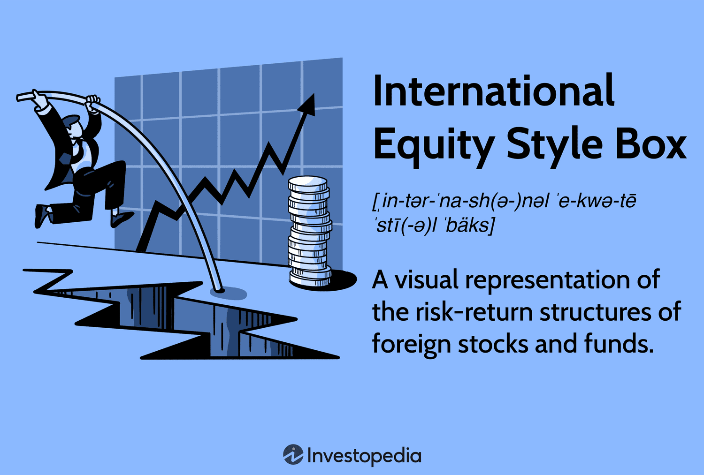

Understanding the basics of international investing and the equity style box is crucial for investors looking to diversify their portfolios globally. International investing allows investors to access markets beyond their home country, offering exposure to different economic environments, growth opportunities, and diversification benefits. By investing across various geographies, investors can mitigate the risks associated with domestic market downturns and capitalize on the growth potential of emerging markets.

The equity style box, a tool developed by Morningstar, categorizes equity investments based on style and market capitalization. It is designed to simplify the complex process of evaluating and selecting stocks by classifying them into nine distinct categories. This structure assists investors in constructing balanced portfolios that are diversified along both style and size dimensions. Understanding the equity style box is essential as it helps investors pinpoint opportunities that align with their risk tolerance and investment objectives.



Algorithmic trading, or algo trading, has revolutionized investment strategies by providing advanced methods to navigate complex markets efficiently. This form of trading uses algorithms—sets of rules or instructions—to automate the decision-making and execution of trades. A primary advantage of algo trading is its ability to process vast amounts of data with speed and accuracy, far surpassing human capabilities. Moreover, it minimizes human error and emotional bias, leading to more consistent investment outcomes.

This article will explore the interconnected roles of the international investing strategy, equity style box, and algo trading in modern investment management. By understanding and integrating these elements, investors can craft strategies that optimize their portfolio performance in today's global markets. Through analysis and practical application, these tools offer a robust framework for managing risk while seeking superior returns.

## Table of Contents

## The Importance of International Investment Strategy

International investing plays a crucial role in contemporary investment management by affording investors an opportunity to diversify their portfolios across different regions and economies. By spreading investments across various countries, investors can mitigate domestic risks and capitalize on diverse economic cycles. This strategy can lead to a more balanced risk profile and potential enhanced returns over time.

## Benefits of International Investing

### Risk Diversification

One of the primary benefits of international investing is risk diversification. By holding assets from multiple geographic regions, investors can reduce the [volatility](/wiki/volatility-trading-strategies) associated with domestic-only portfolios. For example, if a particular country's economy is underperforming, other international investments might stabilize the overall portfolio performance. The correlation between international markets is not perfect, which means they do not all move in the same direction at the same time, providing a natural hedge against domestic market downturns.

### Exposure to Different Economic Cycles

International investments expose investors to a variety of economic cycles and growth opportunities. Economic growth varies significantly across countries due to differing stages of development, monetary policies, and structural economic factors. For instance, emerging markets may offer higher growth potential due to factors like rapid industrialization and a burgeoning middle class, while developed markets may offer stability and steady returns. This exposure allows investors to potentially capitalize on high-growth economies while maintaining a stable investment base in more mature markets.

## Challenges of International Investing

Investing internationally is not without its challenges. 

### Currency Risk

Currency risk is a significant [factor](/wiki/factor-investing) when investing in international markets. Fluctuations in currency exchange rates can impact the returns of a foreign investment. For example, if an investor from the United States invests in European stocks, a depreciation of the Euro against the Dollar might reduce the returns once converted back to Dollars, regardless of the asset's performance in local terms.

### Geopolitical Factors

Geopolitical factors also add complexity to international investments. Political instability, regulatory changes, and trade policies can significantly affect the performance of international investments. Therefore, investors need to consider these factors when selecting markets and stocks.

## Strategies for Selecting International Stocks

Selecting international stocks requires thorough analysis of various factors:

- **Economic Indicators**: Investors should analyze a country's GDP growth rate, inflation, interest rates, and other macroeconomic indicators.

- **Currency Risks**: Understanding and mitigating currency risks through hedging or selecting investments in countries with stable currencies is crucial.

- **Geopolitical Factors**: Evaluating the political climate, regulatory environment, and potential geopolitical risks is essential for protecting investments.

## Historical Examples of Successful International Investing

An example of successful international investing includes the boom in Asian markets during the late 20th century. Investors who capitalized on Japan’s economic rise from the 1960s to the late 1980s or South Korea's rapid industrialization in the 1980s and 1990s gained considerable returns. Similarly, more recent opportunities arose in China as it became a global economic powerhouse following economic reforms.

By understanding the benefits and challenges of international investing, investors can craft a well-rounded strategy that leverages diverse economic conditions globally. With the right strategies, international investing can serve as a key component in building a robust and resilient investment portfolio.

## Understanding the Equity Style Box

The equity style box is a tool developed by Morningstar to categorize mutual funds and other investment vehicles based on two primary dimensions: market capitalization and investment style. Its simple yet effective structure provides investors with a visual representation to help them understand the composition and risk profile of their investment portfolios.

The style box is a three-by-three grid, with the vertical axis representing market capitalization, which is typically divided into large-cap, mid-cap, and small-cap categories. This classification aids investors in assessing the size and market power of the entities they are investing in. The horizontal axis represents the investment style, which can be categorized as value, blend, and growth. Value stocks are generally characterized by lower price-to-earnings ratios and high dividend yields, while [growth stocks](/wiki/growth-stocks) are associated with higher growth potential and reinvestment strategies, often at the cost of present high valuations. Blend represents a mixture of value and growth characteristics.

The equity style box's contribution to investment management lies in its ability to assist in identifying investment opportunities and managing risk across a diversified portfolio. By employing the style box, investors can set targets for diversification across different regions and segments of the market, ensuring a balanced exposure that mitigates risks specific to any single sector or market cap. For example, an investor aiming to achieve a diversified equity portfolio might use the style box to ensure they have adequate representation across different market caps and styles, such as small-cap growth or large-cap value stocks.

In addition to aiding domestic investment strategies, the equity style box can be utilized for international investment analysis. Investors can apply the same three-by-three grid to categorize international equities, ensuring a comprehensive evaluation of global market opportunities. This is especially beneficial given that international markets often behave differently and have varying levels of volatility compared to domestic equities.

Ultimately, the equity style box is a valuable tool for investors looking to analyze and balance their portfolios, providing a clear framework for understanding the interplay between market cap and style across diversified holdings.

## Integration of Algo Trading in Modern Investment Strategies

Algorithmic trading, commonly referred to as algo trading, is the process of using computer algorithms to automate trading decisions and executions in financial markets. These algorithms are based on predefined criteria, often involving complex mathematical models and statistical analysis, to optimize trading strategies and maximize returns. The fundamental role of [algorithmic trading](/wiki/algorithmic-trading) in modern investment strategies is to enhance decision-making capabilities and improve execution efficiency by leveraging advanced technologies.

Algorithmic trading encompasses a variety of strategies, each designed to capitalize on specific market conditions and investor objectives. Three prominent strategies include:

1. **Momentum Trading**: This strategy seeks to capitalize on existing market trends by buying securities that have demonstrated upward price momentum and selling those with downward momentum. The logic behind momentum trading is that assets that are performing well will continue to do so in the near future. A simple momentum strategy can be implemented in Python as follows:

   ```python
   import numpy as np
   import pandas as pd

   # Example price data
   prices = pd.Series([100, 102, 105, 107, 106, 108, 110])
   returns = prices.pct_change()

   # Generate buy (1) and sell (-1) signals based on positive/negative returns
   signals = np.where(returns > 0, 1, -1)
   ```

2. **Trend-following**: This strategy involves identifying and following the direction of market trends over a period. Contrary to momentum trading, trend-following strategies are typically longer-term and aim to capture substantial market moves. A popular method for trend-following is the use of moving averages. When a shorter moving average crosses above a longer moving average, a buy signal is generated, and vice versa for a sell signal.

3. **Arbitrage**: Arbitrage strategies exploit price discrepancies across different markets or instruments. This can involve simple setups, like trading the price difference between two correlated stocks, or more complex strategies that require advanced statistical or machine learning models. An example is statistical arbitrage, where securities are identified based on their statistical profiles and traded against each other to profit from the mean reversion tendencies.

Algorithmic trading offers numerous advantages over traditional manual trading approaches. Key benefits include:

- **Reduced Human Error**: Algorithms eliminate the emotional and psychological biases that can lead to poor decision-making in manual trading. Automation ensures a consistent application of trading rules.

- **Speed and Efficiency**: Algorithms can process and react to market data in fractions of a second. This speed is critical in markets where opportunities can disappear within moments.

- **Scalability and Processing Capacity**: Algorithms can analyze large datasets rapidly, scanning across multiple markets and securities simultaneously to identify trading opportunities that would be impossible for a human to detect.

Through its ability to automate and refine investment strategies, algorithmic trading proves to be an invaluable asset for investors. The systematic approach not only enhances efficiency but also provides a robust mechanism for navigating the intricacies of financial markets. As technology evolves, algorithmic trading is likely to grow even more integral to investment management, offering sophisticated tools for achieving strategic financial objectives.

## Combining International Investing, Equity Style Box, and Algo Trading

The integration of equity style boxes, international investing, and algorithmic trading presents a strategic advantage in navigating the complexities of global markets. Each component plays a crucial role, and their synergies can significantly enhance decision-making and performance outcomes.

Equity style boxes offer a systematic method for categorizing stocks based on investment style and market capitalization. This is particularly beneficial in international markets, where varying economic conditions and corporate practices require precise analytical tools. Using these boxes, investors can systematically assess opportunities within value and growth segments across different market capitalizations, allowing for a structured evaluation of potential investments in diverse economic contexts.

Algorithmic trading enhances this framework by providing a robust mechanism for executing decisions derived from the equity style box analysis efficiently. Algorithms can process vast amounts of market data in real-time, identifying opportunities that align with specific style box criteria. For example, an algorithm could be programmed to focus on undervalued stocks within the small-cap growth segment across emerging markets, executing trades when predefined conditions are met.

Consider the following Python snippet to illustrate a simple algorithmic approach that scans and selects equities fitting a particular style box criterion:

```python
import pandas as pd

# Assuming 'data' is a DataFrame containing international stocks with their styles and market caps
data = pd.read_csv('international_stocks.csv')

def select_stocks(data, style, market_cap_range):
    # Filter stocks by style and market cap
    selected = data[(data['Style'] == style) & 
                    (data['Market_Cap'] >= market_cap_range[0]) &
                    (data['Market_Cap'] <= market_cap_range[1])]
    return selected

style = 'Value'
market_cap_range = (1e9, 5e9)  # Example range in USD for mid-cap stocks
selected_stocks = select_stocks(data, style, market_cap_range)

print(selected_stocks)
```

This code simplifies the process of identifying and listing stocks meeting specific criteria, which can then be fed into an algorithmic trading platform for automated execution based on live market data.

When selecting algorithmic trading platforms for international equities, investors should consider several factors. Critical among these is the platform's capability to handle multi-currency transactions with minimal latency, ensuring trades are executed promptly across different time zones. Additionally, platforms should offer comprehensive data integration, enabling the quick assimilation of economic, financial, and geopolitical information pertinent to the international markets in which they invest. Platforms like MetaTrader and QuantConnect provide extensive support for algorithmic trading in international equity markets, offering historical data, [backtesting](/wiki/backtesting) capabilities, and integrations with major exchanges globally.

By leveraging these synergies, investors can enhance their ability to make informed, effective decisions in international markets. The strategic use of algorithmic trading to apply insights gleaned from equity style box analysis, focused on international equities, provides an edge in managing both risk and return potentials efficiently.

## Case Study: Real-World Application

A prominent example of a portfolio that successfully integrates international investing, equity style boxes, and algorithmic trading is the Global Diversified Growth Fund (GDGF). This fund strategically combines these elements to enhance its performance and risk management while achieving broad diversification.

**Processes and Outcomes:**

**1. International Investing Integration:**
The GDGF diversifies its investments across various geographic regions, including developed and emerging markets. By allocating a portion of the portfolio to international equities, the fund takes advantage of varied economic cycles and growth opportunities worldwide. The selection of international stocks is guided by a thorough analysis of economic indicators, currency risks, and geopolitical factors. This diversification minimizes exposure to market-specific risks and enhances the potential for returns.

**2. Equity Style Box Utilization:**
The fund employs the equity style box methodology to categorize investments based on style (value or growth) and market capitalization (large, mid, or small cap). This approach aids in identifying growth sectors in both domestic and international markets, ensuring a balanced exposure across different investment styles. The style box also facilitates risk management by allowing the fund to adjust its allocations according to market conditions, maintaining a strategic balance between growth potential and value stability.

**3. Algorithmic Trading Implementation:**
GDGF leverages algorithmic trading to optimize its investment strategy. By using data-driven models and algorithms, the fund automates the decision-making and trade execution processes. Strategies such as [momentum](/wiki/momentum) and mean reversion are employed to capitalize on short-term price movements. Algorithmic trading reduces human errors, ensures consistent adherence to the investment strategy, and enables the fund to process large volumes of market data efficiently.

**Performance Metrics:**

Over a five-year period, the GDGF demonstrated a notable enhancement in risk-adjusted returns compared to traditional investment approaches. The Sharpe ratio, a measure of risk-adjusted performance, consistently exceeded benchmarks, reflecting the effectiveness of integrating these strategies. The standard deviation of the portfolio's returns, an indicator of risk, remained lower than that of comparable funds, signifying superior risk management.

**Replication Insights:**

Investors seeking to replicate the GDGF's approach should consider the following strategies:

- **International Diversification:** Blend investments across various international markets, considering economic conditions and geopolitical factors to mitigate specific market risks.

- **Equity Style Box Analysis:** Utilize equity style boxes to categorize investments, ensuring a balanced exposure to different styles and capitalizations that align with market opportunities.

- **Algorithmic Trading Adoption:** Implement algorithmic trading systems to enhance decision-making and execution. Focus on developing or choosing algorithms that align with specific investment goals and market conditions.

By mirroring the GDGF's strategic framework, investors can potentially improve portfolio performance and risk management, achieving diversified growth in the global market landscape.

## Conclusion

In conclusion, the combination of international investing, the equity style box, and algorithmic trading presents investors with a potent framework for constructing robust, diversified portfolios. International investing allows for exposure to diverse economic environments, offering benefits such as risk diversification and opportunities across various economic cycles. By understanding and leveraging the equity style box, investors can categorize investments based on style and market capitalization, enabling more strategic allocation and risk management. This tool aids in identifying potential investment opportunities across different markets, both domestic and international.

Algorithmic trading further enhances this approach by empowering investors with automated decision-making processes that can execute trades with speed and precision. Strategies like momentum, trend-following, and [arbitrage](/wiki/arbitrage) can optimize returns while minimizing the inherent human errors in manual trading. The capability to process vast amounts of data quickly makes algorithmic trading an indispensable asset in the dynamic world of international finance.

Looking forward, investors who integrate these strategies will likely find themselves better positioned to navigate the complexities of global markets. As economic conditions evolve and technology continues to advance, these tools will provide a competitive edge, allowing for adaptive and informed investment strategies.

Investors are encouraged to maintain continuous learning and adaptability in response to ever-changing market conditions. Staying informed about technological advancements in algorithmic trading and developments in international markets will be crucial for success. As the investment landscape shifts, the ability to pivot and integrate new methodologies will be vital for achieving sustained growth and enhanced portfolio performance.

## References & Further Reading

[1]: Sharpe, W. F. (1966). ["Mutual Fund Performance."](https://www.scirp.org/reference/ReferencesPapers?ReferenceID=1451307) Journal of Business, 39(1), 119-138.

[2]: Rouwenhorst, K. G. (1998). ["International Momentum Strategies."](https://onlinelibrary.wiley.com/doi/abs/10.1111/0022-1082.95722) Journal of Finance, 53(1), 267-284.

[3]: ["Global Investing: The Professional's Guide to the World Capital Markets"](https://www.amazon.com/Global-Investing-Professionals-Capital-Markets/dp/007031683X) by Roger G. Ibbotson and Gary P. Brinson

[4]: Loh, R. K., & Stulz, R. M. (2011). ["When Are Analyst Recommendation Changes Influential?"](https://www.nber.org/system/files/working_papers/w14971/w14971.pdf) The Review of Financial Studies, 24(2), 593-627.

[5]: Bodie, Z., Kane, A., & Marcus, A. J. (2014). ["Investments and Portfolio Management"](https://books.google.com/books/about/EBOOK_Investments_Global_edition.html?id=BMsvEAAAQBAJ). McGraw-Hill Education.