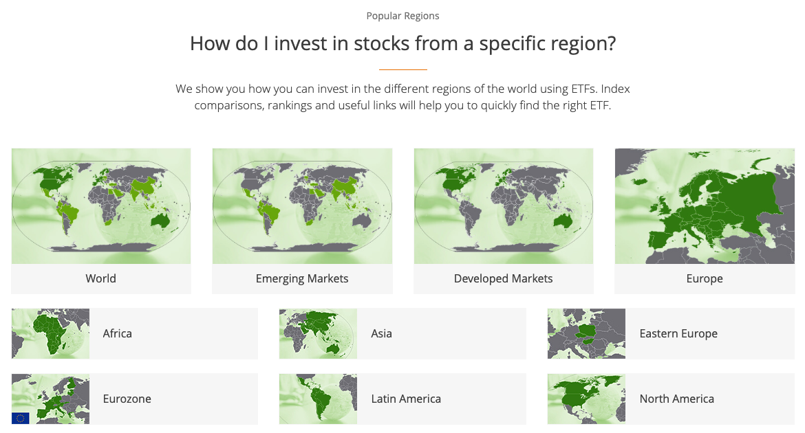

Exchange-Traded Funds (ETFs) have emerged as a prominent tool in the financial markets, offering remarkable versatility and accessibility to a wide range of investors. These instruments are designed to mimic the performance of a specific index, commodity, or a basket of assets, providing a simplified means for individuals to access diversified investment opportunities. Unlike traditional mutual funds, ETFs are traded on stock exchanges throughout the day, similar to individual stocks, which affords investors the flexibility to engage with these securities in real-time.

This article aims to explore several critical aspects that have contributed to the growing appeal of ETFs. We will examine how these investment vehicles function and the unique advantages they offer over more conventional finance options. A deep understanding of the mechanics underlying ETFs, including the arbitrage processes that maintain their price alignment with net asset value, will be elucidated to illustrate their operational efficiency. 



In an increasingly globalized economy, the significance of international ETFs cannot be overstated. These funds allow investors to gain exposure to foreign markets without the complexities and costs associated with direct investments in individual foreign stocks. By enabling diversification across various geographies and economic sectors, international ETFs help mitigate risks tied to specific market downturns, providing a strategic hedge against economic uncertainties and currency fluctuations.

Another transformative aspect of modern ETF trading includes the rise of algorithmic trading, or algo trading. This approach employs sophisticated automated systems to execute trades at high speeds, enhancing liquidity and ensuring more competitive pricing for investors. The integration of AI and machine learning within algo trading tactics heralds a new age in executing ETF trades, offering precision and efficiency that benefit both casual and professional investors. 

For individuals striving to optimize their investment portfolios, understanding the interplay of these elements is crucial. Whether an investor is new to the world of ETFs or boasts a wealth of experience, the combined advantages of leveraging ETF versatility, international diversification, and technological advancements through algorithmic trading present a compelling case for their inclusion in well-rounded investment strategies.

## Table of Contents

## Understanding ETF Functionality

Exchange-Traded Funds (ETFs) function as investment vehicles that combine the diversification benefits of mutual funds with the tradability features of individual stocks. They are listed and traded on stock exchanges, enabling investors to buy and sell shares at market prices throughout the trading day. Unlike mutual funds, which are typically priced once a day, ETFs allow for intra-day transactions, providing greater flexibility to investors.

ETFs are designed to track the performance of a specific index, commodity, or a basket of assets. They hold a portfolio of underlying assets such as stocks, bonds, or commodities. This structure allows investors to gain exposure to a broad array of asset classes with a single transaction, thereby enhancing portfolio diversification. The assets within the [ETF](/wiki/etf-trading-strategies) are managed according to a stated objective, which often involves mirroring the performance of a financial index. Consequently, ETFs come in various forms, including equity, fixed income, commodity, and sector-specific ETFs, among others.

A distinguishing feature of ETFs is their hybrid nature, combining the attributes of mutual funds and individual securities. This is achieved through their open-ended structure, meaning they can issue new shares and redeem existing ones, thus maintaining [liquidity](/wiki/liquidity-risk-premium) and ensuring that the ETF's market price remains in close alignment with its net asset value (NAV). This process, referred to as creation and redemption, involves the ETF working with authorized participants—usually large financial institutions—to add or remove shares from the market. 

The [arbitrage](/wiki/arbitrage) mechanism in ETFs plays a crucial role in maintaining the balance between the market price and the NAV. If an ETF's share price deviates significantly from its NAV, arbitrageurs can step in to exploit the price discrepancy. For instance, if the ETF is trading at a premium, arbitrageurs can buy the underlying assets and create new ETF shares, selling them at the higher market price. Conversely, if the ETF is trading at a discount, they can buy ETF shares and redeem them for the underlying assets, profiting from the differential.

ETFs are renowned for their transparency and cost-effectiveness. Most ETFs disclose their holdings daily, allowing investors to understand exactly what they own. The typically low expense ratios of ETFs make them an attractive option for both short-term traders and long-term investors. This cost efficiency, combined with the absence of load fees and the capability for margin trading and short selling, further enhances the appeal of ETFs.

The creation and redemption mechanism also provides ETFs with a unique tax advantage. Unlike mutual funds, which might incur capital gains tax when rebalancing, ETFs, via their in-kind creation and redemption process, can pass on securities to authorized participants without triggering taxable events. This can result in more favorable after-tax returns for ETF investors compared to traditional mutual funds.

In summary, ETFs offer a flexible, transparent, and cost-efficient way for investors to diversify their portfolios. Their unique structure and trading capabilities provide significant advantages over traditional mutual funds, making them a compelling choice for both individual and institutional investors.

## The Rise of International ETFs

International Exchange-Traded Funds (ETFs) have become an integral part of modern investment portfolios, offering investors a straightforward mechanism to access global markets. These funds are advantageous for their convenience and cost-effectiveness compared to direct investments in foreign stocks. By holding a diversified basket of international securities, international ETFs provide investors exposure to various geographical areas and industry sectors, which aids in risk mitigation. This diversification is essential as it reduces dependency on any single market's performance, thereby offering a buffer against localized economic downturns.

The growth in emerging markets has been a significant driver in the variety of international ETFs now available. These markets offer opportunities for substantial gains due to their rapid development, appealing to investors seeking higher potential returns. ETFs focusing on emerging economies allow investors to participate in these growth stories without the complexities and higher transaction costs associated with investing directly in foreign exchanges.

Furthermore, international ETFs serve as a tool for hedging against currency risks, which can significantly affect investment outcomes. Currency fluctuations can diminish returns on foreign investments when converted back to the investor's home currency. By strategically selecting international ETFs, investors can mitigate this risk, as some ETFs incorporate currency hedging strategies to protect against adverse exchange rate movements. Additionally, the sectoral diversity provided by these ETFs can buffer against economic slumps in specific regions, as downturns in one sector may be offset by growth in another.

In summary, the rise of international ETFs reflects the growing desire for diversified global exposure with managed risk. Their ability to offer access to both developed and emerging markets makes them a versatile tool in constructing a resilient investment portfolio.

## Algorithmic Trading and ETFs

Algorithmic trading, often referred to as algo trading, employs sophisticated automated systems designed to execute trades with superior speed and accuracy compared to manual trading methods. These systems use pre-defined algorithms to determine the timing, price, or quantity of orders, often exploiting tiny price discrepancies efficiently and with minimal human intervention.

One of the primary advantages of [algorithmic trading](/wiki/algorithmic-trading) in the context of Exchange-Traded Funds (ETFs) is its ability to enhance liquidity. This improved liquidity leads to tighter bid-ask spreads, which can be advantageous for ETF investors by potentially providing better price execution. The increased liquidity also supports market stability and reduces transaction costs, making ETFs an attractive investment vehicle.

Algorithmic trading strategies are particularly useful in ETF markets for addressing market inefficiencies. For instance, these strategies can execute large orders without significantly affecting the market price, a critical function when dealing with high-[volume](/wiki/volume-trading-strategy) trading. One approach involves using algorithms to track and exploit [statistical arbitrage](/wiki/statistical-arbitrage) opportunities, where the algorithm identifies and acts on price discrepancies between related ETFs before the market adjusts.

With the rapid progression of technology, the integration of [artificial intelligence](/wiki/ai-artificial-intelligence) (AI) and [machine learning](/wiki/machine-learning) into algorithmic trading has introduced more advanced and adaptable quantitative models. These models can analyze vast datasets to recognize patterns and trends that might not be apparent through traditional analysis techniques. A simple python script example could involve using a machine learning model to predict ETF price movements based on historical data:

```python
import numpy as np
from sklearn.model_selection import train_test_split
from sklearn.ensemble import RandomForestRegressor
from sklearn.metrics import mean_squared_error

# Synthetic dataset of historical ETF prices and features
data = np.random.rand(1000, 5)  # 1000 samples, 5 features
prices = np.random.rand(1000)  # Synthetic target prices

# Split the data
X_train, X_test, y_train, y_test = train_test_split(data, prices, test_size=0.2, random_state=42)

# Create and train the model
model = RandomForestRegressor(n_estimators=100, random_state=42)
model.fit(X_train, y_train)

# Predict and evaluate the model
predictions = model.predict(X_test)
mse = mean_squared_error(y_test, predictions)
print("Mean Squared Error:", mse)
```

In this code, we generate a synthetic dataset and use a Random Forest Regressor to predict ETF price movements, illustrating how machine learning models can be applied to algorithmic trading.

Understanding these algorithmic trading principles is essential for investors looking to maximize the potential of their ETF investments. By staying informed about the latest technologies and methodologies in algo trading, investors can better navigate the complex market landscape and achieve more favorable outcomes in their trading activities.

## Benefits and Challenges of Investing in ETFs

Exchange-Traded Funds (ETFs) present a range of benefits that make them attractive to a wide array of investors, from individuals managing personal finances to large institutional investors. A primary advantage of ETFs is their inherent simplicity compared to other financial derivatives, which allows investors to easily access a diversified portfolio. This diversification is achieved by investing in ETFs that track indices representing entire sectors or markets, offering exposure to a broad range of assets with a single transaction. For example, an investor can achieve diversification by purchasing an ETF that tracks the S&P 500 index, which includes 500 large-cap U.S. publicly traded companies, thereby reducing the impact of individual stock [volatility](/wiki/volatility-trading-strategies).

In addition to simplicity and diversification, ETFs offer cost efficiency. As passively managed funds, most ETFs have lower expense ratios than actively managed mutual funds. The reduced costs stem from the passive management strategy that replicates the performance of a specific index. Furthermore, ETFs are traded on exchanges like individual stocks, allowing investors the flexibility to buy and sell them throughout the trading day at market prices. This feature contrasts with mutual funds, which are typically traded only at the end of the trading day.

Despite these advantages, investing in ETFs is not without challenges. Liquidity can be a concern, particularly with less popular or niche ETFs that have lower trading volumes. Liquidity issues can lead to wider bid-ask spreads, increasing the cost of buying or selling shares. Investors should assess the trading volume and market liquidity of an ETF before investing to avoid excessive costs.

Currency risk is another consideration, especially for international ETFs. Fluctuations in exchange rates can affect the returns of ETFs holding foreign assets. For example, an appreciation in the investor’s local currency relative to the currency of the assets held in the ETF can erode returns. Investors can mitigate this risk through currency-hedged ETFs, though this may come with additional costs.

Tax implications also warrant attention when investing in ETFs. While ETFs are generally tax-efficient due to their structure, differences in tax treatment across countries can affect after-tax returns, particularly for investors in international ETFs. For instance, dividends from foreign securities held in an ETF may be subject to withholding taxes, impacting overall profitability.

Despite these challenges, with careful selection and strategic use, ETFs can significantly boost portfolio performance while managing risks. By leveraging ETFs alongside other investment vehicles, investors can construct a robust portfolio that balances potential returns with risk exposure. Adopting strategies such as dollar-cost averaging (DCA) or tactical asset allocation can further enhance investment outcomes. Here is a simple example of DCA using Python, showing regular investments into an ETF over time:

```python
import numpy as np

investment_amount = 500  # USD per period
periods = 12  # monthly investments for a year
etf_prices = np.array([100, 102, 101, 105, 107, 106, 108, 110, 109, 111, 112, 115])  # example ETF prices

shares_purchased = investment_amount / etf_prices
total_investment = sum(shares_purchased * etf_prices)

average_price_paid = total_investment / sum(shares_purchased)
print(f"Total Shares Purchased: {sum(shares_purchased):.2f}")
print(f"Average Price Paid per Share: {average_price_paid:.2f} USD")
```

By investing consistently over time, investors can reduce the effects of market volatility and achieve a lower average purchase price per share. This strategy, coupled with careful consideration of liquidity, currency, and tax issues, highlights the strategic potential of ETFs in enhancing portfolio diversification and achieving long-term investment goals.

## Conclusion

Exchange-Traded Funds (ETFs) have emerged as a pivotal innovation within the investment landscape, providing a flexible array of options for investors seeking to refine their strategies. These investment vehicles have democratized access to a diverse range of asset classes, enabling investors to tailor their portfolios according to their specific financial goals.

International ETFs have significantly broadened the spectrum of investment opportunities, granting access to a variety of global markets and economic sectors. By facilitating exposure to foreign economies, they empower investors to diversify and optimize risk profiles more effectively than focusing solely on domestic markets.

The integration of algorithmic trading has further revolutionized ETF trading by enhancing efficiency and market liquidity. Algorithmic trading systems enable high-speed execution and better price discovery, rendering ETF trading more accessible and cost-efficient. This advancement is particularly beneficial for modern investors, who can exploit market inefficiencies and achieve superior trade execution.

As the ETF ecosystem continues to evolve, staying informed about functional mechanisms and emerging trends is crucial for capitalizing on the full potential of these investment instruments. Whether for novices or seasoned investors, ETFs present significant opportunities to bolster a well-rounded investment strategy. Understanding their utility and staying attuned to developments within this dynamic field will be essential for maximizing investment success.

## References & Further Reading

[1]: ["International ETFs: Best Exchange-Traded Funds for Global Exposure"](https://www.morningstar.com/funds/best-international-stock-funds) Forbes Advisor

[2]: Poterba, J. M., & Shoven, J. B. (2002). ["Exchange-Traded Funds: A New Investment Option for Taxable Investors"](https://economics.mit.edu/sites/default/files/publications/Exchange-Traded%20Funds%20A%20New%20Investment%20Option.pdf) The American Economic Review.

[3]: ["Exchange Traded Funds in International Investing"](https://www.investopedia.com/terms/i/international-etf.asp) Morningstar.com

[4]: Narang, R. K. (2013). ["Inside the Black Box: The Simple Truth About Quantitative Trading"](https://onlinelibrary.wiley.com/doi/book/10.1002/9781118267738) Wiley Finance.

[5]: Farrell, J. L. (2011). ["Portfolio Management: Theory and Application"](https://archive.org/details/portfoliomanagem0000farr) McGraw Hill Professional.