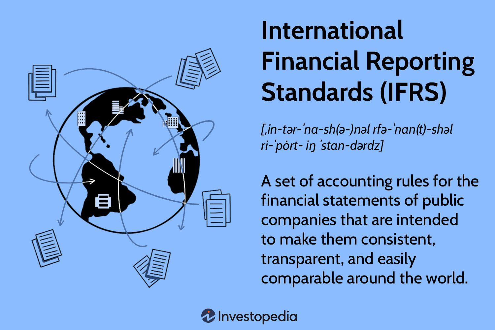

## Table of Contents

## What are International Financial Reporting Standards (IFRS)?

International Financial Reporting Standards (IFRS) are a set of accounting rules that companies around the world use to make their financial statements. These standards help make sure that financial information is clear and comparable no matter where a company is located. They are created by a group called the International Accounting Standards Board (IASB). Many countries have adopted IFRS to help investors and other people understand and compare financial reports from different countries easily.

IFRS covers a wide range of topics, like how to report revenue, how to value assets, and how to show financial performance. They are designed to be flexible so they can be used by different types of businesses, from small companies to large international corporations. The goal is to provide useful information that helps people make smart decisions about investing or doing business with a company. By using the same standards, it's easier for everyone to understand the financial health of a company, no matter where it is based.

## Who develops and maintains IFRS?

The International Financial Reporting Standards (IFRS) are developed and maintained by the International Accounting Standards Board (IASB). The IASB is an independent group that works to create accounting rules that can be used all over the world. They make sure these rules are clear and helpful for everyone who needs to understand a company's financial information.

The IASB is part of a larger organization called the IFRS Foundation. This foundation helps support the IASB's work and makes sure it stays independent. Together, they work to keep the IFRS up to date, so they can meet the needs of businesses and investors everywhere.

## Why were IFRS created and what is their purpose?

IFRS were created to help make financial information easier to understand and compare around the world. Before IFRS, different countries had their own ways of reporting financial information. This made it hard for people, like investors, to understand and compare the financial health of companies from different countries. The goal of IFRS is to have one set of high-quality, global accounting rules that everyone can use.

The purpose of IFRS is to provide clear and useful financial information. When companies use IFRS, it helps investors and others make better decisions about where to put their money or do business. IFRS helps make sure that financial statements are transparent and comparable, no matter where a company is based. This way, people can trust the financial information they see and feel confident in their decisions.

## How do IFRS differ from Generally Accepted Accounting Principles (GAAP)?

IFRS and Generally Accepted Accounting Principles (GAAP) are two different sets of accounting rules used to prepare financial statements. IFRS is used in many countries around the world and is created by the International Accounting Standards Board (IASB). GAAP, on the other hand, is mainly used in the United States and is set by the Financial Accounting Standards Board (FASB). One big difference is that IFRS is more principles-based, which means it gives general rules that companies need to follow. GAAP is more rules-based, meaning it has more detailed and specific rules.

Another difference is how they handle certain financial items. For example, IFRS allows companies to revalue some assets, like property, to their current market value. GAAP usually does not allow this and instead keeps assets at their original cost, minus any depreciation. Also, IFRS and GAAP can have different ways of recognizing revenue, which is the money a company earns from its business activities. These differences can lead to different numbers showing up on a company's financial statements, depending on whether they use IFRS or GAAP.

## Which countries have adopted IFRS?

Many countries around the world have adopted IFRS to make their financial reporting easier to understand and compare. Some of these countries include Australia, Canada, the European Union countries, Japan, and South Korea. These countries use IFRS for their public companies, which means that big businesses in these places follow the same accounting rules.

Other countries that have adopted IFRS include Brazil, China, India, Mexico, and Russia. In some of these countries, like China and India, IFRS is used with a few changes to fit their local needs. This means they mostly follow IFRS but might have some different rules for certain things.

There are also countries that are working on adopting IFRS or have plans to do so in the future. The United States, for example, has not fully adopted IFRS yet but allows some companies to use it. Overall, more and more countries are choosing IFRS to help make financial information clearer and more comparable across the world.

## What are the key principles of IFRS?

IFRS follows some key principles to make sure financial information is clear and useful. One important principle is that financial statements should be understandable, relevant, reliable, and comparable. This means the information should be easy to understand, important for making decisions, trustworthy, and able to be compared with other companies' financial statements. Another principle is that IFRS uses a principles-based approach. This means it gives general rules instead of very specific rules, so companies can use their judgment to report their financial information in a way that makes sense for their business.

Another key principle of IFRS is the concept of "true and fair view." This means that financial statements should show a company's financial position, performance, and changes in financial position in a way that is honest and accurate. IFRS also focuses on the idea of substance over form, which means that the financial statements should reflect the real economic meaning of transactions, not just their legal form. These principles help make sure that the financial information provided by companies using IFRS is helpful for people who need to understand a company's financial health.

## How are IFRS implemented and enforced in different countries?

IFRS are implemented and enforced differently in various countries, depending on their legal systems and the structure of their financial markets. In the European Union, for example, IFRS are required for all listed companies. This means that any company whose stocks are traded on a public stock exchange in the EU must use IFRS for their financial reporting. The enforcement in the EU is handled by national bodies, which make sure companies follow the rules. These bodies can check financial statements and take action if they find any problems.

In other places like Australia and Canada, IFRS are also used for listed companies, but the enforcement might be different. In Australia, the Australian Securities and Investments Commission (ASIC) oversees the use of IFRS, while in Canada, it's the Canadian Securities Administrators (CSA). These organizations make sure that companies follow IFRS and can investigate and penalize companies that don't comply. Some countries, like China and India, have adopted IFRS but with some changes to fit their local needs. They have their own regulatory bodies to enforce these modified versions of IFRS.

In countries where IFRS are not fully adopted, like the United States, the situation can be more complex. The U.S. uses its own accounting rules called GAAP, but it allows some companies to use IFRS if they want to. The Securities and Exchange Commission (SEC) in the U.S. oversees financial reporting and can allow or reject the use of IFRS for certain companies. Overall, the way IFRS are implemented and enforced depends a lot on each country's laws and financial systems, but the goal is always to make sure financial information is clear and trustworthy.

## What are some common challenges companies face when transitioning to IFRS?

When companies switch to IFRS, they often face a few big challenges. One main problem is the cost and time it takes to make the change. Companies need to spend money on training their staff to understand the new rules, and they need to update their accounting systems to follow IFRS. This can take a lot of time and effort, especially for big companies with lots of different parts to their business. Another challenge is that IFRS can be different from the old rules a company was using. This means they might need to change how they report their financial information, which can be confusing and lead to mistakes if they're not careful.

Another issue is that IFRS uses a principles-based approach, which can be hard for some companies to get used to. Instead of very specific rules, IFRS gives general guidelines that need to be applied based on the situation. This can make it harder for companies to know exactly what to do, and they might need to use more judgment when reporting their finances. Also, if a company does business in many different countries, they might need to report under different rules for each place, which can be complicated. Overall, while switching to IFRS can help make financial information clearer and easier to compare, it can be a tough process for companies to go through.

## Can you explain the process of convergence between IFRS and other accounting standards?

The process of convergence between IFRS and other accounting standards, like GAAP, is about making these different sets of rules more similar. This helps because it makes it easier for companies and investors to understand financial information, no matter which set of rules is used. The main groups working on this are the International Accounting Standards Board (IASB), which makes IFRS, and the Financial Accounting Standards Board (FASB), which makes GAAP. These groups have been working together for a long time to find ways to make their rules more alike. They talk about the differences between the standards and try to come up with new rules that both can use. This way, companies in different countries can report their finances in a way that's easier to compare.

One big part of the convergence process was a project called the Norwalk Agreement, started in 2002. This agreement said that the IASB and FASB would work together to make their standards more similar. They set up joint projects to work on specific areas where the rules were different, like how to report revenue or how to value financial instruments. Over the years, they've made a lot of progress, but there are still some differences between IFRS and GAAP. The goal is to keep working on these differences so that eventually, companies all over the world can use the same set of rules. This would make financial information even clearer and easier to understand for everyone.

## What are the latest updates or amendments to IFRS?

The latest updates to IFRS include some important changes. One big change is the new standard called IFRS 17, which is about insurance contracts. This new rule helps insurance companies report their finances in a clearer way. It was made to fix problems with the old rules, which could be confusing and hard to compare. IFRS 17 started being used in January 2023, so insurance companies had to get ready for this big change. Another update is the amendment to IAS 1, which is about how companies show their financial statements. This change makes it easier for people to see important information about a company's finances, like how it manages its money and any risks it faces.

There are also some smaller updates that affect how companies report certain things. For example, there were changes to IAS 12, which is about taxes. These changes help companies report their taxes in a way that makes more sense and is easier to understand. Another update is to IAS 16, which is about property, plant, and equipment. This amendment makes it clearer how companies should report the costs of getting these things ready to use. All these updates are meant to make financial information more useful and easier to compare for investors and other people who need to understand a company's finances.

## How do IFRS impact financial statement analysis and comparability?

IFRS make financial statement analysis easier and more comparable because they set the same rules for companies all over the world. When companies use IFRS, their financial statements follow the same format and rules. This means that if you're looking at the financial statements of a company in Australia and a company in Germany, you can compare them more easily. You can see things like how much money each company makes, what they own, and what they owe in a similar way. This helps investors and other people make better decisions because they can understand and compare the financial health of different companies, no matter where they are located.

However, even with IFRS, there can still be some differences in how companies report their finances. This is because IFRS gives general rules, and companies might need to use their own judgment to apply these rules to their specific situation. Also, some countries might have their own rules that they use along with IFRS, which can make things a bit different. But overall, IFRS helps a lot in making financial statements clearer and more comparable, which is really important for people who need to understand a company's financial health.

## What advanced strategies can companies use to optimize their financial reporting under IFRS?

Companies can use a few smart strategies to make their financial reporting under IFRS even better. One strategy is to really understand the principles behind IFRS. Since IFRS is more about general rules than very specific ones, companies can use their judgment to report their finances in a way that makes sense for their business. This means they should train their staff well and make sure everyone understands how to apply IFRS rules correctly. Another good idea is to use technology to help with reporting. Good accounting software can make it easier to follow IFRS rules and can help catch any mistakes before they become big problems.

Another strategy is to keep an eye on changes to IFRS. The rules can change over time, so it's important for companies to stay updated. They can do this by joining groups that talk about IFRS, going to training sessions, or reading updates from the IASB. This way, they can be ready for any new rules and make sure their financial reporting stays accurate and helpful. By using these strategies, companies can make their financial statements clearer and more useful for investors and other people who need to understand their finances.

## References & Further Reading

[1]: ["International Financial Reporting Standards (IFRS) Briefing"](https://www.iasplus.com/en/standards) from the International Financial Reporting Standards Foundation

[2]: ["IFRS and Global Standards"](https://www.ifrs.org/use-around-the-world/why-global-accounting-standards/) by the International Federation of Accountants

[3]: ["The Role of IFRS in Financial Stability"](https://www.ifrs.org/content/dam/ifrs/around-the-world/policy/ifrs-standards-and-financial-stability.pdf) by the International Monetary Fund

[4]: ["Advances in Financial Machine Learning"](https://www.amazon.com/Advances-Financial-Machine-Learning-Marcos/dp/1119482089) by Marcos Lopez de Prado

[5]: ["Algorithmic Trading and DMA: An introduction to direct access trading strategies"](https://archive.org/details/algorithmictradi0000john) by Barry Johnson

[6]: ["Machine Learning for Algorithmic Trading"](https://github.com/PacktPublishing/Machine-Learning-for-Algorithmic-Trading-Second-Edition) by Stefan Jansen