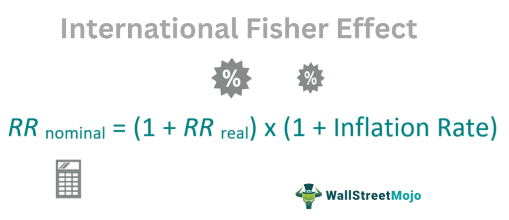

Exchange rates, the relative value of one currency against another, play a crucial role in global trade by influencing the price of goods and services across borders. They impact the competitiveness of nations, determine trade flows, and affect inflation and economic policy decisions. Various factors influence exchange rates, including economic performance, interest rates, inflation, and geopolitical events. In this context, governments and businesses keenly monitor exchange rate movements to make strategic decisions.

The International Fisher Effect (IFE) theory offers a framework for understanding the relationship between interest rates and expected changes in exchange rates. Formulated by economist Irving Fisher, the IFE posits that differences in nominal interest rates between two countries lead to expected changes in their exchange rates. The theory suggests that currencies with higher interest rates will depreciate because the higher nominal interest rates reflect expected inflation, which should equalize real returns across countries. The IFE theory is expressed mathematically as:



$$
\frac{E(S_t)}{S_0} = \frac{(1 + i_d)}{(1 + i_f)}
$$

where $E(S_t)$ represents the expected future exchange rate, $S_0$ is the current exchange rate, $i_d$ is the domestic interest rate, and $i_f$ is the foreign interest rate.

Algorithmic trading, characterized by the use of sophisticated algorithms and software to automate trading strategies, has revolutionized foreign exchange markets. These algorithms can process vast amounts of data at high speed, executing trades based on predefined criteria without human intervention. This method enhances the efficiency, precision, and execution speed of trades, significantly impacting the dynamics of currency markets.

The purpose of this article is to explore how integrating the International Fisher Effect theory with algorithmic trading can improve currency market strategies. By combining a theoretically grounded economic model with advanced technological tools, traders can potentially refine their strategies and capitalize on foreign exchange market opportunities. This integration promises to enhance predictive accuracy and optimize trade execution, offering a robust approach to navigating the complexities of global currency markets.

## Table of Contents

## Understanding Exchange Rates

Exchange rates are the rates at which one currency can be exchanged for another. These rates play a crucial role in international finance as they determine the value of cross-border transactions, influencing trade balances, inflation rates, and economic growth. Exchange rates can be quoted in various forms, including direct quotes (domestic currency per unit of foreign currency) and indirect quotes (foreign currency per unit of domestic currency).

**Factors Influencing Exchange Rates**

Exchange rates are influenced by various factors, encompassing economic indicators, geopolitical events, and market speculation. Key economic indicators affecting exchange rates include interest rates, inflation rates, and gross domestic product (GDP) growth. Higher interest rates offer better returns on investments denominated in that currency, enhancing its demand and value. Conversely, lower interest rates can depreciate a currency as investors seek higher returns elsewhere.

Inflation rates also play an essential role; currencies of countries with lower inflation rates tend to appreciate compared to those with higher inflation rates. GDP growth indicates economic health, impacting exchange rate movements. A robust economy attracts foreign capital, strengthening the currency.

Geopolitical events, such as elections, conflicts, or trade agreements, can induce market [volatility](/wiki/volatility-trading-strategies), impacting exchange rates as investor sentiment shifts in response to perceived economic stability. Furthermore, speculation and market psychology can lead traders to buy or sell currencies, influencing rates through demand and supply dynamics.

**Role of Central Banks and Monetary Policies**

Central banks wield significant influence over exchange rates through monetary policy tools, such as [interest rate](/wiki/interest-rate-trading-strategies) adjustments and open market operations. By manipulating interest rates, central banks can control inflation and stabilize economic growth, indirectly affecting currency values. For instance, an interest rate hike may attract foreign investments, increasing demand for the currency and appreciating its value.

Additionally, central banks might engage in foreign exchange interventions, buying or selling currencies to achieve desired exchange rate levels. These interventions can either stabilize or deliberately undervalue/overvalue a currency to gain competitive trade advantages.

**Currency Pairs Most Affected by Exchange Rate Fluctuations**

Currency pairs consist of two currencies, represented as the base and quote currencies. Some of the most traded currency pairs include the EUR/USD (Euro/US Dollar), USD/JPY (US Dollar/Japanese Yen), and GBP/USD (British Pound/US Dollar). These pairs are considered major currency pairs and are heavily influenced by the economic conditions and monetary policies of their respective countries.

Exchange rate fluctuations in these major pairs often arise from differences in economic performance, interest rate disparities, and geopolitical developments. For example, interest rate differentials between the US and Eurozone can significantly affect the EUR/USD pair, as investors seek higher yields in one currency over the other.

Understanding these dynamics is vital for traders, policymakers, and businesses, as exchange rate movements can profoundly impact profit margins, cost structures, and economic strategies. By analyzing these factors, stakeholders can better navigate the complexities of the global financial system.

## The International Fisher Effect (IFE) Theory

The International Fisher Effect (IFE) theory is an economic hypothesis that establishes a connection between interest rate differentials among countries and the expected changes in their exchange rates. It is rooted in the Fisher Effect, developed by economist Irving Fisher, which suggests that real interest rates are independent of monetary measures, specifically anticipating that nominal interest rates reflect expected inflation. The IFE, therefore, extends this concept to the international context, positing a direct relationship between interest rate differentials and currency value fluctuations.

Mathematically, the IFE is represented by the equation:

$$
E(e) = i_d - i_f
$$

where $E(e)$ is the expected change in the exchange rate, $i_d$ is the domestic interest rate, and $i_f$ is the foreign interest rate. According to the IFE, if domestic interest rates are higher than foreign rates, the domestic currency is expected to depreciate accordingly.

The fundamental assumptions of the IFE theory include the following: international capital mobility, efficient markets, the absence of transaction costs, and rational expectations among investors. These assumptions form the basis for the theoretical linkage between interest rates and exchange rate movements.

The IFE's core assertion is that currencies with higher nominal interest rates will depreciate because the higher rates reflect expected inflation. It suggests that an investment's return equilibrium is achieved globally—an investor should expect no [arbitrage](/wiki/arbitrage) profits from interest rate differentials after accounting for potential exchange rate changes.

Despite its theoretical appeal, the IFE theory faces several critiques and limitations, particularly in its real-world application. One notable limitation is that the IFE assumes exchange rate changes are solely influenced by interest rate differentials, overlooking other critical factors like market speculation, geopolitical influences, and central bank interventions. Additionally, the rational expectations and efficient markets assumptions do not always hold due to market imperfections and investor behavior anomalies.

Empirical studies have yielded mixed results regarding the IFE's predictive accuracy, with some findings supporting the theory under specific conditions while others highlight its inconsistencies. For instance, short-term exchange rates often display significant volatility unaccounted for by interest rate differentials, questioning the IFE's validity in certain scenarios.

In summary, while the International Fisher Effect offers a structured framework to anticipate exchange rate movements based on interest rate disparities, its assumptions and applicability are often contested. Consequently, traders and economists frequently combine it with other analytical tools and models to build comprehensive currency market strategies.

## Algo Trading in Forex Markets

Algorithmic trading, often referred to as algo trading, involves using computer programs to execute trades at optimal speeds and prices based on pre-defined criteria. This approach to trading has evolved significantly since its inception in the 1970s, largely driven by technological advancements and the increasing complexities of financial markets. The adoption of [algorithmic trading](/wiki/algorithmic-trading) in the Forex (foreign exchange) markets is particularly noteworthy due to the market's vast [liquidity](/wiki/liquidity-risk-premium), 24-hour availability, and decentralized nature.

### Benefits of Algorithmic Trading in Forex Markets

1. **Speed and Efficiency**: Algo trading allows for rapid execution of trades, which is critical in Forex markets where currency prices can fluctuate in milliseconds. Automated systems can place orders with precise timing, minimizing latency compared to human traders.

2. **Data Processing Capabilities**: Algorithms can analyze vast amounts of market data to identify trading opportunities. They can incorporate real-time data feeds and historical analysis to make informed decisions. This ability to process and analyze data quickly gives traders a competitive edge in the fast-paced Forex market.

3. **Reduction of Human Error**: By automating trades, algo trading minimizes the risk of human error and emotional decision-making. This results in more disciplined and consistent trading strategies.

### Common Tools and Software

Developers use a variety of tools and platforms to create trading algorithms. Popular programming languages include Python, C++, and Java, valued for their computational capabilities and extensive libraries. Python is particularly favored due to its simpler syntax and versatile libraries such as NumPy, pandas, and Ta-Lib for quantitative analysis and strategy development.

Platforms like MetaTrader 4 and 5 provide integrated environments for developing, testing, and deploying Forex trading algorithms. These platforms often include [backtesting](/wiki/backtesting) capabilities, allowing traders to test their strategies against historical data to validate their effectiveness before live deployment.

### Risks and Regulatory Aspects

While algo trading offers numerous advantages, it is not without risks. One major concern is the possibility of technical failures, such as software bugs or connectivity issues, which can lead to significant financial losses. Additionally, systems are only as good as their underlying algorithms; incorrect assumptions or inadequate risk management strategies can result in poor performance or unexpected market exposure.

Regulation is another critical aspect, as authorities such as the Commodity Futures Trading Commission (CFTC) in the United States impose rules to ensure market stability and fairness. These regulations may include requirements for algorithmic platforms to have adequate risk controls, testing procedures, and transparency measures to mitigate systemic risks.

In conclusion, algorithmic trading has transformed the Forex market by offering traders increased speed, efficiency, and data analytical capabilities. While the tools and platforms available to develop these algorithms are robust, traders must remain mindful of the inherent risks and comply with regulatory standards to harness the full potential of algo trading in currency exchanges.

## Integrating IFE Theory with Algorithmic Trading

The integration of the International Fisher Effect (IFE) theory into algorithmic trading can potentially enhance the precision of foreign exchange (Forex) market strategies by leveraging the relationship between interest rate differentials and expected exchange rate changes. Below, strategies and methods to incorporate IFE into trading algorithms are explored, along with potential benefits and challenges.

### Methods to Incorporate IFE Theory into Trading Algorithms

To integrate IFE theory into trading strategies, one can model the expected change in exchange rates using interest rate differentials. The IFE suggests that currencies with higher interest rates will depreciate in value against those with lower rates, reflecting the differential.

#### Mathematical Representation

The IFE can be mathematically represented as:

$$
\frac{E(S_{t+1}) - S_t}{S_t} \approx i\_d - i\_f
$$

where $E(S_{t+1})$ is the expected future spot exchange rate, $S_t$ is the current spot exchange rate, and $i\_d$ and $i\_f$ are the domestic and foreign interest rates, respectively. This relationship can be coded into Python using libraries like NumPy and Pandas for handling datasets:

```python
import numpy as np
import pandas as pd

def expected_exchange_rate(current_rate, domestic_rate, foreign_rate):
    return current_rate * (1 + (foreign_rate - domestic_rate))

current_rate = 1.2  # Example current exchange rate
domestic_rate = 0.03  # Domestic interest rate
foreign_rate = 0.01  # Foreign interest rate

future_rate = expected_exchange_rate(current_rate, domestic_rate, foreign_rate)
print(f"Expected Future Exchange Rate: {future_rate}")
```

### Case Studies or Hypothetical Scenarios

1. **Case Study: USD/EUR IFE-Based Strategy**

   An algorithm could monitor the interest rate announcements of the Federal Reserve and the European Central Bank. Suppose the U.S. interest rates are expected to decrease, whereas Eurozone rates remain stable. According to IFE, the USD should depreciate relative to the EUR. An algo-trader could execute a long position on EUR/USD pairs based on this information.

2. **Hypothetical Scenario: GBP/JPY Strategy**

   By continuously tracking real-time data, a trader can develop a strategy to trade GBP/JPY based on the anticipated changes in interest rates governed by the Bank of England and the Bank of Japan. The algorithm implements trades when discrepancies between the IFE projected rates and the current market rates offer profitable opportunities.

### Benefits of Using IFE-Informed Algos

Incorporating IFE theory into algo trading offers several advantages:

- **Enhanced Predictive Power**: Incorporating IFE predictions enriches models with anticipated long-term currency movements.
- **Data-Driven Decision Making**: Algorithms can process vast amounts of data to execute trades more efficiently than human traders.
- **Risk Management**: Algorithms can include IFE-based risk assessments to avoid positions in currencies misaligned with interest rate differentials.

### Challenges and Potential Solutions

1. **Accuracy of Interest Rate Projections**

   The effectiveness of IFE-based strategies depends on accurate interest rate forecasts. Incorporating [machine learning](/wiki/machine-learning) models to predict these rates from macroeconomic indicators might enhance accuracy.

   ```python
   from sklearn.linear_model import LinearRegression

   model = LinearRegression()
   # Assumed interest rate and economic indicators dataset
   model.fit(training_data, interest_rates)

   predicted_rates = model.predict(new_economic_data)
   ```

2. **Market Volatility**

   IFE does not account for short-term volatility due to political or economic shocks. Implementing stop-loss and take-profit thresholds ensures that trades minimize risk during unexpected market moves.

3. **Computational Costs**

   High-frequency trading algorithms, especially those incorporating IFE theory, require significant computational resources. Cloud-based solutions or optimizing algorithms for parallel processing could alleviate computational burdens.

Incorporating the IFE theory into algorithmic trading is not without challenges, but it represents a sophisticated approach to trading in Forex markets, improving the exploitation of interest rate differentials to forecast exchange rate trends effectively.

## Future Trends and Innovations

The currency markets are continuously evolving, shaped by technological innovations and global economic shifts. These trends [carry](/wiki/carry-trading) significant implications for the International Fisher Effect (IFE) theory and algorithmic trading strategies.

Emerging trends in currency markets suggest a growing reliance on data analytics and quantitative models. These trends may redefine the application of IFE theory in trading decisions by incorporating more complex variables into models that predict currency movements. One trend is the increasing use of [alternative data](/wiki/best-alternative-data) sources, such as social media sentiment and satellite imagery, to gain insights into economic conditions that influence foreign exchange rates. By integrating such data into algorithmic trading strategies, traders can augment the predictive power of traditional financial theories like the IFE.

Technological advancements are poised to enhance the application of IFE theory in trading. High-frequency trading ([HFT](/wiki/high-frequency-trading-strategies)) and other technological improvements facilitate quicker execution of trades, allowing traders to exploit minuscule interest rate differentials predicted by IFE models. Moreover, blockchain technology is expected to improve transparency and efficiency in currency transactions, potentially reducing arbitrage opportunities that the IFE theory sometimes assumes are readily exploitable.

Artificial intelligence (AI) and machine learning play crucial roles in developing sophisticated trading algorithms. Machine learning models can process vast amounts of data to identify patterns and correlations that may not be evident through conventional analytical methods. For instance, a machine learning model can be trained to discern complex relationships between macroeconomic indicators and currency values, optimizing trading strategies informed by IFE predictions. A potential Python implementation could employ Scikit-learn or TensorFlow libraries to build predictive models:

```python
from sklearn.ensemble import RandomForestRegressor
import numpy as np

# Sample data preparation
X_train = np.array([[interest_rate_diff, other_factor1, other_factor2], ...])
y_train = np.array([exchange_rate_movement, ...])

# Model training
model = RandomForestRegressor(n_estimators=100, random_state=42)
model.fit(X_train, y_train)

# Predicting future exchange rate movements
future_predictions = model.predict(np.array([[future_interest_rate_diff, future_other_factor1, future_other_factor2]]))
```

Global economic shifts also impact IFE and algorithmic trading strategies. The increasing economic integration and cross-border capital flows can lead to more synchronized monetary policies among major economies, affecting the interest rate differentials central to the IFE theory. Moreover, geopolitical events, such as trade wars or changes in trade agreements, can introduce volatility and uncertainty in currency markets, challenging the assumptions of economic parity relations like the IFE.

In conclusion, emerging trends and technological innovations are reshaping currency markets, offering new opportunities and challenges for traders leveraging IFE theory and algorithmic methods. As [artificial intelligence](/wiki/ai-artificial-intelligence) and machine learning continue to evolve, they will provide advanced tools for developing more accurate and efficient trading strategies, essential for navigating the complexities of global economic landscapes.

## Conclusion

The examination of exchange rates, the International Fisher Effect (IFE) theory, and algorithmic trading reveals a comprehensive view of the dynamic nature of foreign exchange markets. Understanding exchange rates is fundamental, as they are crucial in determining international competitiveness and economic stability. The factors influencing these rates range from economic indicators to geopolitical events, with central banks and monetary policies playing pivotal roles.

The IFE theory provides a theoretical framework that links interest rate differentials to expected exchange rate changes. Although this theory presents a consistent mathematical approach to forecasting currency movements, it is not without limitations, as real-world complexities often challenge its assumptions. Despite these critiques, the IFE theory remains a valuable tool for economic prediction.

Algorithmic trading represents a transformation in how currency markets operate, offering speed, efficiency, and enhanced data handling capabilities. By incorporating sophisticated algorithms into trading strategies, market participants can process vast amounts of information rapidly and execute trades with precision. However, the integration of such technology introduces risks, necessitating careful regulatory oversight.

The synergy between IFE theory and algorithmic trading can lead to refined strategies in currency markets. By embedding IFE principles within trading algorithms, traders can better anticipate exchange rate movements and optimize trade executions. Despite the potential challenges in merging these two domains, the opportunities for improved performance are significant.

Looking ahead, further research and innovation are essential to fully leverage the intersection of economic theories and cutting-edge technology. Advancements in artificial intelligence and machine learning could offer more sophisticated models for trading strategies, enhancing the predictability and efficiency of market operations. Encouraging continued experimentation in integrating IFE with algorithmic trading will likely yield valuable insights and contribute to the evolution of market strategies.

## References & Further Reading

[1]: Fisher, Irving. (1930). "The Theory of Interest: As Determined by Impatience to Spend Income and Opportunity to Invest It." Macmillan.

[2]: Mishkin, Frederic S. (1992). ["Is the Fisher Effect for Real? A Reexamination of the Relationship between Inflation and Interest Rates."](https://www.sciencedirect.com/science/article/pii/030439329290060F) Journal of Monetary Economics, 30(2), 195-215.

[3]: Lopez de Prado, Marcos. (2018). ["Advances in Financial Machine Learning."](https://www.amazon.com/Advances-Financial-Machine-Learning-Marcos/dp/1119482089) John Wiley & Sons.

[4]: Aronson, David R. (2006). ["Evidence-Based Technical Analysis: Applying the Scientific Method and Statistical Inference to Trading Signals."](https://www.amazon.com/Evidence-Based-Technical-Analysis-Scientific-Statistical/dp/0470008741) Wiley.

[5]: Chan, Ernest P. (2008). ["Quantitative Trading: How to Build Your Own Algorithmic Trading Business."](https://github.com/ftvision/quant_trading_echan_book) Wiley.

[6]: Poon, Ser-Huang. (2005). ["Forecasting Volatility in Financial Markets."](https://www.aeaweb.org/articles?id=10.1257/002205103765762743) John Wiley & Sons. 

[7]: Taylor, Mark P. (1995). ["The Economics of Exchange Rates."](https://www.jstor.org/stable/pdf/2728909.pdf) Journal of Economic Literature, 33(1), 13-47.

[8]: Dacorogna, Michel M., et al. (2001). ["An Introduction to High-Frequency Finance."](https://www.sciencedirect.com/book/9780122796715/an-introduction-to-high-frequency-finance) Academic Press.