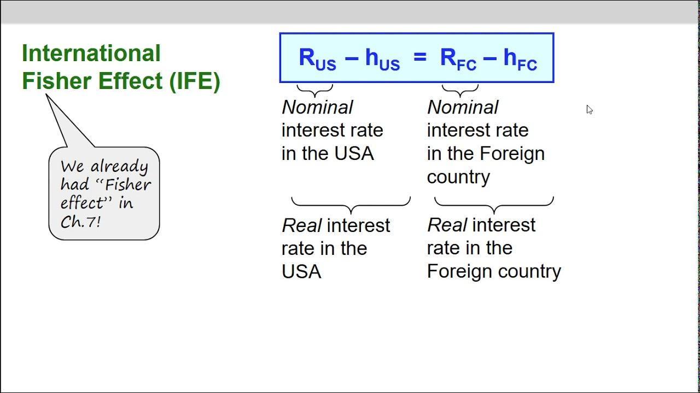

## Table of Contents

## What is the International Fisher Effect (IFE)?

The International Fisher Effect (IFE) is a theory in economics that helps explain the relationship between interest rates and currency exchange rates. It suggests that the difference in interest rates between two countries should be equal to the expected change in the exchange rate between their currencies. In simpler terms, if one country has a higher interest rate than another, its currency is expected to depreciate in the future to balance out the difference.

This theory is based on the idea that investors will move their money to countries with higher interest rates to get better returns. However, as more money flows into a country, its currency will become stronger in the short term. Over time, though, the currency is expected to weaken to the point where the higher interest rate is offset by the lower value of the currency. This helps maintain an equilibrium in the global financial markets.

## Who developed the International Fisher Effect?

The International Fisher Effect was developed by economist Irving Fisher in the early 20th century. Irving Fisher was an American economist who made many important contributions to economics. He came up with the idea of the International Fisher Effect while studying how interest rates and inflation relate to each other.

The International Fisher Effect is based on Fisher's earlier work on the Fisher Effect, which looks at the relationship between interest rates and inflation within one country. Fisher noticed that if a country has higher interest rates, it usually also has higher inflation. He then extended this idea to compare different countries, leading to the International Fisher Effect. This theory helps explain why currencies might change in value when interest rates between countries are different.

## How does the IFE relate to interest rates and exchange rates?

The International Fisher Effect (IFE) says that the difference in interest rates between two countries should be the same as the expected change in their currency exchange rates. Imagine Country A has higher interest rates than Country B. According to the IFE, people will want to invest their money in Country A to get better returns. This can make Country A's currency stronger at first because more people want it. But over time, the IFE predicts that Country A's currency will get weaker compared to Country B's currency. This happens until the higher [interest rate](/wiki/interest-rate-trading-strategies) in Country A is balanced out by the lower value of its currency.

This idea helps explain why currencies might change in value when interest rates are different between countries. If you know the interest rates in two countries, you can guess how their currencies might change in the future. For example, if the interest rate in the United States is higher than in Japan, the IFE suggests that the U.S. dollar might get weaker against the Japanese yen over time. This theory helps investors and businesses understand and predict changes in currency values, which is important for making decisions about where to invest or how to manage international trade.

## What is the basic formula used to express the International Fisher Effect?

The basic formula for the International Fisher Effect is pretty simple. It says that the difference in interest rates between two countries should be equal to the expected change in their exchange rates. If you want to write this as a formula, it looks like this: (1 + i_domestic) / (1 + i_foreign) = (E_t+1 / E_t), where i_domestic is the interest rate in the domestic country, i_foreign is the interest rate in the foreign country, E_t is the current exchange rate, and E_t+1 is the expected future exchange rate.

Let's break this down with an example. If the interest rate in the United States is 3% and in Japan it's 1%, the IFE says the U.S. dollar should get weaker against the Japanese yen over time. The formula helps us see how much weaker. If you plug in the numbers, you can figure out what the expected change in the exchange rate should be. This helps people who are investing or doing business across borders to plan better and understand how currency values might change in the future.

## Can you explain the assumptions behind the IFE?

The International Fisher Effect (IFE) relies on a few key assumptions to work. One big assumption is that capital can move freely between countries. This means that investors can easily move their money from one country to another to chase higher interest rates. If this wasn't true, the IFE wouldn't hold because money wouldn't flow to where the interest rates are higher. Another assumption is that investors are looking for the highest returns they can get after adjusting for inflation. This means they care more about real returns than just the interest rate numbers.

Another important assumption is that inflation rates and interest rates are closely linked. The IFE assumes that if a country has higher interest rates, it's probably because of higher inflation. This link between inflation and interest rates is crucial for the IFE to predict how exchange rates will change. Finally, the IFE assumes that people have good guesses about future exchange rates. If everyone expects one country's currency to get weaker, they'll act on that expectation, which can actually make it happen. These assumptions help the IFE explain how interest rates and exchange rates are connected.

## How does the IFE differ from the Fisher Effect?

The Fisher Effect and the International Fisher Effect (IFE) are related but look at different things. The Fisher Effect is about how interest rates and inflation work together in one country. It says that if a country's interest rate goes up, it's usually because inflation is going up too. This helps people understand why their money might not grow as much as they think when they save or invest in their own country.

The International Fisher Effect takes the Fisher Effect a step further and looks at what happens between different countries. It says that if one country has higher interest rates than another, its currency should get weaker over time. This is because people will move their money to the country with higher interest rates, making its currency stronger at first. But then, to balance things out, that currency will get weaker. So, the IFE helps explain how money moves around the world and why exchange rates change.

## What are some real-world examples where the IFE has been observed?

One real-world example where the International Fisher Effect (IFE) has been observed is in the relationship between the United States and Japan during the 1980s and 1990s. During this period, interest rates in the United States were generally higher than in Japan. According to the IFE, the U.S. dollar should have weakened against the Japanese yen over time. And that's exactly what happened. The U.S. dollar did weaken against the yen, which aligns with what the IFE predicts when there's a big difference in interest rates between two countries.

Another example can be seen in the relationship between the United Kingdom and the Eurozone in the early 2000s. The UK had higher interest rates compared to many countries in the Eurozone. The IFE would suggest that the British pound should have weakened against the euro over time. And indeed, the pound did weaken against the euro during this period. These examples show how the IFE can help explain why currencies might change in value when interest rates between countries are different.

## How accurate is the International Fisher Effect in predicting exchange rate movements?

The International Fisher Effect (IFE) tries to predict how exchange rates will change based on interest rates between countries. It's a useful idea, but it's not always right. Sometimes, the IFE works well and helps explain why one country's money gets weaker or stronger compared to another country's money. For example, if the U.S. has higher interest rates than Japan, the IFE might correctly predict that the U.S. dollar will get weaker against the Japanese yen over time.

However, the IFE isn't perfect. It makes some guesses that don't always happen in real life. For instance, it assumes that money can move freely between countries, which isn't always true because of rules and restrictions. Also, the IFE thinks that people always make smart guesses about future exchange rates, but people can be wrong. Because of these things, the IFE might not always predict exchange rate changes accurately. Still, it's a helpful tool for understanding how interest rates and exchange rates are connected.

## What are the limitations and criticisms of the IFE?

The International Fisher Effect (IFE) has some problems that make it less useful at times. One big issue is that it assumes money can move freely between countries. But in the real world, there are often rules and restrictions that stop money from moving easily. This means the IFE might not work well in places where it's hard to move money around. Another problem is that the IFE thinks people always make good guesses about future exchange rates. But people can be wrong, and their guesses can change the exchange rates in ways the IFE doesn't expect.

Also, the IFE relies on the idea that interest rates and inflation are closely linked. But sometimes, this link isn't as strong as the IFE thinks. For example, a country might have high interest rates because of other reasons, not just inflation. This can mess up the IFE's predictions about how exchange rates will change. Because of these limitations, the IFE is not always accurate in predicting how currencies will move. Still, it's a helpful tool for understanding the big picture of how interest rates and exchange rates are connected.

## How can investors use the IFE in forex trading strategies?

Investors can use the International Fisher Effect (IFE) to help them make better choices in [forex](/wiki/forex-system) trading. The IFE says that if one country has higher interest rates than another, its currency should get weaker over time. So, if an investor sees that the interest rate in the United States is higher than in Japan, they might guess that the U.S. dollar will get weaker against the Japanese yen. They could use this guess to decide when to buy or sell these currencies. For example, they might buy yen now, expecting it to become more valuable compared to the dollar later.

However, the IFE isn't perfect, so investors need to be careful. They should look at other things too, like how easy it is to move money between countries and what other people think will happen to exchange rates. The IFE can give investors a good starting point, but they need to use it along with other information to make the best trading decisions. By understanding the IFE, investors can get a better idea of how interest rates might affect currency values and plan their trades more wisely.

## What role does inflation expectation play in the IFE?

Inflation expectation is really important for the International Fisher Effect (IFE). The IFE says that if one country has higher interest rates than another, its currency should get weaker over time. But why do interest rates go up? Often, it's because people expect inflation to go up too. If people think prices will go up a lot in the future, they'll want more money for lending it out now. So, the interest rate goes up to match the expected inflation. The IFE uses this idea to guess how exchange rates will change.

When people expect inflation to be different in two countries, it can change how they move their money around. If everyone thinks inflation will be higher in the United States than in Japan, they might move their money to the U.S. to get a better return. But the IFE says that over time, the U.S. dollar should get weaker against the Japanese yen to balance things out. So, inflation expectations help the IFE predict how currencies might change in value. It's all about how people think prices will change in the future and how that affects where they put their money.

## How does the IFE integrate with other economic theories like purchasing power parity?

The International Fisher Effect (IFE) and purchasing power parity (PPP) are two economic theories that help explain how exchange rates change. The IFE looks at the difference in interest rates between countries and says that if one country has higher interest rates, its currency should get weaker over time. On the other hand, PPP focuses on how prices for goods and services in different countries affect exchange rates. It says that if a burger costs more in the United States than in Japan, the U.S. dollar should get weaker against the Japanese yen until the prices are the same when you change the money.

These two theories can work together to give a fuller picture of what might happen to exchange rates. For example, if interest rates are higher in the United States than in Japan, the IFE says the U.S. dollar should weaken over time. At the same time, if prices for goods are also higher in the U.S., PPP would suggest the same thing – that the U.S. dollar should get weaker against the yen. By looking at both theories, investors and economists can get a better idea of why currencies might change in value and make more informed guesses about the future.

## What is the International Fisher Effect (IFE) Theory?

The International Fisher Effect (IFE) theory is an economic hypothesis that establishes a connection between interest rate differentials among countries and the expected changes in their exchange rates. It is rooted in the Fisher Effect, developed by economist Irving Fisher, which suggests that real interest rates are independent of monetary measures, specifically anticipating that nominal interest rates reflect expected inflation. The IFE, therefore, extends this concept to the international context, positing a direct relationship between interest rate differentials and currency value fluctuations.

Mathematically, the IFE is represented by the equation:

$$
E(e) = i_d - i_f
$$

where $E(e)$ is the expected change in the exchange rate, $i_d$ is the domestic interest rate, and $i_f$ is the foreign interest rate. According to the IFE, if domestic interest rates are higher than foreign rates, the domestic currency is expected to depreciate accordingly.

The fundamental assumptions of the IFE theory include the following: international capital mobility, efficient markets, the absence of transaction costs, and rational expectations among investors. These assumptions form the basis for the theoretical linkage between interest rates and exchange rate movements.

The IFE's core assertion is that currencies with higher nominal interest rates will depreciate because the higher rates reflect expected inflation. It suggests that an investment's return equilibrium is achieved globally—an investor should expect no [arbitrage](/wiki/arbitrage) profits from interest rate differentials after accounting for potential exchange rate changes.

Despite its theoretical appeal, the IFE theory faces several critiques and limitations, particularly in its real-world application. One notable limitation is that the IFE assumes exchange rate changes are solely influenced by interest rate differentials, overlooking other critical factors like market speculation, geopolitical influences, and central bank interventions. Additionally, the rational expectations and efficient markets assumptions do not always hold due to market imperfections and investor behavior anomalies.

Empirical studies have yielded mixed results regarding the IFE's predictive accuracy, with some findings supporting the theory under specific conditions while others highlight its inconsistencies. For instance, short-term exchange rates often display significant [volatility](/wiki/volatility-trading-strategies) unaccounted for by interest rate differentials, questioning the IFE's validity in certain scenarios.

In summary, while the International Fisher Effect offers a structured framework to anticipate exchange rate movements based on interest rate disparities, its assumptions and applicability are often contested. Consequently, traders and economists frequently combine it with other analytical tools and models to build comprehensive currency market strategies.

## How can IFE Theory be integrated with Algorithmic Trading?

The integration of the International Fisher Effect (IFE) theory into [algorithmic trading](/wiki/algorithmic-trading) can potentially enhance the precision of foreign exchange (Forex) market strategies by leveraging the relationship between interest rate differentials and expected exchange rate changes. Below, strategies and methods to incorporate IFE into trading algorithms are explored, along with potential benefits and challenges.

### Methods to Incorporate IFE Theory into Trading Algorithms

To integrate IFE theory into trading strategies, one can model the expected change in exchange rates using interest rate differentials. The IFE suggests that currencies with higher interest rates will depreciate in value against those with lower rates, reflecting the differential.

#### Mathematical Representation

The IFE can be mathematically represented as:

$$
\frac{E(S_{t+1}) - S_t}{S_t} \approx i\_d - i\_f
$$

where $E(S_{t+1})$ is the expected future spot exchange rate, $S_t$ is the current spot exchange rate, and $i\_d$ and $i\_f$ are the domestic and foreign interest rates, respectively. This relationship can be coded into Python using libraries like NumPy and Pandas for handling datasets:

```python
import numpy as np
import pandas as pd

def expected_exchange_rate(current_rate, domestic_rate, foreign_rate):
    return current_rate * (1 + (foreign_rate - domestic_rate))

current_rate = 1.2  # Example current exchange rate
domestic_rate = 0.03  # Domestic interest rate
foreign_rate = 0.01  # Foreign interest rate

future_rate = expected_exchange_rate(current_rate, domestic_rate, foreign_rate)
print(f"Expected Future Exchange Rate: {future_rate}")
```

### Case Studies or Hypothetical Scenarios

1. **Case Study: USD/EUR IFE-Based Strategy**

   An algorithm could monitor the interest rate announcements of the Federal Reserve and the European Central Bank. Suppose the U.S. interest rates are expected to decrease, whereas Eurozone rates remain stable. According to IFE, the USD should depreciate relative to the EUR. An algo-trader could execute a long position on EUR/USD pairs based on this information.

2. **Hypothetical Scenario: GBP/JPY Strategy**

   By continuously tracking real-time data, a trader can develop a strategy to trade GBP/JPY based on the anticipated changes in interest rates governed by the Bank of England and the Bank of Japan. The algorithm implements trades when discrepancies between the IFE projected rates and the current market rates offer profitable opportunities.

### Benefits of Using IFE-Informed Algos

Incorporating IFE theory into algo trading offers several advantages:

- **Enhanced Predictive Power**: Incorporating IFE predictions enriches models with anticipated long-term currency movements.
- **Data-Driven Decision Making**: Algorithms can process vast amounts of data to execute trades more efficiently than human traders.
- **Risk Management**: Algorithms can include IFE-based risk assessments to avoid positions in currencies misaligned with interest rate differentials.

### Challenges and Potential Solutions

1. **Accuracy of Interest Rate Projections**

   The effectiveness of IFE-based strategies depends on accurate interest rate forecasts. Incorporating [machine learning](/wiki/machine-learning) models to predict these rates from macroeconomic indicators might enhance accuracy.

   ```python
   from sklearn.linear_model import LinearRegression

   model = LinearRegression()
   # Assumed interest rate and economic indicators dataset
   model.fit(training_data, interest_rates)

   predicted_rates = model.predict(new_economic_data)
   ```

2. **Market Volatility**

   IFE does not account for short-term volatility due to political or economic shocks. Implementing stop-loss and take-profit thresholds ensures that trades minimize risk during unexpected market moves.

3. **Computational Costs**

   High-frequency trading algorithms, especially those incorporating IFE theory, require significant computational resources. Cloud-based solutions or optimizing algorithms for parallel processing could alleviate computational burdens.

Incorporating the IFE theory into algorithmic trading is not without challenges, but it represents a sophisticated approach to trading in Forex markets, improving the exploitation of interest rate differentials to forecast exchange rate trends effectively.

## References & Further Reading

[1]: Fisher, Irving. (1930). "The Theory of Interest: As Determined by Impatience to Spend Income and Opportunity to Invest It." Macmillan.

[2]: Mishkin, Frederic S. (1992). ["Is the Fisher Effect for Real? A Reexamination of the Relationship between Inflation and Interest Rates."](https://www.sciencedirect.com/science/article/pii/030439329290060F) Journal of Monetary Economics, 30(2), 195-215.

[3]: Lopez de Prado, Marcos. (2018). ["Advances in Financial Machine Learning."](https://www.amazon.com/Advances-Financial-Machine-Learning-Marcos/dp/1119482089) John Wiley & Sons.

[4]: Aronson, David R. (2006). ["Evidence-Based Technical Analysis: Applying the Scientific Method and Statistical Inference to Trading Signals."](https://www.amazon.com/Evidence-Based-Technical-Analysis-Scientific-Statistical/dp/0470008741) Wiley.

[5]: Chan, Ernest P. (2008). ["Quantitative Trading: How to Build Your Own Algorithmic Trading Business."](https://github.com/ftvision/quant_trading_echan_book) Wiley.

[6]: Poon, Ser-Huang. (2005). ["Forecasting Volatility in Financial Markets."](https://www.aeaweb.org/articles?id=10.1257/002205103765762743) John Wiley & Sons. 

[7]: Taylor, Mark P. (1995). ["The Economics of Exchange Rates."](https://www.jstor.org/stable/pdf/2728909.pdf) Journal of Economic Literature, 33(1), 13-47.

[8]: Dacorogna, Michel M., et al. (2001). ["An Introduction to High-Frequency Finance."](https://www.sciencedirect.com/book/9780122796715/an-introduction-to-high-frequency-finance) Academic Press.