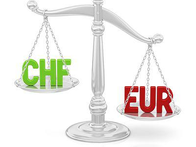

The foreign exchange market (forex) is an integral component of global finance, acting as the backbone facilitating currency exchange and international trade. Forex's vast liquidity and dynamic nature make it indispensable for both countries and corporations, providing a platform for converting earnings and payments into different currencies. Considering its critical role, the establishment of standardized agreements such as the International Foreign Exchange Master Agreement (IFEMA) is essential. IFEMA plays a pivotal role in unifying and streamlining forex transactions, reducing transaction ambiguity and enhancing market stability.

This article focuses on the significance of IFEMA in financial contracts, with a spotlight on the burgeoning area of algorithmic trading. Algorithmic trading, which involves using algorithms to execute trades at remarkable speeds and volumes, has revolutionized the forex market, minimizing human intervention and diminishing errors. The synergy between IFEMA's standardized framework and algorithmic trading strategies ensures efficient transaction execution and robust market performance.



We will explore how IFEMA not only underpins the consistency of forex transactions but also adapts to the evolving landscape shaped by algorithmic systems. IFEMA’s protocols and guidelines help mitigate risks, manage conflicts, and foster international trading partnerships, reinforcing a stable trading environment. Additionally, the article aims to provide financial professionals and investors with insights into the mechanics of forex contracts and automated trading strategies.

Ultimately, readers will achieve a comprehensive understanding of IFEMA's role in standardizing forex transactions and algorithmic trading's transformative impact on financial markets. This knowledge is crucial for navigating the complexities of modern trading and leveraging opportunities within the continually evolving forex landscape.

## Table of Contents

## Understanding the International Foreign Exchange Master Agreement (IFEMA)

The International Foreign Exchange Master Agreement (IFEMA) is a critical standardized contract governing spot and forward transactions in the foreign exchange (forex) market. Established in 1997, IFEMA was developed by leading financial committees to address the complexities and inherent risks involved in currency exchange processes. It serves as an essential tool for financial institutions by providing a clear and uniform protocol for executing and settling forex contracts.

The creation of IFEMA was motivated by the need to streamline currency transactions and minimize associated risks, such as credit and settlement risks, that could arise from differing legal and jurisdictional frameworks. By standardizing procedures, IFEMA significantly reduces the ambiguity that often accompanies foreign exchange agreements, thereby enhancing overall market efficiency.

IFEMA includes comprehensive guidelines that cover crucial aspects of [forex](/wiki/forex-system) transactions. The agreement meticulously outlines the responsibilities and obligations of the involved parties, specifying procedures for contract creation and settlement. It addresses potential issues like default and force majeure, which are critical for maintaining the integrity of financial transactions. These provisions ensure that there are predefined responses to unforeseen events, thereby protecting both parties from potential financial turmoil.

Key components of IFEMA include its detailed rules on transaction default and settlement terms. For instance, the agreement mandates conditions under which a party may declare a transaction default, as well as the remedial steps to be undertaken in such events. This predefined approach allows parties to manage risks proactively, thus fostering a stable trading environment. By defining these scenarios, IFEMA makes it less likely that disputes will escalate to costly legal battles, thereby maintaining smooth market operations.

The standardization provided by IFEMA plays a vital role in reducing transaction ambiguity, a common issue in international trade. Without a clear set of rules, parties involved in forex transactions might have differing expectations and interpretations of their obligations, leading to disputes and inefficiencies. By harmonizing the terms under which transactions are conducted, IFEMA enables market participants to operate with a higher degree of confidence and reliability.

Moreover, IFEMA enhances market efficiency by facilitating faster transaction processing times. With fewer ambiguities, financial institutions can execute trades more quickly, which is especially crucial in forex markets where timing can significantly impact profitability. Standardized agreements also lower the legal and administrative costs associated with drafting bespoke contracts for each transaction, presenting further efficiencies and cost benefits to market participants.

In summary, the International Foreign Exchange Master Agreement serves as a foundational element in managing forex transactions. By providing standardized protocols, IFEMA not only reduces transactional uncertainties but also streamlines the entire currency exchange process, thus supporting a more robust and efficient forex market.

## IFEMA's Role in Financial Contracts and Market Stability

The International Foreign Exchange Master Agreement (IFEMA) plays a critical role in streamlining foreign exchange transactions by providing a standardized framework that ensures clarity and consistency. This agreement serves as a cornerstone for financial institutions engaging in forex transactions, reducing ambiguity and enhancing transparency.

IFEMA addresses potential contractual disputes by setting clear guidelines for conflict resolution. This standardized approach minimizes risks associated with disagreements in foreign exchange trading. By establishing detailed protocols, IFEMA preempts situations that could otherwise lead to legal conflicts, ensuring smoother transaction processes for all parties involved. The agreement outlines specific procedures for handling various scenarios, such as default and force majeure, which significantly mitigates operational risks.

The stability of market conditions is further bolstered by IFEMA's comprehensive terms, which provide a predictable and reliable environment for trading. By promoting uniformity in transaction protocols, IFEMA reduces uncertainty for traders and financial institutions, thereby enhancing trust among international trading partners. The clear framework provided by the agreement fosters confidence in cross-border transactions, which is crucial for maintaining the [liquidity](/wiki/liquidity-risk-premium) and stability of global financial markets.

IFEMA's influence extends beyond transaction stability; it also plays a pivotal role in shaping regulatory practices and ensuring market compliance. The agreement's standardized terms serve as a benchmark for regulatory bodies, facilitating the development of coherent regulations across different jurisdictions. This harmonization of rules is essential for maintaining the integrity of the forex market and protecting market participants from unfair practices.

In conclusion, IFEMA not only mitigates risks and fosters trust among international trading partners but also influences regulatory practices, ensuring compliance and market stability. Through its comprehensive and consistent framework, IFEMA is instrumental in maintaining an orderly forex market, which is essential for the efficiency and reliability of international financial transactions.

## Integrating Algorithmic Trading with Forex Contracts

Algorithmic trading, often referred to as algo trading, has brought a profound transformation to the foreign exchange (forex) markets. This methodology involves the use of computer algorithms to execute trades at high speeds and large volumes, which allows traders to capitalize on even the smallest market fluctuations efficiently. By leveraging algorithms to decide aspects such as the timing, price, and quantity of orders, traders can implement complex trading strategies without the need for direct human intervention, thereby minimizing human error and emotion-driven decisions.

In the context of forex trading, the integration of [algorithmic trading](/wiki/algorithmic-trading) with standardized contracts like those provided by the International Foreign Exchange Master Agreement (IFEMA) is crucial. IFEMA's role in facilitating foreign exchange transactions ensures that even as trades are executed swiftly by machines, the underlying contracts remain consistent and predictable. This standardization is particularly valuable for algorithmic trading, where predefined conditions dictate trade execution. By using IFEMA's contracts, traders can rely on a uniform framework that reduces the complexity and ambiguity often associated with cross-border transactions.

Algorithmic trading leverages IFEMA's standardized contracts to optimize trading performance. This is achieved by integrating sophisticated strategies that [factor](/wiki/factor-investing) in market conditions, historical data, and predictive models. The algorithms can analyze vast amounts of data to identify optimal trading opportunities based on predetermined criteria. For instance, a simple moving average crossover strategy could be implemented using an algorithm to automatically buy or sell currencies when a short-term moving average crosses above or below a long-term moving average.

```python
import pandas as pd

def moving_average(data, window):
    return data.rolling(window=window).mean()

currency_data = pd.Series([...])  # hypothetical currency price data

short_window = 40
long_window = 100

short_mavg = moving_average(currency_data, short_window)
long_mavg = moving_average(currency_data, long_window)

buy_signals = (short_mavg > long_mavg) & (short_mavg.shift(1) <= long_mavg.shift(1))
sell_signals = (short_mavg < long_mavg) & (short_mavg.shift(1) >= long_mavg.shift(1))
```

The implications of algorithmic trading extend to market liquidity and [volatility](/wiki/volatility-trading-strategies). Automated trades can enhance market liquidity by increasing the [volume](/wiki/volume-trading-strategy) of buy and sell orders, thereby narrowing bid-ask spreads and reducing transaction costs. However, the speed and volume of algo trading can also contribute to market volatility, particularly during periods of market stress, where rapid execution of stop-loss orders and similar strategies might amplify price swings.

To mitigate the risks associated with increased volatility, financial markets often implement safeguards such as circuit breakers or impose limits on the speed and size of trades. Furthermore, regulatory bodies continuously assess the impact of algorithmic trading on market stability to ensure fair and efficient markets.

In conclusion, algorithmic trading, aided by the standardized framework of IFEMA, continues to shape the forex markets by enhancing efficiency and precision in trade execution. Its influence on liquidity and volatility highlights the need for a balanced approach to technology integration in financial markets, ensuring that advancements contribute positively to overall market dynamics.

## Evolution of Forex Agreements and Future Trends

Since the International Foreign Exchange Master Agreement (IFEMA) was established in 1997, the landscape of forex agreements has continued to evolve, adapting to a variety of market demands. The introduction of IFEMA set a precedent for standardization in forex contracts, leading to the development of additional agreements such as the International Currency Options Market Agreement (ICOM) and the Foreign Exchange and Options Master Agreement (FEOMA). These agreements address a broader spectrum of transaction types, including currency options, and offer comprehensive coverage of the market's needs.

ICOM and FEOMA were designed to address complexities not fully covered by IFEMA, catering to the increasing demand for diverse financial instruments. These agreements allow for the execution of currency options in addition to spot and forward transactions, providing market participants with greater flexibility in risk management and investment strategies. By incorporating various transaction types, ICOM and FEOMA support more sophisticated trading activities and offer robust frameworks for managing the inherent risks of forex markets.

In 2005, the International Foreign Exchange and Currency Options (IFXCO) agreement introduced enhancements specifically tailored for options trading within the forex market. The IFXCO agreement improved the handling of options alongside traditional forex transactions, acknowledging the growing role of derivative instruments in global finance. The introduction of IFXCO marked a significant advancement in the legal infrastructure supporting complex financial products, facilitating smoother and more secure trading processes.

Looking ahead, the evolution of forex agreements is anticipated to be heavily influenced by advancements in technology and trading platforms. The rise of blockchain technology and smart contracts has the potential to further automate and streamline the execution of forex agreements, reducing the need for intermediaries and enhancing transparency. These technologies could reshape the operational dynamics of forex trading and contribute to more efficient regulatory compliance.

Moreover, the integration of [artificial intelligence](/wiki/ai-artificial-intelligence) and [machine learning](/wiki/machine-learning) into trading strategies is expected to influence the development of new forex agreements. As these technologies improve predictive analytics and risk assessment, they could lead to the creation of agreements that are better aligned with automated trading systems and high-frequency trading operations.

In summary, the ongoing evolution of forex agreements reflects a broader trend towards increased complexity and sophistication in financial markets. As technology continues to advance, future developments in forex agreements are likely to enhance the efficiency, security, and adaptability of international trade and finance. Financial professionals and investors must remain vigilant to these shifts to successfully navigate the constantly changing landscape of forex trading.

## Conclusion

The International Foreign Exchange Master Agreement (IFEMA) is crucial for maintaining stability in the forex market, characterized by its volatility and complexity. By establishing a standardized framework, IFEMA ensures consistency and clarity, allowing for efficient and reliable transactions across global markets. This standardization reduces the risks associated with currency exchange by addressing issues like default and force majeure in foreign exchange contracts.

The emergence of algorithmic trading has further highlighted the significance of standard agreements like IFEMA. Algorithms allow for the execution of trades at unprecedented speeds and volumes, minimizing human error. In this context, IFEMA's standardized contracts provide the necessary structure to support automated trading, ensuring that transactions are conducted smoothly and consistently.

As forex markets continue to evolve with technological advancements, the relevance of agreements like IFEMA will likely increase. The continuous growth of algorithmic trading and the emergence of new trading platforms will necessitate robust frameworks to manage complexity and maintain market stability. Financial professionals and investors must stay informed about these developments to effectively navigate an increasingly intricate trading landscape. Staying updated will enable them to capitalize on innovations while managing the associated risks.

## References & Further Reading

[1]: Bergstra, J., Bardenet, R., Bengio, Y., & Kégl, B. (2011). ["Algorithms for Hyper-Parameter Optimization."](https://dl.acm.org/doi/10.5555/2986459.2986743) Advances in Neural Information Processing Systems 24.

[2]: ["Advances in Financial Machine Learning"](https://www.amazon.com/Advances-Financial-Machine-Learning-Marcos/dp/1119482089) by Marcos Lopez de Prado

[3]: ["International Foreign Exchange Master Agreement (IFEMA)"](https://www.newyorkfed.org/medialibrary/microsites/fmlg/files/ifema.pdf) - International Swaps and Derivatives Association

[4]: ["Algorithmic and High-Frequency Trading"](https://www.amazon.com/Algorithmic-High-Frequency-Trading-Mathematics-Finance/dp/1107091144) by Álvaro Cartea, Sebastian Jaimungal, and José Penalva

[5]: Moreau, Y., & Benhamou, E. (2016). ["Algorithmic Trading and Transaction Costs."](https://www.tandfonline.com/doi/full/10.1080/14697688.2016.1151926) SpringerLink.

[6]: ["Quantitative Trading: How to Build Your Own Algorithmic Trading Business"](https://github.com/LucindaYa/quant-resources/blob/master/Quantitative%20Trading%20How%20to%20Build%20Your%20Own%20Algorithmic%20Trading%20Business.pdf) by Ernest P. Chan