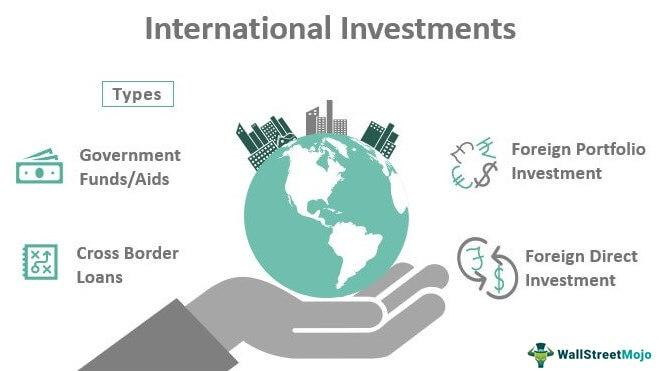

The financial landscape is evolving at an unprecedented pace, largely driven by technological advancements and innovative investment strategies. Three key pillars have emerged as fundamental components of modern portfolio management: mutual funds, investment strategies, and algorithmic trading. Each plays a distinct role in enhancing investment outcomes, offering unique advantages and posing specific challenges.

Mutual funds provide a mechanism for pooling resources from multiple investors to invest in a diversified portfolio of assets. This diversification reduces risk while offering potential for favorable returns. Investment strategies, on the other hand, involve tactical approaches to selecting the right mix of assets to meet specific financial goals. These strategies may be passive, focusing on replicating market indices, or active, aiming to outperform the market through targeted asset selection.



Algorithmic trading represents a technological leap in how trades are executed. Algorithms can analyze vast datasets and execute trades with speeds and precision beyond human capabilities, making them an invaluable tool in the modern investor's arsenal. The integration of algorithmic trading into fund management is increasingly seen as a critical factor for achieving enhanced precision and efficiency in managing portfolios.

A significant area of exploration is how international fund management can leverage algorithmic trading to optimize global investment portfolios. International funds, which invest across borders, offer diversification benefits and enable investors to access growth opportunities in various markets. However, they also come with their own set of complexities, including currency fluctuations and varying political environments. Understanding these intricacies is pivotal for capitalizing on the advantages of international investments while mitigating risks.

An integrated approach that combines the robust structure of mutual funds, the strategic foresight of investment strategies, and the technological prowess of algorithmic trading can provide a strategic advantage in the current financial environment. This article aims to shed light on these integrations and highlight how they contribute to improved global diversification and risk management. As investors navigate the complexities of international markets, an informed understanding of these key components is essential for achieving optimal investment outcomes.

## Table of Contents

## Understanding International Fund Management

International fund management is a critical facet of modern portfolio management, offering investors the opportunity to diversify their investments beyond national borders. By investing in companies from other countries, international funds aim to provide diversification benefits that can potentially reduce portfolio risk and enhance returns.

International funds generally target a combination of emerging and developed markets, each with its own set of risks and potential returns. Emerging markets often offer higher growth potential due to their expanding economies and industrialization processes. However, they also [carry](/wiki/carry-trading) higher risks, including political instability, less mature regulatory environments, and greater exposure to currency [volatility](/wiki/volatility-trading-strategies). Developed markets, on the other hand, typically present lower growth prospects but offer more stability and established regulatory frameworks. The challenge for fund managers is to balance these factors to achieve the desired risk-return profile.

To effectively manage risk and seize global opportunities, international funds employ various strategies. From a risk management perspective, diversification across multiple regions can mitigate unsystematic risks that are specific to individual countries or regions. By spreading investments geographically, a downturn in one region can be offset by gains in another, thereby stabilizing overall portfolio performance. Additionally, investment in international funds enables investors to capitalize on global economic growth, accessing industries and sectors that may be underrepresented in their domestic markets.

Currency fluctuations and political environments significantly affect international investments. Exchange rates can dramatically influence returns, converting foreign profits back into the investor's home currency. This currency risk requires careful analysis and management, often through hedging strategies. Political environments also shape investment outcomes; political instability, regulatory changes, and foreign relations policies can all impact the viability of an investment in a particular country. Therefore, continuous monitoring and assessment of political risks are essential.

When considering international investments, it is crucial to distinguish between international and global fund strategies. International funds typically focus exclusively on non-domestic markets, offering a pure-play on international exposure. In contrast, global funds invest in both domestic and international markets, providing broader diversification but potentially diluting the influence of overseas markets on the portfolio's performance. Selecting the appropriate strategy depends on the investor's specific goals, risk tolerance, and investment horizon.

Understanding these dynamics is crucial for optimizing portfolio management in today's interconnected financial environment. International funds, through their diverse and geographically dispersed holdings, not only aid in risk management but also allow investors to engage with global growth narratives, shaping a comprehensive investment strategy.

## Investment Strategies for International Funds

Investment strategies for international funds entail a comprehensive analysis of diverse management approaches, assessing the risk-return profiles of various markets, while considering economic and political influences. These strategies also harness both fundamental and technical analyses to optimize investment decisions.

### Active vs. Passive Management

International fund strategies often debate the merits of active versus passive management. Active management involves a hands-on approach, where fund managers actively select stocks and attempt to outperform the market through informed decisions and strategic timing. This approach can be particularly beneficial in international markets due to the variance in economic conditions, regulatory environments, and market dynamics across different countries. According to Morningstar, active funds can potentially capitalize on pricing inefficiencies within overseas markets.

Conversely, passive management focuses on replicating the performance of a specific benchmark index. Passive strategies, typically involving exchange-traded funds (ETFs) or index funds, offer lower fees and potentially reduced risk through broad market exposure. Investors may prefer passive management in their international portfolios for its lower cost and the ability to achieve market-level returns, an aspect noted in research published by Vanguard.

### Risk-Return Trade-Off in International Markets

International funds must analyze the risk-return trade-off when considering investments in various markets. Emerging markets often offer higher growth potential, posing increased volatility and risk. Conversely, developed markets can provide stability, albeit with generally lower growth prospects. The Capital Asset Pricing Model (CAPM) aids in evaluating these trade-offs by modeling the expected return of an investment based on its systematic risk:
$$
E(R_i) = R_f + \beta_i \times (E(R_m) - R_f)
$$
where $E(R_i)$ is the expected return on the investment, $R_f$ the risk-free rate, $\beta_i$ the investment's beta, and $E(R_m)$ the expected return of the market.

### Regional Diversification

Diversification across geographical regions is crucial to mitigate unsystematic risks inherent in international investments. This strategy reduces the impact of localized adverse events, such as political instability or natural disasters, on the portfolio. Efficient diversification can be achieved with mean-variance optimization to balance risk and return effectively:
```python
import numpy as np
def portfolio_weights(cov_matrix, risk_free_rate, return_vec):
    inv_cov_matrix = np.linalg.inv(cov_matrix)
    ones = np.ones(len(cov_matrix))
    mean_returns = np.matmul(inv_cov_matrix, return_vec)
    weight_sum = np.dot(ones, mean_returns)
    weights = mean_returns / weight_sum
    return weights
```
This Python code provides an example of how mean-variance optimization can be implemented to determine optimal asset weights for diversified international portfolios.

### Economic and Political Influences

Economic and political shifts significantly influence international fund strategies. Events like the UK's Brexit referendum, trade tensions between major economies, or changes in central bank policies can lead to significant market fluctuations. Hence, international funds must continuously monitor such developments and adjust strategies accordingly. For example, increasing interest rates in a developed market might shift investment preferences towards emerging markets with higher growth potential.

### Fundamental and Technical Analysis

Investors in international funds can enhance their decision-making processes by leveraging both fundamental and technical analyses. Fundamental analysis involves evaluating economic indicators, company financials, and market conditions to assess underlying value. Meanwhile, technical analysis utilizes historical price and [volume](/wiki/volume-trading-strategy) data to forecast future price movements through patterns and trends. Both approaches complement each other, offering a holistic view of market dynamics.

Utilizing these investment strategies, international funds aim to optimize returns while effectively managing the risks associated with the complexities of global markets.

## Algorithmic Trading in International Fund Management

Algorithmic trading has become an integral part of modern financial markets, particularly in the management of international funds. This form of trading utilizes complex algorithms to execute trades at speeds and precisions that exceed human capabilities, allowing for rapid response to market developments. The use of algorithms in trading enhances efficiency by reducing the time between decision-making and trade execution, thereby improving the overall decision-making process in fund management.

The key benefit of incorporating [algorithmic trading](/wiki/algorithmic-trading) in fund management is the increased efficiency and accuracy in handling large volumes of transactions. Algorithms can process vast amounts of data in real-time and execute trades based on predefined parameters. This reduces the likelihood of human error and enables fund managers to implement strategies consistently. For example, algorithms can monitor exchange rates continuously and execute currency trades that are favorable for international fund management.

Several algorithmic strategies are notably employed in international markets. Trend-following algorithms are designed to identify market [momentum](/wiki/momentum) and capitalize on it by executing trades that align with the identified trend. This strategy relies on historical price and volume data to predict future movements, often using statistical and [machine learning](/wiki/machine-learning) models to enhance prediction accuracy. Arbitrage strategies are another common application where algorithms identify price discrepancies across different markets or asset classes to execute simultaneous trades, thereby profiting from the difference.

However, implementing algorithmic trading solutions in international fund management comes with its challenges. Ensuring compliance with international regulations is a significant concern. Markets in different countries are governed by distinct regulatory frameworks, and maintaining compliance across these jurisdictions can be complex. Moreover, these strategies require robust technological infrastructure, and system failures can lead to significant financial losses. Thus, continuous monitoring and updating of systems are crucial to mitigate these risks.

In conclusion, algorithmic trading optimizes international fund management by enhancing efficiency and precision in trade execution. Despite its challenges, such as regulatory compliance and the need for a strong technological foundation, the strategic utilization of algorithmic trading can substantially benefit fund managers in navigating the complexities of global markets.

## Integrating Algo Trading with International Funds

Algorithmic trading plays a pivotal role in optimizing international fund portfolios by leveraging advanced computational technologies to improve efficiency and decision-making. Through data-driven strategies, algorithms can swiftly identify market opportunities across diverse international landscapes, thus enhancing investment outcomes. These strategies are vital for navigating the complexities associated with different markets, currencies, and economic environments.

### Data-Driven Strategies

Data-driven strategies harness large datasets to uncover trends and patterns that inform investment decisions. For international funds, these strategies can identify [arbitrage](/wiki/arbitrage) opportunities, optimize entry and [exit](/wiki/exit-strategy) points, and ultimately reduce transaction costs. By analyzing historical data, algorithms can predict price movements and market dynamics, which are crucial for timely trades in volatile environments.

### Dynamic Asset Allocation

Using algorithms for dynamic asset allocation involves adjusting the portfolio's asset distribution in response to changing market conditions. The goal is to maintain or improve the portfolio's risk-return profile by reallocating capital to assets that exhibit potential for higher returns or lower risks. For example, a Python-based approach could involve:

```python
import pandas as pd
import numpy as np

# Sample data: returns for various assets
returns = pd.DataFrame({
    'Stocks': np.random.normal(0.01, 0.05, 100),
    'Bonds': np.random.normal(0.005, 0.02, 100),
    'Currency': np.random.normal(0.002, 0.03, 100)
})

# Calculate expected returns and covariance matrix
expected_returns = returns.mean()
cov_matrix = returns.cov()

# Optimize asset allocation using the Sharpe ratio
def optimize_allocation(expected_returns, cov_matrix, risk_free_rate=0.01):
    num_assets = len(expected_returns)
    weights = np.random.random(num_assets)
    weights /= np.sum(weights)

    def portfolio_return(weights):
        return np.sum(expected_returns * weights)

    def portfolio_volatility(weights):
        return np.sqrt(np.dot(weights.T, np.dot(cov_matrix, weights)))

    def sharpe_ratio(weights):
        return (portfolio_return(weights) - risk_free_rate) / portfolio_volatility(weights)

    # Objective: maximize the Sharpe ratio
    constraints = ({'type': 'eq', 'fun': lambda weights: np.sum(weights) - 1})
    bounds = tuple((0, 1) for asset in range(num_assets))
    result = minimize(lambda weights: -sharpe_ratio(weights), weights, method='SLSQP',
                      bounds=bounds, constraints=constraints)
    return result.x

optimal_weights = optimize_allocation(expected_returns, cov_matrix)
```

### Algorithmic Trading Models

Several algorithmic trading models enhance international fund performance. For instance, trend-following models capitalize on persistent price movements, while mean-reversion models exploit the tendency of asset prices to revert to their historical averages. Additionally, machine learning models, such as [reinforcement learning](/wiki/reinforcement-learning), can learn and adapt to new market conditions without explicit programming.

### Integration of Traditional and Technological Tools

Combining traditional investment wisdom with modern technological tools leverages the advantages of both approaches. Experienced fund managers bring invaluable insights and intuition about market dynamics, while algorithms provide the speed and precision needed for executing trades. This synergy is crucial for managing complex international fund portfolios, where understanding local market knowledge and employing cutting-edge technologies significantly enhance performance.

In summary, the integration of algorithmic trading with international funds provides a robust framework for optimizing portfolio management. By incorporating data-driven strategies, dynamic asset allocation, and advanced trading models, fund managers can achieve superior outcomes in the global market. Implementing these strategies requires a deep understanding of both traditional finance principles and modern technological advancements, ensuring that portfolios are well-positioned to capitalize on global opportunities.

## Challenges and Considerations

Algorithmic trading introduces several potential risks that must be managed carefully to ensure the smooth operation of international fund management. One significant concern is the risk of system failures, which can arise from hardware malfunctions, software bugs, or unexpected market conditions. Such failures can lead to substantial financial losses or missed investment opportunities. Thus, it is critical for fund managers to implement robust technical infrastructure and maintain comprehensive system checks to mitigate these risks.

Compliance hurdles are another vital consideration when engaging in algorithmic trading. The global nature of investment necessitates adherence to a complex tapestry of international regulations. Different countries have varying legal frameworks governing financial markets, and maintaining compliance requires continuous monitoring of regulatory changes. Fund managers must invest in compliance systems capable of tracking and adapting to these evolving standards to avoid legal repercussions and ensure ethical trading practices.

The importance of quality data cannot be overstated in the context of algorithmic trading. Accurate, timely, and comprehensive data sets are the foundation of effective algorithmic strategies. Poor data quality can lead to erroneous decision-making, resulting in financial losses. Therefore, fund managers should prioritize investments in data acquisition technologies and partnerships with reliable data providers to ensure consistent access to high-quality information.

Continuous [backtesting](/wiki/backtesting) and refinement of trading algorithms are pivotal to align them with evolving market conditions. This process involves using historical data to evaluate the performance of algorithms and identify potential weaknesses or areas for enhancement. By iterating and optimizing strategies, fund managers can increase the robustness and adaptability of their algorithms, ultimately enhancing their effectiveness in contemporary markets.

Lastly, educating investors about the realities and potential of algorithmic trading is essential. Investors should be informed about the strengths and limitations of algorithmic strategies, as well as the risks involved. This education can help set realistic expectations and foster informed decision-making, ensuring investors are aware of the technological and strategic nuances of their investment approaches.

In summary, addressing these challenges and considerations is crucial for the successful integration of algorithmic trading into international fund management, enabling fund managers to leverage technology effectively while mitigating associated risks.

## Conclusion

The fusion of international fund management with algorithmic trading delivers a significant strategic advantage by enhancing the precision and speed of managing global portfolios. Algorithmic systems, equipped with advanced computational capabilities, execute trades at a velocity and accuracy that surpass traditional methods, thus providing investors the ability to respond swiftly to market fluctuations and emerging opportunities. This capability is especially crucial in international fund management, where markets operate across different time zones and respond to diverse geopolitical and economic conditions.

For investors, ongoing education and adaptation are paramount. The rapid evolution of financial technologies necessitates a continuous learning curve to effectively leverage these tools. Investors must remain vigilant and informed about the latest algorithmic strategies and technological advancements to maintain their competitive edge.

Looking toward the future, the synergy between mutual funds and algorithmic trading is poised to redefine investing. Mutual funds, known for their diversification benefits, can be optimized further through the use of algorithmic trading strategies, offering a blend of traditional investment approaches with cutting-edge technology. This integration promises not just increased efficiency but also enhanced potential returns due to the reduction in transaction costs and the improved ability to navigate market volatilities.

In conclusion, investors are encouraged to harness the full potential of these innovative strategies. By strategically integrating algorithmic trading with international fund management, they can optimize portfolio performance, manage risks more effectively, and achieve optimal returns. As financial markets evolve, embracing these advancements will be essential for success in the global investment landscape.

## References & Further Reading

[1]: Bergstra, J., Bardenet, R., Bengio, Y., & Kégl, B. (2011). ["Algorithms for Hyper-Parameter Optimization."](https://dl.acm.org/doi/10.5555/2986459.2986743) Advances in Neural Information Processing Systems 24.

[2]: ["Advances in Financial Machine Learning"](https://www.amazon.com/Advances-Financial-Machine-Learning-Marcos/dp/1119482089) by Marcos Lopez de Prado

[3]: ["Evidence-Based Technical Analysis: Applying the Scientific Method and Statistical Inference to Trading Signals"](https://www.amazon.com/Evidence-Based-Technical-Analysis-Scientific-Statistical/dp/0470008741) by David Aronson

[4]: ["Machine Learning for Algorithmic Trading"](https://github.com/stefan-jansen/machine-learning-for-trading) by Stefan Jansen

[5]: ["Quantitative Trading: How to Build Your Own Algorithmic Trading Business"](https://www.amazon.com/Quantitative-Trading-Build-Algorithmic-Business/dp/1119800064) by Ernest P. Chan

[6]: Watson, R. (2010). ["Currency Trading and Intermarket Analysis: How to Profit from the Shifting Currents in Global Markets."](https://archive.org/details/currencytradingi0000laid) Wiley Trading.

[7]: Dimson, E., Marsh, P., & Staunton, M. (2002). ["Global Investment Returns Yearbook 2002."](https://www.jstor.org/stable/j.ctt5hhpkq)