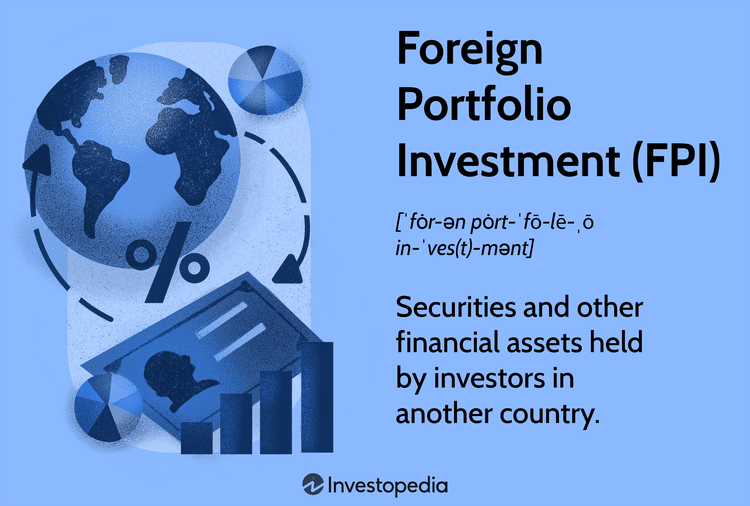

In today's globalized economy, international investing has emerged as a vital strategy for diversifying investment portfolios. As markets become increasingly interconnected, investors seek opportunities beyond domestic borders to enhance returns and spread risk. This approach, however, requires a keen understanding of the multifaceted risks inherent in international markets, including economic, political, and currency fluctuations. Economic instability in a foreign market, abrupt regulatory changes, or volatile exchange rates can significantly impact the performance of international investments. 

To effectively manage these complexities, investors are increasingly turning to algorithmic trading, commonly referred to as algo trading. This method employs automated and sophisticated computer programs to execute trades based on predefined criteria, offering enhanced speed and precision in global financial markets. Algorithmic trading facilitates efficient handling of diverse and complex international portfolios, allowing investors to capitalize on market inefficiencies and swiftly adjust their holdings in response to global developments.



This article examines the inherent risks and potential advantages of utilizing algorithmic trading for managing international investment portfolios. By leveraging technology, investors can potentially achieve superior portfolio diversification and mitigate some of the traditional risks associated with international investing. As the global landscape continues to evolve, understanding how to optimize international portfolios with algorithmic trading remains crucial for investors aiming to navigate the complexities of today's markets successfully.

## Table of Contents

## Understanding International Investment Risks

International investments present a set of distinct risks not encountered in domestic markets, necessitating a comprehensive understanding for effective portfolio management. Political instability is a primary concern; changes in government, civil unrest, or international conflicts can significantly influence market stability and investor confidence. For instance, unexpected geopolitical events can lead to rapid shifts in market conditions, potentially resulting in sudden losses for investors.

Regulatory changes in foreign markets pose another challenge. Each country has its own regulatory framework governing financial markets, which can change unpredictably. Such changes might include new tax laws, restrictions on foreign ownership, or adjustments to financial reporting standards. These shifts can affect the profitability and feasibility of investments in particular regions, requiring investors to stay informed and adaptable.

Differing economic conditions across countries further complicate international investments. Economic indicators such as GDP growth rates, employment figures, and inflation levels vary significantly between nations, influencing market dynamics and investment outcomes. For example, a country experiencing rapid economic growth may attract increased foreign investment, while a nation in recession might see capital outflows, affecting asset prices.

Currency fluctuation is another critical [factor](/wiki/factor-investing) influencing international investments. Exchange rates can be highly volatile, impacted by economic data releases, [interest rate](/wiki/interest-rate-trading-strategies) changes, and global market sentiment. Such [volatility](/wiki/volatility-trading-strategies) adds a layer of complexity as it directly affects the value of investments when converted back into the investor's home currency. For example, a strengthening foreign currency against the investor’s domestic currency can enhance returns when repatriated, whereas a weakening currency can erode gains.

Consequently, investors must carefully evaluate these risks when constructing an international portfolio. A robust risk assessment process typically involves analyzing macroeconomic factors, geopolitical landscape, and currency trends to inform investment decisions. Employing strategies such as diversification across various regions and sectors, and using hedging techniques to mitigate currency risk, can help manage the uncertainties associated with international investing.

## The Role of Algorithmic Trading in Portfolio Management

Algorithmic trading, often referred to as algo trading, is a technological advancement that uses computer algorithms to execute trades at high speed based on predefined criteria. This method plays a crucial role in the management of international investment portfolios by offering enhanced speed and precision in trading activities. By automating complex trading processes, [algorithmic trading](/wiki/algorithmic-trading) enables investors to efficiently handle the diversity and complexity inherent in global markets.

One of the main advantages of algorithmic trading is its ability to identify and exploit market inefficiencies. It empowers investors to execute trades with minimal latency, effectively capturing [arbitrage](/wiki/arbitrage) opportunities before they dissipate. Market inefficiencies, which can arise from discrepancies between supply and demand, price variations across geographic markets, or events affecting specific sectors, can be systematically targeted with algo trading strategies. The ability to process vast amounts of data in real-time allows investors to adjust their portfolios quickly in response to global news or economic shifts, ensuring that their investment strategies remain aligned with changing market conditions.

Moreover, algorithmic trading facilitates the management of complex and diverse international portfolios by implementing strategies that can handle multiple trades across different time zones and exchanges simultaneously. For instance, algorithms can be programmed to operate across various international stock exchanges, accommodating differences in trading hours and market structures. This adaptability is essential for investors seeking to maintain a balanced and diversified portfolio on a global scale.

Despite its numerous advantages, the implementation of algorithmic trading requires a robust technology infrastructure and a sophisticated understanding of market dynamics. A key technical requirement is the development of efficient algorithms capable of handling large datasets and executing trades based on real-time information. In addition, the infrastructure must support the rapid transmission of data and instantaneous execution of orders, which necessitates high-speed internet connections and powerful computational capabilities.

However, it is not merely the technology that poses challenges; investors and portfolio managers must also possess a deep understanding of the intricacies of global markets. This includes knowledge of the regulatory environments, cultural differences, and economic conditions that can influence market activity. Algorithmic trading systems should be continually monitored and refined to reflect the evolving landscape of international finance, ensuring that they remain effective and compliant with all pertinent regulations.

In summary, algorithmic trading serves as a vital tool in managing international investment portfolios, enabling rapid and precise trade execution while navigating market complexities. It offers significant opportunities to capitalize on global market inefficiencies and respond swiftly to market fluctuations. Nonetheless, its successful deployment demands both advanced technological infrastructure and a comprehensive grasp of global market dynamics.

## Types of Algorithms Used in Managing International Portfolios

Several algorithmic strategies are integral to managing international investment portfolios, each serving distinct purposes to optimize trading efficiency and profitability. 

Market-making algorithms are designed to provide [liquidity](/wiki/liquidity-risk-premium) to markets by generating continuous buy and sell orders. These algorithms help maintain tight bid-ask spreads, contributing to market efficiency. By placing both buy and sell limit orders close to the market price, market-making algorithms benefit from the bid-ask spread when both transactions are completed. This approach is vital in less liquid markets, as it prevents significant price swings and stabilizes trading environments. 

Arbitrage algorithms are developed to take advantage of price discrepancies across different markets or financial instruments. These algorithms execute trades simultaneously to exploit these differences, [earning](/wiki/earning-announcement) a profit in the process. Common types of arbitrage include currency arbitrage, where price differences in currency pairs across different platforms are exploited, and [statistical arbitrage](/wiki/statistical-arbitrage), where correlations between securities are analyzed and harnessed for profit. The formula for arbitrage profit in a simple currency trade can be represented as:

$$
\text{Arbitrage Profit} = \left( \frac{\text{Currency Amount}}{\text{Exchange Rate}_1} - \frac{\text{Currency Amount}}{\text{Exchange Rate}_2} \right)
$$

Trend-following algorithms focus on identifying and trading in the direction of existing market trends. These algorithms analyze historical price data to detect patterns or trends and predict future price movements, making them particularly effective in volatile foreign markets. For instance, trend-following strategies might rely on moving averages, where the decision to buy or sell is based on the crossing of price and moving average lines. These strategies are rooted in the belief that asset prices often move in the direction of the trend over a given period before reversing.

Each of these algorithms requires advanced technological infrastructure and a deep understanding of market dynamics to implement successfully. Integrating these into portfolio management can lead to improved liquidity and profitability and an enhanced ability to respond to global market changes promptly.

## Advantages and Challenges of Combining International Portfolios with Algo Trading

Combining international portfolio management with algorithmic trading offers a range of advantages that enhance both risk management and operational efficiency for investors. One of the primary benefits is the ability to achieve faster execution of trades. Algorithmic trading leverages advanced computer algorithms to automatically execute trades at speeds much faster than human capabilities, thus allowing investors to capitalize on fleeting market opportunities and react swiftly to changes. This speed not only improves the chances of obtaining favorable prices but also allows for better order fulfillment in fast-moving markets.

Another significant advantage is the reduction in transaction costs. Algorithmic trading minimizes manual intervention, reducing the likelihood of human errors that can lead to costly mistakes. Additionally, algorithms are optimized to select execution strategies that minimize market impact costs and take advantage of favorable conditions in various markets. These factors contribute to more efficient trading processes and potential cost savings.

Improved portfolio diversification is also facilitated through algorithmic trading. By employing sophisticated algorithms, investors can manage and balance portfolios comprising diverse asset classes and geographic exposures. Algorithms can assess multiple factors simultaneously, adjusting asset allocation to align with market conditions and investment objectives, enabling more effective diversification.

Despite these advantages, integrating algorithmic trading into international portfolio management is not without challenges. One significant challenge is the need for expert knowledge. Successful implementation of algorithmic trading strategies requires a deep understanding of both the technical aspects of the algorithms and the nuances of international financial markets. This expertise is often scarce and requires substantial investment in human resources.

Moreover, increased technical infrastructure costs pose another challenge. Algorithmic trading demands robust hardware and software systems capable of handling high volumes of data and complex computations. The costs associated with acquiring and maintaining this infrastructure can be substantial, particularly for smaller firms.

Additionally, there exists the potential for systemic risks within automated systems. The high speed and automated nature of algo trading can sometimes amplify market volatility, and technical glitches or malfunctions can lead to unintended consequences. Thus, it is essential to implement rigorous monitoring and control systems to mitigate such risks. Regular back-testing and stress-testing of algorithms are critical to ensuring their reliability and stability in various market conditions.

Overall, while the combination of international portfolio management with algorithmic trading presents clear benefits in terms of efficiency and cost reduction, it requires careful consideration of the associated challenges to fully realize its potential.

## Strategies for Mitigating Risks in International Algorithmic Trading

Understanding local market regulations and ensuring compliance is essential for minimizing legal risks in international algorithmic trading. Each market operates under its own set of rules and regulatory frameworks, which can significantly impact trading strategies. Compliance with these regulations not only protects against legal repercussions but also enhances reputability and investor confidence.

Diversification serves as a critical strategy to manage risks associated with international investments. By spreading investments across different regions and asset classes, investors can reduce exposure to risks inherent in specific countries or sectors. This strategy involves allocating resources in a manner that balances potential returns against diverse risk factors. A well-diversified portfolio is less susceptible to significant losses resulting from localized economic or political events.

Predictive analytics and [machine learning](/wiki/machine-learning) are increasingly employed to anticipate and mitigate risks. These technologies analyze large volumes of data to forecast market trends and price movements, enabling more informed decision-making. Machine learning models can identify patterns and signals that traditional analyses might overlook, providing a competitive edge in adjusting strategies swiftly. For example, employing a time-series forecasting model, like ARIMA (AutoRegressive Integrated Moving Average), can predict future price trends based on historical data:

```python
from statsmodels.tsa.arima.model import ARIMA
import numpy as np

# Generate random data representing historical prices
np.random.seed(0)
data = np.random.randn(100) + np.arange(100) * 0.1

# Build and fit the ARIMA model
model = ARIMA(data, order=(1, 1, 1))
model_fit = model.fit()

# Forecast future prices
forecast = model_fit.forecast(steps=5)
print(forecast)
```

Regular monitoring and adjustment of algorithms are necessary to adapt to evolving market conditions. Markets are dynamic, and an algorithm that performs well under certain conditions may become ineffective when those conditions change. Continuous evaluation of algorithms and their performance metrics ensures alignment with desired investment outcomes. This adjustment process might involve recalibrating model parameters or updating algorithmic rules to incorporate new market data.

In summary, effectively managing risks in international algorithmic trading requires a multifaceted approach involving compliance, diversification, advanced analytics, and continuous algorithm adjustment. By adopting these strategies, investors can better navigate the complexities and uncertainties of global financial markets.

## Conclusion

International investment portfolios managed with algorithmic trading combine sophisticated technology with the opportunities of global markets, offering a powerful tool for modern investors. This synergy allows investors to efficiently navigate the complexities associated with diverse economic landscapes, political environments, and fluctuating currencies. Algorithmic trading, with its speed and precision, can enhance portfolio management by swiftly executing trades and capitalizing on market inefficiencies. However, the benefits of such an approach are contingent upon an in-depth understanding of inherent risks.

Managing the associated risks is crucial for leveraging the full potential of algorithmic international investment portfolios. These risks include governance challenges such as regulatory compliance and adaption to local financial laws, alongside operational risks stemming from the technology and algorithms used. Investors must be prepared to address these issues by implementing robust risk management strategies. Diversification across various regions and asset classes, along with the use of predictive analytics to anticipate market trends, can help mitigate these risks. 

Furthermore, staying informed and adaptable is essential for success in the dynamic landscape of global markets. Regular updating and monitoring of trading algorithms, alongside ongoing education in the field of global economics and algorithmic advancements, are vital to adapting strategies to ever-evolving market conditions. Through a diligent and informed approach, investors are better positioned to maximize returns while maintaining risk within acceptable levels. Thus, the combination of international portfolios and algorithmic trading, when handled with due diligence and strategic foresight, can significantly benefit investors seeking to expand their reach in the global market.

## References & Further Reading

[1]: Bodie, Z., Kane, A., & Marcus, A. J. (2014). ["Investments"](https://www.mheducation.com/highered/product/Investments-Bodie.html). McGraw-Hill Education.

[2]: Cartea, Á., Jaimungal, S., & Penalva, J. (2015). ["Algorithmic and High-Frequency Trading."](https://assets.cambridge.org/97811070/91146/frontmatter/9781107091146_frontmatter.pdf) Cambridge University Press.

[3]: De Prado, M. L. (2018). ["Advances in Financial Machine Learning."](https://www.amazon.com/Advances-Financial-Machine-Learning-Marcos/dp/1119482089) Wiley.

[4]: Fabozzi, F. J., Focardi, S., & Jonas, C. (2008). ["Robust Portfolio Optimization and Management."](https://onlinelibrary.wiley.com/doi/book/10.1002/9781119202172) Wiley.

[5]: Grossman, S. J., & Stiglitz, J. E. (1980). ["On the Impossibility of Informationally Efficient Markets."](https://www.jstor.org/stable/1805228) The American Economic Review, 70(3), 393-408.

[6]: Jansen, S. (2018). ["Machine Learning for Algorithmic Trading."](https://github.com/stefan-jansen/machine-learning-for-trading) Packt Publishing.

[7]: Malkiel, B. G. (2019). ["A Random Walk Down Wall Street: The Time-Tested Strategy for Successful Investing."](https://yourknowledgedigest.org/wp-content/uploads/2020/04/a-random-walk-down-wall-street.pdf) W. W. Norton & Company.

[8]: Sharpe, W. F. (1964). ["Capital Asset Prices: A Theory of Market Equilibrium Under Conditions of Risk."](https://onlinelibrary.wiley.com/doi/full/10.1111/j.1540-6261.1964.tb02865.x) The Journal of Finance, 19(3), 425-442.