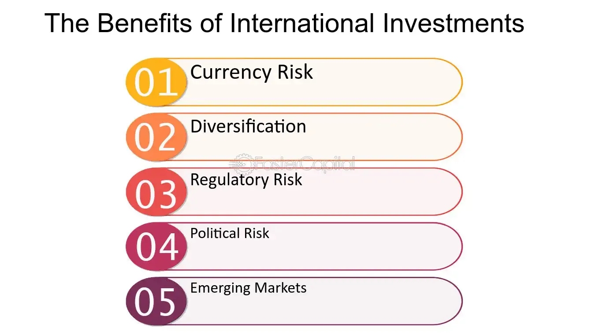

## Table of Contents

## What is an international investment portfolio?

An international investment portfolio is a collection of investments that includes assets from different countries around the world. Instead of just investing in one country, like your own, you spread your money across various international markets. This can include stocks, bonds, mutual funds, and other types of investments from places like the United States, Europe, Asia, and beyond.

By having an international investment portfolio, you can potentially reduce risk and increase returns. When one country's market is doing poorly, another might be doing well, which helps balance out your overall investment performance. It also allows you to take advantage of growth opportunities in different parts of the world, making your investments more diverse and potentially more rewarding.

## What are the basic benefits of diversifying investments internationally?

Diversifying your investments internationally can help you spread out your risk. Imagine if all your money was in one country and that country's economy suddenly got into trouble. Your investments could lose a lot of value. But if you have investments in different countries, when one country's market goes down, another might go up. This can help protect your money and make your overall investment safer.

Another benefit is that you can take advantage of growth in different parts of the world. Some countries might be growing faster than others. For example, a new technology company in one country could be booming while another country's market is slow. By investing in different places, you can potentially earn more money because you're not missing out on these growth opportunities.

Overall, international diversification can make your investments more stable and give you a chance to grow your money in ways that might not be possible if you only invested in one country. It's like not putting all your eggs in one basket, which is a smart way to handle your money.

## How can international investing help in reducing risk?

International investing can help reduce risk by spreading your money across different countries. If you only invest in one country and something bad happens to its economy, like a recession or a financial crisis, your investments could lose a lot of value. But if you have money in different countries, a problem in one place might not affect your whole portfolio. For example, if the U.S. market goes down, your investments in Europe or Asia might still do well, balancing out your losses.

Another way international investing reduces risk is by taking advantage of different economic cycles. Different countries might be at different stages of their economic cycles. When one country's market is slowing down, another might be picking up speed. By having investments in various countries, you can benefit from these different cycles, which can help smooth out the ups and downs of your investment returns. This means your money is less likely to be hit hard all at once, making your overall investment more stable.

## What are the common risks associated with international investing?

International investing can be a great way to spread your money around, but it also comes with some risks. One big risk is currency risk. When you invest in another country, you have to change your money into that country's currency. If that currency gets weaker compared to your own, your investment could lose value, even if the investment itself is doing well. Another risk is political risk. Different countries can have different governments and laws. If a new government comes in and changes the rules or if there's political unrest, it can affect your investments.

Another risk to think about is economic risk. Just like your own country, other countries can go through tough economic times. If a country you've invested in has a recession or other economic problems, your investments there could lose value. There's also the risk that comes from not knowing as much about other countries. You might not have all the information you need to make good investment choices, which can lead to mistakes.

Lastly, there's the risk of higher costs. Investing internationally can sometimes cost more because of fees for changing money, higher taxes, or more expensive management fees. These extra costs can eat into your returns. So, while international investing can help you spread your risk, it's important to be aware of these potential downsides and think about how they might affect your investments.

## How does currency exchange impact an international investment portfolio?

When you invest in other countries, you have to change your money into the currency of that country. This is called currency exchange. If the currency of the country you invested in gets weaker compared to your own currency, your investment could lose value. For example, if you invested in a company in Japan and the Japanese yen gets weaker compared to your home currency, like the U.S. dollar, then when you change your money back to dollars, you'll get less money than you expected. This is called currency risk, and it's something to think about when you're making an international investment portfolio.

On the other hand, if the currency of the country you invested in gets stronger, your investment could become more valuable. Using the same example, if the Japanese yen gets stronger compared to the U.S. dollar, then when you change your money back to dollars, you'll get more money than you expected. This can be a good thing, but it's hard to predict how currencies will change. Because of this, currency exchange can add both risk and opportunity to your international investment portfolio. It's important to keep an eye on currency movements and understand how they might affect your investments.

## What are the tax implications of holding an international investment portfolio?

When you invest in other countries, you need to think about taxes. Different countries have different tax rules, and you might have to pay taxes in the country where you're investing. For example, if you earn money from stocks in another country, that country might take some of it as tax. This is called foreign withholding tax. Also, when you bring your money back home, you might have to pay taxes on it again in your own country. This can make your investments less profitable because you're paying taxes twice.

To deal with these tax issues, many countries have agreements called tax treaties. These treaties help make sure you don't get taxed too much. For example, a tax treaty might let you claim a credit for the taxes you paid in another country, so you don't have to pay as much tax at home. It's important to understand these treaties and how they apply to your investments. Talking to a tax advisor can help you figure out the best way to handle your taxes and keep more of your investment earnings.

## How does geopolitical risk affect international investments?

Geopolitical risk is when political events or changes in one country can affect your investments in that country. For example, if there's a war or a new government that changes the rules, it can make your investments less valuable. If a country you've invested in starts having political problems, like protests or a change in leadership, it can scare investors away. When investors are scared, they might sell their investments, which can make the value of those investments go down.

This kind of risk can be hard to predict because political situations can change quickly. For instance, if a country suddenly puts new restrictions on foreign investors, it can hurt your investments there. Also, if there's tension between countries, like trade wars or sanctions, it can affect the economy of the countries involved. This can lead to lower stock prices or slower growth, which means your international investments might not do as well as you hoped. Keeping an eye on the news and understanding the political situation in the countries where you invest can help you manage these risks better.

## What role does economic stability play in choosing international investments?

Economic stability is really important when you're deciding where to put your money in other countries. If a country has a stable economy, it's more likely that your investments there will be safe and grow over time. A stable economy means things like low inflation, steady growth, and a strong currency. When a country's economy is stable, businesses can plan better, and people feel more confident about spending and investing. This makes it a good place for your money because the chances of sudden big losses are lower.

On the other hand, if a country's economy is unstable, it can be risky to invest there. Unstable economies can have high inflation, lots of ups and downs in growth, and a weak currency. These things can make your investments lose value quickly. For example, if a country goes through a financial crisis or has big changes in its government, it can shake up the economy and hurt your investments. So, it's a good idea to check how stable a country's economy is before you decide to invest there.

## How can one assess the performance of an international investment portfolio?

To assess the performance of an international investment portfolio, you need to look at how your investments are doing over time. One way to do this is by checking the returns on your investments. This means seeing how much money you've made or lost from your stocks, bonds, or other assets in different countries. You can compare these returns to what you expected or to a benchmark, like a global stock index, to see if your portfolio is doing well. It's also important to look at the performance in different currencies because changes in exchange rates can affect your returns.

Another thing to consider is how well your portfolio is diversified. Since you're investing in different countries, you want to make sure your money is spread out enough to reduce risk. Look at how each part of your portfolio is doing and see if some countries or types of investments are doing better than others. This can help you decide if you need to make any changes to keep your portfolio balanced. Also, think about the costs of managing your international investments, like fees for currency exchange or taxes, because these can affect your overall performance.

Lastly, it's helpful to review your portfolio regularly, maybe once a year or more often if there are big changes in the world. Keep an eye on economic and political news from the countries you're invested in because these can impact your investments. By staying informed and regularly checking your portfolio's performance, you can make smart decisions to help your international investments grow over time.

## What advanced strategies can be used to optimize an international investment portfolio?

One advanced strategy to optimize an international investment portfolio is to use currency hedging. This means you can take steps to protect your investments from changes in currency values. For example, you might use financial tools like forward contracts or options to lock in exchange rates. This can help make sure that if the currency of a country you've invested in gets weaker, it won't hurt your returns as much. By hedging, you can focus more on the actual performance of your investments, rather than worrying about currency swings.

Another strategy is to use sector diversification across different countries. Instead of just spreading your money across different countries, you can also spread it across different industries. For example, you might invest in technology companies in the U.S., energy companies in the Middle East, and consumer goods companies in Europe. This way, if one sector or country has problems, your other investments in different sectors and countries can help balance things out. It's like having a safety net that can catch you if one part of your portfolio falls.

Lastly, consider using tactical asset allocation. This means you can change your investments based on what's happening in the world. If you see that one country or sector is doing really well, you might want to put more money there. Or if you think a country's economy is going to have trouble, you can move your money out before it's too late. By staying flexible and adjusting your portfolio as needed, you can take advantage of opportunities and avoid big risks. This strategy needs a lot of research and attention, but it can help make your international investment portfolio perform better over time.

## How do regulatory differences across countries impact international investing?

When you invest in different countries, you need to know about their rules and laws. Each country has its own way of doing things, and these rules can affect your investments. For example, some countries have strict rules about who can buy and sell stocks or how much money you can take out of the country. These rules can make it harder or more expensive to invest there. If a country changes its laws suddenly, it can also affect the value of your investments. So, it's important to understand the rules of each country you're investing in.

Another thing to think about is how different countries handle taxes. Some countries might take a big part of your earnings as taxes, while others might be more friendly to investors. This can change how much money you make from your investments. Also, some countries have agreements called tax treaties that can help you avoid paying too much tax. Knowing about these tax rules and treaties can help you plan your investments better and keep more of your money.

## What are the long-term trends and future outlook for international investment portfolios?

The long-term trends for international investment portfolios are looking towards more growth in emerging markets. Countries like China, India, and Brazil are expected to keep growing faster than many developed countries. This means that if you invest in these places, you might see bigger returns in the future. Another trend is the rise of technology and green energy. More and more people are investing in tech companies and renewable energy projects around the world. These areas are expected to keep growing, which can be good for your portfolio.

Looking ahead, the future outlook for international investing seems promising but also comes with challenges. Globalization is making it easier to invest in different countries, but it also means that events in one part of the world can quickly affect others. For example, a financial crisis in one country can spread to others. Also, changes in technology and how people live and work can create new opportunities and risks. It's important to keep learning and stay flexible with your investments. By understanding these trends and being ready for changes, you can make the most of your international investment portfolio in the long run.

## What types of algorithms are used in managing international portfolios?

Several algorithmic strategies are integral to managing international investment portfolios, each serving distinct purposes to optimize trading efficiency and profitability. 

Market-making algorithms are designed to provide [liquidity](/wiki/liquidity-risk-premium) to markets by generating continuous buy and sell orders. These algorithms help maintain tight bid-ask spreads, contributing to market efficiency. By placing both buy and sell limit orders close to the market price, market-making algorithms benefit from the bid-ask spread when both transactions are completed. This approach is vital in less liquid markets, as it prevents significant price swings and stabilizes trading environments. 

Arbitrage algorithms are developed to take advantage of price discrepancies across different markets or financial instruments. These algorithms execute trades simultaneously to exploit these differences, [earning](/wiki/earning-announcement) a profit in the process. Common types of arbitrage include currency arbitrage, where price differences in currency pairs across different platforms are exploited, and [statistical arbitrage](/wiki/statistical-arbitrage), where correlations between securities are analyzed and harnessed for profit. The formula for arbitrage profit in a simple currency trade can be represented as:

$$
\text{Arbitrage Profit} = \left( \frac{\text{Currency Amount}}{\text{Exchange Rate}_1} - \frac{\text{Currency Amount}}{\text{Exchange Rate}_2} \right)
$$

Trend-following algorithms focus on identifying and trading in the direction of existing market trends. These algorithms analyze historical price data to detect patterns or trends and predict future price movements, making them particularly effective in volatile foreign markets. For instance, trend-following strategies might rely on moving averages, where the decision to buy or sell is based on the crossing of price and moving average lines. These strategies are rooted in the belief that asset prices often move in the direction of the trend over a given period before reversing.

Each of these algorithms requires advanced technological infrastructure and a deep understanding of market dynamics to implement successfully. Integrating these into portfolio management can lead to improved liquidity and profitability and an enhanced ability to respond to global market changes promptly.

## References & Further Reading

[1]: Bodie, Z., Kane, A., & Marcus, A. J. (2014). ["Investments"](https://www.mheducation.com/highered/product/Investments-Bodie.html). McGraw-Hill Education.

[2]: Cartea, Á., Jaimungal, S., & Penalva, J. (2015). ["Algorithmic and High-Frequency Trading."](https://assets.cambridge.org/97811070/91146/frontmatter/9781107091146_frontmatter.pdf) Cambridge University Press.

[3]: De Prado, M. L. (2018). ["Advances in Financial Machine Learning."](https://www.amazon.com/Advances-Financial-Machine-Learning-Marcos/dp/1119482089) Wiley.

[4]: Fabozzi, F. J., Focardi, S., & Jonas, C. (2008). ["Robust Portfolio Optimization and Management."](https://onlinelibrary.wiley.com/doi/book/10.1002/9781119202172) Wiley.

[5]: Grossman, S. J., & Stiglitz, J. E. (1980). ["On the Impossibility of Informationally Efficient Markets."](https://www.jstor.org/stable/1805228) The American Economic Review, 70(3), 393-408.

[6]: Jansen, S. (2018). ["Machine Learning for Algorithmic Trading."](https://github.com/stefan-jansen/machine-learning-for-trading) Packt Publishing.

[7]: Malkiel, B. G. (2019). ["A Random Walk Down Wall Street: The Time-Tested Strategy for Successful Investing."](https://yourknowledgedigest.org/wp-content/uploads/2020/04/a-random-walk-down-wall-street.pdf) W. W. Norton & Company.

[8]: Sharpe, W. F. (1964). ["Capital Asset Prices: A Theory of Market Equilibrium Under Conditions of Risk."](https://onlinelibrary.wiley.com/doi/full/10.1111/j.1540-6261.1964.tb02865.x) The Journal of Finance, 19(3), 425-442.