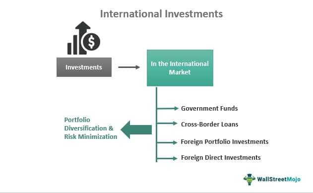

## Table of Contents

## What is international investment and why is it important?

International investment happens when people or companies from one country put their money into businesses, properties, or other financial assets in another country. This can include buying stocks, building factories, or starting new businesses abroad. It's like lending money or buying a piece of something in another country, hoping it will grow and be worth more later.

This kind of investment is important because it helps countries grow their economies. When foreign money comes in, it can create jobs, build new factories, and improve technology in the host country. It also helps the countries investing because they can earn more money from their investments. Overall, international investment connects economies around the world, making them stronger and more dependent on each other.

## What are the basic types of international investments?

There are mainly two types of international investments: foreign direct investment (FDI) and portfolio investment. Foreign direct investment happens when a company from one country buys or builds a business in another country. This could be a factory, a store, or any kind of business where the company has control over what happens. It's like when a big company decides to open a new branch in a different country. This type of investment is important because it can create jobs and bring new technology to the country where the investment is made.

Portfolio investment is different. It's when people or companies buy stocks, bonds, or other financial assets in another country without taking control of the business. It's more like buying a small piece of a company or lending money to a government by buying its bonds. This type of investment can help countries raise money for projects, but it can also be riskier because the value of these investments can go up and down a lot. Both types of investments are important for connecting economies around the world and helping them grow.

## How can beginners start with international investing?

If you're new to international investing, the first step is to learn about it. You can start by reading [books](/wiki/algo-trading-books) or articles about how to invest in other countries. Websites and videos can also help you understand the basics. It's important to know about different countries' economies and what might affect them, like their politics or natural resources. Once you feel ready, you can open an account with a broker that lets you buy stocks or bonds from other countries. Make sure to choose a broker that is trustworthy and has low fees.

After you've set up your account, you can start by investing small amounts of money. It's a good idea to spread your money across different countries and types of investments. This way, if one investment doesn't do well, others might still do okay. You can buy shares in big international companies or invest in funds that focus on different parts of the world. Remember, international investing can be riskier than investing at home, so it's wise to only invest money you can afford to lose. Keep learning and checking on your investments to see how they're doing and make changes if you need to.

## What are the risks associated with international investments?

International investments can be risky because they involve more unknowns than investing in your own country. One big risk is currency risk. This means the value of the money in the country you're investing in can change compared to your own country's money. If the other country's money loses value, your investment might be worth less when you convert it back to your own currency. Political risk is another concern. Changes in government or laws in the country where you've invested can affect your investment. For example, if a new government takes over and decides to nationalize businesses, you could lose your investment.

Another risk is economic risk. This happens when the economy of the country you've invested in goes through tough times, like a recession. If the economy struggles, the value of your investments could go down. Market risk is also important to consider. The stock market in another country can be more unpredictable than your own, and prices can go up and down a lot. It's also harder to get good information about companies in other countries, which makes it riskier to invest in them. All these risks mean that international investing can be more challenging and potentially more rewarding, but it's important to be aware of them and invest carefully.

## How does currency exchange impact international investment returns?

Currency exchange can really change how much money you make or lose from your international investments. Let's say you invest in a company in another country. If the value of that country's money goes up compared to your own country's money, you can make more money when you change it back. But if that country's money loses value, your investment might be worth less when you convert it back to your own currency. This is called currency risk, and it's something you need to think about when you invest in other countries.

To understand this better, imagine you buy shares in a company in Japan with US dollars. If the Japanese yen gets stronger against the US dollar while you own those shares, you'll get more dollars back when you sell the shares and convert the yen. But if the yen gets weaker, you'll get fewer dollars. This can make a big difference in how much money you end up with. So, when you're thinking about international investments, it's important to keep an eye on what's happening with different currencies.

## What role does geopolitical risk play in international investment strategies?

Geopolitical risk is when things like wars, government changes, or new laws in other countries can affect your investments. If you invest in a country and then it has a big political change, like a new government that doesn't like foreign investors, your investment could lose value. For example, if a country decides to take over businesses owned by foreigners, you might lose your money. This risk makes people think carefully about where to invest because they want to avoid losing money due to political problems.

To manage geopolitical risk, investors often spread their money across different countries. This way, if one country has a big political problem, the investments in other countries might still do okay. Also, investors keep an eye on news and try to predict what might happen in different countries. If they think a country might become unstable, they might decide not to invest there or to take their money out before things get bad. By paying attention to geopolitical risks, investors can try to protect their money and make better choices about where to put it.

## How can diversification be achieved through international investments?

Diversification through international investments means spreading your money across different countries and types of investments. This can help lower your risk because if one country's economy or a particular investment doesn't do well, your other investments in different countries might still be okay. For example, if you invest only in your home country and its economy has a bad year, all your money could be affected. But if you also have investments in other countries, those might do better and balance out your losses.

To diversify internationally, you can buy stocks or bonds from companies in different parts of the world. You might choose to invest in developed countries like the United States, Japan, or Germany, and also in emerging markets like Brazil, India, or China. Another way to diversify is by investing in international mutual funds or exchange-traded funds (ETFs), which hold a mix of investments from many countries. By doing this, you spread your risk across different economies and industries, which can help protect your money and potentially lead to better returns over time.

## What are some advanced strategies for international portfolio management?

One advanced strategy for managing an international portfolio is currency hedging. This means taking steps to protect your investments from changes in currency values. For example, if you invest in a country where the currency might lose value compared to your home currency, you can use financial tools like forward contracts or options to lock in a better exchange rate. This can help make sure that currency changes don't hurt your returns too much. It's a bit like buying insurance for your investments against currency risk, but it can cost money, so you need to think about whether the cost is worth it.

Another strategy is to use sector and country allocation to balance your portfolio. This means choosing to invest more in certain industries or countries that you think will do well, and less in others that might not. For example, if you believe technology companies in Asia will grow a lot, you might put more money there. But if you think a country's economy might have problems, you might put less money there. This way, you're trying to pick the best places to invest based on what's happening around the world. It takes a lot of research and understanding of global trends, but it can help you make better investment decisions.

A third strategy involves using derivatives like futures and options to manage risk and potentially increase returns. These are complex financial instruments that can be used to bet on the future direction of markets or to protect against losses. For example, you might buy a futures contract to lock in a price for a stock you think will go up, or an option to protect against a stock falling too much. Using derivatives can be risky and requires a good understanding of how they work, but they can be powerful tools for experienced investors looking to fine-tune their international portfolios.

## How do international tax laws affect investment decisions?

International tax laws can really change how you decide to invest your money in other countries. Different countries have different rules about taxes, and these rules can make some investments more or less attractive. For example, if a country has a high tax on money you make from investments, you might decide to invest less there because you'll keep less of your earnings. On the other hand, some countries have special deals or lower taxes for foreign investors, which can make investing there more appealing. Also, you need to think about things like double taxation, which is when you have to pay taxes on the same money in two different countries. Many countries have agreements to help avoid this, but it still affects where and how you invest.

Another thing to consider is how tax laws might change. Governments can decide to raise or lower taxes, or change the rules about what you can deduct or how you report your earnings. If you think a country might change its tax laws in a way that's bad for investors, you might choose to invest less there or not at all. Keeping up with tax news and understanding how it might affect your investments is really important. Sometimes, it's a good idea to work with a tax advisor who knows about international taxes. They can help you figure out the best places to invest and how to handle any tax issues that come up.

## What are the implications of emerging markets on global investment strategies?

Emerging markets are countries that are growing fast and becoming more important in the world economy. They include places like Brazil, India, and China. Investing in these countries can be exciting because they often have a lot of potential for growth. Companies in emerging markets might be expanding quickly, and their economies might be doing better than those in more developed countries. This means that if you invest in these markets, you could make a lot of money. But, there are also more risks. Emerging markets can be less stable, with more ups and downs in their economies, politics, and currencies. So, while the rewards can be big, you need to be ready for the risks too.

To include emerging markets in your global investment strategy, you need to think carefully about how much risk you want to take. One way to do this is by spreading your investments across different emerging markets. This way, if one country has problems, your other investments might still do well. Another way is to invest in funds that focus on emerging markets. These funds can help you get a piece of many different companies and countries, which can lower your risk. It's also important to keep learning about what's happening in these countries. The more you know, the better you can decide where to put your money. By balancing the potential rewards with the risks, you can make smart choices about investing in emerging markets.

## How can investors use international ETFs and mutual funds effectively?

International ETFs and mutual funds are great tools for investors who want to spread their money across different countries without having to pick individual stocks. These funds hold a bunch of investments from all over the world, which means you can get a piece of many companies and countries with just one investment. This makes it easier to diversify your portfolio, which can help lower your risk. When choosing an international [ETF](/wiki/etf-trading-strategies) or mutual fund, look for ones that match your goals. Some focus on specific regions, like Europe or Asia, while others might include companies from all over the world. Also, pay attention to the fees, because lower fees mean more money stays in your pocket.

To use these funds effectively, think about how they fit into your overall investment plan. For example, if you want to invest in emerging markets, you can find ETFs or mutual funds that focus on those countries. This way, you can take advantage of the growth potential without having to pick individual companies. It's also a good idea to check how the funds have done in the past, but remember that past performance doesn't guarantee future results. Keep an eye on how your funds are doing and be ready to make changes if needed. By using international ETFs and mutual funds wisely, you can build a strong, diversified portfolio that can help you reach your financial goals.

## What are the latest trends in international investment and how should they influence strategy?

One of the latest trends in international investment is the growing interest in sustainable and [ESG](/wiki/esg-investing) (Environmental, Social, and Governance) investing. More and more investors are looking to put their money into companies that are good for the environment, treat their workers well, and have strong leadership. This trend is happening all over the world, not just in one country. So, if you're thinking about where to invest, you might want to look at companies that are doing well in these areas. They might be a good choice because more people are interested in them, and they might be better for the world too.

Another trend is the rise of technology and digital investments. Countries like China and India are becoming big players in technology, and many investors are putting their money into tech companies in these places. Also, things like cryptocurrencies and digital currencies are getting more popular. If you're planning your investment strategy, you might want to think about including some tech investments from different countries. It can be a good way to spread your risk and take advantage of new opportunities. Just remember, technology can change fast, so you'll need to keep learning and stay updated on what's happening.

## References & Further Reading

[1]: ["Global Investing: The Professional's Guide to the World Capital Markets"](https://www.amazon.com/Global-Investing-Professionals-Capital-Markets/dp/007031683X) by Roger G. Ibbotson and Gary P. Brinson

[2]: ["International Investments"](https://www.wallstreetmojo.com/international-investments/) by Bruno Solnik and Dennis McLeavey

[3]: ["Algorithmic Trading: Strategies for Optimizing Alpha and Analyzing Risk"](https://www.tradingcanyon.com/trading/algorithmic-trading-strategies/) by Jeffrey Bacidore

[4]: ["International Financial Markets: A Diverse System is the Key to Commerce"](https://www.academia.edu/26728053/International_Financial_Markets_A_Diverse_System_Is_the_Key_to_Commerce) by Richard J. Herring and Robert E. Litan

[5]: Chlistalla, M., & Huemer, A. (2011). ["How Emerging Markets are Restructuring Global Banking"](https://www.sciencedirect.com/science/article/abs/pii/S0378426610003936) Deutsche Bank Research.