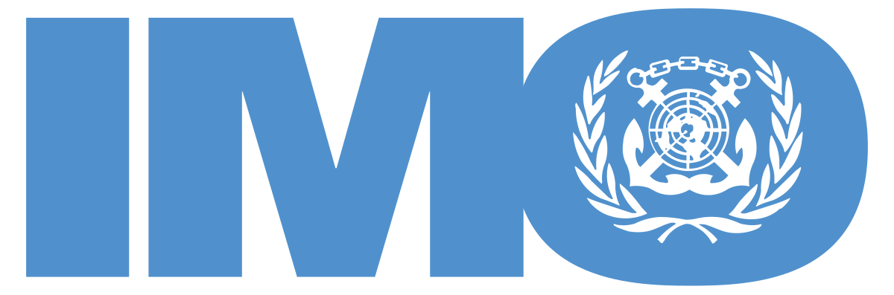

## Table of Contents

## What is the International Maritime Organization (IMO)?

The International Maritime Organization (IMO) is a special group that helps make the world's oceans safe and clean. It was created by the United Nations in 1948 and started working in 1959. The IMO makes rules that countries agree to follow to make sure ships are safe and do not harm the environment. They also help stop illegal activities like piracy on the seas.

The IMO is made up of many countries that work together. They meet to talk about and decide on new rules. These rules can be about how ships should be built, how they should be run, and how to protect the environment from pollution. The IMO also helps train people who work on ships and makes sure they know how to do their jobs safely. By working together, the IMO helps make sure that traveling and trading by sea is safe for everyone.

## When was the IMO established and why?

The IMO was set up in 1948. It was created because countries wanted to work together to make sea travel safer and cleaner. Before the IMO, there were no global rules for ships, and this could be dangerous and bad for the environment.

The IMO started working in 1959. It helps make rules that all countries agree to follow. These rules help stop accidents at sea, keep the oceans clean, and stop illegal activities like piracy. By working together, the IMO makes sure that ships can travel safely and that the seas stay healthy for everyone.

## What are the main objectives of the IMO?

The main goal of the IMO is to make sea travel safe for everyone. They do this by making rules that all countries agree to follow. These rules help stop accidents on ships and make sure that the people who work on them know how to do their jobs safely. The IMO also works to stop illegal activities like piracy, which can be dangerous for everyone at sea.

Another big goal of the IMO is to keep the oceans clean and healthy. They make rules to stop ships from polluting the water. This includes rules about how to get rid of waste and how to stop oil spills. By keeping the oceans clean, the IMO helps protect the environment and the animals that live in the sea.

The IMO also helps countries work together. They meet to talk about new rules and ideas. This helps make sure that everyone is doing their part to keep the seas safe and clean. By working together, the IMO makes sure that traveling and trading by sea is safe for everyone.

## How is the IMO structured and who are its members?

The IMO is made up of many different parts that work together to keep the seas safe and clean. At the top is the Assembly, which is like a big meeting where all the member countries come together every two years to make big decisions. The Council is another important part that meets more often to help run the IMO between the big meetings. There are also many smaller groups called committees and sub-committees that focus on specific topics like safety, the environment, and how ships are built and run.

The IMO has 175 member countries. These countries work together to make rules that everyone agrees to follow. Each country sends people to the IMO meetings to represent them and help make decisions. Countries that are not full members can still join as associate members or observers. This means they can come to meetings and share their ideas, but they don't get to vote on the rules. By working together, all these countries help make sure that the oceans are safe and clean for everyone.

## What are some key conventions and regulations set by the IMO?

The IMO has made many important rules to keep the seas safe and clean. One big rule is the International Convention for the Safety of Life at Sea (SOLAS). This rule makes sure that ships are built safely and have things like lifeboats and fire safety equipment. It helps stop accidents and saves lives if something goes wrong. Another important rule is the International Convention for the Prevention of Pollution from Ships (MARPOL). This rule stops ships from polluting the oceans with things like oil, chemicals, and garbage. It helps keep the water clean and protects the animals that live in the sea.

The IMO also has rules about how ships should be run and how people should be trained to work on them. The International Convention on Standards of Training, Certification and Watchkeeping for Seafarers (STCW) makes sure that people who work on ships know how to do their jobs safely. This helps stop accidents and keeps everyone on board safe. Another rule, the International Convention on Maritime Search and Rescue (SAR), helps countries work together to save people who are in trouble at sea. By working together and following these rules, the IMO helps make sure that traveling and trading by sea is safe for everyone.

## How does the IMO address environmental concerns in maritime transport?

The IMO works hard to keep the oceans clean by making rules that stop ships from polluting the water. One big rule they made is called MARPOL, which stands for the International Convention for the Prevention of Pollution from Ships. This rule tells ships how to get rid of waste, oil, and chemicals in a way that doesn't hurt the environment. It also makes sure that ships don't dump garbage into the sea. By following these rules, ships help keep the water clean and safe for sea animals and people.

The IMO also makes rules about how ships should be built to be less harmful to the environment. They have rules about using cleaner fuels and making engines that pollute less. For example, they have rules about using low-sulfur fuel to cut down on air pollution. They also work on new ideas like using wind power or electric ships to make sea travel even cleaner. By making these rules, the IMO helps make sure that ships can travel without hurting the environment too much.

## What role does the IMO play in maritime safety?

The IMO plays a big role in making sure that traveling by sea is safe for everyone. They make rules that all countries agree to follow. One important rule is called SOLAS, which stands for the International Convention for the Safety of Life at Sea. This rule tells ships how to be built safely and what safety equipment they need to have, like lifeboats and fire safety gear. By following these rules, ships can be safer and help stop accidents from happening.

The IMO also makes rules about how ships should be run and how the people who work on them should be trained. The STCW rule, which stands for the International Convention on Standards of Training, Certification and Watchkeeping for Seafarers, makes sure that everyone working on a ship knows how to do their job safely. This helps stop accidents and keeps everyone on board safe. The IMO also helps countries work together to save people who are in trouble at sea through the SAR rule, which stands for the International Convention on Maritime Search and Rescue. By making these rules, the IMO helps make sure that traveling by sea is safe for everyone.

## How does the IMO influence global shipping practices?

The IMO influences global shipping practices by making rules that all countries agree to follow. These rules help make sure that ships are safe and do not harm the environment. For example, the IMO has rules like SOLAS, which tells ships how to be built safely and what safety equipment they need. This helps stop accidents and keeps everyone on board safe. The IMO also has rules like MARPOL, which stops ships from polluting the oceans with things like oil and garbage. By following these rules, ships help keep the water clean and safe for sea animals and people.

The IMO also makes rules about how ships should be run and how the people who work on them should be trained. The STCW rule makes sure that everyone working on a ship knows how to do their job safely. This helps stop accidents and keeps everyone safe. The IMO also helps countries work together to save people who are in trouble at sea through the SAR rule. By working together and following these rules, the IMO helps make sure that traveling and trading by sea is safe for everyone and that the oceans stay healthy.

## What are the IMO's initiatives to combat piracy and maritime security?

The IMO works hard to stop piracy and make the seas safe for everyone. They help countries work together to stop pirates. They do this by making rules like the Djibouti Code of Conduct, which helps countries around Africa and the Middle East share information and work together to stop piracy. The IMO also helps train people who work on ships so they know what to do if they see pirates. By working together and following these rules, the IMO helps make sure that ships can travel safely without being attacked by pirates.

The IMO also makes rules to stop other dangers at sea, like terrorism. They have rules like the ISPS Code, which stands for the International Ship and Port Facility Security Code. This rule tells ships and ports how to be safe from attacks. It makes sure that ships and ports have security plans and check people and things coming on board. By following these rules, the IMO helps keep ships and ports safe from attacks and makes sure that traveling by sea is safe for everyone.

## How does the IMO collaborate with other international organizations?

The IMO works with other big groups to make the seas safe and clean. They team up with the United Nations (UN) a lot because the IMO is part of the UN. They work together on things like stopping pollution and making sure ships are safe. The IMO also works with groups like the World Bank to help countries build better ports and ships. By working together, they can make sure that everyone follows the same rules and that the oceans stay healthy.

The IMO also teams up with groups that focus on the environment, like the United Nations Environment Programme (UNEP). They work together to make rules that stop ships from polluting the water. They also work with groups like the International Labour Organization (ILO) to make sure that people who work on ships are treated fairly and safely. By working with all these different groups, the IMO can make sure that traveling and trading by sea is safe for everyone and that the oceans stay clean.

## What challenges does the IMO face in implementing its policies?

The IMO faces many challenges when trying to make sure everyone follows their rules. One big challenge is that not all countries have the same resources or money to follow the rules. Some countries might not have enough money to build safe ships or train their workers properly. This can make it hard for them to follow the IMO's rules, even if they want to. Another challenge is that some countries might not agree with the rules or might not want to follow them. This can make it hard for the IMO to make sure everyone is doing their part to keep the seas safe and clean.

Another challenge is keeping up with new technology and changes in the world. Ships are getting bigger and more advanced, and the IMO needs to make new rules to keep up with these changes. They also need to think about new problems like cyber attacks on ships. It can be hard to make rules that work for all these new situations. The IMO also needs to work with other groups and countries to make sure everyone is following the same rules. This can take a lot of time and effort, but it's important to make sure the oceans stay safe and clean for everyone.

## What future developments or reforms are being considered by the IMO?

The IMO is always looking at new ways to make the seas safer and cleaner. One big thing they are working on is making ships use less fuel and pollute less. They are thinking about new rules that will make ships use cleaner fuels like electricity or wind power. They are also working on rules to stop ships from using fuels that make the air dirty. By making these changes, the IMO hopes to help stop climate change and keep the oceans healthy.

Another thing the IMO is looking at is how to keep up with new technology. Ships are getting smarter and more connected, so the IMO needs to make sure they are safe from cyber attacks. They are thinking about new rules to protect ships from these kinds of dangers. The IMO also wants to make sure that everyone who works on ships knows how to use new technology safely. By making these changes, the IMO hopes to keep the seas safe for everyone, even as the world changes.

## What is Algorithmic Trading in Maritime Shipping?

Algorithmic trading, a sophisticated technology already revolutionizing financial markets, is beginning to reshape the maritime shipping industry. At its core, [algorithmic trading](/wiki/algorithmic-trading) involves the use of complex algorithms to execute trades or operational decisions at speeds and efficiencies unattainable by human operators alone. This technology provides strategic advantages in fleet management, chartering, and route selection.

One primary function of algorithmic trading systems is their ability to handle and analyze massive datasets rapidly, which facilitates accurate predictions of shipping demand and pricing trends. By using historical and real-time data, these algorithms can forecast fluctuations in demand, allowing operators to adjust their strategies accordingly. For example, [machine learning](/wiki/machine-learning) models can be employed to detect patterns and correlations in trade routes, weather conditions, and port congestion, thereby optimizing logistical operations.

Mathematically, these algorithms often rely on regression models and time-series analysis to predict future states of the shipping markets. For instance, a basic linear regression model can be used to estimate future shipping demand $\hat{y}$ based on various predictors $x_1, x_2, ..., x_n$:

$$
\hat{y} = \beta_0 + \beta_1 x_1 + \beta_2 x_2 + \ldots + \beta_n x_n
$$

Here, $\beta_0$ is the intercept, and $\beta_1, \beta_2, ..., \beta_n$ are coefficients representing the weight of each predictor. Advanced models might include non-linear relationships or incorporate tools such as neural networks for greater predictive analysis.

In practical terms, shipping firms employ these predictive capabilities to streamline fleet deployment. By understanding future demand, companies can strategically position their vessels to maximize load efficiency and minimize idle time, thereby reducing fuel waste and operational costs.

Algorithmic systems also play a crucial role in risk management through hedging strategies, further enhancing profitability. For instance, companies can use derivatives trading algorithms to protect against volatile shipping rates. By setting trigger points for automated trades, these systems can ensure that financial exposure is minimized when market conditions shift unexpectedly.

The integration of algorithmic trading into maritime logistics heralds new business opportunities, from dynamic pricing models that react in real-time to market changes to the development of more adaptive chartering contracts. As technology continues to progress, the maritime industry is poised to benefit from increased operational efficiency and strategic growth.

Overall, although the widespread adoption of these technologies is still emerging, their potential to transform maritime shipping operations and logistics is considerable. As such, industry stakeholders are keenly aware of the need to incorporate algorithmic solutions in their strategic planning to maintain a competitive edge in this evolving marketplace.

## References & Further Reading

[1]: ["International Convention for the Safety of Life at Sea (SOLAS), 1974"](https://www.imo.org/en/About/Conventions/Pages/International-Convention-for-the-Safety-of-Life-at-Sea-(SOLAS),-1974.aspx),-1974.aspx) - International Maritime Organization (IMO).

[2]: ["International Convention for the Prevention of Pollution from Ships (MARPOL)"](https://www.imo.org/en/about/Conventions/Pages/International-Convention-for-the-Prevention-of-Pollution-from-Ships-(MARPOL).aspx).aspx) - International Maritime Organization (IMO).

[3]: Hijmans, Arjen-Norman, et al. ["Innovations in Maritime Transport: Algorithmic Trading and Digitalization."](https://www.sciencedirect.com/science/article/pii/S0048733321000913) Journal of Maritime Research.

[4]: Stopford, Martin. ["Maritime Economics"](https://www.taylorfrancis.com/books/mono/10.4324/9780203891742/maritime-economics-3e-martin-stopford) (3rd Edition). Routledge, 2009.

[5]: Buhaug, Ø., et al. ["Second IMO GHG Study 2009"](https://www.imo.org/en/OurWork/Environment/Pages/Second-IMO-GHG-Study-2009.aspx) - International Maritime Organization (IMO).