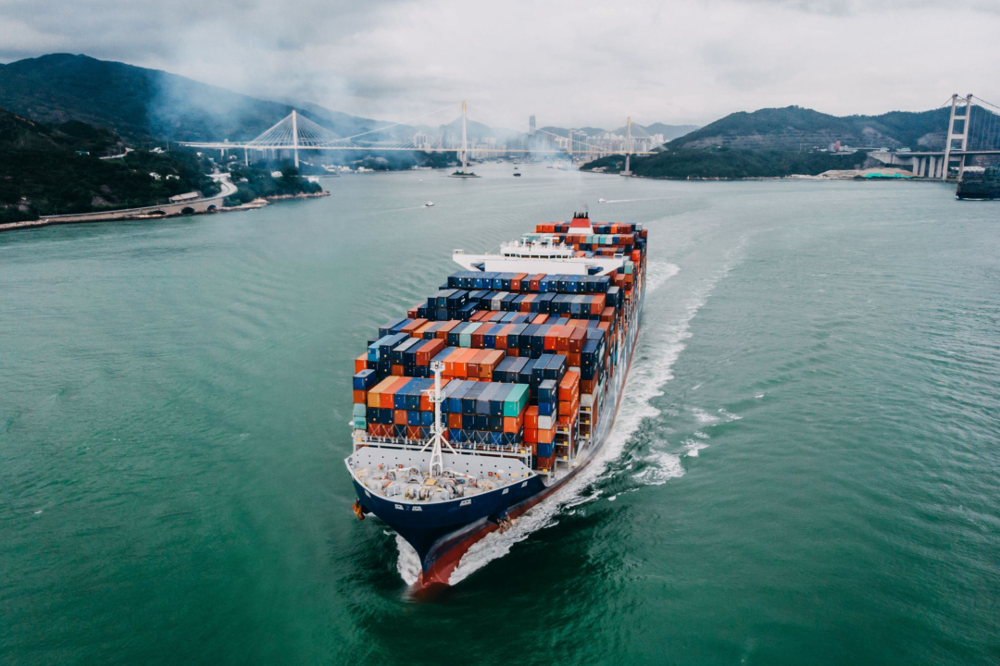

The global shipping industry is a cornerstone of international trade, transporting approximately 90% of the world's goods across vast oceanic expanses. This extensive network is integral to global economic growth and stability. Central to this intricate system is the International Maritime Organization (IMO), a specialized agency of the United Nations. The IMO's role is pivotal in establishing and maintaining a comprehensive regulatory framework that ensures maritime safety, environmental protection, and operational efficiency. Its strategic regulations and conventions guide shipping operations globally, fostering a uniform standard that mitigates risks associated with maritime activities.

Amid the traditional frameworks, innovation is reshaping how the maritime industry operates. Algorithmic trading, a concept initially rooted in financial markets, is now making waves in maritime sectors, providing enhanced decision-making capabilities through advanced data analysis. This intersection of technological advancement and maritime operations paves the way for unprecedented efficiencies, as algorithmic trading optimizes fleet deployment, route selection, and chartering decisions based on complex algorithms.

This article examines the convergence of maritime regulation, the transformative influence of the IMO, the industry's evolving dynamics, and the profound impact of algorithmic trading. By analyzing these critical elements, we gain insights into the future trajectory of global maritime commerce, emphasizing the importance of harmonizing regulatory foresight with technological innovation to sustain the industry's growth and adaptability within a rapidly changing global landscape. Understanding these emerging trends is essential for stakeholders aiming to navigate the complexities of modern maritime logistics successfully.

## Table of Contents

## The Role of the International Maritime Organization (IMO)

The International Maritime Organization (IMO) is a specialized agency of the United Nations established to develop and maintain a comprehensive regulatory framework for shipping. Founded in 1948 and headquartered in London, the IMO plays a crucial role in ensuring the safety, security, and efficiency of international shipping. Its primary objectives include enhancing maritime safety, ensuring fair competition, and protecting the maritime environment. These aims are achieved through the formulation and enforcement of global standards and conventions.

One of the IMO's most significant contributions is the establishment of key conventions that form the backbone of international maritime law. Among these are the International Convention for the Safety of Life at Sea (SOLAS) and the International Convention for the Prevention of Pollution from Ships (MARPOL). SOLAS is regarded as one of the most important treaties concerning the safety of merchant ships, mandating minimum standards for the construction, equipment, and operation of vessels to ensure their safety at sea. Similarly, MARPOL aims to minimize pollution from ships, covering various forms of pollution such as oil spills, chemical discharges, and waste disposal.

As the shipping industry evolves, the IMO continually updates its regulations to address new challenges, including those posed by climate change and technological advancements. For instance, amendments to MARPOL have introduced measures to reduce greenhouse gas emissions from ships, reflecting the global commitment to combat climate change. The evolving maritime landscape driven by technological innovation, such as digitalization and automation, also necessitates the revision and enhancement of IMO regulations to maintain relevance and effectiveness.

The standards set by the IMO are essential in maintaining a level playing field within the shipping industry. They ensure that all players adhere to the same rules and standards, thereby promoting fair competition. Additionally, these standards facilitate smooth international trade by providing a consistent legal framework that nations and companies can rely on, reducing uncertainties and fostering trust in maritime operations.

In conclusion, the International Maritime Organization's regulatory framework is fundamental to global shipping. By focusing on safety, environmental protection, and equitable trade practices, the IMO plays a pivotal role in shaping the future of maritime commerce in an increasingly interconnected world.

## Current Challenges Facing the Shipping Industry

The shipping industry is a vital component of global commerce, yet it is beset with multiple challenges in the contemporary era. A primary concern is adherence to environmental regulations, which increasingly demand significant reductions in greenhouse gas emissions. The International Maritime Organization (IMO) has set ambitious targets through regulations such as the International Convention for the Prevention of Pollution from Ships (MARPOL). Meeting these targets necessitates innovation in ship design, fuel alternatives, and operational efficiency, offering both obstacles and chances for advancement.

Financial pressures are compounded by rising fuel costs, which have a substantial impact given that fuel accounts for a significant portion of operational expenses. With the [volatility](/wiki/volatility-trading-strategies) of oil prices, shipping companies must explore strategies like slow steaming and fuel-switching to mitigate costs while remaining compliant with environmental standards.

Piracy remains a tangible threat, particularly in regions such as the Gulf of Aden and the Straits of Malacca. These threats necessitate investments in security measures, including armed guards and advanced tracking technologies, which further add to operational costs.

The industry must also navigate geopolitical tensions, which can lead to the rerouting of ships and increased shipping times and costs. For instance, conflicts or political instability can affect critical chokepoints such as the Suez Canal or the Strait of Hormuz, influencing global trade flows.

Fluctuating global demand adds another layer of complexity. Economic downturns or shifts in consumer behavior can lead to overcapacity in shipping fleets, leading to decreased freight rates. Conversely, sudden surges in demand can strain capacity, impacting service reliability and pricing structures.

The rise of automation and digitalization is transforming industry operations. Technologies such as the Internet of Things (IoT) and big data analytics enable real-time monitoring of vessel performance and predictive maintenance, improving efficiency and reducing costs. However, these advancements also require substantial investments and come with cybersecurity risks that must be managed to protect sensitive maritime data.

For the shipping industry to thrive amidst these challenges, it must adeptly adapt through strategic planning and investment in technology. Such adaptation is essential for maintaining competitiveness and ensuring growth in an increasingly complex and demanding environment.

## Algorithmic Trading in Maritime Shipping

Algorithmic trading, a sophisticated technology already revolutionizing financial markets, is beginning to reshape the maritime shipping industry. At its core, [algorithmic trading](/wiki/algorithmic-trading) involves the use of complex algorithms to execute trades or operational decisions at speeds and efficiencies unattainable by human operators alone. This technology provides strategic advantages in fleet management, chartering, and route selection.

One primary function of algorithmic trading systems is their ability to handle and analyze massive datasets rapidly, which facilitates accurate predictions of shipping demand and pricing trends. By using historical and real-time data, these algorithms can forecast fluctuations in demand, allowing operators to adjust their strategies accordingly. For example, [machine learning](/wiki/machine-learning) models can be employed to detect patterns and correlations in trade routes, weather conditions, and port congestion, thereby optimizing logistical operations.

Mathematically, these algorithms often rely on regression models and time-series analysis to predict future states of the shipping markets. For instance, a basic linear regression model can be used to estimate future shipping demand $\hat{y}$ based on various predictors $x_1, x_2, ..., x_n$:

$$
\hat{y} = \beta_0 + \beta_1 x_1 + \beta_2 x_2 + \ldots + \beta_n x_n
$$

Here, $\beta_0$ is the intercept, and $\beta_1, \beta_2, ..., \beta_n$ are coefficients representing the weight of each predictor. Advanced models might include non-linear relationships or incorporate tools such as neural networks for greater predictive analysis.

In practical terms, shipping firms employ these predictive capabilities to streamline fleet deployment. By understanding future demand, companies can strategically position their vessels to maximize load efficiency and minimize idle time, thereby reducing fuel waste and operational costs.

Algorithmic systems also play a crucial role in risk management through hedging strategies, further enhancing profitability. For instance, companies can use derivatives trading algorithms to protect against volatile shipping rates. By setting trigger points for automated trades, these systems can ensure that financial exposure is minimized when market conditions shift unexpectedly.

The integration of algorithmic trading into maritime logistics heralds new business opportunities, from dynamic pricing models that react in real-time to market changes to the development of more adaptive chartering contracts. As technology continues to progress, the maritime industry is poised to benefit from increased operational efficiency and strategic growth.

Overall, although the widespread adoption of these technologies is still emerging, their potential to transform maritime shipping operations and logistics is considerable. As such, industry stakeholders are keenly aware of the need to incorporate algorithmic solutions in their strategic planning to maintain a competitive edge in this evolving marketplace.

## Maritime Regulation and the Adoption of New Technologies

The International Maritime Organization (IMO) plays a pivotal role in ensuring that the incorporation of new technologies into maritime operations occurs within a framework that emphasizes safety, security, and environmental protection. As the maritime industry becomes increasingly digital, the IMO faces the challenge of updating regulatory frameworks to keep pace with technological advancements while preventing potential disruptions.

Balancing innovation with regulatory oversight is essential. Without adequate regulation, the rapid deployment of technology can lead to unforeseen safety risks and operational inefficiencies. Thus, the IMO must create flexible regulations that can adapt to advancements, particularly as new technologies are adopted at unprecedented rates.

A critical area that requires attention is cybersecurity. As maritime operations become heavily reliant on digital systems, they become more vulnerable to cyber threats. Regulations must evolve to ensure robust protection of sensitive data and the integrity of automated systems. This involves compliance with cybersecurity standards and implementing measures to safeguard against breaches and data theft.

Collaboration among industry stakeholders and regulatory bodies is fundamental to the successful integration of technology. By fostering partnerships, the IMO can ensure technologies are implemented safely without hindering compliance. These collaborations enable the sharing of best practices, creating a cooperative environment that encourages innovation while maintaining stringent safety standards.

Finally, the IMO’s proactive stance in promoting innovation aligns with its overarching objectives to enhance sustainability in the maritime industry. By providing guidelines and frameworks for the adoption of eco-friendly technologies, the IMO supports the industry's efforts to reduce its environmental footprint, thereby contributing to global sustainability goals. This dual focus on innovation and regulation ensures a future where maritime technology advances responsibly and efficiently.

## Conclusion

The maritime shipping industry is experiencing a transformative phase, driven by the confluence of robust regulatory frameworks and rapid technological advancements. Central to this transformation is the International Maritime Organization (IMO), which continues to play a pivotal role in steering the industry towards enhanced safety standards, environmental sustainability, and fair trading practices. The regulations set forth by the IMO are crucial in fostering an environment that encourages innovation while maintaining strict adherence to safety and environmental guidelines.

Algorithmic trading, along with various digital innovations, is at the forefront of this industry evolution. These advancements offer substantial opportunities for improving operational efficiencies and driving strategic growth. By employing sophisticated algorithms, shipping companies can optimize fleet management, predict market trends with greater accuracy, and mitigate risks effectively, thereby enhancing profitability and competitiveness.

However, the successful integration of these technologies within the maritime sector relies heavily on collaboration between industry stakeholders and regulatory bodies. A concerted effort is necessary to ensure that technological innovations are adopted responsibly, without compromising the safety and compliance standards that the industry upholds.

As the global economy remains heavily dependent on maritime logistics, the future of shipping hinges on the harmonious integration of regulation and innovation. By aligning technological progress with regulatory frameworks, the maritime industry is poised to operate more efficiently, sustainably, and equitably, ensuring its continued vital role in global trade.

## References & Further Reading

[1]: ["International Convention for the Safety of Life at Sea (SOLAS), 1974"](https://www.imo.org/en/About/Conventions/Pages/International-Convention-for-the-Safety-of-Life-at-Sea-(SOLAS),-1974.aspx),-1974.aspx) - International Maritime Organization (IMO).

[2]: ["International Convention for the Prevention of Pollution from Ships (MARPOL)"](https://www.imo.org/en/about/Conventions/Pages/International-Convention-for-the-Prevention-of-Pollution-from-Ships-(MARPOL).aspx).aspx) - International Maritime Organization (IMO).

[3]: Hijmans, Arjen-Norman, et al. ["Innovations in Maritime Transport: Algorithmic Trading and Digitalization."](https://www.sciencedirect.com/science/article/pii/S0048733321000913) Journal of Maritime Research.

[4]: Stopford, Martin. ["Maritime Economics"](https://www.taylorfrancis.com/books/mono/10.4324/9780203891742/maritime-economics-3e-martin-stopford) (3rd Edition). Routledge, 2009.

[5]: Buhaug, Ø., et al. ["Second IMO GHG Study 2009"](https://www.imo.org/en/OurWork/Environment/Pages/Second-IMO-GHG-Study-2009.aspx) - International Maritime Organization (IMO).