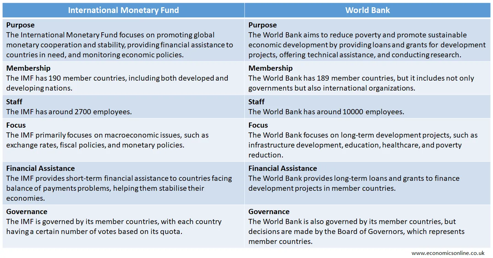

## Table of Contents

## What is the International Monetary Fund (IMF)?

The International Monetary Fund (IMF) is an organization that helps countries with their money problems. It was created after World War II to help countries work together and keep their economies stable. Countries that join the IMF can get help if they have trouble with their money, like if they owe a lot to other countries or if their economy is not doing well.

The IMF gives advice and loans to countries that need help. It also keeps an eye on the world's economy and tells countries what they can do to make their economies better. When a country gets a loan from the IMF, it usually has to follow certain rules to fix its economic problems. This way, the IMF helps make the world's economy stronger and more stable.

## What are the primary goals of the IMF?

The main goal of the International Monetary Fund (IMF) is to make sure that the world's economy stays stable. It does this by helping countries that are having money problems. When a country's economy is not doing well, it can ask the IMF for help. The IMF gives advice and loans to these countries so they can fix their economic issues and keep their money stable.

Another important goal of the IMF is to help countries work together better. It does this by keeping an eye on the world's economy and sharing information with countries. This helps countries understand what is happening in the global economy and how they can work together to make things better. By doing this, the IMF helps create a stronger and more stable world economy.

## How does the IMF help countries in financial distress?

The IMF helps countries in financial distress by giving them loans and advice. When a country is having money problems, it can ask the IMF for help. The IMF will then give the country a loan to help it pay its bills and fix its economy. But, the IMF doesn't just give money; it also gives advice on how to make the country's economy better. This advice might include things like changing laws or making the government spend less money.

When a country gets a loan from the IMF, it has to follow certain rules. These rules are called "conditions," and they are meant to help the country fix its money problems. For example, the IMF might tell the country to lower its spending or change its taxes. By following these rules, the country can use the loan to get its economy back on track. This way, the IMF helps countries in financial distress get better and stay stable.

## What are the main advantages of IMF assistance for member countries?

When a country gets help from the IMF, it can fix its money problems faster. The IMF gives loans that help the country pay its bills and keep its economy going. This is important because if a country can't pay its bills, it might have big problems. The IMF's loans give the country the money it needs to get better. Plus, the IMF gives good advice on how to make the economy stronger. This advice can help the country make smart choices about its money and laws.

Another big advantage of IMF help is that it makes the world's economy more stable. When one country's economy is in trouble, it can affect other countries too. By helping countries in need, the IMF stops these problems from spreading. This makes the whole world's economy safer and more predictable. Also, when countries follow the IMF's advice and rules, they can work better with other countries. This teamwork helps everyone's economy grow and stay strong.

## How does the IMF promote global economic stability?

The IMF helps keep the world's economy stable by watching over it and giving advice to countries. It looks at what is happening in the global economy and tells countries what they can do to make things better. If a country is having money problems, the IMF can give it a loan to help it fix its economy. This stops the country's problems from spreading to other countries and making the whole world's economy unstable.

When the IMF gives a loan, it also gives advice on how to make the country's economy stronger. This advice can help the country make smart choices about its money and laws. By following the IMF's advice, countries can work better together and make the global economy more stable. This teamwork helps everyone's economy grow and stay strong, which is good for the whole world.

## What are the typical conditions attached to IMF loans?

When a country gets a loan from the IMF, it has to follow certain rules, which are called conditions. These conditions are meant to help the country fix its money problems. For example, the IMF might tell the country to spend less money or change its taxes. This can help the country use the loan to make its economy better. The conditions are important because they make sure the country uses the money in a smart way.

Another common condition is that the country might need to change some of its laws or rules. This could mean making it easier for businesses to work or changing how the government spends its money. By doing this, the country can become more stable and grow its economy. The IMF works with the country to make sure these changes help fix the problems and make the economy stronger in the long run.

## What criticisms are commonly directed at the IMF's policies and practices?

Some people say that the IMF's rules can make things harder for countries that are already struggling. They think the IMF's conditions, like spending less money or changing laws, can hurt poor people the most. For example, if a country has to spend less on things like schools and hospitals, it can make life harder for people who need help. Critics also say that the IMF sometimes pushes countries to open up their markets too quickly, which can hurt local businesses and workers.

Another criticism is that the IMF has too much power over countries that need help. Some people think that the IMF's rules don't always fit every country's situation. They say the IMF should listen more to what each country needs instead of using the same rules for everyone. Critics also worry that the IMF focuses too much on fixing short-term problems and not enough on helping countries grow in the long run. They think the IMF should do more to help countries build strong economies that can last.

## How does the IMF's decision-making process work, and what are its implications?

The IMF's decision-making happens through its Board of Governors, where each member country gets a vote. But, countries with more money in the IMF get more votes, so richer countries have more say. The Board of Governors meets once a year, but most decisions are made by the Executive Board, which meets more often. The Executive Board has 24 members, and they make choices about loans, rules, and other big things. The voting power on the Executive Board also depends on how much money a country has put into the IMF.

This way of making decisions can cause problems. Some people say it's not fair because richer countries have more control. This means that the IMF might not always make choices that are best for poorer countries. Also, because the IMF has a lot of power over countries that need help, its decisions can have a big impact on those countries' economies. If the IMF makes a rule that doesn't fit a country's situation, it can make things harder for that country. So, it's important for the IMF to listen to what each country needs and try to make decisions that help everyone.

## What are the potential disadvantages of IMF interventions for borrowing countries?

When a country gets help from the IMF, it can face some problems. One big problem is that the IMF's rules can make life harder for people in the country. For example, if the IMF says the country has to spend less money, the government might cut back on things like schools and hospitals. This can hurt poor people the most because they need these services the most. Also, the IMF might tell the country to open up its markets quickly, which can hurt local businesses and workers. They might lose their jobs or have to compete with big companies from other countries.

Another problem is that the IMF can have too much power over the country. The IMF's rules might not always fit what the country really needs. Sometimes, the IMF uses the same rules for every country, even though each country's situation is different. This can make it hard for the country to fix its problems in a way that works best for them. Also, the IMF might focus too much on fixing short-term problems and not enough on helping the country grow in the long run. This means the country might get better quickly but could face more problems later if it doesn't have a strong economy.

## How does the IMF influence global economic policies beyond direct financial assistance?

The IMF influences global economic policies by giving advice and sharing information with countries. It watches the world's economy and tells countries what is happening and what they can do to make things better. This helps countries make smart choices about their money and laws. When countries follow the IMF's advice, they can work together better and make the whole world's economy stronger. The IMF also helps countries set up rules and standards that make it easier for them to trade and do business with each other.

Besides giving direct help to countries, the IMF also talks to other big groups like the World Bank and the United Nations. They work together to make plans and rules that help the world's economy. The IMF's ideas and advice can affect what these groups do, which means it can have a big impact on global economic policies. By working with these groups, the IMF helps make sure that countries around the world are following good practices and working together to keep the economy stable.

## What role does the IMF play in debt restructuring and crisis prevention?

The IMF helps countries manage their debts and stop big money problems before they start. When a country has too much debt, it can ask the IMF for help. The IMF works with the country and its lenders to change the debt so it's easier to pay back. This is called debt restructuring. The IMF gives advice on how to make the debt smaller or give the country more time to pay it back. By doing this, the IMF helps the country fix its money problems and keep its economy going.

The IMF also tries to stop money crises from happening in the first place. It does this by watching the world's economy and telling countries what they can do to stay stable. The IMF gives advice on things like saving money, spending less, and making good laws. If a country follows this advice, it can avoid big money problems. The IMF also helps countries work together and share information, which makes the whole world's economy stronger and less likely to have big problems.

## How effective has the IMF been in achieving its objectives, and what reforms have been proposed?

The IMF has had some success in helping countries with their money problems and keeping the world's economy stable. It has given loans and advice to many countries, which has helped them fix their economies and pay their bills. The IMF also watches the world's economy and tells countries what they can do to make things better. This has helped countries work together and make smart choices about their money and laws. But, the IMF has also faced some problems. Some people say its rules can make life harder for poor people and that it has too much power over countries that need help. Also, the IMF's focus on short-term fixes might not always help countries grow in the long run.

To make the IMF better, some people have suggested changes. One idea is to give poorer countries more say in the IMF's decisions. This could make the IMF's rules fairer and fit each country's needs better. Another idea is for the IMF to focus more on helping countries grow their economies in the long run, not just fixing short-term problems. The IMF could also work more with other groups like the World Bank to make sure its advice and rules help the whole world's economy. By making these changes, the IMF could do a better job of helping countries and keeping the world's economy stable.

## References & Further Reading

[1]: International Monetary Fund. (n.d.). [History.](https://en.wikipedia.org/wiki/International_Monetary_Fund) Retrieved from the International Monetary Fund website.

[2]: International Monetary Fund. (n.d.). [Lending.](https://www.imf.org/external/pubs/ft/ar/2024/what-we-do/lending/) Retrieved from the International Monetary Fund website.

[3]: International Monetary Fund. (n.d.). [Capacity Development.](https://www.imf.org/external/pubs/ft/ar/2024/what-we-do/capacity-development/) Retrieved from the International Monetary Fund website.

[4]: Stiglitz, J. E. (2002). "Globalization and Its Discontents." W. W. Norton & Company.

[5]: Lopez de Prado, M. (2018). ["Advances in Financial Machine Learning."](https://www.amazon.com/Advances-Financial-Machine-Learning-Marcos/dp/1119482089) Wiley.

[6]: Aronson, D. R. (2007). ["Evidence-Based Technical Analysis: Applying the Scientific Method and Statistical Inference to Trading Signals."](https://onlinelibrary.wiley.com/doi/book/10.1002/9781118268315) Wiley.

[7]: Jansen, S. (2020). ["Machine Learning for Algorithmic Trading."](https://github.com/stefan-jansen/machine-learning-for-trading) Packt Publishing.

[8]: Chan, E. P. (2008). ["Quantitative Trading: How to Build Your Own Algorithmic Trading Business."](https://github.com/ftvision/quant_trading_echan_book) Wiley.