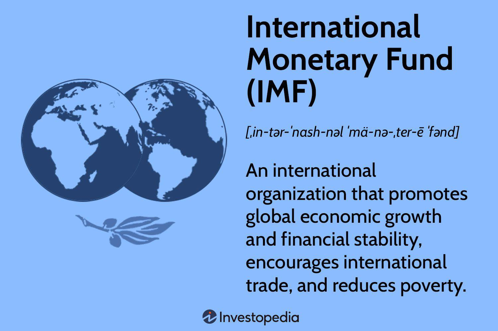

The International Monetary Fund (IMF) is a cornerstone institution in global finance, established to promote international monetary cooperation, secure financial stability, and facilitate international trade. As a specialized agency of the United Nations, the IMF provides financial assistance to member countries facing balance of payments problems, aiming to stabilize economies and foster sustainable economic growth. Its critical functions include offering policy advice, financial lending, and serving as a forum for cooperation on monetary issues. With 190 member countries as of 2023, the IMF exerts significant influence over global economic policies and practices, continuously adapting to address emerging challenges in the global financial system.

Algorithmic trading, on the other hand, has revolutionized financial markets by automating trading strategies through advanced algorithms and computational power. This trading approach leverages mathematical models to execute trades at speeds and frequencies far beyond human capabilities, significantly enhancing market efficiency and liquidity. The impact of algorithmic trading on financial markets is profound, as it introduces new dynamics such as increased market liquidity and volatility, posing both opportunities and challenges for market participants and regulators alike.



At the intersection of IMF policies and algorithmic trading lies a complex and evolving landscape where global financial stability and technological advancement converge. The IMF's regulatory frameworks and policies are increasingly relevant as algorithmic trading becomes a dominant force in financial markets. Understanding how IMF policies interface with the mechanics of algorithmic trading is essential for grasping the broader implications on global economic stability and the regulatory environment.

This article aims to provide a comprehensive examination of the IMF's role in global finance and the transformative impact of algorithmic trading. By exploring the synergy and tension between IMF policies and algorithmic trading, readers will gain insights into the regulatory challenges and opportunities posed by this confluence. This understanding is crucial in the context of current global economic dynamics, where technology and finance coexist as powerful catalysts for change.

The significance of understanding these dynamics extends beyond theoretical analysis, impacting real-world policy-making, financial market practices, and technological innovation. As financial markets continue to evolve and integrate advanced technologies, the coordination between institutions like the IMF and participants in algorithmic trading becomes increasingly vital for ensuring a stable and sustainable global economic environment.

## Table of Contents

## Understanding the International Monetary Fund (IMF)

The International Monetary Fund (IMF) was conceived in July 1944 during the United Nations Monetary and Financial Conference held at Bretton Woods, New Hampshire. Officially established on December 27, 1945, the IMF's creation aimed to foster global monetary cooperation and ensure economic stability in a world recovering from the devastation of World War II. With an original membership of 29 countries, the organization has expanded significantly, now encompassing 190 member countries, working collectively to promote economic stability and growth.

The IMF seeks to achieve several key objectives integral to global financial stability. Primarily, it strives to ensure the stability of the international monetary system by helping to balance international payments and exchange rates. To facilitate international trade, an essential driver of economic growth, the IMF offers financial assistance and advice to its member countries. Its activities include surveillance of global economic trends, policy advice, and financial assistance to countries facing balance of payments problems. Additionally, the IMF provides capacity development programs to strengthen the economic institutions of its member states.

Influence on member countries is a cornerstone of the IMF's operations. By offering financial assistance through mechanisms such as Stand-By Arrangements (SBA) and Extended Fund Facility (EFF) programs, the IMF influences economic policies in borrowing countries, often advocating for fiscal discipline, reform, and macroeconomic stability. These interventions aim to restore economic equilibrium and sustain economic growth.

Several notable IMF interventions have marked its history, including its role during the 1997 Asian financial crisis, where it provided substantial financial packages to affected countries like South Korea, Indonesia, and Thailand. Similarly, during the 2008 global financial crisis, the IMF played a pivotal role by offering financial rescue packages to nations such as Greece, Iceland, and Ukraine, thereby stabilizing their economies.

Promoting international monetary cooperation is another fundamental role of the IMF, achieved through the provision of a forum for consultation and collaboration on international payments issues. The organization fosters global economic stability by providing essential data, analysis, and policy recommendations, leveraging its extensive research and expertise.

Overall, the IMF plays an indispensable role in maintaining the stability and well-being of the global economy. It acts as a central institution in managing international financial crises, promoting sound economic policies, and supporting sustainable economic growth worldwide.

## Algorithmic Trading: A Game Changer in Financial Markets

Algorithmic trading, often referred to as automated trading, involves the use of computer systems and software to execute trades in financial markets at high speed and [volume](/wiki/volume-trading-strategy). The core idea is to use algorithms—pre-defined, step-by-step computational procedures—for deciding on aspects of trade such as timing, price, and volume.

### Definition and Evolution of Algorithmic Trading

The concept of [algorithmic trading](/wiki/algorithmic-trading) originated in the 1970s with the advent of electronic exchanges. Initially, its purpose was limited to reducing the cost of obtaining paper transaction records. However, as technology advanced, algorithmic trading evolved to encompass a breadth of strategies ranging from simple execution algorithms to complex high-frequency trading ([HFT](/wiki/high-frequency-trading-strategies)) systems.

### How Algorithmic Trading Works: Technical and Operational Overview

Algorithmic trading relies on mathematical models to make transaction decisions. These decisions are based on variations of basic price-quantity strategies, intended to exploit various market fundaments. For a practical example, consider a "simple moving average crossover" strategy, which generates buy/sell signals when short-term prices cross long-term moving averages:

```python
def simple_moving_average(prices, window):
    return sum(prices[-window:]) / window

def trading_signal(short_window, long_window, prices):
    short_mavg = simple_moving_average(prices, short_window)
    long_mavg = simple_moving_average(prices, long_window)

    if short_mavg > long_mavg:
        return "buy"
    elif short_mavg < long_mavg:
        return "sell"
    else:
        return "hold"

# Example use:
prices = [10, 11, 12, 13, 14, 15, 16]
signal = trading_signal(3, 5, prices)
print(signal)  # Output could be "buy", "sell" or "hold" based on the averages
```

### The Rise of Algorithmic Trading in Global Financial Markets and Its Benefits

Over the past few decades, algorithmic trading has grown from a subsidiary strategy to a dominant force in financial markets. This transformation has been driven by technological advancements, increasing market fragmentation, and the promise of executing orders at optimal prices without human intervention. The payoffs include increased market efficiency, tighter spreads, and reduced transaction costs. Algorithms can process complex datasets and execute trades in milliseconds, a feat impossible with traditional manual methods.

### Challenges and Risks Associated with Algorithmic Trading

Despite its benefits, algorithmic trading poses certain challenges and risks. Key among these are technological pitfalls, such as software bugs or network outages, which can lead to significant financial losses. The strategies can also exhibit unexpected behaviors under volatile market conditions. Additionally, algorithmic trading raises regulatory concerns, particularly regarding market fairness and the potential for system-wide risks. Anecdotal examples include flash crashes, where trades cascade rapidly causing abrupt price movements.

### Impact of Algorithmic Trading on Market Liquidity and Volatility

Algorithmic trading significantly impacts market [liquidity](/wiki/liquidity-risk-premium) and [volatility](/wiki/volatility-trading-strategies). On one hand, it can improve liquidity by providing continuous order flows, thus reducing bid-ask spreads and price disparities between markets. On the other, algorithms, especially those deployed in high-frequency trading, can exacerbate volatility during stress periods by rapidly amplifying price movements. Therefore, while it fosters market efficiency, it necessitates comprehensive regulatory oversight to mitigate adverse effects.

In summary, algorithmic trading is integral to modern financial markets, bringing numerous efficiencies and complexities. Understanding these dynamics is key for regulators, investors, and market participants striving to harness its benefits while managing associated risks.

## The Intersection of IMF Policies and Algorithmic Trading

The impact of algorithmic trading on global financial stability is a matter of considerable importance, given its prevalence in modern financial markets. As algorithmic trading often leads to increased market liquidity, it can contribute to a more efficient allocation of resources and smoother market operations. However, it also introduces significant volatility risks, as evidenced by events like the Flash Crash of 2010. The International Monetary Fund (IMF), which aims to foster global monetary cooperation and ensure financial stability, recognizes these dual effects of algorithmic trading. The IMF has advocated for robust regulatory frameworks to monitor and mitigate systemic risks posed by high-frequency trading (HFT), a subset of algorithmic trading known for executing numerous orders at exceptionally fast speeds.

The IMF acknowledges the transformative role that fintech advancements, including algorithmic trading, play in modernizing financial markets. In various reports, the IMF has highlighted the need for regulatory systems to adapt to technological developments while ensuring that these do not destabilize the broader financial system. The potential influence of IMF regulations on algorithmic trading practices has been significant. For example, the Fund has recommended that countries adopt real-time data collection and monitoring systems to identify market disruptions caused by algorithmic trading swiftly. 

The alignment of algorithmic trading with the IMF's broader goals of economic stability involves ensuring that trading algorithms adhere to established principles of fairness, efficiency, and transparency. Algorithmic trading can contribute positively to the global financial ecosystem if managed correctly by reducing transaction costs and enhancing price discovery. However, if poorly regulated, it may lead to outcomes that contradict the IMF's objectives, such as exacerbating financial market crises.

A case study of interest is the regulatory overhaul post-2008 financial crisis, where IMF policies indirectly influenced algorithmic trading operations. In response to calls for greater market oversight, many countries instituted circuit breakers that temporarily halt trading during severe market fluctuations. These policies, aligning with the IMF’s advocacy for stability and transparency, significantly impacted how algorithmic trading firms calibrate their risk models and trading algorithms.

In conclusion, the convergence of IMF policies and algorithmic trading presents both challenges and opportunities for ensuring global financial stability. It necessitates a delicate balance between fostering technological innovation in financial markets and maintaining oversight to prevent systemic risks. The IMF's guidance in this area is crucial as it continues to evaluate and influence policies that protect against the potential downsides of rapid algorithm-driven transactions.

## Challenges and Opportunities at the Convergence

The convergence of International Monetary Fund (IMF) policies and algorithmic trading introduces a complex set of challenges and opportunities within global finance. As algorithmic trading becomes increasingly prevalent, it poses specific regulatory challenges that need to be addressed to ensure harmony with the IMF's objectives of maintaining economic stability and fostering global monetary cooperation.

### Regulatory Challenges

One of the primary regulatory challenges at this intersection is the potential for algorithmic trading to exacerbate market volatility. High-frequency trading (HFT), a subset of algorithmic trading, can lead to rapid market fluctuations, which can undermine the IMF's goal of financial stability. The "flash crashes" seen in various markets are illustrative of the potential risks posed by poorly regulated algorithmic systems. Regulatory bodies face the daunting task of crafting rules that mitigate these risks without stifling innovation.

Another challenge lies in the global nature of both IMF operations and algorithmic trading platforms. The cross-border nature of digital finance requires a harmonized regulatory framework that ensures consistency across jurisdictions. This need for a cohesive approach presents significant obstacles due to the diverse regulatory environments and economic priorities of member countries.

### Opportunities for Collaboration

Despite these challenges, there are ample opportunities for collaboration between financial institutions and the IMF. By working together, they can craft regulatory frameworks that facilitate the safe use of algorithmic trading technologies. Financial institutions can leverage the IMF's data analysis capabilities and global economic insights to better align their trading strategies with macroeconomic goals.

### Enhancing IMF Policy Effectiveness Through Technology

Technological advancements play a crucial role in enhancing the effectiveness of IMF policies. Through the use of big data analytics and [machine learning](/wiki/machine-learning), the IMF can gain deeper insights into global economic trends and potential instabilities. These technologies can help the IMF in detecting systemic risks and in providing member countries with actionable insights to preempt economic crises. By integrating these technologies, the IMF can improve its surveillance capabilities and policy recommendations.

### Guiding Algorithmic Trading Growth

There is significant potential for IMF initiatives to guide the growth of algorithmic trading in a manner that aligns with sustainable financial practices. By establishing best practices and guidelines for algorithmic trading, the IMF can help market participants adopt strategies that promote transparency and accountability. Encouraging the implementation of circuit breakers and other safeguards can prevent excessive market disturbances.

### Crafting Future-Ready Policies

To effectively govern the convergence of global finance mechanisms, there is a pressing need for crafting future-ready policies that incorporate the nuances of both IMF policies and algorithmic trading. Policymakers must ensure that regulations are flexible enough to adapt to technological advancements while maintaining rigorous standards to prevent market abuse and systemic risks.

In conclusion, the intersection of IMF policies and algorithmic trading presents both challenges and opportunities. By addressing regulatory challenges, seizing collaborative opportunities, leveraging technology, guiding sustainable trading practices, and developing adaptive policies, stakeholders can ensure that this convergence enhances global financial stability. Continued dialogue and research will be crucial in navigating this evolving landscape.

## Conclusion

In synthesizing the complex dynamics explored, this article has underscored several key themes involving the International Monetary Fund (IMF) and algorithmic trading. Both entities play pivotal roles in shaping global finance, with the IMF's policies focusing on financial stability and international monetary cooperation, while algorithmic trading influences market efficiency and liquidity through technology-driven practices.

The synergy between IMF policies and algorithmic trading is crucial. In an increasingly interconnected global economy, policies need to evolve to accommodate the rapid advancements in financial technologies and address the potential risks they pose. Algorithmic trading offers significant benefits in terms of speed and accuracy, but also poses challenges such as market volatility and systemic risks. Effective IMF policies can guide the safe integration of these technologies into global markets, ensuring stability while fostering innovation.

The evolution of global finance is heavily influenced by technological advancements, necessitating a proactive approach from all stakeholders involved. Policymakers must craft regulations that not only mitigate risks associated with algorithmic trading but also support technological growth. Traders and financial institutions should align operational practices with these frameworks to ensure compliance and maximize the benefits of algorithmic innovations.

A call to action is necessary to encourage continuous dialogue and research on how to effectively integrate IMF policies with financial technologies. Policymakers, traders, financial institutions, and researchers are urged to collaborate on addressing the complexities of this evolving landscape. By doing so, they can develop future-ready policies that balance innovation with economic stability, creating a robust foundation for the sustainable growth of global financial markets.

## References & Further Reading

[1]: ["The IMF and Global Financial Crises: Phoenix Rising?"](https://www.cambridge.org/core/books/imf-and-global-financial-crises/70175FD7FDF8988D113939F34507D0F6) by Joseph P. Joyce

[2]: Lopez de Prado, Marcos. (2018). ["Advances in Financial Machine Learning."](https://www.amazon.com/Advances-Financial-Machine-Learning-Marcos/dp/1119482089) Wiley.

[3]: ["Algorithmic Trading: Winning Strategies and Their Rationale"](https://books.google.com/books/about/Algorithmic_Trading.html?id=WAlFDwAAQBAJ) by Ernest P. Chan

[4]: Narang, R. K. (2009). ["Inside the Black Box: The Simple Truth About Quantitative Trading."](https://onlinelibrary.wiley.com/doi/book/10.1002/9781118267738) Wiley.

[5]: Aldridge, I. (2013). ["High-Frequency Trading: A Practical Guide to Algorithmic Strategies and Trading Systems."](https://www.ahmetbeyefendi.com/wp-content/uploads/2020/07/High-Frequency-Trading-Irene-Aldridge.pdf) Wiley.

[6]: ["Flash Crash: A Trading Savant, a Global Manhunt, and the Most Mysterious Market Crash in History"](https://www.amazon.com/Flash-Crash-Trading-Manhunt-Mysterious/dp/0385543654) by Liam Vaughan

[7]: IMF Staff Discussion Note. (2020). ["The Impact of Fintech on Central Bank Governance."](https://www.imf.org/en/Publications/fintech-notes/Issues/2021/08/24/The-Impact-of-Fintech-on-Central-Bank-Governance-463625) International Monetary Fund.

[8]: Chaboud, A. P., Chiquoine, B., Hjalmarsson, E., & Vega, C. (2014). ["Rise of the Machines: Algorithmic Trading in the Foreign Exchange Market."](https://www.jstor.org/stable/43612951) Journal of Finance.