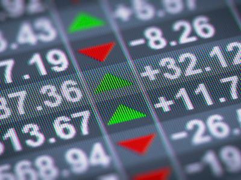

The evolution of financial markets has been profoundly shaped by an array of factors, including monetary policies, international market dynamics, and technological innovations such as algorithmic trading. Understanding the interplay among these factors provides valuable insights into the complexities of today's financial landscape.

Monetary policy plays a critical role in influencing financial markets, affecting everything from interest rates to inflation and economic growth. Central banks, with their arsenal of policy tools, aim to stabilize economies by targeting economic variables like inflation and employment. The historical progression of these policies has left an indelible mark on financial markets, guiding their development and transformations over time.



International markets further illustrate how interconnected the world's economies have become. The globalization of finance has led to increased capital flow across borders, enhancing market efficiency and providing investment opportunities. Major historical milestones such as the establishment of the International Monetary Market and the introduction of the euro have reshaped global monetary policies and financial market structures.

Technological innovation, particularly the rise of algorithmic trading, represents a significant shift in how financial transactions are executed. Leveraging powerful computing technologies, algorithmic trading facilitates high-frequency trades, increasing market efficiency and liquidity. However, it also introduces challenges, such as the potential for market instability through events like flash crashes.

These elements—monetary policies, international markets, and algorithmic trading—are intricately connected, each contributing uniquely to the evolution of financial markets. By examining these historical and current influences, market participants can better navigate the evolving financial landscape, balancing opportunities with risks to achieve financial stability and growth in the future. Understanding these critical components is essential for investors, policymakers, and regulators to promote a stable and thriving financial ecosystem.

## Table of Contents

## Historical Overview of Monetary Policy in Financial Markets

Monetary policy has consistently served as a crucial mechanism in shaping financial markets, wielding significant influence over economic stability. Central banks are at the core of this process, carefully balancing policies to promote economic growth while controlling inflation. The establishment of the Federal Reserve in 1913 marked a turning point in U.S. monetary policy, creating a central authority to manage monetary supply and stabilize the banking sector. The Federal Reserve's dual mandate, which focuses on maximizing employment and stabilizing prices, has guided its evolving policies, reflecting an intricate balance between fostering economic growth and maintaining inflation control.

One of the most significant monetary events in history is the Bretton Woods Agreement of 1944. This agreement established a new international monetary order, creating a system of fixed exchange rates anchored by the U.S. dollar, which was convertible to gold. The Bretton Woods system facilitated international trade and investment, laying the groundwork for modern global finance. However, by 1971, economic pressures led to the abandonment of the gold standard under President Richard Nixon, transitioning global economies to floating exchange rates. This shift allowed currencies to fluctuate freely on the foreign exchange market, significantly influencing international financial markets.

Over the decades, the tools and strategies employed in monetary policy have become more sophisticated. In the past, central banks primarily relied on tools like open market operations, adjusting reserve requirements, and modifying discount rates to steer economic conditions. However, in response to increasingly complex global and domestic economic challenges, more nuanced tools have been developed. For instance, forward guidance allows central banks to communicate future policy intentions to influence market expectations. Additionally, during times of severe financial distress, measures such as quantitative easing have been implemented, wherein central banks purchase large amounts of financial assets to increase money supply and lower interest rates, aiming to spur economic activity.

These advancements in monetary policy tools and frameworks underscore the dynamic nature needed to address evolving economic landscapes. As a consequence, understanding historical and present-day monetary policies remains crucial for navigating the complexities of global financial markets.

## The Role of International Markets in Monetary History

International markets have played a crucial role in expanding the reach of finance on a global scale, enabling capital to flow seamlessly across nations and fostering economic growth. The integration of financial markets internationally has facilitated risk sharing, diversification, and access to larger pools of capital.

The establishment of the International Monetary Market (IMM) in 1972 was a pivotal moment in financial history. Located within the Chicago Mercantile Exchange, the IMM was created to cater to the burgeoning demand for currency and [interest rate](/wiki/interest-rate-trading-strategies) futures trading. This development allowed market participants to hedge risks associated with exchange rate fluctuations and interest rate changes more effectively. By providing a structured marketplace for these financial instruments, the IMM contributed significantly to the efficiency and stability of international finance.

The European Union (EU) and the introduction of the euro marked another significant evolution in international financial dynamics. As a single currency, the euro simplified trade and investment among member nations by eliminating exchange rate risk within the eurozone. This currency consolidation shifted the landscape of global monetary policies and had profound implications for how businesses operate across borders. The euro facilitated increased economic integration and competition within the EU, promoting efficiency and economic cohesion among its members.

Furthermore, trade agreements and the economic policies of major global economies are continuously shaping international markets. Agreements such as the North American Free Trade Agreement (NAFTA) and the Comprehensive and Progressive Agreement for Trans-Pacific Partnership (CPTPP) have fostered trade liberalization, reducing barriers and facilitating smoother cross-border transactions. These agreements, alongside the evolving economic strategies of major economies, influence global capital flows, exchange rates, and investment patterns, ultimately impacting the international financial architecture.

Overall, the interactions between these elements underscore the interconnectedness of global financial markets. As these markets continue to evolve, they depend upon stable international policies and agreements that foster cooperation and trust among nations.

## Algorithmic Trading and its Impact on Financial Markets

Algorithmic trading has fundamentally transformed the execution of financial transactions by harnessing advanced computing power to facilitate high-frequency trading ([HFT](/wiki/high-frequency-trading-strategies)). This method involves utilizing algorithms to make rapid trading decisions, thereby increasing market efficiency. Such trading strategies employ complex mathematical models and statistical techniques to analyze and execute trades within microseconds. The adoption of [algorithmic trading](/wiki/algorithmic-trading) has led to significantly enhanced [liquidity](/wiki/liquidity-risk-premium) in the markets, as automated systems can transact vast numbers of orders at speeds unattainable by human traders.

Despite its benefits, algorithmic trading presents substantial challenges. One of the most notable issues is the occurrence of "flash crashes," which are abrupt and severe market declines triggered by automated trades. These events underscore the potential for algorithms to react negatively to certain market conditions, leading to cascading sell-offs. The 2010 Flash Crash serves as a prominent example where algorithmic trading was implicated in a rapid market plunge, highlighting the need for robust risk management systems.

Research suggests that algorithmic trading can lower [volatility](/wiki/volatility-trading-strategies) and enhance liquidity by narrowing bid-ask spreads and providing continuous market presence. However, it also raises concerns related to market manipulation tactics, such as spoofing, which involves placing and then canceling substantial orders to mislead market participants about supply and demand dynamics. This practice can distort market prices and create unfair trading advantages, drawing scrutiny from regulatory bodies.

The ongoing integration of [artificial intelligence](/wiki/ai-artificial-intelligence) (AI) within algorithmic trading continues to push the boundaries of financial market strategies. AI-driven algorithms are capable of learning and adapting to new market conditions, providing an edge in prediction accuracy and execution efficiency. Machine learning models, for example, can process vast datasets to identify patterns and forecast price movements, reinforcing the role of data analytics in trading.

```python
# Example of a simple moving average crossover strategy
import pandas as pd

def moving_average_crossover_strategy(data, short_window=40, long_window=100):
    signals = pd.DataFrame(index=data.index)
    signals['price'] = data['price']
    signals['short_mavg'] = data['price'].rolling(window=short_window, min_periods=1).mean()
    signals['long_mavg'] = data['price'].rolling(window=long_window, min_periods=1).mean()
    signals['signal'] = 0.0

    signals['signal'][short_window:] = np.where(signals['short_mavg'][short_window:] > signals['long_mavg'][short_window:], 1.0, 0.0)
    signals['positions'] = signals['signal'].diff()

    return signals

# Example usage with fictional price data
data = pd.DataFrame({
    'price': [1, 2, 3, 4, 5, 6, 7, 8, 9, 10, 11, 12, 13, 14, 15]
})
signals = moving_average_crossover_strategy(data)
print(signals)
```

The future of algorithmic trading is likely to focus on enhancing predictive analytics and [machine learning](/wiki/machine-learning) capabilities in order to better anticipate market trends and systemic risks. The evolution of these technologies will continue to shape the landscape of financial markets, presenting both opportunities and challenges for traders, investors, and regulators alike.

## Interplay Between Market Dynamics and Algorithmic Strategies

The complexity of modern financial markets is intensified by the interaction between traditional market dynamics and sophisticated algorithmic strategies. Algorithmic trading, which includes the use of computer algorithms to execute trading orders, interacts with a variety of market variables such as liquidity, volatility, and price movements. These interactions significantly influence decision-making processes and investor behavior, often accelerating transactions and impacting market prices in real-time.

Algorithmic strategies adjust to different market conditions and incorporate variables such as [volume](/wiki/volume-trading-strategy) and price trends. For instance, high-frequency trading—a subset of algorithmic trading—leverages speed to exploit fleeting opportunities based on the smallest changes in price. This interaction leads to an increase in market efficiency by narrowing bid-ask spreads and providing liquidity. However, it also introduces challenges, including increased market fragility, exemplified by events like flash crashes, where rapid sell-offs driven by algorithms can lead to significant drops in market values.

The correlation between algorithmic strategies and volatility measures underscores the necessity for advanced risk management approaches. Algorithms can contribute to both the stabilization and destabilization of markets. While their ability to process vast amounts of data can lead to efficient pricing, their automated responses to market stimuli can exacerbate volatility, especially during periods of market stress. Therefore, developing models to predict and manage volatility is crucial. Risk management frameworks must evolve, integrating real-time data analysis and monitoring systems capable of identifying anomalies triggered by algorithmic trading.

Future developments in algorithmic trading are likely to concentrate on predictive analytics and machine learning to foresee market trends more accurately. Machine learning models can analyze historical data and identify patterns that traditional models may overlook. The integration of these advanced technologies can enhance the ability of traders to anticipate market movements, allowing for the preemptive adjustment of trading strategies. With techniques such as sentiment analysis on news and social media feeds, algorithms will become increasingly sophisticated in interpreting external information that could affect market conditions.

```python
# Example of a basic moving average algorithm used in trading
def moving_average(prices, window_size):
    """
    Calculate the moving average of a given list of prices.

    :param prices: List of historical prices.
    :param window_size: The window size for the moving average calculation.
    :return: List of moving averages.
    """
    moving_averages = []
    for i in range(len(prices) - window_size + 1):
        window = prices[i:i + window_size]
        moving_avg = sum(window) / window_size
        moving_averages.append(moving_avg)
    return moving_averages

# Example usage
prices = [100, 102, 104, 108, 106, 107, 109, 112, 115]
window_size = 3
ma = moving_average(prices, window_size)
print(ma)  # Output: [102.0, 104.66666666666667, 106.0, 107.0, 107.33333333333333, 109.33333333333333, 112.0]
```

The merging of traditional market elements with algorithmic strategies is transforming how financial markets operate. This evolution necessitates a balanced regulatory approach to ensure fair and transparent markets while fostering innovation. As technology continues to advance, the capability to anticipate and adapt to these changes will be essential for investors and regulators alike.

## Conclusion

The financial landscape of today is profoundly shaped by the intricate web of monetary policy history, international market structures, and the evolution of algorithmic trading. Understanding these elements is pivotal for investors, policymakers, and regulators aiming to foster financial stability and growth. Each element introduces a spectrum of opportunities and challenges, necessitating ongoing adaptation and learning.

Monetary policy has historically provided the foundation for economic stability and growth, with central banks exerting substantial influence over national and global economic conditions. As monetary tools and strategies continue to evolve, the ability of policymakers to effectively manage inflation and economic cycles remains essential. This requires a nuanced understanding of economic indicators and the capacity to forecast market reactions to policy adjustments.

The structure of international markets facilitates global capital flows and economic integration. Developments such as the formation of the European Union and the introduction of the euro have fundamentally altered international financial dynamics, introducing both opportunities and complexities. As global trade agreements and economic policies evolve, participants in the financial markets must remain vigilant to the implications these changes have on global trade balances and capital flows.

Algorithmic trading represents a significant technological advancement, increasing market efficiency and liquidity, while simultaneously introducing new risks such as flash crashes and potential market manipulation. The reliance on high-frequency trading and sophisticated algorithms necessitates enhanced risk management practices and regulatory measures to safeguard market integrity. 

As the financial markets continue to evolve, continuous research and innovation are vital to address emerging challenges and capitalize on new opportunities. Future developments in algorithmic trading, particularly in the areas of artificial intelligence and machine learning, will likely focus on predictive analytics to better anticipate market trends. This evolution emphasizes the need for robust risk management frameworks and adaptive regulatory strategies.

In conclusion, a comprehensive understanding of the history of monetary policy, international market structures, and advancements in trading technologies is essential for navigating the complexities of modern financial markets. By promoting strategic adaptation and supporting ongoing research and innovation, market participants can contribute to a stable and dynamic financial environment.

## References & Further Reading

[1]: ["The Economics of Money, Banking, and Financial Markets"](https://www.pearsonhighered.com/assets/preface/0/1/3/4/0134855388.pdf) by Frederic S. Mishkin

[2]: ["Central Banking before 1800: A Rehabilitation"](https://www.amazon.com/Central-Banking-before-1800-Rehabilitation-ebook/dp/B082P5GKY5) by Ulrich Bindseil

[3]: Aldridge, I. (2013). ["High-Frequency Trading: A Practical Guide to Algorithmic Strategies and Trading Systems"](https://onlinelibrary.wiley.com/doi/pdf/10.1002/9781119203803.fmatter).

[4]: Black, F., & Scholes, M. (1973). ["The Pricing of Options and Corporate Liabilities,"](https://www.cs.princeton.edu/courses/archive/fall09/cos323/papers/black_scholes73.pdf) Journal of Political Economy, 81(3), 637-654.

[5]: Gorton, G. B., & Metrick, A. (2012). ["Securitized Banking and the Run on Repo,"](https://www.sciencedirect.com/science/article/pii/S0304405X1100081X) Journal of Financial Economics, 104(3), 425-451. 

[6]: Harford, T. (2005). ["The Undercover Economist"](https://en.wikipedia.org/wiki/The_Undercover_Economist).

[7]: Harris, L. (2003). ["Trading and Exchanges: Market Microstructure for Practitioners"](https://academic.oup.com/book/52292).

[8]: Petrovic, A., & Tutsch, R. (2009). ["National Rescue Measures in Response to the Current Financial Crisis,"](https://papers.ssrn.com/sol3/papers.cfm?abstract_id=1430489.) European Central Bank Occasional Paper Series, No. 43.