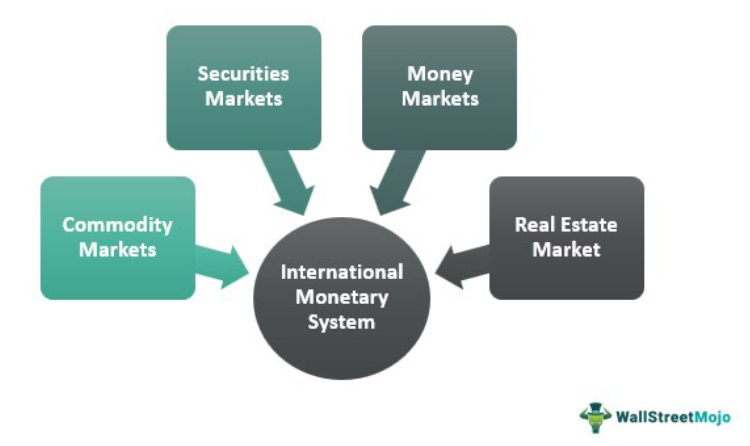

## Table of Contents

## What is the International Monetary Market (IMM)?

The International Monetary Market (IMM) is a part of the Chicago Mercantile Exchange (CME) where people trade futures and options on currencies and interest rates. It started in 1972 and has grown to be a big place for people to manage risks related to money and interest rates. Traders use the IMM to buy and sell contracts that help them protect against changes in currency values or interest rates.

The IMM is important because it helps businesses and investors from different countries manage their money better. For example, if a company in the U.S. expects to get paid in euros in the future, they can use the IMM to buy a futures contract. This way, they can lock in today's exchange rate and not worry if the euro's value changes later. This makes international trade and investment safer and more predictable.

## When was the International Monetary Market established?

The International Monetary Market, or IMM, was established in 1972. It is a part of the Chicago Mercantile Exchange, which is a big place where people trade different things. The IMM was created to help people trade futures and options on currencies and interest rates.

This was important because it gave businesses and investors a way to manage risks related to money from different countries. Before the IMM, it was harder for them to protect themselves against changes in currency values or interest rates. The IMM made it easier for them to do business safely across borders.

## What are the main functions of the International Monetary Market?

The main function of the International Monetary Market (IMM) is to help people trade futures and options on currencies and interest rates. This means that businesses and investors can buy and sell contracts that will be settled in the future. For example, if a company knows it will need to pay for something in another country's currency later, it can use the IMM to lock in today's exchange rate. This helps them avoid the risk of the currency changing in value before they need to make the payment.

Another important function of the IMM is to provide a place where people can manage risks related to interest rates. If someone has a loan or investment that depends on interest rates, they can use the IMM to protect themselves against changes in those rates. By trading futures and options on interest rates, they can make sure they know what their costs or earnings will be, even if interest rates go up or down. This makes financial planning easier and more predictable for businesses and investors around the world.

## How does the International Monetary Market influence global trade?

The International Monetary Market (IMM) helps global trade by letting businesses and investors manage risks with money from different countries. When a company in one country needs to buy or sell things in another country's currency, they can use the IMM to lock in today's exchange rate. This means they don't have to worry if the currency's value changes later. This makes it safer for them to do business with other countries because they can plan better and avoid losing money because of changes in currency values.

The IMM also helps with interest rates, which are important for loans and investments. If a business has a loan or investment that depends on interest rates, they can use the IMM to protect themselves if those rates change. By trading futures and options on interest rates, they can make sure they know what their costs or earnings will be, even if interest rates go up or down. This makes financial planning easier and more predictable, which is good for global trade because it helps businesses and investors feel more confident about doing business across borders.

## What types of financial instruments are traded on the International Monetary Market?

The International Monetary Market (IMM) mainly deals with two types of financial instruments: futures and options. Futures are contracts where people agree to buy or sell something at a set price on a specific date in the future. These are used for currencies and interest rates. For example, if a company knows it will need euros in six months, it can buy a futures contract now to lock in today's exchange rate.

Options are another type of financial instrument traded on the IMM. An option gives the buyer the right, but not the obligation, to buy or sell something at a set price before a certain date. People use options to protect themselves from big changes in currency values or interest rates. For example, if someone thinks the value of the Japanese yen might go down, they can buy an option to sell yen at today's rate, even if the value drops later.

## Can you explain the role of currency futures in the International Monetary Market?

Currency futures play a big role in the International Monetary Market (IMM). They are contracts where people agree to buy or sell a certain amount of one currency for another at a set price on a future date. This helps businesses and investors manage the risk of currency values changing. For example, if a U.S. company knows it will need to pay for something in euros in six months, it can buy a currency future now to lock in today's exchange rate. This way, even if the euro's value goes up or down, the company knows exactly how much it will cost in dollars.

This tool is really important for global trade because it makes things more predictable. When companies can plan ahead and know what their costs will be, they feel more confident about doing business with other countries. Currency futures help reduce the worry about sudden changes in currency values, which can make a big difference in how much money a company makes or loses. By using the IMM to trade currency futures, businesses can focus on growing and trading without the fear of unexpected currency changes hurting their plans.

## How has the International Monetary Market evolved since its inception?

Since it started in 1972, the International Monetary Market (IMM) has grown a lot. At first, it was just a place where people could trade futures on currencies like the British pound and the German mark. Over time, it added more currencies and started trading futures and options on interest rates too. This made it easier for businesses and investors from all over the world to manage risks related to money and interest rates.

Today, the IMM is a big part of the Chicago Mercantile Exchange (CME) and has become a key place for global financial trading. It now offers a wide range of financial products that help people protect themselves against changes in currency values and interest rates. The growth of technology has also helped the IMM to become more efficient and accessible, allowing traders to do business from anywhere in the world. This evolution has made the IMM an important tool for managing financial risks in today's global economy.

## What are the major economic events that have impacted the International Monetary Market?

Since it started, the International Monetary Market has been affected by many big economic events. One of the biggest was the 1973 oil crisis. When oil prices went up a lot, it caused big changes in currency values and interest rates. This made the IMM very important for businesses that needed to protect themselves from these changes. Another important event was the 1987 stock market crash, also known as Black Monday. This crash made people realize how important it was to have tools like the IMM to manage risks in financial markets.

Another major event that impacted the IMM was the 2008 financial crisis. During this time, there were big problems with banks and the economy, which led to a lot of uncertainty about currencies and interest rates. The IMM helped businesses and investors manage these risks better. More recently, events like Brexit and the global response to the COVID-19 pandemic have also affected the IMM. These events caused big changes in currency values and interest rates, making the IMM an essential tool for businesses trying to plan for the future in uncertain times.

## How do interest rate futures work within the International Monetary Market?

Interest rate futures are contracts traded on the International Monetary Market (IMM) where people agree to buy or sell something at a set price on a future date, but instead of trading goods, they trade interest rates. This helps businesses and investors manage the risk of interest rates changing. For example, if a company has a loan with a variable [interest rate](/wiki/interest-rate-trading-strategies), they can use an interest rate future to lock in today's rate. This way, even if interest rates go up, the company knows exactly what its loan will cost.

These futures are important because they make financial planning easier and more predictable. If someone is worried that interest rates might go up and make their loan more expensive, they can buy an interest rate future to protect themselves. On the other hand, if someone thinks interest rates might go down and they want to take advantage of that, they can sell an interest rate future. By using the IMM to trade interest rate futures, businesses and investors can feel more confident about their financial decisions, even when interest rates are changing.

## What are the regulatory bodies overseeing the International Monetary Market?

The International Monetary Market (IMM) is part of the Chicago Mercantile Exchange (CME), so it follows the rules set by the CME. The main group that watches over the CME and the IMM is the Commodity Futures Trading Commission (CFTC). The CFTC is a government agency in the United States that makes sure trading in futures and options markets is fair and honest. They check that everyone follows the rules and that the markets work well.

Another important group is the National Futures Association (NFA). The NFA is like a club that futures professionals join. It helps make sure that people trading in the IMM follow the rules and behave properly. The NFA works together with the CFTC to keep the markets safe and fair for everyone. Both of these groups help make sure that the IMM runs smoothly and that people can trust the market.

## How does the International Monetary Market interact with other financial markets globally?

The International Monetary Market (IMM) works closely with other financial markets around the world. It does this by helping people manage risks with currencies and interest rates. For example, if a business in Japan wants to buy something from a company in the United States, they might use the IMM to lock in today's exchange rate. This way, they know exactly how much it will cost in yen, even if the dollar's value changes later. The IMM helps make these kinds of deals smoother and safer, which is good for global trade.

The IMM also affects other markets because it helps set prices for currencies and interest rates. When people trade futures and options on the IMM, it can change what people think about the value of different currencies or how interest rates might move. This can influence decisions made in other markets, like the stock market or bond market. By giving businesses and investors a way to manage risks, the IMM helps make the whole global financial system more stable and predictable.

## What are the current trends and future outlook for the International Monetary Market?

The International Monetary Market (IMM) is seeing a few big trends right now. One trend is the use of more technology. Traders are using computers and the internet to buy and sell futures and options more easily. This makes the IMM faster and more accessible to people all over the world. Another trend is that more countries are joining in. As more businesses and investors from different places start using the IMM, it becomes more important for global trade. Also, people are using the IMM to protect themselves from big changes in currency values and interest rates, especially during uncertain times like the global response to the COVID-19 pandemic.

Looking into the future, the IMM is likely to keep growing and becoming more important. As the world gets more connected, more businesses will need to manage risks with different currencies and interest rates. The IMM will be a key tool for them to do this. Technology will probably keep getting better, making it even easier for people to use the IMM. Also, as new economic events happen, the IMM will help businesses and investors deal with these changes. Overall, the IMM will continue to be a big part of the global financial system, helping to make trade and investment safer and more predictable.

## References & Further Reading

[1]: ["The Economics of Money, Banking, and Financial Markets"](https://www.pearsonhighered.com/assets/preface/0/1/3/4/0134855388.pdf) by Frederic S. Mishkin

[2]: ["Central Banking before 1800: A Rehabilitation"](https://www.amazon.com/Central-Banking-before-1800-Rehabilitation-ebook/dp/B082P5GKY5) by Ulrich Bindseil

[3]: Aldridge, I. (2013). ["High-Frequency Trading: A Practical Guide to Algorithmic Strategies and Trading Systems"](https://onlinelibrary.wiley.com/doi/pdf/10.1002/9781119203803.fmatter).

[4]: Black, F., & Scholes, M. (1973). ["The Pricing of Options and Corporate Liabilities,"](https://www.cs.princeton.edu/courses/archive/fall09/cos323/papers/black_scholes73.pdf) Journal of Political Economy, 81(3), 637-654.

[5]: Gorton, G. B., & Metrick, A. (2012). ["Securitized Banking and the Run on Repo,"](https://www.sciencedirect.com/science/article/pii/S0304405X1100081X) Journal of Financial Economics, 104(3), 425-451. 

[6]: Harford, T. (2005). ["The Undercover Economist"](https://en.wikipedia.org/wiki/The_Undercover_Economist).

[7]: Harris, L. (2003). ["Trading and Exchanges: Market Microstructure for Practitioners"](https://academic.oup.com/book/52292).

[8]: Petrovic, A., & Tutsch, R. (2009). ["National Rescue Measures in Response to the Current Financial Crisis,"](https://papers.ssrn.com/sol3/papers.cfm?abstract_id=1430489.) European Central Bank Occasional Paper Series, No. 43.