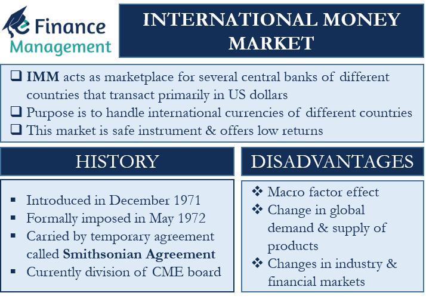

## Table of Contents

## What is the International Money Market?

The International Money Market (IMM) is a part of the global financial market where banks, companies, and governments from different countries trade currencies and short-term financial instruments. It helps them manage their money across borders. The main products traded in the IMM are currencies, like the US dollar or the Euro, and short-term loans, called money market instruments. These include things like Treasury bills, commercial paper, and certificates of deposit.

The IMM is important because it helps keep the world's economy running smoothly. When companies or governments need foreign currency to buy things from other countries, they can get it through the IMM. It also helps them borrow money in different currencies, which can be useful if they want to take advantage of lower interest rates in another country. The IMM operates 24 hours a day, which means people can trade whenever they need to, no matter where they are in the world.

## What are the main functions of the International Money Market?

The International Money Market helps people and businesses from different countries trade money and short-term loans. It's like a big marketplace where you can exchange one country's money for another's. This is really important for companies that need to buy things from other countries. They can go to the International Money Market to get the money they need. It also lets banks and governments trade money, which helps keep the world's economy working smoothly.

Another big job of the International Money Market is to help people borrow and lend money in different currencies. If a company wants to borrow money, it can find short-term loans in the market. These loans can be in any currency, which is helpful if borrowing in another country's money is cheaper. The market is open all the time, so people can trade whenever they need to, no matter where they are in the world. This makes it easier for everyone to manage their money across borders.

## Who are the primary participants in the International Money Market?

The main people who use the International Money Market are big banks, big companies, and governments. These groups need to trade money from different countries because they do business all over the world. For example, a big company might need Euros to buy things from Europe, so they go to the International Money Market to get Euros in exchange for their own country's money.

Besides trading money, these participants also use the market to borrow and lend money for short periods. This can be useful if they want to borrow money in a different currency where the interest rates are lower. Governments might use the market to manage their country's money supply or to help their economy grow. All these activities help keep the global economy running smoothly.

## How does the International Money Market differ from domestic money markets?

The International Money Market and domestic money markets both help people and businesses manage their money, but they work in different ways. The International Money Market is where people from different countries trade money and short-term loans. It's like a big global marketplace where you can exchange one country's money for another's. This is really important for big companies that do business all over the world because they need to buy things in different currencies. On the other hand, domestic money markets are focused on just one country. They help people and businesses within that country trade their own money and short-term loans.

Another big difference is that the International Money Market is open all the time, 24 hours a day. This means people can trade whenever they need to, no matter where they are in the world. This is really helpful for managing money across borders. Domestic money markets, however, usually work during the business hours of the country they're in. So, if you need to trade money or borrow in your own country, you have to do it when the market is open. Both markets are important, but they serve different needs and operate in different ways.

## What are the most common instruments traded in the International Money Market?

In the International Money Market, people mostly trade currencies and short-term loans. The most common currencies are big ones like the US dollar, the Euro, and the Japanese yen. Companies and governments need these currencies to buy things from other countries or to invest in different places around the world. Trading these currencies helps them manage their money across borders.

Besides currencies, the market also trades short-term loans, called money market instruments. These include things like Treasury bills, which are loans to governments, commercial paper, which are loans to big companies, and certificates of deposit, which are loans to banks. These loans usually last for less than a year and help companies and governments borrow money quickly when they need it. Trading these instruments in different currencies lets them take advantage of lower interest rates in other countries.

## How do interest rates affect the International Money Market?

Interest rates play a big role in the International Money Market. When interest rates go up in one country, it can make that country's money more attractive to people from other countries. They might want to move their money to that country to earn more from the higher interest rates. This can make the value of that country's money go up compared to other countries' money. On the other hand, if interest rates go down, people might move their money out of that country to find better rates somewhere else, which can make the value of that country's money go down.

Interest rates also affect how much it costs to borrow money in the International Money Market. When rates are low, it's cheaper for companies and governments to borrow money in different currencies. This can lead to more borrowing and trading in the market. But when rates are high, borrowing becomes more expensive, which might slow down trading. So, changes in interest rates can make the International Money Market busier or quieter, depending on whether rates are going up or down.

## What role do central banks play in the International Money Market?

Central banks are really important in the International Money Market. They control the money supply in their own countries and set interest rates. When a central bank changes its interest rates, it can affect how much people want to trade that country's money. If the central bank raises rates, it can make that country's money more attractive to people from other countries because they can earn more from it. This can make the value of the money go up. On the other hand, if the central bank lowers rates, it might make people move their money out to find better rates somewhere else, which can make the value of the money go down.

Central banks also help keep the International Money Market stable. They can step in to buy or sell their own country's money if it's changing too much in value. This helps keep things calm and prevents big swings that could hurt the economy. Sometimes, central banks work together to manage the market better. For example, they might agree to keep their interest rates at certain levels to help the global economy. By doing these things, central banks play a big role in making sure the International Money Market works smoothly for everyone.

## How are transactions settled in the International Money Market?

In the International Money Market, transactions are settled through a system called the Continuous Linked Settlement (CLS). This system helps make sure that when people trade money from different countries, both sides of the trade happen at the same time. This is important because it reduces the risk that one side of the trade won't happen after the other side has already gone through. The CLS system works 24 hours a day, just like the International Money Market, so people can settle their trades whenever they need to.

When someone wants to trade money in the International Money Market, they use banks that are part of the CLS system. These banks make sure the trade is settled correctly. For example, if a company in the US wants to buy Euros, their bank will work with the CLS system to make sure the US dollars are swapped for Euros at the same time. This way, everyone knows the trade is fair and safe. The whole process is quick and helps keep the International Money Market running smoothly.

## What are the risks associated with participating in the International Money Market?

Participating in the International Money Market can be risky because the value of money can change a lot. If you trade one country's money for another's, you might lose money if the value of the money you bought goes down. This is called exchange rate risk. It can be hard to predict what will happen to the value of different currencies, so trading in the International Money Market can be like gambling. Big changes in exchange rates can also happen quickly, which can make it even riskier.

Another risk is [interest rate](/wiki/interest-rate-trading-strategies) risk. When you borrow or lend money in the International Money Market, the interest rates can change. If you borrowed money and the interest rates go up, it can cost you more to pay back the loan. On the other hand, if you lent money and the interest rates go down, you might not earn as much as you expected. These changes can affect how much money you make or lose in the market. Both exchange rate risk and interest rate risk can make the International Money Market a challenging place to trade.

## How does currency exchange impact the International Money Market?

Currency exchange is a big part of the International Money Market. When people trade one country's money for another's, it can change how much each currency is worth. If a lot of people want to buy a certain currency, its value goes up. But if fewer people want it, its value can go down. This can affect how much companies and governments have to pay when they buy things from other countries. For example, if the US dollar gets stronger compared to the Euro, it might cost less for an American company to buy things from Europe.

These changes in currency values can also make the International Money Market busier or quieter. When currencies are moving a lot, more people might want to trade to take advantage of the changes. But if the values are staying the same, there might be less trading. Central banks can also step in to try to control how much their currency is worth. They might buy or sell their own money to keep it stable. All these things show how important currency exchange is in the International Money Market.

## What regulatory frameworks govern the International Money Market?

The International Money Market is governed by a lot of different rules from different countries. Each country has its own laws and rules that banks and companies need to follow when they trade money. For example, in the United States, the Federal Reserve sets rules for banks and the Commodity Futures Trading Commission (CFTC) oversees trading in financial markets. In Europe, the European Central Bank and the European Securities and Markets Authority (ESMA) help make sure that trading is fair and safe. These rules are important because they help stop fraud and make sure everyone plays by the same rules.

There are also international groups that try to make trading easier and safer across borders. The Bank for International Settlements (BIS) and the International Organization of Securities Commissions (IOSCO) work together with countries to set global standards. These standards help make sure that the International Money Market works well and that people can trust it. Even though there are a lot of different rules, they all work together to keep the market running smoothly and to protect everyone who uses it.

## How have technological advancements influenced the operations of the International Money Market?

Technological advancements have made a big difference in how the International Money Market works. Computers and the internet have made it easier and faster for people to trade money from different countries. Now, instead of calling someone on the phone to make a trade, people can use online platforms to buy and sell currencies and short-term loans. This has made the market more efficient because trades can happen in seconds, no matter where in the world the people are. It's also easier for banks and companies to keep track of their trades and manage their money better with the help of technology.

Another way technology has changed the International Money Market is by making it safer. Special systems, like the Continuous Linked Settlement (CLS) system, use technology to make sure that trades are settled at the same time. This reduces the risk that one side of the trade won't happen after the other side has already gone through. Also, technology helps with security, making it harder for people to cheat or steal money. Overall, technology has made the International Money Market faster, safer, and easier to use for everyone involved.

## References & Further Reading

[1]: Bergstra, J., Bardenet, R., Bengio, Y., & Kégl, B. (2011). ["Algorithms for Hyper-Parameter Optimization."](https://papers.nips.cc/paper/4443-algorithms-for-hyper-parameter-optimization) Advances in Neural Information Processing Systems 24.

[2]: ["Advances in Financial Machine Learning"](https://www.amazon.com/Advances-Financial-Machine-Learning-Marcos/dp/1119482089) by Marcos Lopez de Prado

[3]: ["Evidence-Based Technical Analysis: Applying the Scientific Method and Statistical Inference to Trading Signals"](https://www.amazon.com/Evidence-Based-Technical-Analysis-Scientific-Statistical/dp/0470008741) by David Aronson

[4]: ["Machine Learning for Algorithmic Trading"](https://github.com/stefan-jansen/machine-learning-for-trading) by Stefan Jansen

[5]: ["Quantitative Trading: How to Build Your Own Algorithmic Trading Business"](https://www.amazon.com/Quantitative-Trading-Build-Algorithmic-Business/dp/1119800064) by Ernest P. Chan