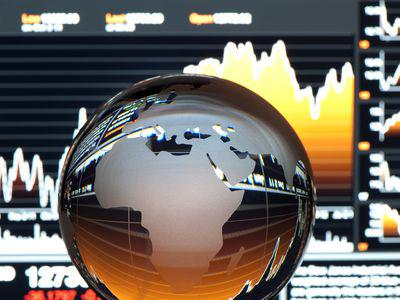

## Table of Contents

## What is the International Petroleum Exchange (IPE)?

The International Petroleum Exchange (IPE) is a place where people buy and sell oil and other energy products. It started in 1980 in London, England. People from all over the world come to the IPE to trade things like crude oil, natural gas, and electricity. The IPE helps set prices for these products that many countries use.

In 2001, the IPE became part of a bigger company called the Intercontinental Exchange (ICE). This made the IPE even more important in the world of energy trading. Now, it is known as ICE Futures Europe. Even though the name changed, it still does the same important job of helping people trade energy products and set prices.

## When was the International Petroleum Exchange established?

The International Petroleum Exchange (IPE) was established in 1980. It started in London, England. The IPE was created so that people could buy and sell oil and other energy products in one place.

People from all around the world came to the IPE to trade things like [crude oil](/wiki/crude-oil), natural gas, and electricity. The IPE helped set prices for these products, which are important for many countries.

In 2001, the IPE joined a bigger company called the Intercontinental Exchange (ICE). After this, it was renamed ICE Futures Europe. Even with the new name, it still does the same important job of helping people trade energy products and set prices.

## Where is the International Petroleum Exchange located?

The International Petroleum Exchange (IPE) is located in London, England. It was set up in 1980 to help people buy and sell oil and other energy products. People from all over the world come to the IPE to trade things like crude oil, natural gas, and electricity.

In 2001, the IPE became part of a bigger company called the Intercontinental Exchange (ICE). After joining ICE, it was renamed ICE Futures Europe. Even though the name changed, it still does the same important job of helping people trade energy products and set prices.

## What types of commodities are traded on the IPE?

The International Petroleum Exchange (IPE) is a place where people trade different kinds of energy products. The main thing they trade is crude oil, which is the oil that comes straight from the ground before it is turned into things like gasoline. They also trade natural gas, which is used to heat homes and cook food.

Besides crude oil and natural gas, the IPE also trades electricity. Electricity is important because it powers our homes, schools, and businesses. Trading these energy products on the IPE helps set prices that many countries use. In 2001, the IPE became part of the Intercontinental Exchange (ICE) and was renamed ICE Futures Europe, but it still does the same important job.

## How does trading on the IPE influence global oil prices?

Trading on the International Petroleum Exchange (IPE), now known as ICE Futures Europe, has a big impact on global oil prices. When people buy and sell oil on the IPE, the prices they agree on help set a standard price for oil around the world. This is because the IPE is a big place where a lot of oil trading happens, and many countries look at these prices to decide how much they should pay for oil.

The prices set on the IPE can go up or down based on how much oil people want to buy and how much oil is available to sell. If more people want to buy oil than there is oil to sell, the price goes up. If there is more oil available than people want to buy, the price goes down. These changes in price on the IPE can affect the cost of oil everywhere, which can then affect the price of things like gasoline and heating oil that people use every day.

## What are the main differences between the IPE and other commodity exchanges?

The International Petroleum Exchange (IPE), now known as ICE Futures Europe, is different from other commodity exchanges because it focuses mainly on energy products like crude oil, natural gas, and electricity. Other commodity exchanges might trade a wider variety of products, such as metals, agricultural goods, and even financial products. The IPE's specialization in energy helps it set important prices that many countries use for oil and gas.

Another difference is that the IPE is located in London, which makes it a key player in the global energy market. This location helps it attract traders from all over the world, especially from Europe and the Middle East. Other commodity exchanges might be located in different parts of the world, like the Chicago Mercantile Exchange in the United States, which can affect the types of commodities they focus on and the traders they attract.

## Can you explain the trading mechanisms used on the IPE?

Trading on the International Petroleum Exchange (IPE), now called ICE Futures Europe, happens in two main ways: through open outcry and electronic trading. Open outcry is when traders meet in a big room and shout out their buy and sell offers. They use hand signals and loud voices to make deals quickly. This method was very common when the IPE first started, but it has become less used over time. Electronic trading, on the other hand, is when traders use computers to buy and sell energy products. They log into a special trading platform where they can see prices and make trades from anywhere in the world. This method is now the main way trading happens on the IPE.

Both open outcry and electronic trading help set the prices for energy products like crude oil and natural gas. When traders make deals, the prices they agree on become part of the overall price for those products. This is important because many countries use these prices to decide how much they should pay for oil and gas. The IPE's trading mechanisms make sure that the prices are fair and reflect what is happening in the global energy market.

## What role does the IPE play in the global energy market?

The International Petroleum Exchange (IPE), now known as ICE Futures Europe, is very important in the global energy market. It is a place where people from all over the world come to buy and sell energy products like crude oil, natural gas, and electricity. When traders make deals on the IPE, they help set the prices for these products. Many countries look at these prices to decide how much they should pay for oil and gas. This makes the IPE a key player in deciding how much energy costs around the world.

The IPE also helps make sure that the energy market works smoothly. By providing a place for people to trade, it helps match the people who want to buy energy with the people who want to sell it. This helps keep the supply and demand of energy balanced. When the IPE sets prices, it gives everyone a clear idea of what energy is worth, which helps businesses and governments plan better. Overall, the IPE plays a big role in making the global energy market stable and fair.

## How has the ownership of the IPE changed over time?

The International Petroleum Exchange (IPE) started in 1980 in London, England. At first, it was owned by a group of people who wanted a place to trade oil and other energy products. The IPE was very important because it helped set prices for oil and gas that many countries used.

In 2001, the IPE was bought by a bigger company called the Intercontinental Exchange (ICE). After this, the IPE was renamed ICE Futures Europe. Even though the name and ownership changed, it still does the same important job of helping people trade energy products and set prices.

## What are some major historical events that impacted the IPE?

The International Petroleum Exchange (IPE) was set up in 1980 in London, England. This was a big deal because it gave people a place to trade oil and other energy products. At first, the IPE used a method called open outcry, where traders shouted and used hand signals to make deals. This was how they set prices for oil and gas that many countries used.

In 2001, a big change happened when the IPE was bought by the Intercontinental Exchange (ICE). After this, the IPE was renamed ICE Futures Europe. This change made the IPE part of a bigger company, which helped it grow even more important in the global energy market. The switch to electronic trading also happened around this time, making it easier for people from all over the world to trade on the IPE.

These two events, the founding of the IPE in 1980 and its acquisition by ICE in 2001, were very important. They helped the IPE become a key player in setting energy prices and making the global energy market work smoothly.

## How do regulations affect trading on the IPE?

Regulations are rules that help keep trading on the International Petroleum Exchange (IPE), now known as ICE Futures Europe, fair and safe. These rules are made by governments and other groups to make sure that everyone follows the same guidelines when buying and selling energy products like oil and gas. For example, there are rules about how much money traders need to have before they can start trading, and rules about how they must report their trades. These regulations help stop people from doing things that could harm the market, like cheating or making prices go up and down too much.

The IPE has to follow these rules, which can change how trading happens. For instance, if a new rule says that traders need to keep more money in their accounts, some people might trade less because they don't have enough money. Also, if the rules change about how to report trades, the IPE might need to use new computer systems or hire more people to make sure everything is done correctly. Even though these rules can make trading more complicated, they are important because they help keep the energy market stable and fair for everyone.

## What future trends might affect the operations of the IPE?

In the future, the IPE might see big changes because of new technology. More and more people are using computers and the internet to trade energy products. This means the IPE might use even more electronic trading instead of the old way of shouting and using hand signals. New technology could also make trading faster and easier, helping more people from around the world to trade on the IPE. But, this also means the IPE will need to keep its computer systems safe from hackers and other problems.

Another trend that could affect the IPE is the move towards cleaner energy. More countries are trying to use less oil and gas and more renewable energy like wind and solar power. This could mean less trading of oil and gas on the IPE. But, the IPE might start trading more renewable energy products in the future. This would help it stay important in the energy market. The IPE will need to change its rules and systems to handle these new kinds of energy products.

## References & Further Reading

[1]: ["The Development and Impact of Algorithmic Trading in Global Markets"](https://www.researchgate.net/publication/378548435_Algorithmic_Trading_and_AI_A_Review_of_Strategies_and_Market_Impact) by the Bank for International Settlements

[2]: Gorton, G., & Rouwenhorst, K. G. (2006). ["Facts and Fantasies about Commodity Futures."](https://www.nber.org/papers/w10595) Financial Analysts Journal.

[3]: Hendershott, T., Jones, C. M., & Menkveld, A. J. (2011). ["Does Algorithmic Trading Improve Liquidity?"](https://onlinelibrary.wiley.com/doi/full/10.1111/j.1540-6261.2010.01624.x) The Journal of Finance.

[4]: ["The Impact of Node Attributes on Trading Dynamics"](https://www.nature.com/articles/s41598-020-68094-z) by T. Glaser, I. Weber, and C. Mullig in Decision Support Systems.

[5]: Mackenzie, D. (2008). ["An Engine, Not a Camera: How Financial Models Shape Markets"](https://academic.oup.com/mit-press-scholarship-online/book/20588) The MIT Press.