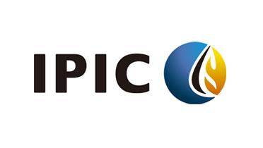

The world of investment is continually evolving, with technology playing a significant role in transforming traditional methods. One of the most significant advancements in this arena is algorithmic trading, commonly referred to as algo trading. This method utilizes computer algorithms to automate trading processes, enabling financial firms to execute trades at speeds and efficiencies unattainable by human operators. As a result, algo trading has become a cornerstone of modern financial strategies.

This article examines how the International Petroleum Investment Company (IPIC) integrates algorithmic trading into its operations, demonstrating profound implications for global trading dynamics. Founded by the Abu Dhabi government in 1984, IPIC's mandate was to manage a sovereign wealth fund by investing internationally in the hydrocarbons sector. Over the years, the company leveraged Abu Dhabi's vast oil wealth to drive economic growth and development, reflecting its intrinsic connection to the global energy market.



Furthermore, a pivotal moment in IPIC's history was its merger with Mubadala Development Company in 2016, forming the Mubadala Investment Company. This merger significantly expanded IPIC's investment reach, allowing further exploration of modern financial innovations like algo trading. By adopting such technologies, IPIC continues to play a strategic role in setting benchmarks for competitive investment management amidst an evolving global market landscape. Through this exploration, readers will better understand how companies like IPIC are navigating the complexities of today's financial environment with cutting-edge technological approaches.

## Table of Contents

## What is IPIC?

The International Petroleum Investment Company (IPIC) was established in 1984 by the Abu Dhabi government. Its inception marked a strategic move to deploy the emirate’s oil wealth to foster economic growth and diversification. As a state-owned enterprise, IPIC is tasked with managing a sovereign wealth fund through global investments in the hydrocarbons industry. This approach ensures that the wealth generated from Abu Dhabi's petroleum resources is utilized in a manner that promotes sustainable economic development.

IPIC's investment strategy focuses on maximizing the returns from these investments while contributing to the broader economic objectives of the United Arab Emirates (UAE). The company has historically aimed to create a balanced portfolio by investing across the entire value chain of the hydrocarbons industry. This includes exploration and production, refining and marketing, petrochemicals, and energy-related services.

Abu Dhabi, possessing substantial [crude oil](/wiki/crude-oil) reserves, has leveraged IPIC to ensure that the oil wealth translates into long-term financial stability and prosperity. The primary mission of IPIC is, therefore, not only to generate financial returns but also to support the nation's economic policy and strategic interests on a global stage. IPIC has effectively placed Abu Dhabi amongst the leading players in the international investment landscape by focusing on the core areas of the energy sector.

## Understanding IPIC's Investment Strategies

The International Petroleum Investment Company (IPIC) has long demonstrated a strategic approach to investment, characterized by a focus on global market integration and diversification across the hydrocarbons sector. The company's first significant investment occurred in 1988 when it acquired a stake in Cepsa, a Spanish refining company. This marked IPIC's initial step in establishing a robust portfolio, underpinned by its objectives of leveraging Abu Dhabi’s oil wealth for economic expansion and growth.

Post the Cepsa acquisition, IPIC continuously broadened its investment repertoire. The company diversified its portfolio to encompass various sectors within the hydrocarbons industry, including exploration, production, distribution, and industrial services. This strategic diversification was aimed at mitigating risks associated with the cyclical nature of the oil industry.

In 2016, a significant transformation occurred when IPIC merged with Mubadala Development Company, creating the Mubadala Investment Company. This merger was pivotal as it substantially broadened IPIC's investment reach, enhancing its capabilities to manage a more extensive and varied portfolio. Mubadala’s diverse investments, ranging from aerospace to information technology, complemented IPIC’s strengths in the energy sector. This merger reflected a strategic alignment towards a more diversified economic model, benefiting from shared expertise and resources to capitalize on global investment opportunities.

This synergy allowed the newly formed entity to pursue innovative financial ventures, reinforcing the commitment to sustainable economic development through strategic investments and partnerships across multiple industries around the globe.

## Algo Trading and Its Relevance

Algorithmic trading leverages advanced mathematical models and rapid computational power to make efficient trading decisions within the securities market. By utilizing algorithms, decisions based on massively complex sets of data can be executed almost instantaneously, thus providing a competitive advantage in the fast-paced global financial markets. For firms engaging in substantial trading activities, like the International Petroleum Investment Company (IPIC), [algorithmic trading](/wiki/algorithmic-trading) is vital for boosting operational efficiency and refining decision-making processes.

The core advantage of algorithmic trading lies in its ability to process large quantities of data at speeds unattainable by human traders. Algorithms can scan various markets, simultaneously analyzing multiple trading patterns while minimizing human-induced errors. This automated approach is particularly beneficial for price discovery, as algorithmic systems can rapidly respond to market changes and execute trades at optimal prices within microseconds.

Furthermore, algorithmic trading allows firms to manage large volumes of transactions efficiently. Unlike traditional trading methods, which are constrained by the speed and cognitive capacities of individual traders, algo trading systems can execute a vast number of transactions per second. This capability is crucial in maintaining pace with continuously fluctuating market conditions and allows firms to exploit fleeting opportunities without delay. Algorithms can be programmed to execute specific strategies, such as [arbitrage](/wiki/arbitrage), market-making, or trend-following, each tailored to the firm's particular investment goals.

The effectiveness of these algorithms is underpinned by complex models and strategies that assess various market factors, including historical price trends, market [liquidity](/wiki/liquidity-risk-premium), and trading signals. Incorporating [machine learning](/wiki/machine-learning) and [artificial intelligence](/wiki/ai-artificial-intelligence), these algorithms can also learn from historical data to improve their predictive accuracy and adapt to new market conditions. 

In summary, the automation and speed provided by algorithmic trading systems are essential for managing trading activities and optimizing decision-making in global markets, representing a valuable tool for companies looking to remain competitive and resilient in dynamic financial environments.

## IPIC and Algorithmic Trading

IPIC's integration of algorithmic trading represents a significant development in the management of its diverse investment portfolio. Algorithmic trading utilizes computer programs to execute trades based on predetermined parameters, optimizing decision-making processes in complex and volatile market environments. This technology-driven approach allows IPIC to manage its assets more effectively by minimizing the latency and slippage often associated with manual trading methods.

Algorithms enable IPIC to analyze large datasets in real time, providing insights into market trends and allowing for rapid execution of trades. This capability is particularly useful in dealing with global markets that are subject to sudden changes in supply, demand, and political conditions. The programmed instructions in algorithms can be based on timing, price, quantity, or any mathematical model, and swiftly adapt to evolving market conditions.

The efficiency gained through algorithmic trading is crucial for IPIC. By analyzing historical and real-time data, algorithms can predict potential market movements and capitalize on them faster than traditional trading strategies. This speed and precision are not just advantageous but essential for maintaining competitiveness in the global investment landscape, where decisions are influenced by a myriad of market variables.

Thus, by incorporating algorithmic trading, IPIC enhances its ability to allocate resources dynamically and capture opportunities across various asset classes and geographies. This strategic evolution underscores IPIC's commitment to leveraging technology for sustained growth and reflects its forward-thinking approach to global finance.

## Benefits of Algo Trading for IPIC

Algorithmic trading offers several advantages for the International Petroleum Investment Company (IPIC), primarily by reducing human error and emotional biases in investment decisions. Automated systems ensure precision and consistency in executing trades, minimizing the risk of costly mistakes associated with manual trading. This technological approach allows IPIC to capitalize on market opportunities with greater speed and accuracy, effectively enhancing its global trading operations.

The competitive edge gained through algorithmic trading is evident in the ability to execute trades at optimal prices within fractions of a second. High-frequency trading, a subset of algorithmic trading, enables IPIC to manage vast numbers of transactions swiftly. By utilizing advanced algorithms, the firm can react to market signals and execute large volumes of trades rapidly, a feat unattainable through traditional trading methods. This not only ensures that IPIC captures favorable market conditions but also improves liquidity and price efficiency across the markets it operates.

Moreover, the high-frequency trading strategies facilitated by algorithmic systems play a crucial role in the modern financial market structure. These strategies often involve capturing small price discrepancies in various markets, thus providing market stability and liquidity. IPIC benefits from this by maintaining an agile trading posture in rapidly changing market environments. Such real-time processing and execution capabilities are integral for managing risks and maximizing returns on investments.

Algorithmic systems also allow for the continuous [backtesting](/wiki/backtesting) of trading strategies. This involves simulating trades using historical data to evaluate the effectiveness and resilience of various strategies. By analyzing past performance, IPIC can fine-tune its algorithms to optimize future returns, aligning its investment strategies with market dynamics. The computational power of these systems allows for the consideration of myriad variables, ensuring robust strategy development and deployment.

Additionally, the cost-effectiveness of algorithmic trading cannot be overstated. Automation reduces the need for extensive human resource involvement in trading activities, thereby cutting operational costs. This efficiency enables IPIC to allocate resources more strategically towards areas with higher growth potential, thereby enhancing overall investment performance.

In summary, algorithmic trading equips the International Petroleum Investment Company with a strategic advantage in the intricate world of global financial markets. It enhances execution speed, accuracy, and efficiency while enabling innovative trading strategies that are crucial for maintaining competitive market positions. Through leveraging these technological advancements, IPIC ensures its continued commitment to achieving superior investment outcomes.

## The Future of IPIC and Algorithmic Trading

The International Petroleum Investment Company (IPIC)'s leap into algorithmic trading signifies a profound commitment to maintaining its competitive edge within the energy sector. This strategic embrace of technology is not just limited to algorithmic trading but extends towards advanced methodologies such as artificial intelligence (AI) and machine learning (ML). As these technologies continue to evolve, they promise enhanced capabilities in data analysis and trading precision, enabling IPIC to refine its investment strategies further.

AI, with its ability to process vast amounts of data, can help in predicting market trends with greater accuracy. By employing machine learning algorithms, IPIC can analyze historical trading data to identify patterns and make informed decisions based on predictive analytics. For example, using supervised learning techniques, IPIC could classify market conditions and adjust its trading algorithms dynamically to optimize performance.

Moreover, the integration of AI and ML could facilitate the development of algorithmic trading strategies that adapt in real-time to market fluctuations. This adaptability is crucial in enabling high-frequency trading strategies, which rely on executing trades in milliseconds across decentralized global markets. A hypothetical Python implementation that uses a machine learning model to predict stock price movements might include libraries like Pandas and Scikit-learn, as shown in the basic setup below:

```python
import pandas as pd
from sklearn.model_selection import train_test_split
from sklearn.ensemble import RandomForestRegressor

# Load historical trading data
data = pd.read_csv('historical_trading_data.csv')

# Select features and target variable
features = data[['feature1', 'feature2', 'feature3']]
target = data['target_price']

# Split data into training and test sets
X_train, X_test, y_train, y_test = train_test_split(features, target, test_size=0.2, random_state=42)

# Initialize and train the model
model = RandomForestRegressor(n_estimators=100, random_state=42)
model.fit(X_train, y_train)

# Predict future prices
predictions = model.predict(X_test)
```

As technology progresses, the fusion of robust data analytics platforms, increased computational power, and sophisticated algorithm design will drive further innovations in algorithmic trading. Therefore, for IPIC, the future entails deeper integration of digital technologies in their investment management processes, potentially revolutionizing how trading and investments are conducted.

This shift not only supports IPIC's growth ambitions but also sets new industry standards. By proactively embracing technological advancements, IPIC positions itself as a leader, not just in the energy sector but in the broader spectrum of global finance and investment. Continued focus on these new technologies will ensure IPIC's adaptability and sustainability in an increasingly digital future.

## Conclusion

The International Petroleum Investment Company's (IPIC) adoption of algorithmic trading underscores the transformative potential of technology in reshaping conventional investment methodologies. This transition highlights how cutting-edge technology can forge new paths for strategic investment and risk management. In an increasingly complex and volatile global market environment, IPIC's proactive approach to embracing algorithmic trading is not merely about keeping pace with technological changes but about positioning itself as a leader in the investment sector.

By integrating algorithmic trading into its operations, IPIC has set its sights beyond mere adaptation. The company has established new industry benchmarks through innovative strategies that underline efficiency and precision in trading operations. Algorithmic trading's capability to execute trades at optimal prices and within minimal timeframes distinguishes IPIC's approach from traditional investment models, which often rely heavily on human intuition and decision-making processes. The minimization of human error and the elimination of emotionally-driven trading decisions enhance the overall quality and effectiveness of IPIC's investment strategies.

Furthermore, IPIC's commitment to advancing trading technologies ensures sustainable growth and profitability. The development and implementation of such advanced tools enable selective engagement with high-frequency and high-value trading opportunities that conventional methods might overlook. This meticulous attention to technological evolution reflects IPIC's foresight in securing a prosperous future for its portfolio holdings.

Looking ahead, as technology continues to evolve, IPIC is well-positioned to leverage artificial intelligence (AI) and machine learning to further refine its trading strategies. These advancements promise more precise predictions of market trends and enhanced decision-making frameworks, paving the way for innovative investment solutions that could revolutionize the industry. By championing such initiatives, IPIC not only maintains its competitive edge but also reinforces its reputation as a thought leader in utilizing digital innovations for sustainable investment management.

## References & Further Reading

[1]: Aldridge, I. (2013). ["High-Frequency Trading: A Practical Guide to Algorithmic Strategies and Trading Systems."](https://www.amazon.com/High-Frequency-Trading-Practical-Algorithmic-Strategies/dp/1118343506) Wiley.

[2]: Lopez de Prado, M. (2018). ["Advances in Financial Machine Learning."](https://www.amazon.com/Advances-Financial-Machine-Learning-Marcos/dp/1119482089) Wiley.

[3]: Chan, E. P. (2009). ["Quantitative Trading: How to Build Your Own Algorithmic Trading Business."](https://github.com/ftvision/quant_trading_echan_book) Wiley.

[4]: Jansen, S. (2020). ["Machine Learning for Algorithmic Trading: Predictive models to extract signals from market and alternative data for systematic trading strategies with Python."](https://github.com/stefan-jansen/machine-learning-for-trading) Packt Publishing.

[5]: Narang, R. K. (2013). ["Inside the Black Box: A Simple Guide to Quantitative and High Frequency Trading."](https://onlinelibrary.wiley.com/doi/book/10.1002/9781118662717) Wiley.

[6]: Dourado, P. & Valentini, G. (2020). ["The Impact of Algorithmic Trading on Financial Markets."](https://www.researchgate.net/publication/378548435_Algorithmic_Trading_and_AI_A_Review_of_Strategies_and_Market_Impact) Journal of Financial and Quantitative Analysis.