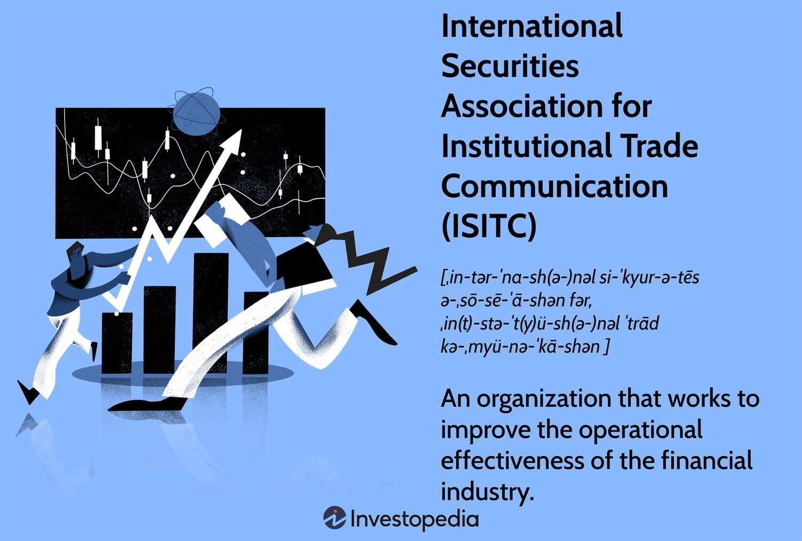

The global financial landscape is undergoing significant transformation as advanced technologies, notably algorithmic trading, become integral to market operations. Algorithmic trading leverages complex mathematical models and high-powered computing to execute trades at speeds and efficiencies that are unattainable by human traders. This technological advancement has not only increased the volume of trades conducted on financial markets but has also enhanced the precision and timing of these trades, ultimately contributing to more liquid and efficient markets.

The International Securities Association for Institutional Trade Communication (ISITC) plays a crucial role in this evolving landscape by formulating and promoting standards that ensure seamless and effective financial communication among market participants. Established in 1991, ISITC aims to improve operational efficiency within financial institutions by advocating for best practices and fostering technological advancements. Its efforts are paramount in creating a structured environment where communication across different trading platforms and market participants is standardized for reliability and efficiency.

In exploring the intersection between algorithmic trading and institutional trade communications, it is essential to consider the contributions of associations like ISITC. These organizations provide the framework and guidance necessary for financial markets to operate smoothly amidst rapidly changing technological dynamics. By focusing on these contributions, this article addresses the synergy required between advanced trading technologies and robust communication standards, which is vital for the health and stability of global financial markets.

## Table of Contents

## Understanding the Role of ISITC

The International Securities Association for Institutional Trade Communication (ISITC) was established in 1991 with a primary role of formulating standards that streamline financial communications. Situated at the forefront of this sector, ISITC's core mission is to enhance operational efficiency within financial institutions by advocating for best practices and the adoption of cutting-edge technologies. The organization's focus is on creating a seamless communication infrastructure to support the evolving needs of global finance.

ISITC's initiatives are centered around implementing standardized communication protocols that reduce complexities and increase the interoperability of financial systems. By setting these standards, ISITC facilitates more efficient and accurate transaction processing, which is critical in high-frequency trading environments. This focus on standardization supports financial institutions in minimizing risk and maximizing performance.

Strategically, ISITC aims to foster an environment where innovation and collaboration lead to sustainable improvements in financial communication processes. Key strategic goals include the development of guidelines that support new technologies, such as blockchain and artificial intelligence, which are increasingly pivotal in finance. Moreover, ISITC prioritizes the education and engagement of its membership, ensuring that industry professionals are well-equipped to adapt to and leverage these advancements.

In addition to internal initiatives, ISITC collaborates with various regulatory bodies and international organizations to align its standards with global best practices. This collaboration ensures that the standards advocated by ISITC are globally relevant and contribute to the integrity of financial markets worldwide. Through its comprehensive efforts, ISITC is instrumental in shaping the modern landscape of financial transactions, promoting both reliability and efficiency in the process.

## Algorithmic Trading: Revolutionizing Financial Markets

Algorithmic trading, commonly referred to as algo trading, marks a significant evolution in financial markets by automating trading processes through the use of sophisticated algorithms. These algorithms analyze vast datasets to make quick trading decisions, substantially increasing both the speed and precision of transactions.

The impact of [algorithmic trading](/wiki/algorithmic-trading) on market dynamics is profound, influencing [liquidity](/wiki/liquidity-risk-premium) and price discovery. Increased speed of executions contributes to narrower bid-ask spreads, thus improving market liquidity. Additionally, automated systems can process large volumes of data to identify [arbitrage](/wiki/arbitrage) opportunities and execute trades in fractions of a second, which enhances market efficiency and aids in price discovery.

Institutional investors, including hedge funds and investment banks, are increasingly adopting algo trading strategies due to several recognized benefits. These include the reduction of manual errors, ability to execute complex trading strategies that might be challenging for human traders, and the potential for achieving better entry and [exit](/wiki/exit-strategy) prices. Moreover, algorithms can manage large libraries of stocks, execute trades around-the-clock, and strategically manage the trades to minimize market impact costs.

Despite its advantages, algorithmic trading also presents several challenges. Market participants face technological risks, including system failures and latency issues, which can cause significant losses. The "flash crash" of May 6, 2010, is an example where a malfunctioning algorithm led to drastic price [volatility](/wiki/volatility-trading-strategies), demonstrating how rapidly executed trades can sometimes destabilize markets.

Furthermore, the complexity of algorithms introduces challenges in monitoring and regulation. Ensuring that algorithms are designed to comply with market regulations and adjusting them to reflect regulatory changes requires continuous effort and resources. There is also a growing concern over ethical considerations, such as the potential for market manipulation through high-frequency trading tactics.

Despite these challenges, the trend towards algorithmic trading continues to grow, driven by advancements in [machine learning](/wiki/machine-learning) and [artificial intelligence](/wiki/ai-artificial-intelligence). The future of algo trading seems poised towards further innovation, leveraging technologies such as quantum computing to enhance market analytics and decision-making processes. As financial markets evolve, the role of algorithmic trading is expected to expand, offering both opportunities and challenges for investors and regulators alike.

## The Importance of Communication Protocols

Effective communication protocols are the backbone of efficient trading systems in financial markets, providing a structured approach for the transmission of information between parties. They ensure that data is transferred swiftly, securely, and accurately, which is vital for maintaining the integrity of financial transactions. As financial markets continue to evolve, the complexity and [volume](/wiki/volume-trading-strategy) of trades necessitate sophisticated communication protocols that can handle these demands.

One of the significant initiatives by the International Securities Association for Institutional Trade Communication (ISITC) is promoting Straight-Through Processing (STP). STP is a method of conducting securities transactions without manual intervention, which significantly enhances the speed and reliability of financial transactions. The integration of STP into trading systems ensures transactions are processed seamlessly across various stages, from order initiation to settlement. This streamlined process reduces the likelihood of human error, minimizes delays, and enhances operational efficiency.

Effective communication protocols also play a crucial role in mitigating operational risks. By providing a framework for consistent and transparent communication, these protocols help reduce the potential for errors that could arise from miscommunication or discrepancies in the data being exchanged. For example, standardized messaging formats and data validation checks ensure that all parties have the same understanding and expectations regarding each transaction, thereby reducing the risk of disputes or failures.

Moreover, robust communication protocols improve transaction efficiency by facilitating real-time data exchange and analytics. In the context of algorithmic trading, where decisions are made in fractions of a second, the ability to swiftly communicate market changes and execute trades is essential. Algorithms rely on the timely reception of accurate data to make informed decisions, and any delays in communication can result in missed opportunities or financial losses.

In summary, communication protocols are critical to the effectiveness and reliability of financial trading systems. By enhancing transaction speed and reliability, reducing operational risks, and supporting real-time data exchange, these protocols lay the foundation for efficient market operations. Associations like ISITC play a pivotal role in advancing these communication standards, ensuring that the financial industry adapts to emerging challenges and opportunities.

## Strategic Initiatives by ISITC

The International Securities Association for Institutional Trade Communication (ISITC) has long been at the forefront of enhancing operational efficiencies and setting high standards in financial communications. As part of its ongoing mission to solidify its influence and ensure long-term stability, ISITC has outlined strategic initiatives centered around four key pillars: leadership, coordination, improvement of industry standards, and collaboration with external entities.

**Leadership**: ISITC aims to solidify its position as a leading authority in the financial sector. By hosting industry conferences and workshops, ISITC provides a platform for thought leaders to exchange ideas and best practices. These events serve as incubators for innovative solutions that address current market challenges and drive the direction of future developments.

**Coordination**: Effective coordination among financial institutions, service providers, and market infrastructures is crucial. ISITC promotes seamless integration of new technologies by developing guidelines that facilitate straightforward implementation across the industry. This coordination helps minimize disruptions and maximizes the benefits of technological advancements, ensuring a smooth alignment between varying systems and protocols.

**Improvement of Industry Standards**: One of ISITC’s primary goals is to enhance industry standards continually. By conducting regular reviews and updates, the association ensures that best practices evolve in tandem with technological advancements. ISITC’s standardization efforts cover a wide array of protocols, emphasizing the need for consistent, transparent, and adaptable systems that cater to the dynamic nature of global markets.

**Collaboration with Regulatory Bodies and Stakeholders**: Establishing strong relationships with regulatory agencies and other stakeholders is paramount for ISITC. Through strategic partnerships and open dialogue, ISITC advocates for regulations that support innovation while safeguarding the integrity of financial markets. This collaboration ensures that new policies are both practical and enforceable, benefiting the entire financial ecosystem.

By focusing on these strategic initiatives, ISITC positions itself as a pivotal entity that not only shapes but also sustains an efficient, secure, and innovative financial landscape.

## Future Prospects: Embracing Innovation in Trade Communications

As financial technologies advance, the integration of innovative solutions becomes essential for maintaining competitiveness. The International Securities Association for Institutional Trade Communication (ISITC) recognizes the imperative to remain at the forefront of emerging technologies and trends that are reshaping financial markets. ISITC’s forward-looking initiatives are pivotal in paving the way for advancements in financial communication and transaction processing. By fostering innovation, ISITC aims to ensure that financial institutions remain agile and responsive to market changes.

One area where ISITC is making significant strides is in adopting and promoting blockchain technology. Blockchain, with its potential to provide decentralized and secure transaction processing, promises to revolutionize institutional trade communications. By enabling a transparent and immutable ledger of transactions, blockchain can enhance data integrity and reduce settlement times. Moreover, smart contracts—self-executing contracts with terms directly written into code—could automate many aspects of transaction processing, significantly reducing operational costs and enhancing efficiency.

Furthermore, ISITC is exploring the use of artificial intelligence (AI) and machine learning in trade communications. These technologies can analyze vast amounts of market data to generate insights and predictive analytics, aiding decision-making and risk management. AI-driven systems can automate routine tasks, thus freeing up human resources for more strategic initiatives. For instance, natural language processing (NLP), a branch of AI, can facilitate real-time data extraction and processing from unstructured data sources, such as news articles and social media, thereby providing timely and actionable market intelligence.

The future of institutional trade communications will likely see a shift toward greater interoperability among financial systems. ISITC is advocating for standard protocols and application programming interfaces (APIs) that enable seamless integration of disparate systems. Such standardization is crucial in ensuring that different trading platforms and communication networks can work together efficiently, thereby enhancing overall market liquidity and reducing transaction costs.

Another trend to watch is the increasing focus on data security and privacy. As more financial transactions occur electronically, ensuring the protection of sensitive data becomes paramount. ISITC is prioritizing cybersecurity measures and privacy regulations to safeguard institutional trade communications from potential threats and breaches.

In conclusion, ISITC’s initiatives are setting the direction for the future of trade communications by embracing cutting-edge technologies. The incorporation of blockchain, AI, and standardized protocols promises to streamline processes, enhance security, and foster greater collaboration among financial institutions. As these technologies continue to evolve, they will undoubtedly play a crucial role in shaping the future landscape of financial markets, ensuring that institutions are well-equipped to navigate the challenges and opportunities that lie ahead.

## Conclusion

The synergy between algorithmic trading and standardized communication protocols is essential for the efficient functioning of financial markets. Algorithmic trading, with its reliance on data-driven decision-making and automation, demands high-speed, reliable communication infrastructures that standardized protocols like those promoted by the International Securities Association for Institutional Trade Communication (ISITC) provide. These standardized protocols ensure that different trading systems can communicate seamlessly, reducing latency and increasing the accuracy of transactions, which are critical in environments where milliseconds can impact financial outcomes significantly.

Associations like ISITC play a pivotal role in advancing these developments. By establishing and promoting best practices and industry standards, ISITC ensures a robust and resilient financial ecosystem. This stability is crucial, as it mitigates operational risks and enhances the reliability of financial markets. Through its strategic initiatives, ISITC fosters collaboration among financial institutions, regulatory bodies, and technological companies, which is vital for adapting to the rapid technological changes affecting the industry.

This article underscores the necessity for continuous innovation and collaboration among industry stakeholders to foster a robust financial environment. As technology evolves, maintaining this synergy between trading strategies and communication protocols becomes even more essential. The financial industry's future will be shaped by those who can effectively integrate these systems, ensuring not only competitiveness but also the stability and security of global financial networks. Continuous efforts in innovation, standardization, and collaboration will be paramount in meeting these ever-evolving challenges.

## References & Further Reading

[1]: Hendershott, T., Jones, C. M., & Menkveld, A. J. (2011). ["Does Algorithmic Trading Improve Liquidity?"](https://onlinelibrary.wiley.com/doi/full/10.1111/j.1540-6261.2010.01624.x) The Review of Financial Studies, 24(8), 2174-2216.

[2]: Aldridge, I. (2013). ["High-Frequency Trading: A Practical Guide to Algorithmic Strategies and Trading Systems,"](https://www.amazon.com/High-Frequency-Trading-Practical-Algorithmic-Strategies/dp/1118343506) 2nd Edition. Wiley.

[3]: Barth, M. E., & Landsman, W. R. (2010). ["How did Financial Reporting Contribute to the Financial Crisis?"](https://www.tandfonline.com/doi/full/10.1080/09638180.2010.498619) European Accounting Review, 19(3), 399-423.

[4]: Lopez de Prado, M. (2018). ["Advances in Financial Machine Learning,"](https://www.amazon.com/Advances-Financial-Machine-Learning-Marcos/dp/1119482089) Wiley.

[5]: Paddrik, M. E., & Hayes, R. (2013). ["The Flash Crash: The Impact of High-frequency Trading on an Electronic Market."](https://papers.ssrn.com/sol3/papers.cfm?abstract_id=1932152) Social Science Research Network.

[6]: IOSCO (2009). ["Principles for the Regulation and Supervision of Algorithmic and High-Frequency Trading,"](https://www.iosco.org/library/pubdocs/pdf/IOSCOPD726.pdf) International Organization of Securities Commissions.

[7]: Gomber, P., Arndt, B., Lutat, M., & Uhle, T. (2011). ["High-Frequency Trading,"](https://papers.ssrn.com/sol3/papers.cfm?abstract_id=1858626) Business & Information Systems Engineering, 3(2), 153-162.