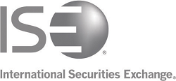

## Table of Contents

## What is the International Securities Exchange (ISE)?

The International Securities Exchange (ISE) is a stock exchange that focuses on trading options. It started in 2000 and was the first all-electronic options exchange in the United States. This means that all trading happens on computers, without a physical trading floor. The ISE allows people to buy and sell options on stocks, which are contracts that give the buyer the right to buy or sell a stock at a specific price before a certain date.

The ISE is important because it makes trading options easier and faster. Since it uses computers, traders can quickly see prices and make trades from anywhere. The ISE has grown a lot since it began and is now part of a bigger company called Nasdaq. This has helped it to offer even more trading services and reach more people around the world.

## When was the International Securities Exchange founded?

The International Securities Exchange, or ISE, was founded in the year 2000. It was a big deal because it was the first options exchange in the United States to use only computers for trading. This meant no more trading floors; everything was done electronically.

Since it started, the ISE has grown a lot. It made trading options easier and faster for people. Later on, the ISE became part of Nasdaq, which is a bigger company. This helped the ISE to offer more services and reach more people around the world.

## What types of securities are traded on the ISE?

The International Securities Exchange, or ISE, mainly focuses on trading options. Options are special contracts that give people the right to buy or sell a stock at a set price before a certain date. This can be useful for people who want to make money from changes in stock prices without buying the stocks themselves.

Besides options, the ISE also trades other types of securities. These include exchange-traded funds (ETFs), which are like baskets of stocks that you can trade like a single stock. The ISE's electronic trading system makes it easy for people to buy and sell these securities quickly and from anywhere.

Being part of Nasdaq, the ISE has grown a lot and now offers a wide range of trading services. This helps more people around the world to use the ISE for their trading needs.

## How does the ISE differ from other stock exchanges?

The International Securities Exchange, or ISE, stands out from other stock exchanges because it was the first in the United States to be fully electronic. This means that all trading on the ISE happens on computers, without a physical trading floor. This makes trading faster and easier for people because they can see prices and make trades from anywhere. Other exchanges might still use a mix of electronic and physical trading, which can be slower and less convenient.

Another big difference is that the ISE focuses mainly on trading options. Options are contracts that give people the right to buy or sell stocks at a set price before a certain date. While other exchanges also trade options, the ISE specializes in them and offers a wide variety of options on stocks and exchange-traded funds (ETFs). This focus helps the ISE to serve people who are interested in options trading in a more specialized way.

Since becoming part of Nasdaq, the ISE has been able to offer even more services and reach more people around the world. This partnership has helped the ISE to grow and improve its trading platform. Other exchanges might not have the same level of global reach or the specific focus on options that the ISE provides, making it a unique choice for traders looking for fast, electronic options trading.

## What are the main functions of the ISE?

The main function of the International Securities Exchange, or ISE, is to provide a place for people to trade options. Options are special contracts that give the buyer the right to buy or sell a stock at a set price before a certain date. The ISE makes it easy for people to trade these options because it uses computers for all its trading. This means that traders can quickly see prices and make trades from anywhere, without needing to go to a physical trading floor.

Another important function of the ISE is to offer a wide range of options on stocks and exchange-traded funds (ETFs). ETFs are like baskets of stocks that you can trade like a single stock. By focusing on options, the ISE helps people who want to make money from changes in stock prices without actually buying the stocks themselves. Since the ISE became part of Nasdaq, it has been able to offer even more services and reach more people around the world, making it easier for traders to use the ISE for their needs.

## How does trading occur on the ISE?

Trading on the International Securities Exchange, or ISE, happens completely on computers. This means there's no physical place where people shout and trade. Instead, everything is done electronically. Traders use their computers to see the prices of options and make their trades. This makes trading fast and easy because you can do it from anywhere, as long as you have a computer and internet.

The ISE focuses on trading options. Options are special contracts that let you buy or sell a stock at a set price before a certain date. When you want to trade an option on the ISE, you look at the prices on your computer screen. If you like a price, you can click to buy or sell the option. The ISE's computer system then matches your trade with someone else's, and the trade happens quickly. This electronic way of trading makes it easier for more people to trade options without needing to be in a specific place.

## What are the trading hours of the ISE?

The International Securities Exchange, or ISE, has regular trading hours from 9:30 AM to 4:00 PM Eastern Time. These are the same hours as the main U.S. stock market. During this time, people can trade options on stocks and exchange-traded funds (ETFs) easily on their computers.

The ISE also has extended trading hours. These hours are from 4:00 AM to 9:30 AM Eastern Time. This means you can start trading options even before the regular market opens. It's a good time for people who want to trade early in the morning.

## What technology platforms does the ISE use to facilitate trading?

The International Securities Exchange, or ISE, uses a special technology platform called the ISE Trading System. This system helps people trade options quickly and easily on their computers. It's all electronic, so there's no need for a physical trading floor. Traders can see prices and make trades from anywhere as long as they have a computer and internet. The ISE Trading System is designed to handle lots of trades fast, making sure everything runs smoothly and efficiently.

Since the ISE became part of Nasdaq, it also uses some of Nasdaq's technology. This includes the Nasdaq MRX (Market Regulation and Surveillance) system, which helps keep an eye on trading to make sure everything is fair and follows the rules. Using Nasdaq's technology has helped the ISE to offer more services and reach more people around the world. It makes trading options even easier and more reliable for everyone using the ISE.

## How does the ISE ensure fair trading practices?

The International Securities Exchange, or ISE, works hard to make sure trading is fair for everyone. They use special computer systems to watch over all the trades that happen on their platform. One of these systems is called the Nasdaq MRX, which stands for Market Regulation and Surveillance. This system keeps an eye on trading to make sure no one is cheating or breaking the rules. If it spots something fishy, it can alert the people in charge so they can look into it and fix any problems.

Another way the ISE makes trading fair is by following strict rules set by the U.S. government and other groups that watch over the markets. These rules are there to stop people from doing things like trading with secret information or trying to trick other traders. The ISE has people who check that everyone follows these rules. They can punish anyone who doesn't, which helps keep the trading fair and honest for everyone.

## What are the fees associated with trading on the ISE?

When you trade on the International Securities Exchange, or ISE, you have to pay some fees. These fees help the ISE run smoothly and keep everything working well. There are different fees for different things. For example, there's a fee for every trade you make. This is called a transaction fee. There are also fees if you want to cancel or change your trade before it happens. These fees can change depending on what kind of options you're trading and how often you trade.

The ISE also has fees for using their services. If you want to use special tools or data that the ISE offers, there might be extra charges for those. These can include things like real-time price information or special trading software. It's important to check with the ISE or your broker to know exactly what fees you'll have to pay. This way, you can plan your trading and make sure you're not surprised by any costs.

## How does the ISE handle market volatility and ensure stability?

The International Securities Exchange, or ISE, works hard to handle market volatility and keep things stable. When the market gets wild and prices jump around a lot, the ISE uses special computer systems to watch over everything. These systems can spot when things are getting too crazy and can take steps to calm things down. For example, if prices are moving too fast, the ISE might put in place a short break, called a trading halt, to give everyone a chance to catch their breath and see what's going on.

Another way the ISE keeps things stable is by having strict rules that everyone has to follow. These rules help stop people from doing things that could make the market even more wild. The ISE also keeps a close eye on big traders to make sure they're not causing too much trouble. By watching over everything and having these rules in place, the ISE helps make sure the market stays fair and stable, even when things get a bit crazy.

## What future developments are planned for the ISE?

The International Securities Exchange, or ISE, is always working on new things to make trading better. They are planning to use even more advanced computer technology to make trading faster and easier. This means they might use new tools and software to help traders see prices and make trades more quickly. They are also thinking about adding more types of options for people to trade. This could mean new options on different stocks or even new kinds of options that traders haven't seen before.

Another thing the ISE is working on is reaching more people around the world. Since they are part of Nasdaq, they can use Nasdaq's big network to help more traders from different countries use the ISE. They might also start offering their services in new languages or in new time zones to make it easier for people everywhere to trade. By doing these things, the ISE hopes to grow and keep being a leader in options trading.

## What are the strategies in algorithmic trading?

Algorithmic trading encompasses a variety of strategies, each designed to enhance trading effectiveness by leveraging computer algorithms. Among the fundamental strategies, moving averages and trend-following systems are widely utilized due to their simplicity and effectiveness. These systems automate the process of buying an asset when its price surpasses a predetermined threshold and selling it when the price falls below a specified level. A moving average, typically calculated as the average closing price of an asset over a specific number of days, helps in identifying the direction of the trend by smoothing out price data. For example, a 50-day moving average (MA) can be computed using the formula:

$$

\text{MA}_n = \frac{P_1 + P_2 + ... + P_n}{n} 
$$

where $P_n$ represents the closing price on day $n$.

High-frequency trading ([HFT](/wiki/high-frequency-trading-strategies)) represents another sophisticated strategy. It involves executing a large number of orders at extremely high speeds, often in fractions of a second, to take advantage of minute market anomalies. These trades depend on advanced technological infrastructure to minimize latency, allowing firms to detect and act on short-lived market inefficiencies. HFT strategies often require substantial computational power and sophisticated algorithms tailored to rapidly identify and exploit transient market signals.

Moreover, algorithmic trading increasingly employs [artificial intelligence](/wiki/ai-artificial-intelligence) (AI) and [machine learning](/wiki/machine-learning) techniques to devise adaptive strategies. By utilizing AI, trading algorithms can process vast datasets to uncover complex patterns that are not immediately apparent to human traders. Machine learning models, such as neural networks or regression models, facilitate dynamic strategy development by continuously adapting to new information and evolving market conditions. For instance, a simple Python implementation using scikit-learn for a linear regression model predictive of asset returns could look like this:

```python
from sklearn.linear_model import LinearRegression
import numpy as np

# Assuming X is the array of features and y is the target variable
X = np.array([...])  # Array of features
y = np.array([...])  # Corresponding target variable returns

model = LinearRegression()
model.fit(X, y)

predicted_returns = model.predict(X)
```

The application of AI and machine learning fosters the development of predictive models that can adjust strategies in near real-time, thereby optimizing trade executions based on continuously evolving market dynamics. As algorithmic trading continues to evolve, these sophisticated techniques are expected to become more integral, offering traders tools to optimize decision-making and capitalize on market opportunities.

## References & Further Reading

[1]: Bergstra, J., Bardenet, R., Bengio, Y., & Kégl, B. (2011). ["Algorithms for Hyper-Parameter Optimization."](https://dl.acm.org/doi/10.5555/2986459.2986743) Advances in Neural Information Processing Systems 24.

[2]: ["Advances in Financial Machine Learning"](https://www.amazon.com/Advances-Financial-Machine-Learning-Marcos/dp/1119482089) by Marcos Lopez de Prado

[3]: ["Evidence-Based Technical Analysis: Applying the Scientific Method and Statistical Inference to Trading Signals"](https://www.amazon.com/Evidence-Based-Technical-Analysis-Scientific-Statistical/dp/0470008741) by David Aronson

[4]: ["Machine Learning for Algorithmic Trading"](https://github.com/stefan-jansen/machine-learning-for-trading) by Stefan Jansen

[5]: ["Quantitative Trading: How to Build Your Own Algorithmic Trading Business"](https://www.amazon.com/Quantitative-Trading-Build-Algorithmic-Business/dp/1119800064) by Ernest P. Chan