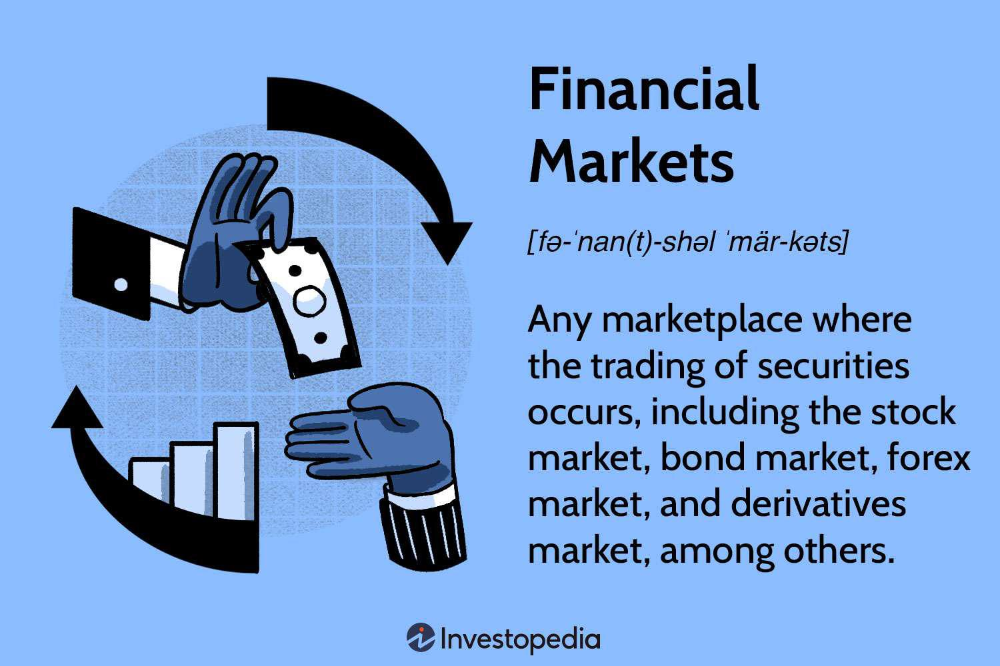

The landscape of financial markets has transformed dramatically due to technological advancements. One of the most influential innovations in this space is derivatives trading, with platforms like the International Securities Exchange (ISE) at the forefront. Derivatives, by their nature, offer market participants the ability to hedge against risk or engage in speculative ventures, thereby adding complexity and dynamism to trading activities. The ISE, as an electronic options exchange, has modernized the trading process by providing enhanced market liquidity and transaction speed, reducing price volatility, and increasing efficiency.

Alongside the rise of derivatives trading, algorithmic trading—commonly referred to as algo trading—has revolutionized the speed and precision with which trades are executed. This automated process allows for pre-defined trading strategies, minimizing human error and emotional bias, thereby resulting in a more structured approach to market engagement. The melding of derivatives trading and algorithmic technology is reshaping the strategies and operations of modern financial markets.



For market participants aiming to refine and optimize their trading approaches, understanding the intricacies of derivatives trading, the pivotal role played by exchanges like the ISE, and the accelerating impact of algorithmic solutions is imperative. Knowledge of these components will enable traders, investors, and financial institutions to navigate the evolving financial landscape efficiently and effectively.

## Table of Contents

## Understanding Financial Market Derivatives

Derivatives are financial instruments whose value is contingent upon the value of an underlying asset, index, or rate. These are not direct claims on assets but are contracts between two or more parties. The most commonly encountered types of derivatives in financial markets include options, futures, forwards, and swaps.

**Options** provide the holder with the right, but not the obligation, to buy or sell an underlying asset at a predetermined price before or at a set expiration date. This flexibility allows options to be used effectively for hedging or speculative purposes. 

**Futures** are standardized contracts obligating the buyer to purchase, and the seller to sell, an underlying asset at a predetermined price at a specified future date. Unlike options, futures contracts require the parties to fulfill the contract's terms, making them a preferred instrument for investors looking to hedge against price fluctuations in commodities or financial instruments.

**Forwards** are similar to futures but are customizable and traded over-the-counter (OTC), rather than on exchanges. This customization permits the parties to tailor the contract to their specific risk management needs, though it also introduces counterparty risk, as the contract's fulfillment relies solely on the involved parties’ credibility.

**Swaps** involve the exchange of one stream of cash flows for another, typically to alter the nature of a financial obligation or exposure. For instance, interest rate swaps might be undertaken to switch from paying a variable interest rate to a fixed rate, thereby stabilizing financial expenses.

Over recent decades, the trading of derivatives has experienced substantial growth and diversification. It has become a pivotal component of financial markets, offering participants a flexible tool to manage financial exposure and risk. Traders and institutional investors utilize derivatives to achieve various financial objectives, ranging from hedging against adverse price movements to enhancing portfolio returns through speculative bets on market shifts.

The growth of derivatives markets underscores their importance in facilitating efficient risk management and enabling the efficient allocation of capital. This expansion has been accompanied by increased scrutiny and regulatory oversight to mitigate systemic risks associated with derivative transactions. While derivatives can offer substantial benefits, it is essential for participants to thoroughly understand the complexities and risks inherent in these financial instruments.

## The Role of the International Securities Exchange (ISE)

The International Securities Exchange (ISE), a trailblazer in electronic options trading, was launched in 2000. As an innovative platform, the ISE brought revolutionary changes to the way options are traded, moving away from traditional open outcry systems. This shift to electronic trading has allowed the ISE to offer greater market [liquidity](/wiki/liquidity-risk-premium) and faster transaction speeds, which are critical elements in the fast-paced world of options trading.

The ISE's integration into Nasdaq, one of the largest global exchanges, underscores its importance in the financial markets. As a subsidiary of Nasdaq, the ISE offers an extensive range of options contracts across more than 3,000 underlying entities, including equities, indexes, and exchange-traded funds (ETFs). This extensive offering positions the ISE as a key player in the options market, catering to a wide array of institutional and retail investors.

One of the ISE's main contributions to the financial markets is its computerized trading systems, which play a significant role in reducing price [volatility](/wiki/volatility-trading-strategies) and enhancing market efficiency. By automating the matching of buy and sell orders, the ISE minimizes the impact of human error and emotional decision-making, leading to more stable pricing. The use of technology ensures that transactions are executed with precision, quickly matching trades and stabilizing the order flow in volatile market conditions.

The adoption of electronic trading platforms by the ISE has also facilitated [algorithmic trading](/wiki/algorithmic-trading), where computer algorithms are used to automate trading strategies. By providing a robust and efficient trading infrastructure, the ISE supports high-frequency trading strategies, allowing traders to execute numerous transactions within milliseconds. This infrastructure not only benefits traders by improving execution speeds but also enhances overall market efficiency by narrowing bid-ask spreads and increasing market depth.

In conclusion, the International Securities Exchange's pioneering approach to electronic options trading has had a profound impact on the financial markets. Its ability to provide enhanced liquidity, speed, and efficiency offers significant advantages to traders and investors. As technology continues to advance, platforms like the ISE will remain pivotal in shaping the future landscape of derivatives trading.

## Algo Trading: An Overview

Algorithmic trading, often referred to as algo trading, automates the execution of trades using computer algorithms. These algorithms are sets of predefined rules that autonomously determine the timing, price, and quantity of trade executions, thereby minimizing human intervention and the emotional biases that typically accompany trading decisions.

One of the primary advantages of algorithmic trading is the precision in trade execution. Traders can specify exact criteria for trade entries and exits, making it possible to target favorable market conditions with high accuracy. For instance, an algorithm might be programmed to execute a trade when a stock's moving average reaches a certain threshold, initiating the transaction instantaneously and avoiding the potential delays associated with manual trading.

The proliferation of algo trading has been transformative, becoming a dominant force in financial markets. As of recent reports, algorithmic trading is responsible for a significant majority of trading [volume](/wiki/volume-trading-strategy), particularly in equity markets. The speed and efficiency of algorithms enable high-frequency trading, where large volumes of trades are executed in fractions of a second. This capability allows traders to capitalize on fleeting market opportunities that would be inaccessible through conventional trading methods.

Moreover, algorithmic trading can diversify trading strategies beyond simple transactions. It can integrate complex strategies such as statistical [arbitrage](/wiki/arbitrage), [market making](/wiki/market-making), and volatility arbitrage. The sophistication of these algorithms is supported by advancements in computational power and data analytics, allowing them to process vast amounts of market data and execute trades based on intricate patterns and indicators.

This evolution in trading dynamics underscores the importance of technology in financial markets, where participants who leverage algorithmic trading gain a competitive edge in execution speed and strategic precision. However, while automation minimizes human error, traders must ensure that algorithms are rigorously tested and calibrated to market conditions, as even minor discrepancies in coding can lead to significant financial losses.

## Strategies in Algorithmic Trading

Algorithmic trading encompasses a variety of strategies, each designed to enhance trading effectiveness by leveraging computer algorithms. Among the fundamental strategies, moving averages and trend-following systems are widely utilized due to their simplicity and effectiveness. These systems automate the process of buying an asset when its price surpasses a predetermined threshold and selling it when the price falls below a specified level. A moving average, typically calculated as the average closing price of an asset over a specific number of days, helps in identifying the direction of the trend by smoothing out price data. For example, a 50-day moving average (MA) can be computed using the formula:

$$

\text{MA}_n = \frac{P_1 + P_2 + ... + P_n}{n} 
$$

where $P_n$ represents the closing price on day $n$.

High-frequency trading ([HFT](/wiki/high-frequency-trading-strategies)) represents another sophisticated strategy. It involves executing a large number of orders at extremely high speeds, often in fractions of a second, to take advantage of minute market anomalies. These trades depend on advanced technological infrastructure to minimize latency, allowing firms to detect and act on short-lived market inefficiencies. HFT strategies often require substantial computational power and sophisticated algorithms tailored to rapidly identify and exploit transient market signals.

Moreover, algorithmic trading increasingly employs [artificial intelligence](/wiki/ai-artificial-intelligence) (AI) and [machine learning](/wiki/machine-learning) techniques to devise adaptive strategies. By utilizing AI, trading algorithms can process vast datasets to uncover complex patterns that are not immediately apparent to human traders. Machine learning models, such as neural networks or regression models, facilitate dynamic strategy development by continuously adapting to new information and evolving market conditions. For instance, a simple Python implementation using scikit-learn for a linear regression model predictive of asset returns could look like this:

```python
from sklearn.linear_model import LinearRegression
import numpy as np

# Assuming X is the array of features and y is the target variable
X = np.array([...])  # Array of features
y = np.array([...])  # Corresponding target variable returns

model = LinearRegression()
model.fit(X, y)

predicted_returns = model.predict(X)
```

The application of AI and machine learning fosters the development of predictive models that can adjust strategies in near real-time, thereby optimizing trade executions based on continuously evolving market dynamics. As algorithmic trading continues to evolve, these sophisticated techniques are expected to become more integral, offering traders tools to optimize decision-making and capitalize on market opportunities.

## Benefits and Challenges of Algorithmic Trading

Algorithmic trading offers several distinct advantages to market participants. One of the primary benefits is increased trade accuracy. By using precisely defined algorithms, trades can be executed with minimal oversight and fewer errors compared to manual trading processes. These algorithms can identify and capitalize on market trends and patterns more quickly and accurately than human traders might. Additionally, algorithmic trading significantly reduces transaction costs. Automated trading systems can place thousands of trades in a fraction of the time it would take a human, cutting down on labor costs and slippage - the difference between the expected price of a trade and the price at which the trade is actually executed.

Moreover, algorithmic trading eliminates emotion-driven decision-making, which is a common pitfall in trading. Emotional responses can lead to decisions not aligned with a trader's strategy or risk tolerance. By relying on algorithms, decisions are based on quantitative data and pre-established criteria, promoting discipline and consistency in trading operations.

While the benefits of algorithmic trading are compelling, challenges must also be noted. Technical barriers represent a significant hurdle. Developing and maintaining a robust trading algorithm requires substantial expertise in both programming and financial markets. Here, Python is widely used due to its simplicity and comprehensive libraries, such as NumPy and pandas, which facilitate data manipulation and analysis. A simple example of an algorithm to compute moving averages could look like this:

```python
import pandas as pd

def moving_average(data, window_size):
    return data.rolling(window=window_size).mean()

# Example usage with a pandas DataFrame
prices = pd.Series([50, 51, 52, 48, 47, 49, 52, 53])
print(moving_average(prices, 3))
```

Complexity in programming these algorithms can be a daunting task, making it necessary for traders to either develop specialized skills or partner with technology providers.

Additionally, the risk of algorithmic malfunction poses a significant challenge. A minor glitch in the algorithm or unforeseen market conditions can lead to erroneous trades or even substantial financial losses. It is crucial for market participants to conduct exhaustive [backtesting](/wiki/backtesting) and to implement risk management measures such as circuit breakers and real-time monitoring systems to minimize such incidents.

Furthermore, algorithmic trading can contribute to market volatility. Although it enhances market efficiency, the rapid pace at which trades are executed can exacerbate price movements, leading to rapid swings in asset prices. This necessitates continuous improvement and adjustments to algorithms to ensure they adapt effectively to real-time market conditions.

Overall, while algorithmic trading brings considerable improvements to trading operations, market participants must also be prepared to address its inherent challenges. This requires a careful balance between innovation, robust risk management frameworks, and continuous education to optimize the benefits while mitigating the risks associated with this technology-driven approach to trading.

## ISE and Algo Trading

The International Securities Exchange (ISE) has established itself as a significant player in the financial markets by supporting algorithmic trading through its robust electronic trading platforms. This electronic infrastructure is designed to accommodate the high-speed demands of modern algorithmic trading, enabling rapid execution of trades with minimal latency. The ISE's systems are engineered to handle high-frequency trading (HFT) and various algorithmic strategies, which contribute to increased market efficiency and liquidity.

To participate in trading on the ISE, entities are required to hold Nasdaq membership, which ensures that firms adhere to a set of stringent regulatory standards. These standards are in place to maintain fair and orderly markets, protect investors, and ensure the integrity of the trading environment. Compliance with these regulations involves adhering to rules that govern trading conduct, financial transparency, and risk management, among other aspects.

Algorithmic trading on the ISE is characterized by its capacity to enhance liquidity in the markets. By enabling large volumes of trades to be executed swiftly, algorithmic trading minimizes the spread between bid and ask prices, thus allowing for more efficient pricing and reducing the cost of transacting for market participants. This increased liquidity is advantageous to both retail and institutional investors, as it facilitates easier entry and [exit](/wiki/exit-strategy) points in the market.

Furthermore, the algorithmic capabilities of the ISE contribute significantly to the stability and efficiency of the market. The sophisticated algorithms employed can process complex data sets and execute trades based on predefined criteria, effectively eliminating human error and emotional biases from trading decisions. This automation of trading strategies improves the overall market dynamic, aligning the supply and demand more accurately and ensuring effective price discovery.

In summary, the ISE's infrastructure for algorithmic trading serves as a catalyst for improving market conditions by enhancing liquidity, reducing transaction costs, and promoting efficient price discovery. Adherence to regulatory standards ensures that the benefits of algorithmic trading are realized within a framework that promotes transparency, fairness, and stability in the market.

## Conclusion

The integration of derivatives trading with algorithmic strategies on platforms such as the International Securities Exchange (ISE) marks a transformative advancement in financial markets. This fusion facilitates enhanced precision, speed, and efficiency, providing traders with the ability to execute complex trades at unprecedented scales and speeds. As technology continues to advance, the scope and capabilities of algorithmic trading are expected to expand further, presenting both opportunities and challenges for market participants.

Opportunities arise in the form of increased market access and the ability to execute trading strategies that were previously impractical due to their complexity or resource intensity. Algorithmic trading enables sophisticated models that can leverage large datasets, identifying market trends and optimizing trading strategies in real time. For instance, machine learning algorithms can predict market movements, thus potentially maximizing returns and minimizing risks.

However, the expansion of algo trading also brings significant challenges. The reliance on automated systems introduces the potential for technical failures and market disruptions caused by algorithmic malfunctions. Moreover, the competitive edge gained by employing such strategies often demands continuous investment in technological infrastructure and analytical capabilities, creating a barrier to entry for smaller market participants.

Market participants must remain vigilant and adaptable to these evolving dynamics to harness the full potential of these advancements. Continuous education, investment in technology, and a robust understanding of regulatory compliance are essential for successfully navigating this rapidly changing landscape. By staying informed and agile, traders can leverage the benefits of algorithmic trading on platforms like the ISE, ensuring sustained competitiveness in the financial markets of the future.

## References & Further Reading

[1]: Bergstra, J., Bardenet, R., Bengio, Y., & Kégl, B. (2011). ["Algorithms for Hyper-Parameter Optimization."](https://dl.acm.org/doi/10.5555/2986459.2986743) Advances in Neural Information Processing Systems 24.

[2]: ["Advances in Financial Machine Learning"](https://www.amazon.com/Advances-Financial-Machine-Learning-Marcos/dp/1119482089) by Marcos Lopez de Prado

[3]: ["Evidence-Based Technical Analysis: Applying the Scientific Method and Statistical Inference to Trading Signals"](https://www.amazon.com/Evidence-Based-Technical-Analysis-Scientific-Statistical/dp/0470008741) by David Aronson

[4]: ["Machine Learning for Algorithmic Trading"](https://github.com/stefan-jansen/machine-learning-for-trading) by Stefan Jansen

[5]: ["Quantitative Trading: How to Build Your Own Algorithmic Trading Business"](https://www.amazon.com/Quantitative-Trading-Build-Algorithmic-Business/dp/1119800064) by Ernest P. Chan