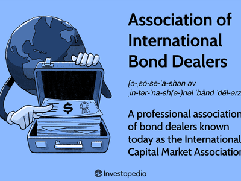

The International Securities Market Association (ISMA) played a pivotal role in the regulation and development of the global securities market. As a self-regulatory organization, its primary focus was ensuring transparency, efficiency, and integrity within the Euromarkets. The Euromarket refers to the international financial market for dealing in securities unbound by national boundaries. ISMA's contributions were instrumental in establishing accepted practices and standards, which bolstered investor confidence and facilitated the smooth functioning of these markets.

In today's financial landscape, algorithmic trading has become a cornerstone of modern securities trading. This method involves using computer algorithms to automate trading activities, allowing for rapid decision-making and execution at speeds surpassing human capabilities. Algorithms analyze a multitude of market data points almost instantaneously and make trades based on predefined criteria. The primary advantage of this approach is its ability to process vast amounts of data and execute orders with high precision, reducing the likelihood of human error and enhancing market liquidity.

The automation of trading and investment strategies has significantly influenced how markets operate. By automating repetitive tasks, institutions can allocate human resources to more strategic and analytical roles, potentially leading to more informed investment decisions. Additionally, automation allows for backtesting and optimizing strategies before implementing them in live markets.

Key concepts related to ISMA and algorithmic trading encompass a variety of market practices and evolving technologies. ISMA's legacy includes its contribution to market organization and its transition into the International Capital Market Association (ICMA), which continues to uphold similar values. On the other hand, algorithmic trading represents a shift towards leveraging technology to enhance market efficiencies, offering insights into future trends such as machine learning and artificial intelligence in trading strategies. While these developments promise increased efficiency, they also present new challenges requiring a balance between innovation and regulation to ensure market stability and protection for investors.

## Table of Contents

## What Was the International Securities Market Association (ISMA)?

The International Securities Market Association (ISMA) was established as a self-regulatory organization with the primary aim of promoting international capital markets, particularly the Euromarkets. Formally founded in 1969, ISMA sought to enhance the efficiency and professionalism of the securities market by developing standardized practices and norms. Acting as a coordinating body, it was instrumental in the growth and development of the international bond markets, providing a structured environment for market participants.

ISMA’s formation marked a significant development in the regulation of the international securities markets. At a time when the Euromarkets were burgeoning, there was a clear need for a centralized authority that could oversee the trading activities conducted across borders without direct government intervention. ISMA provided guidelines and standardized practices which helped in mitigating risks associated with international trading. The organization was pivotal in setting the framework for the efficient operation of traders and intermediaries involved in the market.

One of ISMA’s key objectives was to promote transparency and trust in the Euromarkets. This was primarily achieved through the introduction of a set of rules and recommendations that members were encouraged to follow. By doing so, ISMA contributed to the reduction of transaction costs and the fostering of competition among market participants. Moreover, ISMA served as a platform for discussion and dissemination of industry insights, facilitating communication across different jurisdictions.

A significant aspect of ISMA’s legacy is its recognition as a designated investment exchange by various national regulatory authorities. This status enabled it to function with a degree of regulatory oversight while maintaining its self-regulatory capacity. The acknowledgment affirmed ISMA's role in providing a safe and efficient trading venue for international securities transactions, ensuring that members adhered to its operational and ethical standards.

In summary, ISMA was a cornerstone institution that played a vital role in shaping the landscape of international securities markets. Its establishment as a self-regulatory body underscored the increasing complexity and internationalization of financial markets, setting precedents for how such markets could be organized and regulated effectively. ISMA’s missions and functions laid the groundwork for future regulatory bodies and market associations, influencing the structure of international finance to this day.

## The Evolution of ISMA to ICMA

The International Securities Market Association (ISMA), a key player in the financial landscape, collaborated with the International Primary Market Association (IPMA) to form the International Capital Market Association (ICMA) in 2005. This merger was pivotal in fortifying global securities markets by combining the strengths of both associations to enhance regulatory frameworks and market practices.

The primary milestone of this merger was the unification of both the primary and secondary markets under one umbrella, subsequently streamlining the operations and regulatory practices across these facets. ICMA emerged with a mission to promote resilient and transparent capital markets. It focuses on adhering to high standards of market practice and regulation, which are essential in maintaining market integrity and investor confidence.

ICMA has been instrumental in setting global standards for the debt securities markets. Their regulatory efforts concentrated on advocating for reform and guidance in market practices, contributing significantly to the shaping of a more structured and reliable capital market environment. The association's commitment to market transparency and efficiency has made it a leading voice in the financial community.

The impact of the merger on global capital markets is substantial. It fostered enhanced cooperation between primary and secondary markets, leading to improved market [liquidity](/wiki/liquidity-risk-premium) and efficiency. Furthermore, ICMA's emphasis on professional standards has facilitated harmonization across markets, thus making cross-border transactions more seamless and less prone to market disruptions.

In essence, the transformation of ISMA into ICMA marked a significant evolution in financial associations. Through the merger, the association has contributed to a more robust infrastructure that supports fair and effective markets worldwide, thereby strengthening the global capital market system.

## Algorithmic Trading in the Securities Market

Algorithmic trading refers to the use of computer programs to automate the process of buying and selling securities. These algorithms utilize pre-defined criteria, such as timing, price, or [volume](/wiki/volume-trading-strategy), to execute trades at speeds and frequencies that are unimaginable for a human trader. This method leverages computational models and advanced statistical analysis to forecast market trends and make trading decisions. 

One of the primary advantages of using algorithms in securities trading is the ability to process vast amounts of market data rapidly. Algorithms can analyze multiple markets and execute trades simultaneously, ensuring that traders can capitalize on opportunities as they arise. This capability significantly enhances market liquidity as it allows for faster entry and [exit](/wiki/exit-strategy) positions, contributing to a more liquid and efficient market overall.

Technological advancements play a crucial role in market efficiencies by optimizing transaction costs and reducing the time between decision making and execution. High-frequency trading ([HFT](/wiki/high-frequency-trading-strategies)), a subset of [algorithmic trading](/wiki/algorithmic-trading) characterized by high turnover rates, relies heavily on cutting-edge technology to derive profits from bid-ask spreads often measured in sub-seconds. The widespread adoption of [machine learning](/wiki/machine-learning) and [artificial intelligence](/wiki/ai-artificial-intelligence) in trading strategies has further enhanced decision-making accuracy and predictive capabilities.

Recent trends in algorithmic trading include the rise of machine learning models and the use of big data to improve trading strategies. Artificial intelligence allows algorithms to learn from historical data patterns and adjust strategies without human intervention. Additionally, sentiment analysis, which evaluates news sentiment through natural language processing (NLP) techniques, has become a notable innovation, helping traders to gauge market sentiment and make informed decisions.

The integration of cloud computing is another significant trend, as it offers scalable infrastructure for analyzing and processing vast datasets. This allows traders and firms to handle large-scale computations required for [backtesting](/wiki/backtesting) and deploying complex models without investing heavily in physical hardware.

As these innovations continue to reshape the environment, algorithmic trading remains a dynamic and integral component of the securities market, necessitating continual adaptation to technological and regulatory developments.

## Impacts of Algorithmic Trading on the Market

Algorithmic trading, a pivotal force in modern financial markets, fundamentally alters market dynamics by affecting liquidity and [volatility](/wiki/volatility-trading-strategies). High-frequency trading, a subset of algorithmic trading, contributes significantly to these changes. By executing trades at high speeds and volumes, algorithmic trading can enhance liquidity. Liquidity is crucial for efficient market operations, as it reduces transaction costs and enables large trades without impacting the market price significantly. However, while algorithmic trading boosts liquidity, it may also increase volatility under certain market conditions. Algorithms reacting to market signals can trigger rapid price movements, particularly during periods of market stress, potentially amplifying market fluctuations.

Regulatory bodies have responded to the challenges introduced by algorithmic trading by implementing measures to ensure market integrity and stability. The European Securities and Markets Authority (ESMA), along with other global regulatory authorities, mandates transparency and emphasizes the need for robust risk management frameworks. These frameworks include circuit breakers and other mechanisms to prevent market crashes precipitated by algorithmic missteps.

Organizations such as the International Capital Market Association (ICMA) play a crucial role in providing guidelines and recommendations to help navigate the growing complexity of algorithmic trading. ICMA fosters high standards of market practice and promotes collaboration among market participants to address the challenges posed by rapidly evolving technology.

Implementing algorithmic trading solutions is not without challenges. Key considerations include ensuring the accuracy and reliability of the algorithms, safeguarding against market manipulation, and managing the risks associated with high-speed trading. Computational infrastructure must be robust to handle large volumes of data and execute trades without error. Moreover, it requires continuous monitoring and adaptation to changing market conditions and regulatory requirements.

In summary, while algorithmic trading enhances market efficiency through increased liquidity, it demands careful oversight to mitigate associated risks, particularly the potential for heightened volatility. Balancing innovation with regulation is essential to harness the benefits while safeguarding financial markets.

## Conclusion

The International Securities Market Association (ISMA) played a crucial role in the development and regulation of the global securities market. As a self-regulatory organization, ISMA worked diligently to promote the Euromarkets and maintain market integrity. Its transformation into the International Capital Market Association (ICMA) marked a significant milestone, expanding its influence and capabilities. ICMA's focus on high standards of market practice and regulation continues to impact global capital markets positively.

In parallel with these developments, algorithmic trading has grown increasingly relevant in today's financial landscape. Its adoption in the securities market has transformed trading and investment strategies, offering increased speed, efficiency, and precision. Algorithms have automated processes that were once manual, allowing traders to execute large volumes of transactions with minimal human intervention. This technological advancement has brought market efficiencies but also presents new challenges in terms of regulation and oversight.

Looking ahead, the synergy between financial associations like ICMA and algorithmic trading will likely continue to evolve. These organizations have a critical role in ensuring that market innovations do not outpace regulatory frameworks. As technology further permeates trading practices, there will be an ongoing need for robust regulatory measures to maintain market stability and integrity. The future of financial markets will hinge on finding the right balance between fostering innovation and implementing effective regulations.

In conclusion, the historical significance of ISMA and its transition to ICMA underscores the dynamic nature of financial associations in adapting to market needs. The growing prevalence of algorithmic trading highlights the transformative power of technology in the securities market. Moving forward, the challenge will be to harness this potential while safeguarding market integrity, reflecting a continuously evolving relationship between regulation and innovation in modern trading.

## References & Further Reading

[1]: López de Prado, M. (2018). ["Advances in Financial Machine Learning."](https://www.amazon.com/Advances-Financial-Machine-Learning-Marcos/dp/1119482089) Wiley.

[2]: Chan, E. P. (2008). ["Quantitative Trading: How to Build Your Own Algorithmic Trading Business."](https://github.com/ftvision/quant_trading_echan_book) Wiley.

[3]: Jansen, S. (2020). ["Machine Learning for Algorithmic Trading."](https://github.com/stefan-jansen/machine-learning-for-trading) Packt Publishing.

[4]: Aronson, D. (2006). ["Evidence-Based Technical Analysis: Applying the Scientific Method and Statistical Inference to Trading Signals."](https://www.amazon.com/Evidence-Based-Technical-Analysis-Scientific-Statistical/dp/0470008741) Wiley.

[5]: Bergstra, J., Bardenet, R., Bengio, Y., & Kégl, B. (2011). ["Algorithms for Hyper-Parameter Optimization."](https://dl.acm.org/doi/10.5555/2986459.2986743) Advances in Neural Information Processing Systems 24.