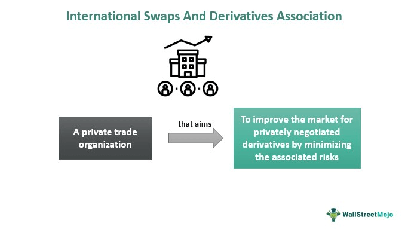

Algorithmic trading has brought significant changes to the financial markets, heavily impacting the trading and management of derivatives. These financial instruments, whose value depends on underlying assets such as stocks, bonds, or interest rates, are essential for hedging risks, speculative strategies, and enhancing market liquidity. The adoption of algorithmic trading allows for the execution of large and complex trades with incredible speed and precision, optimizing market strategies and exploiting arbitrage opportunities more effectively than manual trading methods.

Central to the efficient functioning of the derivatives market is the role played by the International Swaps and Derivatives Association (ISDA). Since its inception, ISDA has been influential in creating standardized agreements that facilitate over-the-counter (OTC) derivatives transactions, most notably through the ISDA Master Agreement. This standardized legal framework reduces counterparty risk and improves market transparency, making it easier for traders and financial institutions to operate within this sophisticated market.

The integration of ISDA's frameworks with algorithmic trading represents a significant advancement in financial market operations. This convergence ensures that complex derivatives transactions can be automated with a high degree of legal and operational certainty, promoting market stability and efficiency.

As traders, investors, and financial institutions navigate this sophisticated landscape, understanding the interplay between ISDA swap derivatives and algorithmic trading is crucial. Such understanding enables market participants to leverage these tools effectively, optimizing trading strategies while managing risks. Looking forward, the derivatives market is poised to undergo further innovation and transformation, influenced by technological advancements and evolving regulatory frameworks. These developments will continue to shape the future of financial trading, presenting both opportunities and challenges for market participants.

## Table of Contents

## Understanding Derivatives

Derivatives are financial instruments whose value is derived from underlying assets such as stocks, bonds, interest rates, commodities, or currencies. These instruments serve multiple purposes including risk management, speculation, and enhancing market efficiency by enabling price discovery and increasing market liquidity.

One primary function of derivatives is risk management. They allow investors and corporations to hedge against potential adverse movements in underlying asset prices. For instance, a company concerned about fluctuating currency rates might use currency derivatives to lock in a specific exchange rate for future transactions, thus mitigating potential losses.

Speculation is another significant use of derivatives. Traders can speculate on the future direction of an underlying asset's price without owning the asset itself. This provides an opportunity to profit from market movements. Speculators inject [liquidity](/wiki/liquidity-risk-premium) into the market, facilitating smoother transactions for hedgers.

Market efficiency is improved by derivatives as they provide avenues for [arbitrage](/wiki/arbitrage). Arbitrageurs exploit price discrepancies between the derivative and its underlying asset, ensuring prices in different markets do not deviate substantially from each other for prolonged periods. This increases the efficiency of the markets by aligning prices across different platforms.

Derivatives can be categorized into several types based on their underlying assets and their use:

1. **Interest Rate Derivatives**: These include instruments like interest rate swaps and options that are used to hedge or assume interest rate risk. They are vital for institutions looking to manage the fluctuations in interest rates that can affect their financial positions.

2. **Credit Derivatives**: These products, such as credit default swaps, allow parties to manage credit risk. They provide insurance against the default of a borrower, thus playing a critical role in managing credit exposures.

3. **Equity Derivatives**: Based on the value of equity securities, these derivatives include stock options and futures, which are used for hedging or to gain exposure to specific stocks without purchasing the stock itself.

4. **Commodity Derivatives**: These are used to hedge or speculate on the price of commodities like oil, gold, or agricultural products. Farmers, for example, might use futures contracts to secure a guaranteed price for their crops.

5. **Currency Derivatives**: Used to manage exposure to fluctuations in exchange rates, instruments like currency futures, options, and swaps are vital for companies engaged in international trade.

The significance of derivatives is largely attributed to their capability to enable risk hedging and facilitate price discovery. By allowing market participants to secure a future price or exchange rate, derivatives help reduce uncertainty and provide information about future market conditions. Moreover, derivatives enhance overall market liquidity, as they attract a broader range of participants, including hedgers, speculators, and arbitrageurs, thereby increasing the number of transactions and the ease with which trades are executed. 

Understanding these key functions and types of derivatives is crucial for navigating and leveraging the opportunities present within the financial markets.

## The ISDA Master Agreement

The ISDA Master Agreement is a crucial standardized contract pervasive in the over-the-counter (OTC) derivatives market. Its primary purpose is to mitigate counterparty credit risk and enhance market transparency. First introduced in 1987, this agreement has undergone several refinements to cater to evolving market dynamics and regulatory frameworks. It provides a comprehensive legal framework, encompassing various types of derivative transactions.

One of the key features of the ISDA Master Agreement is netting provisions. These provisions allow parties to combine their various obligations, permitting a single net payment in case of a default event. This mechanism significantly reduces the potential for systemic risk by limiting the number of outstanding obligations and, consequently, the credit exposure between parties.

Additionally, the ISDA Master Agreement includes robust collateral management processes. These are instrumental in securing transactions against credit risk by requiring parties to provide collateral to cover potential exposures. This reduces the probability of a loss if one party fails to fulfill its contractual obligations, thus fostering a more secure trading environment.

The ISDA Master Agreement extends consistent structural benefits for all involved parties, ensuring legal certainty and operational stability in derivatives trading. It standardizes the terms and conditions under which these complex financial instruments are traded, allowing market participants to rely on a universally accepted legal document. This standardization simplifies cross-border transactions and decreases the legal costs associated with negotiating individual contracts for each transaction.

In summary, the ISDA Master Agreement is foundational to the effective functioning of the OTC derivatives market. It facilitates reduced legal complexity, enhances credit risk management, and contributes to the overall stability and efficiency of global financial markets.

## Algorithmic Trading and Derivatives

Algorithmic trading, a form of automated trading, utilizes computer programs to execute trading strategies at high speeds and volumes, often beyond human execution capabilities. In the derivatives markets, [algorithmic trading](/wiki/algorithmic-trading) offers several advantages in terms of efficiency, precision, and speed. By automatically scanning for market trends, price discrepancies, and arbitrage opportunities, algorithms can execute trades rapidly and with minimal delay, thereby maximizing profits and minimizing risks associated with human error or slow decision-making processes.

The rapid execution of complex orders and strategies is a significant advantage of algorithmic trading in derivatives markets. Traders can leverage algorithms to perform intricate calculations and identify optimal entry and [exit](/wiki/exit-strategy) points based on pre-defined criteria, enabling them to capitalize on minute price movements. For example, a common strategy is [statistical arbitrage](/wiki/statistical-arbitrage), which involves exploiting price differentials between correlated derivative instruments, often requiring the execution of numerous trades within seconds.

However, the speed and automation of algorithmic trading also come with challenges, notably in the form of market [volatility](/wiki/volatility-trading-strategies). One of the most cited examples of this is the 2010 Flash Crash, where the Dow Jones Industrial Average plummeted nearly 1,000 points within minutes, primarily due to automated trading systems. This incident highlighted the potential risks, including liquidity evaporation and exacerbated market swings, associated with high-frequency trading in derivatives and other financial markets.

Despite these challenges, algorithmic trading continues to grow in prominence within derivatives markets, driven by its ability to handle vast amounts of data and execute complex trading strategies quickly. The precision and processing power of algorithms make them indispensable tools for traders seeking to maintain a competitive edge in today's fast-paced financial environment. As technology advances, algorithmic trading is expected to further influence the landscape of derivatives trading, necessitating ongoing adaptation and innovation by market participants.

## The Intersection of ISDA Master Agreement and Algorithmic Trading

The ISDA Master Agreement plays a crucial role in ensuring a stable legal framework essential for the efficiency of algorithmic trading in derivatives markets. Its standardization is key, as it allows algorithmic trading systems to operate with a high degree of legal certainty, thereby facilitating the automated execution of derivative trades. This legal framework, introduced in 1987 and continually refined, provides the consistency necessary for high-frequency trading practices, where rapid decision-making and transaction execution are paramount.

One of the primary advantages of integrating the ISDA Master Agreement into algorithmic trading lies in its ability to reduce legal risk. By offering a standardized contract model, market participants can reduce the complexities associated with differing legal interpretations, which is critical when trades are executed at high speeds. This consistency helps ensure that the terms of each transaction are clear and enforceable, reducing the potential for disputes between counterparties.

However, leveraging ISDA terms in algorithmic trading is not without challenges. A significant hurdle is translating the complex legal language of the ISDA Master Agreement into executable code within trading algorithms. This requires not only a thorough understanding of the legal provisions but also proficiency in programming and algorithm design to ensure accurate representation of these terms. Errors in coding can lead to substantial financial and operational risks, highlighting the importance of rigorous testing and validation of algorithms.

Furthermore, ensuring that algorithmic systems can adapt to various amendments and updates to the ISDA agreements is another challenge. As these agreements evolve to accommodate changing regulatory and market conditions, trading systems must also be updated to maintain compliance and efficiency. This requires ongoing collaboration between legal experts and technology developers to implement changes swiftly and effectively.

The implementation of the ISDA Master Agreement in algorithmic trading environments supports the scalability and responsiveness of trading operations. By standardizing legal structures, it allows high-frequency trading systems to focus on optimizing performance without becoming entangled in legal uncertainties. This integration emphasizes the importance of legal frameworks in advancing technological capabilities within financial markets, ensuring that trading systems operate with both precision and reliability.

## Future Prospects and Developments

Advancements in technology such as blockchain and smart contracts are poised to significantly impact the intersection of ISDA frameworks and algorithmic trading. Blockchain technology, with its decentralized and immutable nature, offers enhanced transparency and security, which are critical elements in derivatives trading. This technology can streamline transaction processes, reduce the risk of errors, and improve efficiency by eliminating the need for intermediaries. Smart contracts, as self-executing agreements, can automate terms defined within the ISDA Master Agreement, ensuring compliance and accuracy in trade execution.

Regulatory changes are expected to continue shaping the evolution of these frameworks, placing a greater emphasis on transparency and risk management. As regulatory bodies worldwide strive to adapt to rapid technological changes, there is a growing demand for clearer guidelines and oversight to protect market integrity. This evolving landscape creates an opportunity for the ISDA to update its documentation and templates to integrate these technologies seamlessly.

Emerging technologies present opportunities to enhance the efficiency and security of the derivatives market. However, to fully leverage these innovations, it is imperative to update existing legal frameworks to ensure compliance and adaptability. The integration of blockchain in clearing and settlement processes could drastically reduce counterparty risk, enhance auditability, and lead to cost savings. Nevertheless, achieving this requires collaboration between regulatory authorities, legal professionals, and technologists to overcome challenges related to scalability, interoperability, and regulatory compliance.

In conclusion, while technology continues to drive transformation in financial trading, it is crucial for stakeholders to remain vigilant and proactive in managing associated risks. The integration of blockchain and smart contracts within the ISDA framework offers promising prospects for high-frequency and algorithmic trading, but necessitates continuous refinement of legal structures to support these advances in a secure and efficient manner.

## Conclusion

As derivatives and algorithmic trading continue their dynamic evolution, the ISDA Master Agreement remains a fundamental pillar underpinning market stability. This stable framework enhances the predictability and robustness of the derivatives market, making it an essential tool for market participants. Legal frameworks such as the ISDA Master Agreement are crucial for maintaining market integrity, especially as technological advancements pervade financial trading environments.

The integration of legal and technological innovations is poised to reshape financial trading. Technologies such as blockchain and smart contracts offer new possibilities for automating and securing transactions, potentially reducing operational risks and increasing transparency. However, this also necessitates the adaptation of existing legal structures to accommodate new trading methodologies and ensure compliance with evolving regulations.

Understanding and successfully navigating these complex domains is essential for market participants aiming to capitalize on emerging opportunities while ensuring robust risk management. Engaging with both the technological and legal aspects of trading will provide a competitive edge and foster informed decision-making.

As the financial landscape undergoes technological and regulatory transformations, continuous adaptation and education are imperative. Market participants must remain agile, updating their knowledge and strategies to align with current trends and legislative changes. This proactive approach will help secure a position in the rapidly evolving world of financial markets, ensuring long-term success and stability.

## References & Further Reading

- Hull, J. C. (2017). *Options, Futures, and Other Derivatives.* Pearson Education. This comprehensive guide offers insights into the mechanisms and applications of various derivatives, making it a fundamental resource for understanding financial instruments like futures, options, and swaps.

- International Swaps and Derivatives Association, Inc. (2003). *ISDA Master Agreement.* An essential document for professionals in the derivatives market, this agreement provides the foundational legal framework facilitating secure and standardized transactions in the over-the-counter derivatives markets. For more information, visit [ISDA's official site](https://www.isda.org/).

- Cartea, Á., Jaimungal, S., & Penalva, J. (2015). *Algorithmic and High-Frequency Trading.* Cambridge University Press. This book investigates into the technical and quantitative aspects of algorithmic trading, providing a detailed analysis of the strategies and algorithms employed in high-frequency trading environments.

- Pirrong, C. (2011). *The Economics of Central Clearing: Theory and Practice.* ISDA. This paper discusses the significance and complexities of central clearing in derivatives markets, exploring the theoretical framework and practical implications of clearinghouses' roles in minimizing counterparty risk.