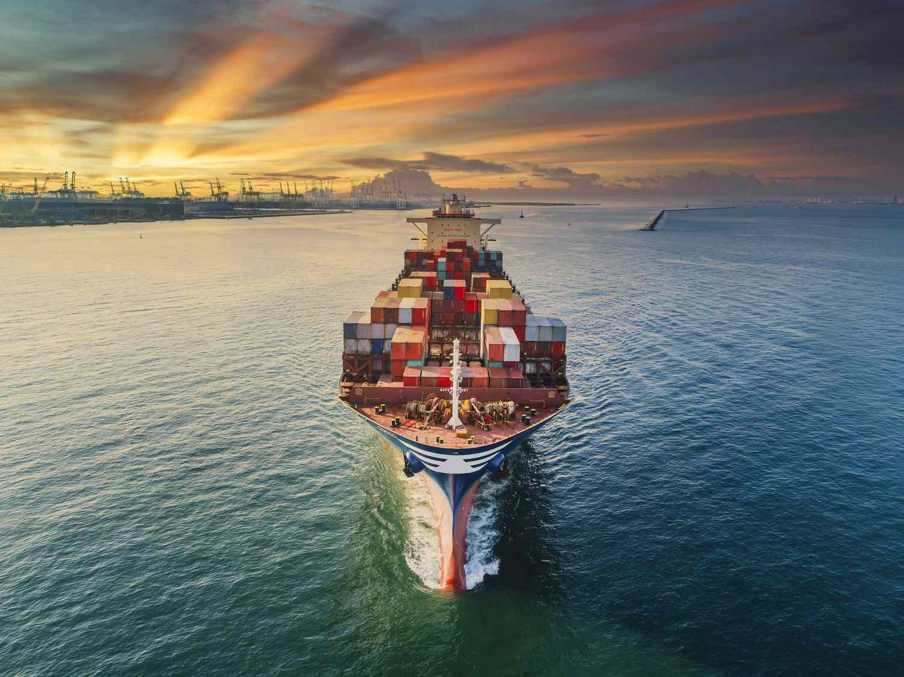

International trade, often referred to as global trade, encompasses the exchange of goods and services across international borders. This intricate system allows countries to connect economically, bridging the gap between different markets and resources. The operations of international trade have profound impacts on global economies, driving economic growth, stimulating innovation, and improving market efficiency.

The benefits associated with international trade are multifaceted. By enabling countries to access products and services not available within their own borders, trade promotes diversity in consumer choices and supports economic expansion. It also fosters innovation through exposure to new ideas and technologies, while enhancing market efficiency by leveraging the economic principle of comparative advantage. This concept allows nations to specialize in producing goods where they have a lower opportunity cost, thereby maximizing efficiency and production output.

Recently, the advent of algorithmic trading has added a new layer of complexity and opportunity to the landscape of international trade. Algorithmic trading, characterized by the use of advanced algorithms to automate and optimize the trading process, is revolutionizing the way global trading is conducted. It increases the speed and efficiency of trade by analyzing vast datasets in real-time and making instantaneous trading decisions. This shift presents both new opportunities and challenges in the global trading arena.

As international trade continues to evolve, understanding its interplay with algorithmic trading is crucial. Algorithmic trading not only influences traditional trading methods but also necessitates adaptations in regulatory frameworks to manage market volatility and ethical concerns. Successful navigation of these evolving dynamics is essential for nations and businesses alike to effectively leverage the benefits of international trade, while mitigating potential risks. Each of these elements contributes to a comprehensive understanding of how international trade operates today and informs strategies for future growth and adaptation in the context of an increasingly automated world.

## Table of Contents

## The Benefits of Global Trade

Global trade significantly enriches the spectrum of goods and services accessible to consumers worldwide by enabling diversification beyond domestic capabilities. This access allows countries to procure products that may be unavailable or too costly to produce locally. Such diversification is instrumental in meeting various consumer preferences and demands, thereby enhancing overall welfare.

Economic interdependence is a crucial outcome of global trade, promoting closer geopolitical ties among nations. As countries become integral parts of the global supply chain, their economic destinies increasingly intertwine, fostering a collaborative international environment. This interconnectedness can lead to more stable political relations, as nations benefit from mutual economic prosperity and shared interests.

Furthermore, international trade serves as a catalyst for innovation. By opening domestic markets to a plethora of global ideas, technologies, and processes, trade encourages countries to adopt and adapt leading-edge practices. This constant flow of knowledge and technology transfer prompts firms to innovate and improve, reinforcing their competitive edge. 

The competitive environment created by global trade plays a pivotal role in maintaining price equilibrium. By allowing multiple players in the marketplace, trade discourages monopolistic practices, ensuring that consumers benefit from competitive pricing. This competition not only keeps prices in check but also improves the quality of goods and services as companies strive to capture market share.

Countries engage in international trade by capitalizing on their comparative advantages—producing goods or services at a lower opportunity cost than others. This specialization leads to more efficient production processes and distribution of resources. The theory of comparative advantage, developed by economists like David Ricardo, illustrates how trade can enable all trading partners to achieve greater production efficiency and consumption levels than in isolation. For instance, when a country focuses on industries where it has a comparative advantage, it can produce more effectively and trade for goods that would be costlier to produce domestically, thereby optimizing the global distribution of resources. 

In conclusion, global trade provides an array of benefits that include product diversification, economic interdependence, innovation stimulation, competitive pricing, and enhanced efficiency through comparative advantage. These fundamental advantages collectively drive economic growth and prosperity, reinforcing the essential role of trade in the global economy.

## Comparative Advantage and Specialization

Comparative advantage is a fundamental principle in international trade, explaining why nations leverage their resources to produce specific goods where they incur lower opportunity costs. This principle, first introduced by economist David Ricardo in the early 19th century, illustrates that trade can be mutually beneficial for all parties involved—even when one country holds an absolute advantage in the production of all goods. According to Ricardo's theory, by concentrating on their strengths or areas where they are more efficient relative to others, countries can increase overall production and consumption, leading to enhanced economic welfare.

The concept of comparative advantage is often framed through the production possibilities frontier (PPF), which represents the maximum possible output of two goods that a country can achieve with its resources. By focusing on producing the good for which they have a comparative advantage, countries can operate on a point inside the PPF that maximizes efficiency. Consider the mathematical formulation for this concept:

Assuming two countries—Portugal and England—and two goods—wine and textiles—the opportunity cost can be represented as follows:

$$
\text{Opportunity cost of wine in Portugal} = \frac{\text{Textiles foregone}}{\text{Wine produced}}
$$

$$
\text{Opportunity cost of textiles in England} = \frac{\text{Wine foregone}}{\text{Textiles produced}}
$$

Portugal has a comparative advantage in wine production if the opportunity cost of producing wine is lower in Portugal than in England. Conversely, England has a comparative advantage in textile production if the opportunity cost of producing textiles is lower in England than in Portugal.

Specialization, driven by comparative advantage, enables countries like Portugal and England to focus on producing wine and textiles, respectively. For instance, Portugal may excel in wine due to its favorable climate and soil, while England's advanced textile machinery and expertise might predispose it to specialize in textiles. This specialization ensures more efficient production, as resources are allocated optimally, aligning with each country's competitive edge.

Historical trade patterns corroborate these theoretical insights. During the 19th century, Portugal's wine industry flourished as it traded with England, which supplied textiles. This exchange not only facilitated economies of scale but also stimulated growth by enabling both nations to consume beyond their own PPFs. By focusing on their respective areas of comparative advantage, both countries enhanced their economic welfare and experienced a net gain from trade.

Furthermore, comparative advantage and specialization are not static. Technological advancements, shifts in consumer preferences, and changes in resource availability can alter a country's comparative advantage over time. Thus, continuous evaluation and adaptation are essential for countries to maintain an efficient and beneficial trade strategy on the global stage.

## Free Trade vs. Protectionism

Free trade and protectionism represent two opposing approaches to managing international trade. Free trade advocates emphasize the removal of tariffs, quotas, and other trade barriers, arguing that such liberalization fosters economic efficiency and growth. The theory is rooted in the belief that markets, if left largely unrestricted, will naturally adjust to allocate resources in the most effective manner possible. This, in turn, leads to increased variety and lower prices for consumers, as competition drives innovation and cost reductions.

Protectionism, on the other hand, involves the implementation of tariffs, import quotas, and other regulatory measures to protect domestic industries from foreign competition. By doing so, governments aim to shield local businesses, particularly nascent industries, from being outcompeted by more established international firms. Protectionist policies can be crucial for national security, preserving jobs, and helping emerging industries gain the necessary scale and experience to compete globally.

Both free trade and protectionism have profound effects on international trade efficiency and economic growth. Free trade can lead to more efficient global supply chains, with nations specializing in the production of goods for which they have comparative advantages. This specialization can maximize economic output and cater to consumers' diverse demands at competitive prices. However, completely open markets may expose domestic industries to overwhelming foreign competition, potentially resulting in job losses and economic inequality.

Protectionism can be beneficial to fledgling industries by giving them time to develop technological expertise and achieve economies of scale. However, over-reliance on protectionist measures can lead to market distortions, reduced economic vitality, and retaliatory measures from trade partners. Ultimately, luxury tariffs or quotas can misallocate resources, raising costs for consumers and reducing a nation's economic welfare.

Finding a balance between free trade and protectionism is crucial for policymakers. While free trade fosters growth and competitiveness, measured protectionism can strategically support industries critical to national interests. This nuanced approach seeks to optimize the benefits of both systems, ensuring robust economic development.

## Challenges and Criticisms of International Trade

Opponents of free trade argue that it can sometimes have detrimental effects on domestic industries, potentially leading to job losses. When local companies face competition from international firms that may produce goods at lower costs due to factors such as cheaper labor or more efficient production processes, they may struggle to maintain market share. This competition can lead to the closure of domestic firms, resulting in unemployment and economic dislocation in affected communities.

Rent-seeking and lobbying behaviors further complicate the landscape of international trade. Powerful interest groups may exert influence on policymakers to design trade policies that favor specific industries or companies, rather than the economy as a whole. This can lead to inefficiencies as resources are allocated based on political influence rather than market forces or comparative advantage. Such distortions may benefit a few at the expense of the broader economy, inhibiting the overall gains from trade.

Developing nations often face significant challenges when attempting to compete on a global scale. These countries may encounter barriers such as tariffs and quotas that restrict their access to larger markets. Additionally, they may lack the advanced infrastructure and technology necessary to produce goods at competitive prices. The imposition of trade barriers by developed nations can further exacerbate these challenges, limiting the ability of developing countries to grow their economies through international trade.

Currency manipulation and unfair trade practices are also ongoing concerns in achieving equitable international trade. Some nations may engage in deliberate actions to devalue their currency, making their exports cheaper and more attractive to foreign buyers while making imports more expensive. This can create imbalances in trade relationships and lead to accusations of unfair competitive practices. Ensuring fairness in trade requires robust international agreements and regulatory frameworks to address such issues.

In summary, the critics of international trade highlight valid concerns that need to be addressed to ensure that its benefits are more evenly distributed. Policymakers must carefully consider the impacts of trade on domestic industries, confront rent-seeking behavior, support developing nations in overcoming trade barriers, and work towards equitable trade practices globally.

## The Emergence and Impact of Algorithmic Trading

Algorithmic trading has revolutionized the financial markets by employing sophisticated algorithms to automate trading processes, thereby significantly increasing speed and efficiency in executing trades. By harnessing powerful computational models, [algorithmic trading](/wiki/algorithmic-trading) systems can sift through immense datasets, effectively analyzing vast amounts of market information in real time to make instantaneous trading decisions. This capability has substantially shifted traditional trading paradigms.

At the heart of algorithmic trading is the ability to process large-scale historical and real-time data to detect patterns, price fluctuations, and market trends. This real-time decision-making is achieved through algorithms that rely on various statistical, quantitative, and [machine learning](/wiki/machine-learning) models. For example, algorithms may use regression analysis to predict price movements or neural networks to identify complex market patterns. This data-driven approach not only enhances transaction speed but also reduces human errors, offering a more efficient means of trading large volumes of assets.

The advantages of algorithmic trading extend beyond mere speed. By automating trading processes, firms can significantly reduce transaction costs, as algorithms can execute trades with minimal human intervention. Moreover, they offer the ability to manage complex portfolios and implement strategies such as [arbitrage](/wiki/arbitrage), [market making](/wiki/market-making), and [trend following](/wiki/trend-following) with a level of precision that manual trading cannot match.

Despite its many advantages, algorithmic trading raises several concerns, particularly regarding market [volatility](/wiki/volatility-trading-strategies) and ethical implications. The capacity of algorithms to execute trades at lightning speed can contribute to sudden spikes or drops in asset prices, leading to increased market volatility. This was notably observed during events such as the 2010 "Flash Crash," where rapid automated trading led to a sharp, albeit brief, market downturn. Hence, the rapid execution of trades necessitates new regulatory frameworks to mitigate potential risks associated with extreme price movements and ensure market stability.

Furthermore, ethical considerations arise in the context of algorithmic trading concerning transparency and fairness. High-frequency trading ([HFT](/wiki/high-frequency-trading-strategies)), a subset of algorithmic trading, can create an uneven playing field where only those with advanced technological capabilities can compete effectively. This raises concerns about fairness in market access and the potential for manipulative practices.

The transformative impact of algorithmic trading on international trade dynamics is profound. As global markets become increasingly interconnected and technology-driven, the efficiency gains from algorithmic trading are reshaping how financial institutions and traders operate across borders. This evolution requires a rethinking of existing trade regulations to address the novel challenges posed by algorithm-driven transactions, ensuring that the benefits of this technological advancement are realized while maintaining fair and stable markets.

## Conclusion

International trade offers numerous benefits, such as bolstering economic growth, fostering innovation, and broadening consumer choices. These advantages stem from the increased availability of diverse goods and technologies, facilitating cross-border collaboration and competition.

Algorithmic trading, an emerging technological advancement, significantly influences global trade. By utilizing complex algorithms to perform high-speed trading with increased precision, it enhances market efficiency. This automation enables traders to process vast quantities of data rapidly, leading to more informed and timely trading decisions. However, the rise of algorithmic trading also introduces challenges, such as increased market volatility and ethical concerns regarding the transparency and fairness of trading practices. These factors necessitate the development of updated regulatory frameworks to ensure market stability and equity.

Nations seeking to optimize the benefits of international trade must carefully balance free trade and protectionist measures. Free trade facilitates access to a wider range of goods and services at competitive prices, while protectionism can provide temporary shelter to nascent industries, allowing them to mature. Crafting policies that strike this balance is crucial for sustainable economic growth and development.

Adaptation to advancements in algorithmic trading will be essential for devising future trade strategies. By embracing these technological changes, countries can better position themselves to capitalize on new trading opportunities while addressing potential disruptions. This proactive approach ensures the continued growth and resilience of global trade systems, aligning with the evolving demands of the modern economy.

## References & Further Reading

[1]: Ricardo, D. (1817). "On the Principles of Political Economy and Taxation." This book introduces the theory of comparative advantage in trade.

[2]: Lopez de Prado, M. (2018). ["Advances in Financial Machine Learning."](https://www.amazon.com/Advances-Financial-Machine-Learning-Marcos/dp/1119482089) Wiley. This book explores the application of machine learning techniques in finance and trading.

[3]: Chan, E. P. (2009). ["Quantitative Trading: How to Build Your Own Algorithmic Trading Business."](https://github.com/ftvision/quant_trading_echan_book) Wiley. This book provides insights into developing algorithmic trading strategies.

[4]: Aronson, D. R. (2006). ["Evidence-Based Technical Analysis: Applying the Scientific Method and Statistical Inference to Trading Signals."](https://www.amazon.com/Evidence-Based-Technical-Analysis-Scientific-Statistical/dp/0470008741) Wiley. This book advocates for a scientific approach to technical analysis in trading.

[5]: Jansen, S. (2020). ["Machine Learning for Algorithmic Trading."](https://github.com/stefan-jansen/machine-learning-for-trading) Packt Publishing. This book covers utilizing machine learning in building trading systems.

[6]: Bergstra, J., Bardenet, R., Bengio, Y., & Kégl, B. (2011). ["Algorithms for Hyper-Parameter Optimization."](https://dl.acm.org/doi/10.5555/2986459.2986743) Advances in Neural Information Processing Systems 24. This paper discusses optimizing algorithms, which is applicable in algorithmic trading strategies.