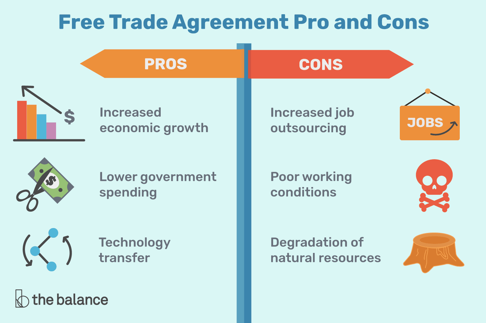

## Table of Contents

## What is international trade?

International trade is when countries buy and sell goods and services from each other. It's like a big market where countries trade things they are good at making or have a lot of, for things they need but don't have. For example, a country that grows a lot of bananas might trade them for cars from another country that makes a lot of cars.

This trading helps countries grow their economies. When a country sells more things to other countries, it can make more money. This money can be used to build schools, hospitals, and roads. It also means people can buy more things from other countries, which can make life better for them. But, sometimes, if a country depends too much on trading with others, it can be risky if something goes wrong, like if there's a big problem in the world that stops trade.

## What are the basic benefits of international trade for countries?

International trade helps countries by letting them sell what they are good at making to other countries. For example, if a country is really good at growing oranges, it can sell those oranges to countries that can't grow them. This way, the country makes money from selling oranges, which can be used to improve things like schools and hospitals at home. It also means that the country can buy things it needs but can't make itself, like cars or computers, from other countries.

Another benefit is that international trade can create jobs. When a country sells more things to other countries, companies might need to hire more people to make those things. This means more people can have jobs and earn money. Also, when people in a country can buy things from other countries, they have more choices and can often get things cheaper than if everything was made at home. This can make life better for everyone in the country.

## How does international trade affect the prices of goods and services?

International trade can make the prices of goods and services go down. When countries trade with each other, they can buy things from the country that makes them cheapest. For example, if one country can make shoes cheaper than another, the other country can buy those shoes instead of making them at home. This competition makes companies try to keep their prices low so they can sell more. When more countries are selling the same thing, it often means the price goes down because everyone wants to sell their stuff.

But sometimes, international trade can also make prices go up. If a country depends a lot on buying something from another country, and that country decides to raise its prices, then the prices can go up. For example, if a country needs oil and only buys it from one other country, and that country raises the price of oil, then the price of oil in the first country will go up too. Also, if there are extra costs like shipping or taxes when trading between countries, these can make the final price of goods and services higher.

## What are the common criticisms of international trade?

One big criticism of international trade is that it can hurt workers in some countries. When companies move their factories to countries where they can pay workers less, it can mean people in the original country lose their jobs. This can make it hard for them to find new work and can lead to problems like poverty. Also, workers in the countries where factories move might have to work in bad conditions for low pay, which is not fair to them.

Another criticism is that international trade can harm the environment. When goods are shipped around the world, it uses a lot of energy and creates pollution. Also, some countries might not have strict rules about protecting the environment, so companies might move there to avoid those rules. This can lead to more pollution and damage to nature. People worry that the benefits of trade might not be worth the harm it does to the planet.

Lastly, some people think international trade can make countries too dependent on each other. If a country relies too much on another country for important things like food or medicine, it can be risky. If something goes wrong, like a war or a natural disaster, it can be hard for the country to get what it needs. This can make people feel that their country is not safe or strong on its own.

## How does international trade impact job creation and loss?

International trade can create jobs in a country. When a country sells a lot of things to other countries, companies might need more people to make those things. This means more jobs for people in that country. For example, if a country is good at making cars and starts selling them to other countries, car factories might need to hire more workers. This can be good for the economy because more people are working and earning money.

But international trade can also lead to job loss. Sometimes companies move their factories to other countries where they can pay workers less. When this happens, people in the original country can lose their jobs. For example, if a shoe company moves its factory from one country to another where labor is cheaper, workers in the first country might find it hard to get new jobs. This can cause problems like poverty and make life harder for those people.

Overall, international trade can have both good and bad effects on jobs. It can create new jobs in some places while causing job losses in others. It's important for countries to think about how to help workers who lose their jobs because of trade, so that everyone can benefit from the opportunities that come with it.

## What role do trade agreements play in international trade?

Trade agreements are like rules that countries agree on to make it easier to buy and sell things with each other. These agreements can lower or get rid of taxes that countries put on things they buy from other countries. This makes things cheaper and can help companies sell more stuff. For example, if two countries have a trade agreement, a company in one country might find it easier and cheaper to sell its products in the other country. This can help the company grow and create more jobs.

But trade agreements can also be tricky. Sometimes, they might help some people but hurt others. For instance, if a country agrees to let in more foreign goods without taxes, local businesses might have a hard time competing. This can lead to job losses in some industries. Also, trade agreements can be complicated to make because countries have to agree on many things. But when they work well, they can help countries trade more and grow their economies.

## How do tariffs and trade barriers influence international trade?

Tariffs and trade barriers can make international trade harder. Tariffs are like taxes that a country puts on things it buys from other countries. When tariffs are high, it makes the things more expensive for people in the country buying them. This can mean they buy less of those things, which can hurt companies in other countries that want to sell their stuff. Trade barriers are rules or limits that a country sets up to control what comes in from other countries. These can make it hard for companies to sell their products in other countries, which can slow down trade and make it less fair.

But tariffs and trade barriers can also be used to protect local businesses. If a country has industries that are struggling, putting tariffs on similar goods from other countries can help. This makes the foreign goods more expensive, so people might choose to buy the local products instead. This can help keep jobs and businesses safe at home. However, it can also lead to other countries putting tariffs on the first country's goods in return, which can start a cycle of trade problems. Balancing the need to protect local businesses with the benefits of open trade is a big challenge for countries.

## What is the effect of international trade on economic growth?

International trade helps countries grow their economies. When a country sells things to other countries, it can make more money. This money can be used to build schools, hospitals, and roads, which makes life better for people. Also, when a country can buy things it needs from other countries, it doesn't have to spend as much money making everything at home. This can save money and help the economy grow faster. For example, if a country is good at making computers but not cars, it can sell computers to other countries and buy cars from them. This way, both countries can focus on what they do best and everyone benefits.

But international trade can also have some downsides for economic growth. If a country depends too much on selling things to other countries, it can be risky. If something goes wrong, like a big problem in the world that stops trade, the country's economy can suffer. Also, when companies move to other countries where they can pay workers less, it can cause people to lose their jobs at home. This can hurt the economy because fewer people are working and earning money. So, while international trade can help countries grow, it's important for them to find a balance and not rely too much on it.

## How does international trade contribute to global income inequality?

International trade can make the gap between rich and poor countries bigger. When rich countries trade with poor countries, they often have more power and can set the rules. Rich countries can sell high-tech products like computers and cars, which make a lot of money. Poor countries usually sell things like raw materials or simple goods, which don't make as much money. This means rich countries get richer while poor countries might not see as much benefit from trade. Also, when companies from rich countries move to poor countries to pay workers less, it can help the company make more money, but it doesn't always help the workers in the poor country earn enough to improve their lives.

But international trade can also help reduce income inequality if it's done fairly. When poor countries can sell their goods to rich countries, it can create jobs and help people earn more money. For example, if a poor country starts selling more clothes to rich countries, it can help people in the poor country get better jobs and earn more. Trade can also help poor countries learn new skills and technologies from rich countries, which can help them grow their economies. The key is making sure that trade rules are fair and that the benefits of trade are shared with everyone, not just the rich countries or big companies.

## What are the environmental impacts of international trade?

International trade can hurt the environment. When goods are shipped around the world, it uses a lot of energy and makes a lot of pollution. Ships, trucks, and planes that move goods burn fuel and release harmful gases into the air. Also, when companies move to countries with fewer rules about the environment, they might pollute more. For example, a factory might dump waste into rivers or release smoke into the air without worrying about being punished. This can harm nature and make it harder for people to live healthy lives.

But there are also ways international trade can help the environment. When countries trade, they can share new technologies that are better for the environment. For example, a country might start using cleaner ways to make things because it learned about them from another country. Also, trade can help countries use their resources in a smarter way. If a country is good at making solar panels, it can sell them to other countries, helping everyone use more clean energy. So, while international trade can cause environmental problems, it can also be part of the solution if countries work together to make trade more sustainable.

## How do developing countries benefit from or get challenged by international trade?

Developing countries can benefit a lot from international trade. When they sell things like coffee, cotton, or oil to other countries, they can make money. This money can be used to build schools, hospitals, and roads, which makes life better for people. Also, when developing countries can buy things they need from other countries, like medicine or technology, it can help them grow faster. Trading with other countries can also create jobs. If a developing country starts making more things to sell to other countries, it might need to hire more people, which means more people can earn money and improve their lives.

But international trade can also be challenging for developing countries. Sometimes, they have to compete with big companies from rich countries that can sell things cheaper. This can make it hard for local businesses in developing countries to survive. Also, when rich countries set the rules for trade, it might not be fair to developing countries. They might have to let in a lot of foreign goods without being able to protect their own industries. And if they depend too much on selling one thing, like oil, it can be risky. If the price of oil goes down, their economy can suffer. So, while international trade can help developing countries grow, it can also bring problems they need to handle carefully.

## What advanced strategies can countries use to maximize the benefits of international trade while mitigating its downsides?

Countries can use smart strategies to get the most out of international trade while reducing the bad parts. One way is to focus on making things they are really good at and sell those to other countries. This can help them make more money and create jobs. But they should also try to spread out what they sell so they don't depend too much on just one thing. For example, if a country sells a lot of oil, it could also start making and selling other things like food or clothes. This way, if the price of oil goes down, the country can still make money from other things. Another strategy is to learn new skills and technologies from other countries. This can help them make better products and be more competitive in the world market.

Another important strategy is to make trade rules fair for everyone. Countries should work together to set rules that help developing countries grow and don't just benefit rich countries. This means making sure that tariffs and trade barriers are used in a way that helps everyone. Countries can also use trade agreements to protect workers and the environment. For example, they can agree to follow certain rules about how workers are treated and how much pollution is allowed. This can help make sure that the benefits of trade are shared fairly and that it doesn't hurt people or the planet.

Lastly, countries need to help workers who lose their jobs because of trade. They can do this by giving them training for new jobs or helping them start their own businesses. This can make it easier for people to find new work and keep earning money. By using these strategies, countries can make the most of international trade and make sure it helps everyone, not just a few.

## What is the relationship between Comparative Advantage and Specialization?

Comparative advantage is a fundamental principle in international trade, explaining why nations leverage their resources to produce specific goods where they incur lower opportunity costs. This principle, first introduced by economist David Ricardo in the early 19th century, illustrates that trade can be mutually beneficial for all parties involved—even when one country holds an absolute advantage in the production of all goods. According to Ricardo's theory, by concentrating on their strengths or areas where they are more efficient relative to others, countries can increase overall production and consumption, leading to enhanced economic welfare.

The concept of comparative advantage is often framed through the production possibilities frontier (PPF), which represents the maximum possible output of two goods that a country can achieve with its resources. By focusing on producing the good for which they have a comparative advantage, countries can operate on a point inside the PPF that maximizes efficiency. Consider the mathematical formulation for this concept:

Assuming two countries—Portugal and England—and two goods—wine and textiles—the opportunity cost can be represented as follows:

$$
\text{Opportunity cost of wine in Portugal} = \frac{\text{Textiles foregone}}{\text{Wine produced}}
$$

$$
\text{Opportunity cost of textiles in England} = \frac{\text{Wine foregone}}{\text{Textiles produced}}
$$

Portugal has a comparative advantage in wine production if the opportunity cost of producing wine is lower in Portugal than in England. Conversely, England has a comparative advantage in textile production if the opportunity cost of producing textiles is lower in England than in Portugal.

Specialization, driven by comparative advantage, enables countries like Portugal and England to focus on producing wine and textiles, respectively. For instance, Portugal may excel in wine due to its favorable climate and soil, while England's advanced textile machinery and expertise might predispose it to specialize in textiles. This specialization ensures more efficient production, as resources are allocated optimally, aligning with each country's competitive edge.

Historical trade patterns corroborate these theoretical insights. During the 19th century, Portugal's wine industry flourished as it traded with England, which supplied textiles. This exchange not only facilitated economies of scale but also stimulated growth by enabling both nations to consume beyond their own PPFs. By focusing on their respective areas of comparative advantage, both countries enhanced their economic welfare and experienced a net gain from trade.

Furthermore, comparative advantage and specialization are not static. Technological advancements, shifts in consumer preferences, and changes in resource availability can alter a country's comparative advantage over time. Thus, continuous evaluation and adaptation are essential for countries to maintain an efficient and beneficial trade strategy on the global stage.

## References & Further Reading

[1]: Ricardo, D. (1817). "On the Principles of Political Economy and Taxation." This book introduces the theory of comparative advantage in trade.

[2]: Lopez de Prado, M. (2018). ["Advances in Financial Machine Learning."](https://www.amazon.com/Advances-Financial-Machine-Learning-Marcos/dp/1119482089) Wiley. This book explores the application of machine learning techniques in finance and trading.

[3]: Chan, E. P. (2009). ["Quantitative Trading: How to Build Your Own Algorithmic Trading Business."](https://github.com/ftvision/quant_trading_echan_book) Wiley. This book provides insights into developing algorithmic trading strategies.

[4]: Aronson, D. R. (2006). ["Evidence-Based Technical Analysis: Applying the Scientific Method and Statistical Inference to Trading Signals."](https://www.amazon.com/Evidence-Based-Technical-Analysis-Scientific-Statistical/dp/0470008741) Wiley. This book advocates for a scientific approach to technical analysis in trading.

[5]: Jansen, S. (2020). ["Machine Learning for Algorithmic Trading."](https://github.com/stefan-jansen/machine-learning-for-trading) Packt Publishing. This book covers utilizing machine learning in building trading systems.

[6]: Bergstra, J., Bardenet, R., Bengio, Y., & Kégl, B. (2011). ["Algorithms for Hyper-Parameter Optimization."](https://dl.acm.org/doi/10.5555/2986459.2986743) Advances in Neural Information Processing Systems 24. This paper discusses optimizing algorithms, which is applicable in algorithmic trading strategies.