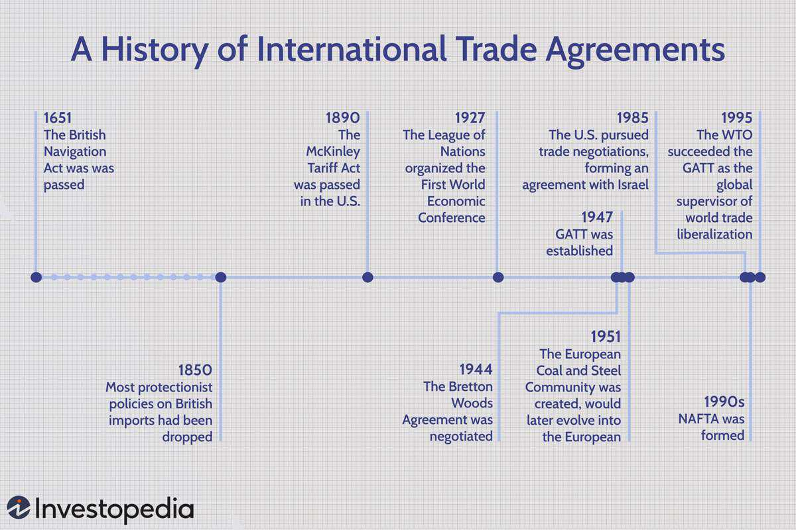

International trade policies are pivotal in shaping the global economy, acting as the set of rules and standards that govern trade activities across national borders. These policies dictate how countries interact economically, affecting everything from the flow of goods and services to the stability of currencies. At the core, international trade involves a complex system of commercial policies, trade agreements, and regulatory frameworks, each contributing to the bustling ecosystem of global commerce.

Commercial policies, serving as a subset of trade policies, include measures like tariffs, import quotas, and subsidies, all aimed at regulating trade and protecting domestic industries. These policies can either open up economies to international competition or shield them by imposing restrictions on imports and exports. Historically, governments have wielded trade policies as instruments to achieve broader economic objectives, such as generating revenue and bolstering local industries.

Integral to these policies are trade rules—specific laws and guidelines that formalize international economic interactions. Key elements such as tariffs, which are taxes levied on imports, and quotas, which set limits on the quantity of traded goods, are fundamental tools. These rules create both opportunities and challenges, necessitating businesses to strategically navigate to optimize their presence in international markets.

International trade agreements, like the North American Free Trade Agreement (NAFTA) and the EU-Korea Free Trade Agreement, play a vital role by reducing trade barriers and increasing market accessibility. They foster economic cooperation and competition, contributing to global economic integration. However, these agreements can also spark debates over perceived economic imbalances and their impact on domestic economies.

In recent years, the rise of algorithmic trading has further transformed how international trade operates. This technology leverages computer algorithms to automate decisions in financial markets, increasing market efficiency and liquidity. Yet, it also introduces challenges, such as heightened market volatility and regulatory hurdles, which are under scrutiny by policymakers worldwide.

In conclusion, understanding the structure and impact of international trade policies is essential for businesses and policymakers aiming to thrive in the global marketplace. As globalization and technological advances continue to alter the landscape of international trade, staying informed about these dynamics will be crucial in crafting policies that support sustainable economic growth and fair trade practices.

## Table of Contents

## Understanding Commercial Policy

Commercial policy, more commonly referred to as trade policy, governs the exchange of goods and services across international borders. Its primary aim is to shape the economic interactions between countries through regulations that focus on tariffs, import quotas, and subsidies. Each of these elements serves distinct purposes while collectively influencing the balance of trade, domestic market stabilization, and overall economic growth.

Tariffs represent taxes or duties imposed on imported goods, serving as a primary tool for governments to generate revenue. By levying these charges, governments can effectively increase the cost of foreign goods, making them less competitive compared to locally produced items. For example, if a nation imposes a tariff on imported steel, domestic steel manufacturers are better positioned to compete on price within the local market. Historically, tariffs have been an essential revenue stream for governments before the widespread adoption of income and sales taxes.

Import quotas, on the other hand, set a physical limit on the quantity of certain goods that can be imported into a country over a specified period. Quotas are designed to protect domestic industries by preventing market saturation from foreign products, which could otherwise devastate local producers who are unable to compete with often cheaper imports. For instance, a country might impose import quotas on agricultural products to ensure that its domestic farmers maintain a market for their produce.

Subsidies form another critical aspect of commercial policy, aiming to support domestic businesses against foreign competition. These governmental financial incentives help local industries reduce production costs, allowing them to offer products at competitive prices both domestically and internationally. Subsidies are particularly common in sectors deemed vital for national interests, such as agriculture, energy, and technology.

Historically, trade policy has been employed by governments to achieve several objectives. Revenue generation through tariffs was particularly significant before the establishment of modern taxation systems. Additionally, protecting domestic industries has been a consistent goal, aimed at preserving jobs and fostering the growth of strategic sectors within the national economy. Through thoughtful implementation of commercial policy, governments have sought to balance the benefits of international trade with the necessity of safeguarding domestic economic stability.

## Key Elements of Trade Rules

Trade rules serve as essential frameworks for economic interactions among nations, dictating how countries conduct trade and establishing the terms of engagement. These rules are primarily composed of instruments such as tariffs and quotas that have substantial implications for international commerce.

Tariffs constitute a significant component of trade rules. They are taxes imposed on imported goods and are employed by governments to generate revenue or protect domestic industries from foreign competition. The imposition of tariffs can influence the price of imported goods, effectively altering demand. For example, a higher tariff increases the cost of imports, making them less competitive compared to locally produced goods. As a result, tariffs can serve as a protective measure for domestic industries but may also lead to trade disputes and potential retaliation from trading partners.

Quotas, another vital element of trade rules, impose limits on the quantity of goods that can be imported into a country during a specified timeframe. Quotas are designed to safeguard domestic producers by restricting the influx of foreign goods, thus maintaining market balance. Unlike tariffs, which allow imports at a higher cost, quotas create a direct cap on import volumes, potentially leading to shortages of certain goods and increased prices.

Understanding these trade rules is crucial for businesses seeking to capitalize on international market opportunities while mitigating associated risks. Companies must navigate these regulations to effectively manage costs and maintain competitiveness in global markets. For instance, businesses can strategically plan their supply chains to minimize tariff expenses and optimize import quotas. Additionally, awareness of trade rules enables firms to anticipate changes in the regulatory environment, allowing them to adapt swiftly and maintain a foothold in diverse markets.

In summary, tariffs and quotas are fundamental instruments within trade rules that shape the economic relationships between countries. Their implications extend beyond mere regulatory measures, influencing global supply chains and market dynamics. Businesses that comprehend these elements can effectively navigate international trade landscapes, optimizing operations and securing advantages in competitive markets.

## The Role of International Trade Agreements

International trade agreements are pivotal mechanisms that facilitate cross-border commerce by lowering trade barriers and enhancing market access. These agreements aim to create a more predictable and stable trading environment, thus fostering economic growth and international cooperation.

One significant example is the North American Free Trade Agreement (NAFTA), which was a trilateral trade bloc in North America among the United States, Canada, and Mexico. Implemented on January 1, 1994, NAFTA aimed to eliminate trade barriers between the three countries, increase investment opportunities, and promote fair competition. As a result, NAFTA significantly increased trade between its members by creating one of the world's largest free trade zones. However, it also faced criticism and was perceived as having uneven benefits, leading to the creation of the United States-Mexico-Canada Agreement (USMCA) in 2020 as a modernization effort.

Similarly, the EU-Korea Free Trade Agreement is a comprehensive trade pact between the European Union and South Korea. Ratified in 2011, this agreement was the first of its kind between the EU and an Asian country. It aims to remove barriers to trade in goods and services, thereby enhancing the flow of investments and fostering stronger economic ties. The agreement has been advantageous for both parties, facilitating a significant increase in bilateral trade and improving the competitive position of EU firms in the Korean market. Nevertheless, the agreement also faced criticisms regarding its impact on certain industries and the regulatory challenges it presents.

These agreements, while generally beneficial, can also be sources of contention due to perceived imbalances and the differential impacts on participating countries' economies. Critics often argue that such agreements can lead to job losses in sectors unable to compete with foreign imports, thus necessitating measures to mitigate adverse effects on affected industries and communities.

International trade agreements are essential tools for promoting economic cooperation and competition globally. While they have their challenges, the potential benefits in terms of economic growth and development are significant. By navigating the complexities associated with these agreements, countries can enhance their participation in the global economy and foster mutually beneficial relationships.

## Impact of Algorithmic Trading in Global Markets

Algorithmic trading refers to the use of computer algorithms to automate the execution of trades in financial markets, a method that has significantly transformed global trading practices. The core advantage of [algorithmic trading](/wiki/algorithmic-trading) lies in its ability to process large volumes of data at high speeds, thereby improving market efficiency and [liquidity](/wiki/liquidity-risk-premium). These algorithms can react to market conditions more swiftly than human traders, which allows for quicker execution of trades, reduction in errors, and minimization of trading costs.

The efficiency brought by algorithmic trading is particularly notable in terms of market liquidity. By automating trades, these systems ensure that both buying and selling orders are processed swiftly, contributing to more stabilized and accessible market conditions for other traders. This kind of liquidity ensures that assets can be bought and sold with minimal impact on their price, which is particularly advantageous in volatile markets or when dealing with large volumes of trade.

Nonetheless, algorithmic trading is not without its challenges. One of the primary issues is market [volatility](/wiki/volatility-trading-strategies). High-frequency trading, a subset of algorithmic trading, can exacerbate market fluctuations because of the sheer speed and [volume](/wiki/volume-trading-strategy) of trades. These rapid trades can lead to abrupt price changes, potentially causing significant market disruptions. An example of this was the "Flash Crash" of May 6, 2010, when the Dow Jones Industrial Average dropped by about 1,000 points within minutes, highlighting the potential risks associated with algorithmic trading.

Regulatory concerns also emerge as a principal challenge. Financial markets globally face difficulties in crafting appropriate regulatory frameworks to oversee algorithmic trading activities. Regulators must balance fostering innovation and ensuring technological advancement with protecting market integrity and reducing systemic risk. This includes monitoring algorithmic strategies that could manipulate markets or contribute to unfair trading advantages.

Addressing these challenges requires ongoing collaboration between financial institutions, technology developers, and regulatory bodies to ensure that the benefits of algorithmic trading are maximized while minimizing its risks. As technology continues to evolve, so too must the strategies and regulations that govern algorithmic trading to foster a stable and equitable trading environment.

## Challenges and Opportunities in Commercial Policy

Globalization and technological advancements have significantly impacted commercial policy, introducing both opportunities and challenges. As economies become increasingly interconnected, countries strive to strike a balance between protecting domestic industries and embracing the benefits of free trade. This balancing act requires careful consideration and strategic policy-making to ensure economic growth and fair trade practices.

One of the key challenges is the protection of domestic industries. Countries often implement measures such as tariffs, quotas, and subsidies to shield local businesses from international competition. While these measures can secure jobs and stabilize certain sectors, they might also provoke retaliation, leading to trade wars that could harm the global economy. For instance, the imposition of high tariffs on imported goods can result in similar actions from trade partners, thereby disrupting international trade relations.

Conversely, globalization offers significant opportunities by providing access to larger markets. Businesses can expand their operations across borders, leveraging comparative advantages and optimizing supply chains. This can lead to increased efficiency, innovations, and access to a more diversified range of goods and services for consumers. The challenge for policymakers is to facilitate this expansion while ensuring that the benefits are evenly distributed across society.

Technological advancements, particularly in digitalization, offer another set of opportunities and challenges for commercial policy. The rise of e-commerce and digital services has created new avenues for trade, enabling businesses to reach global consumers more efficiently than ever before. However, this rapid technological evolution necessitates updates to existing trade rules and regulations. Issues such as data privacy, cybersecurity, and the digital divide are increasingly relevant, requiring effective governance to prevent potential abuses and ensure equitable access.

Policymakers must also address the environmental impacts of globalization and technological advancement. As global trade increases, so does the carbon footprint associated with production and transportation of goods. This has led to calls for more sustainable trade practices, such as incorporating environmental standards in trade agreements and developing green technologies.

In adapting commercial policies to address these challenges and leverage opportunities, countries need to foster collaboration at a global level. Forums such as the World Trade Organization (WTO) and international trade agreements can play pivotal roles in harmonizing policies, resolving disputes, and promoting fair trade practices. By engaging in cooperative efforts, countries can better navigate the complexities of modern trade dynamics.

As international trade continues to evolve, policymakers must remain agile, crafting policies that not only adapt to the changing economic landscape but also enhance global cooperation. Balancing protection with openness, while leveraging technological advancements, can lead to a more prosperous and equitable global economy.

## Conclusion

Navigating the complexities of commercial policy and international trade necessitates a comprehensive understanding of the existing trade rules and the effects of technological innovations such as algorithmic trading. Trade policies function as the framework that shapes the interactions between countries, influencing economic stability and growth. As the global economy becomes increasingly interconnected, the intricate nature of trade rules requires businesses and policymakers to stay informed and adaptive.

Staying informed about these dynamics allows stakeholders to make strategic decisions that facilitate effective engagement in the global marketplace. This involves recognizing opportunities arising from reduced trade barriers and leveraging technological advances while mitigating associated risks such as market volatility or potential regulatory issues.

The evolution of international trade demands that policies continuously adapt to new realities. As trading landscapes shift, influenced by factors ranging from technological advancements to geopolitical changes, there must be a corresponding evolution in trade policies. This adaptation ensures that trade remains fair, equitable, and conducive to economic development.

Ultimately, as globalization and technology continually reshape trade dynamics, the policies governing international commerce must progress to align with these changes, fostering a balanced and prosperous trading environment worldwide.

## References & Further Reading

[1]: Bhagwati, J. (1988). ["Protectionism."](https://archive.org/details/protectionism0000bhag) MIT Press.

[2]: Krugman, P., & Obstfeld, M. (2008). ["International Economics: Theory and Policy."](https://books.google.com/books/about/International_Economics.html?id=NZnk5C2r8qEC) Pearson Education.

[3]: World Trade Organization. ["Understanding the WTO."](https://www.wto-ilibrary.org/content/books/9789287044662c001)

[4]: Lopez de Prado, M. (2018). ["Advances in Financial Machine Learning."](https://www.amazon.com/Advances-Financial-Machine-Learning-Marcos/dp/1119482089) Wiley.

[5]: Malkiel, B. G. (2015). ["A Random Walk Down Wall Street."](https://www.amazon.com/Random-Walk-Down-Wall-Street/dp/0393358380) W.W. Norton & Company.

[6]: Alden, E., & Taylor, T. (2017). ["Trade Agreements and Economic Sovereignty."](https://www.semanticscholar.org/paper/Immigration-and-Border-Control-Alden/027a5093b65bdd1052d3b1de05df773465c02783) Council on Foreign Relations.

[7]: Melitz, M. J., & Trefler, D. (2012). ["Gains from Trade When Firms Matter."](https://www.aeaweb.org/articles?id=10.1257/jep.26.2.91) Journal of Economic Perspectives, 26(2), 91-118.

[8]: Scholtes, S. (2010). ["Flash Crash Report](https://www.cftc.gov/sites/default/files/idc/groups/public/@economicanalysis/documents/file/oce_flashcrash0314.pdf)" Financial Times. 

[9]: Sussman, N., & Zeira, J. (1995). ["Commodity and Consumer Prices in OECD Countries."](https://www.semanticscholar.org/paper/Banking-and-Development-Sussman-Zeira/3d7c1823b6ea1348a0ab77c8bd4435080a359307) Review of Economic Studies, 62(3), 533-542.

[10]: Eyal, I., & Sirer, E. G. (2014). ["Majority Is Not Enough: Bitcoin Mining Is Vulnerable"](https://dl.acm.org/doi/10.1145/3212998) Communications of the ACM.