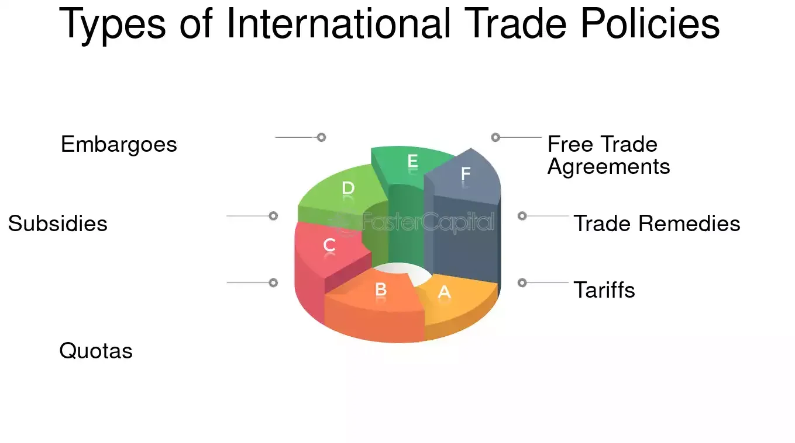

## Table of Contents

## What is international trade and why is it important?

International trade is when countries buy and sell goods and services with each other. It's like a big global market where countries can get things they can't make themselves or can get them cheaper from other places. For example, a country might buy oil from another country if it doesn't have its own oil, or it might buy clothes from a country where they can make them for less money.

International trade is important because it helps countries grow their economies. When a country sells things to other countries, it earns money that can be used to improve the lives of its people, like building schools or hospitals. It also means that people can buy more different kinds of things, which makes life better. Plus, when countries trade with each other, they often work together more and have better relationships, which can help keep peace in the world.

## What are the basic principles of international trade rules?

International trade rules are based on a few key ideas that help countries trade fairly and smoothly. One main principle is non-discrimination, which means countries should treat all trading partners the same. This is broken down into two parts: the most-favored-nation (MFN) rule, where if a country gives a trade advantage to one country, it has to give the same advantage to all other countries, and the national treatment rule, where imported goods should be treated no less favorably than locally-made goods once they are in the country.

Another important principle is transparency, which means countries should be open about their trade policies and rules. This helps other countries know what to expect when they trade. There's also the idea of fairness, where countries shouldn't use trade to hurt others, like by dumping goods at very low prices to drive competitors out of business. Lastly, international trade rules encourage countries to talk and work out their differences through negotiations, rather than fighting or putting up trade barriers.

These principles are often set by big organizations like the World Trade Organization (WTO), which helps countries follow the rules and settle disagreements. The goal is to make sure trade is as fair and beneficial as possible for everyone involved, helping economies grow and people live better lives.

## How do trade agreements affect commercial policy?

Trade agreements are deals between countries that set rules for how they will trade with each other. These agreements can change a country's commercial policy, which is the set of rules and actions a country uses to manage its trade. When countries sign a trade agreement, they often agree to lower tariffs, which are taxes on imports, and to remove other barriers to trade. This can make it easier for businesses in those countries to sell their goods and services abroad, and it can also mean more competition from foreign companies at home.

These changes in commercial policy can have big effects on a country's economy. For example, lowering tariffs might make imported goods cheaper, which can be good for consumers but might hurt local businesses that can't compete with the lower prices. Trade agreements can also include rules about things like labor standards, environmental protection, and intellectual property rights, which can shape how businesses operate. Overall, trade agreements can help countries grow their economies by making trade easier, but they also require countries to adjust their commercial policies to meet the terms of the agreement.

## What is the role of the World Trade Organization (WTO) in regulating international trade?

The World Trade Organization, or WTO, is like a big club where countries come together to make rules about how they trade with each other. Its main job is to make sure that trade between countries is fair and follows the rules that everyone agrees on. The WTO helps countries talk to each other and solve problems if they disagree about trade. It also keeps an eye on the trade policies of its members to make sure they're playing by the rules.

One important thing the WTO does is help countries make trade agreements. These agreements can lower taxes on goods and make it easier for businesses to sell things in other countries. The WTO also has a system where countries can bring their trade problems to be solved. If countries can't agree, the WTO can act like a judge and decide who is right. This helps keep trade peaceful and fair, and it makes sure that all countries, big and small, have a say in how global trade works.

## What are tariffs and how do they impact international trade?

Tariffs are like taxes that a country puts on things that come from other countries. When a country wants to sell something to another country, the other country might say, "You have to pay this extra money if you want to sell it here." This extra money is the tariff. Countries use tariffs to make their own products look cheaper compared to things from other places. For example, if a country puts a high tariff on imported cars, then cars made in that country might seem like a better deal to people buying them.

Tariffs can make international trade harder. When tariffs are high, it can be too expensive for companies to sell their things in other countries. This can lead to less trading between countries. On the other hand, tariffs can also help protect jobs and businesses in the country that sets them. If a country makes it more expensive to buy things from other places, people might buy more things made at home. But, if every country starts doing this, it can lead to trade wars where countries keep putting up more and more tariffs, making it tough for everyone.

## How do non-tariff barriers affect international commerce?

Non-tariff barriers are rules and restrictions that countries use to control the flow of goods and services, but they are not taxes like tariffs. These barriers can include things like quotas, which limit how much of a product can come into a country, and strict rules about safety, health, or the environment that imported goods have to meet. They can also include things like complicated paperwork or long waits at customs, which make it harder and more expensive for companies to sell their products in other countries.

These non-tariff barriers can really slow down international trade. They make it tougher for businesses to get their goods into new markets because they have to deal with a lot of extra rules and costs. This can lead to fewer goods being traded between countries and can make products more expensive for people to buy. On the other hand, these barriers can help protect local businesses and jobs by making it harder for foreign companies to compete. But, just like with tariffs, if too many countries start using these barriers, it can lead to less trade overall and hurt the global economy.

## What is the difference between free trade and protectionism?

Free trade is when countries let goods and services move between them without many restrictions. It's like opening all the doors so businesses can sell their things easily in other countries. Free trade can help countries grow their economies because it means more competition, which can lead to lower prices and more choices for people. It also encourages countries to work together and can lead to better relationships between them.

Protectionism is the opposite. It's when a country puts up barriers to stop or limit things coming in from other places. These barriers can be tariffs, which are taxes on imports, or other rules like quotas and strict standards. The idea behind protectionism is to protect local businesses and jobs by making it harder for foreign companies to compete. But, too much protectionism can lead to less trade overall, which can hurt the global economy and make things more expensive for people.

## How do countries negotiate trade deals and what are the key considerations?

Countries negotiate trade deals by sitting down and talking about what they want from each other. They usually start by figuring out what they can offer and what they need. For example, one country might want to sell more cars to another country, while the other country might want to sell more fruits. They talk back and forth, trying to find a deal that makes both sides happy. Sometimes, they use big meetings or special groups to help them talk things out. If they can agree, they write down the deal in a trade agreement, which is like a promise that they will follow the rules they set.

When countries are negotiating trade deals, they think about a lot of things. One big thing is how the deal will help their economy grow. They want to make sure that their businesses can sell more things and that people can buy things cheaper. They also think about how the deal will affect jobs at home. If a deal might hurt local businesses, they might want to protect them with tariffs or other rules. Another thing they consider is how the deal will change their relationship with the other country. A good trade deal can make countries friends and help them work together better. But, they also have to think about how the deal fits with other trade agreements they already have, so it doesn't cause problems.

## What are the implications of trade sanctions on international trade?

Trade sanctions are when one country or a group of countries stops trading with another country to punish it or make it change its behavior. When this happens, it can make international trade harder. The country that gets the sanctions might have a hard time selling its things to other places, which can hurt its economy. It might also have trouble getting things it needs from other countries, which can make life harder for people living there. Other countries might also be affected because they can't trade with the sanctioned country anymore, which can mess up their own trade plans.

On the other hand, trade sanctions can also make countries think twice before doing something wrong. If a country knows it might get cut off from trade, it might decide not to do something bad. But, sanctions can also make countries angry and lead to more problems. Sometimes, instead of making a country change, sanctions just make it find new ways to get what it needs, like trading with other countries that don't care about the sanctions. So, while trade sanctions can be a strong tool, they can also make international trade more complicated and tense.

## How do regional trade agreements differ from multilateral agreements?

Regional trade agreements are deals between a few countries that are close to each other or have a special relationship. These agreements help these countries trade more easily with each other by lowering tariffs and other barriers. For example, the European Union is a big regional trade agreement where countries in Europe trade with each other more easily. Regional agreements can be easier to make because there are fewer countries to talk to, and they can focus on the needs of the countries involved.

Multilateral agreements, on the other hand, are deals that involve many countries from all over the world. These agreements are made through big organizations like the World Trade Organization (WTO). They aim to make trade fair and easy for everyone, not just a few countries. Multilateral agreements can be harder to make because there are so many countries with different needs and wants. But, when they work, they can help the whole world trade more and grow their economies together.

## What advanced strategies can businesses use to navigate complex trade regulations?

Businesses can use a few smart strategies to deal with tricky trade rules. One good way is to hire experts who know a lot about trade laws. These experts can help businesses understand the rules in different countries and make sure they follow them. They can also help businesses find ways to save money, like using special trade deals or figuring out the best places to make and sell their products. Another strategy is to use technology to keep track of all the rules and changes. There are special computer programs that can help businesses stay up to date and make sure they're doing everything right.

Another important strategy is to build good relationships with people in the countries they want to trade with. This can mean working with local businesses or talking to government officials to learn about new rules or changes. By understanding the culture and politics of these countries, businesses can find ways to make trade easier. They can also join groups or clubs with other businesses to share information and work together to solve problems. By using these strategies, businesses can handle complex trade rules better and keep their trade going strong.

## How do emerging technologies and digital trade influence future commercial policies?

Emerging technologies and digital trade are changing the way countries think about their commercial policies. As more businesses use the internet to sell things and new technologies like [artificial intelligence](/wiki/ai-artificial-intelligence) and blockchain make trade easier, countries need to update their rules. They have to figure out how to protect their businesses and people while also making it easy for new technology to grow. This means they might need to make new rules about things like data privacy, cybersecurity, and how to tax digital goods. Countries also need to work together to make sure their rules don't stop trade from happening.

These changes can make trade more complicated, but they also bring a lot of new chances. For example, digital trade can help small businesses sell their things all over the world without needing a big store. It can also make it easier for people to buy things from other countries. But, countries need to be careful to make sure everyone plays fair. They might need to make new agreements to stop big companies from using technology to hurt smaller ones. By working together and making smart rules, countries can help their economies grow and make sure everyone benefits from new technology and digital trade.

## References & Further Reading

[1]: Bhagwati, J. (1988). ["Protectionism."](https://archive.org/details/protectionism0000bhag) MIT Press.

[2]: Krugman, P., & Obstfeld, M. (2008). ["International Economics: Theory and Policy."](https://books.google.com/books/about/International_Economics.html?id=NZnk5C2r8qEC) Pearson Education.

[3]: World Trade Organization. ["Understanding the WTO."](https://www.wto-ilibrary.org/content/books/9789287044662c001)

[4]: Lopez de Prado, M. (2018). ["Advances in Financial Machine Learning."](https://www.amazon.com/Advances-Financial-Machine-Learning-Marcos/dp/1119482089) Wiley.

[5]: Malkiel, B. G. (2015). ["A Random Walk Down Wall Street."](https://www.amazon.com/Random-Walk-Down-Wall-Street/dp/0393358380) W.W. Norton & Company.

[6]: Alden, E., & Taylor, T. (2017). ["Trade Agreements and Economic Sovereignty."](https://www.semanticscholar.org/paper/Immigration-and-Border-Control-Alden/027a5093b65bdd1052d3b1de05df773465c02783) Council on Foreign Relations.

[7]: Melitz, M. J., & Trefler, D. (2012). ["Gains from Trade When Firms Matter."](https://www.aeaweb.org/articles?id=10.1257/jep.26.2.91) Journal of Economic Perspectives, 26(2), 91-118.

[8]: Scholtes, S. (2010). ["Flash Crash Report](https://www.cftc.gov/sites/default/files/idc/groups/public/@economicanalysis/documents/file/oce_flashcrash0314.pdf)" Financial Times. 

[9]: Sussman, N., & Zeira, J. (1995). ["Commodity and Consumer Prices in OECD Countries."](https://www.semanticscholar.org/paper/Banking-and-Development-Sussman-Zeira/3d7c1823b6ea1348a0ab77c8bd4435080a359307) Review of Economic Studies, 62(3), 533-542.

[10]: Eyal, I., & Sirer, E. G. (2014). ["Majority Is Not Enough: Bitcoin Mining Is Vulnerable"](https://dl.acm.org/doi/10.1145/3212998) Communications of the ACM.