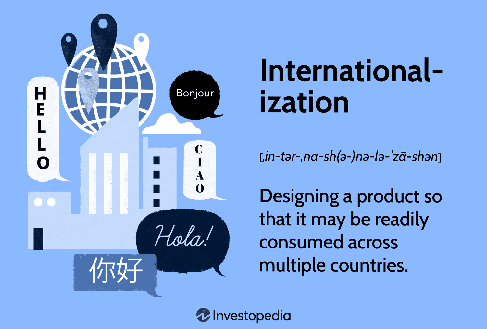

The global economy is increasingly interconnected, with currency internationalization and algorithmic trading playing crucial roles in shaping modern financial markets. Currency internationalization involves the widespread use of a country's currency beyond its borders, significantly influencing global trade and economic stability. This process transforms a domestic currency into a preferred choice for international transactions, reserves, and investment, thus enhancing its global economic influence and stability. Examples of prominent international currencies include the U.S. Dollar (USD), Euro (EUR), and Japanese Yen (JPY), which are widely used for international trade settlements and held as reserve currencies by central banks worldwide.

Algorithmic trading, on the other hand, employs advanced technological tools and strategies to execute trades with high efficiency and speed. It leverages algorithms and mathematical models to process vast amounts of data and identify trading opportunities more swiftly than human traders. This approach enables market participants to react rapidly to changes in market conditions, thus enhancing market liquidity and efficiency. Algorithmic trading can minimize transaction costs, eliminate human biases, and capitalize on currency fluctuations with precision. It has become a cornerstone in global currency markets, revolutionizing trading dynamics and facilitating more streamlined operations.



This article explores the economic benefits of currency internationalization, alongside the transformative impact of algorithmic trading on global currency markets. By understanding these components, stakeholders can better appreciate their roles in shaping a stable and efficient financial ecosystem.

## Table of Contents

## Understanding Currency Internationalization

Currency internationalization is the process through which a currency extends its usage beyond the borders of its issuing country, gaining acceptance and utilization on a global scale. This phenomenon plays a crucial role in facilitating international trade, investment, and economic integration. Essentially, the more a currency is accepted globally, the more it serves as a bridge facilitating international economic activities.

The most significant and widely recognized international currencies today include the United States Dollar (USD), Euro (EUR), and Japanese Yen (JPY). These currencies have established themselves as dominant players in the global financial system due to their widespread adoption and trust. Among these, the USD holds a prominent place as the world's primary reserve currency. The reserve currency status implies that central banks around the world hold significant quantities of the currency in their foreign exchange reserves. This is not solely due to the economic might of the United States but also its deep financial markets, political stability, and the historical trust that has been established in its currency.

In addition to being used as reserve currencies, well-internationalized currencies often function as safe-haven currencies. A safe-haven currency is one that investors flock to during times of geopolitical or economic uncertainty, seeking stability and preserving capital. The Swiss Franc (CHF), for example, often serves this role alongside the USD due to Switzerland's political neutrality and robust financial stability.

Furthermore, internationalized currencies play a major role in settling international trade transactions. The widespread use of a currency for trade can reduce the transaction costs associated with exchanging currencies, thereby making international business more efficient. When businesses from different countries prefer the same currency for transactions, it negates the need for currency conversion and the associated risks.

The international demand for a currency solidifies its stability and extends its influence in global markets. Currencies that are widely accepted provide countries with significant economic advantages. The issuing country of a widely adopted currency benefits from what is known as 'seigniorage'—the capacity to borrow at lower interest rates since its debt instruments are in higher demand globally. Moreover, the global stock of the currency in circulation acts as a de facto interest-free loan to the issuing country.

For policymakers, understanding the dynamics of currency internationalization is vital, as it has far-reaching implications for economic policy and international relations. The broader acceptance and use of a currency on the global stage not only reflect trust in the economic and political systems of the issuing country but also contribute to the country's global influence and leverage in international affairs.

In conclusion, currency internationalization is an intricate process rooted in economic performance, financial stability, and international trust. The benefits of having a well-internationalized currency are multifaceted, encompassing reduced transaction costs, enhanced stability, and greater economic influence on the world stage.

## Benefits of Currency Internationalization

Currency internationalization provides significant economic benefits, primarily by reducing exchange rate risks in global trade. When businesses conduct transactions in a widely accepted currency, they mitigate the uncertainties associated with currency fluctuations. This stability facilitates economic expansion as companies are more likely to engage in international trade without the fear of losing value due to unfavorable exchange rate movements.

One of the direct benefits of using an internationalized currency is the reduction in transaction costs for trade and investment. When a currency is widely accepted across borders, companies can bypass the costs associated with currency conversion. This cost-efficiency makes the transaction process smoother, encouraging more frequent trade and investment activities.

Additionally, the demand for a stable international currency plays a crucial role in influencing domestic monetary policies, including interest rates. A well-internationalized currency is typically associated with a lower domestic [interest rate](/wiki/interest-rate-trading-strategies) environment. This is because the international demand supports a stable currency value, allowing central banks to maintain lower interest rates without fear of inflation or depreciation. Consequently, the cost of capital is reduced, providing businesses with cheaper access to financing and stimulating further economic growth.

Moreover, a robust international currency enhances the global economic influence of the issuing country. It allows the country to exercise greater economic power in international forums and negotiations. As the currency is held as reserves by foreign governments and used in trade settlement, the issuing country can exert diplomatic influence, leveraging its currency’s stability and international acceptance. This geopolitical advantage extends the country's reach in shaping global economic policies.

The strategic advantage of having an international currency is observed in its use as a reserve currency and a preferred medium for international debts and settlements. This status not only fortifies the issuing country's financial markets but also amplifies its influence on the global economic stage, allowing the country to participate more actively in setting international financial standards and regulations.

## The Rise of Global Currency Algorithmic Trading

Algorithmic trading has revolutionized the global currency markets by leveraging computer algorithms to execute and manage trades with remarkable speed and precision. This transformation is primarily driven by the capabilities of these algorithms to process vast amounts of data and identify trading opportunities in real-time. As a consequence, algorithmic traders can make rapid decisions that capitalize on slight changes in exchange rates.

One of the major advantages of [algorithmic trading](/wiki/algorithmic-trading) in global currency markets is its ability to enhance market [liquidity](/wiki/liquidity-risk-premium) and efficiency. By automatically executing trades based on pre-set criteria, algorithmic systems ensure that large volumes of trades can be processed within a fraction of a second, thereby maintaining a fluid marketplace with lower bid-ask spreads. This increased liquidity makes markets more attractive to participants, as it reduces the cost and difficulty of entering or exiting positions.

The rise of [machine learning](/wiki/machine-learning) and [artificial intelligence](/wiki/ai-artificial-intelligence) has further augmented the effectiveness of algorithmic trading. These technologies enable the development of sophisticated trading strategies that can learn from historical data and adapt to new patterns and information. Machine learning algorithms, in particular, can be employed to fine-tune predictive models that assess future currency movements, while artificial intelligence can automate decision-making processes by predicting market sentiment and other influential factors.

Python, a popular programming language for algorithmic trading, provides a robust ecosystem for implementing trading strategies. With libraries such as Pandas for data manipulation, NumPy for numerical analysis, and scikit-learn for machine learning, traders can develop, test, and deploy algorithms efficiently. For instance, a simple moving average crossover strategy—a common algorithmic approach—could be implemented using Python as follows:

```python
import pandas as pd

# Fetch historical currency data
data = pd.read_csv('currency_data.csv')
data['SMA_20'] = data['Close'].rolling(window=20).mean()
data['SMA_50'] = data['Close'].rolling(window=50).mean()

# Generate trading signals
data['Signal'] = 0
data['Signal'][20:] = np.where(data['SMA_20'][20:] > data['SMA_50'][20:], 1, -1)

# Calculate returns
data['Returns'] = data['Signal'].shift(1) * (data['Close'].pct_change())
cumulative_return = (1 + data['Returns']).cumprod()[-1]
```

In this code, a trader could calculate the 20-day and 50-day simple moving averages and generate trading signals based on crossovers. Such strategies, when executed algorithmically, remove human emotional biases from trading decisions, which can lead to more stable market conditions over time.

In summary, the integration of algorithmic trading in global currency markets continues to enhance trading precision, liquidity, and the ability to process and react to new market information swiftly. As technological advancements progress, the role of algorithmic and AI-driven systems in currency markets is expected to grow, offering refined and increasingly adaptive trading strategies.

## Economic Impact of Algorithmic Trading on Forex Markets

Algorithmic trading has significantly altered the landscape of [forex](/wiki/forex-system) markets, allowing traders to exploit currency fluctuations with heightened precision and speed. This transformation is largely attributed to the ability of algorithms to execute trades based on predetermined criteria, minimizing the latency associated with human intervention. By incorporating large datasets and complex calculations, algorithms can efficiently analyze market conditions, thus facilitating trades that capitalize on minute variations in exchange rates.

One notable impact of algorithmic trading in forex markets is the reduction of human emotional biases. Traders are often influenced by emotional factors such as fear and greed, which can lead to irrational decision-making. Algorithms, in contrast, adhere strictly to their programmed strategies, mitigating the influence of human emotions. This objectivity can result in more stable market conditions, as trades are executed based on logical analysis rather than emotional impulse.

Algorithmic trading also enhances market efficiency by increasing transaction speed and accuracy. High-frequency trading ([HFT](/wiki/high-frequency-trading-strategies)), a form of algorithmic trading, exemplifies this efficiency by executing a large number of trades in fractions of a second. This rapid execution contributes to market liquidity, as there is a constant presence of buy and sell orders. Enhanced liquidity reduces the bid-ask spread, making the market more attractive to investors and providing opportunities for [arbitrage](/wiki/arbitrage).

The improved market conditions fostered by algorithmic trading can attract a broader spectrum of investors, both institutional and retail, thus promoting international financial participation. As the forex market becomes more liquid and efficient, it offers a more conducive environment for global trade and investment. This international participation fuels the exchange of currencies, which is vital for global economic growth and stability.

In summary, algorithmic trading in forex markets has increased precision in trading strategies, reduced emotional biases, and improved market efficiency and liquidity. These advancements have broad implications, encouraging more robust international financial participation and contributing to the overall stability of the global financial system.

## Synergies: Currency Internationalization and Algorithmic Trading

The convergence of currency internationalization and algorithmic trading establishes a dynamic and resilient framework for the global financial system. This synergy facilitates increased trade volumes due to reduced friction in currency exchanges and enhanced liquidity in the markets. As currencies are increasingly utilized beyond their national boundaries, the demand for seamless and efficient trading becomes essential. Algorithmic trading, with its capacity for rapid execution and data analysis, meets this demand by optimizing trade processes and minimizing costs.

By embracing both currency internationalization and advanced trading technologies, countries can achieve improved economic stability. The reduction in transaction costs enables businesses to expand their trade networks, thereby fostering economic growth. Furthermore, as algorithmic trading algorithms are designed to minimize risks and capitalize on market opportunities, they contribute to more stable exchange rates and market conditions, reinforcing economic predictability and security.

Countries possessing an internationalized currency combined with sophisticated algorithmic trading infrastructures often witness enhanced economic positions on the global stage. For instance, nations like the United States and members of the European Union benefit from the widespread use of the USD and Euro, respectively, alongside advanced trading systems. This combination provides them with competitive advantages, such as attracting more foreign investments and expanding their geopolitical influence.

Moreover, as algorithmic trading continues to integrate innovative technologies like artificial intelligence and machine learning, these benefits are amplified. These advanced algorithms enable nations to remain agile and responsive to evolving market conditions, further solidifying their strategic economic status. The interplay between currency internationalization and algorithmic trading not only enhances the operational efficiency of global finance but also paves the way for a more interconnected and competitive economic landscape.

## Conclusion

Currency internationalization and algorithmic trading are pivotal components in the modern financial ecosystem, offering substantial economic benefits that contribute to global economic integration. Currency internationalization facilitates global trade and investment by reducing exchange rate risks and lowering transaction costs. It enables countries to exert greater economic influence internationally, as currencies become widely accepted and utilized beyond national borders. As currencies internationalize, their demand stabilizes and strengthens, potentially lowering domestic interest rates and decreasing the cost of capital.

Algorithmic trading, on the other hand, enhances market efficiency and liquidity by leveraging technology to execute trades rapidly and accurately. The implementation of computer algorithms and artificial intelligence allows traders to respond swiftly to market fluctuations, improving the overall stability of currency markets. The reduction of human emotional biases in trading decisions leads to more predictable market conditions, attracting increased international financial participation and fostering a more stable investment environment.

As global markets continue to evolve, the synergy between currency internationalization and algorithmic trading will remain crucial. Their integration helps create a more resilient and adaptive financial system, supporting increased trade volumes and economic stability. Policymakers, businesses, and investors must recognize and embrace these developments to maintain economic growth and ensure stability within the ever-changing global economy. By doing so, they can secure competitive advantages and fortify their positions in the international economic landscape, optimizing the benefits derived from these transformative financial innovations.

## References & Further Reading

Investopedia articles on currency internationalization and algorithmic trading provide foundational insights into these critical areas of the global economy. They cover how currencies are adopted beyond national borders and the technological innovations that drive automated trading processes (Investopedia, n.d.). These articles serve as a primer for understanding both the strategic use of currencies and the integration of algorithms in trading scenarios, influencing factors such as market efficiency and liquidity.

The International Monetary Fund (IMF) and Bank for International Settlements (BIS) offer extensive reports on global currency reserves and the broader economic implications of currency use. These reports analyze the distribution and management of foreign exchange reserves, highlighting trends in currency adoption and the associated impacts on global financial stability (IMF, 2023; BIS, 2023). They also provide data-driven insights into how currency internationalization can affect national economies, interest rates, and international trade dynamics.

Numerous academic papers explore trading strategies employing algorithmic systems and currency dynamics. For instance, research on the application of machine learning and artificial intelligence to algorithmic trading illustrates how these technologies adapt to ever-evolving financial markets (Lee et al., 2022). Studies often employ quantitative models to examine the efficacy of these strategies in predicting exchange rate movements and optimizing trade execution, thereby contributing to enhanced market efficiency and reduced transaction costs.

These resources collectively provide a comprehensive understanding of the intricate relationships between currency internationalization, algorithmic trading, and global economic systems, underscoring the importance of these factors in shaping the future of international finance. 

References:
- Investopedia. (n.d.). Currency Internationalization. Retrieved from https://www.investopedia.com
- Investopedia. (n.d.). Algorithmic Trading Explained. Retrieved from https://www.investopedia.com
- International Monetary Fund (IMF). (2023). Global Currency Reserves. Retrieved from https://www.imf.org
- Bank for International Settlements (BIS). (2023). Economic Implications of Currency Use. Retrieved from https://www.bis.org
- Lee, J., Kim, H., & Park, S. (2022). Machine Learning Applications in Algorithmic Trading. Journal of Financial Technology, 15(2), 100-120.

