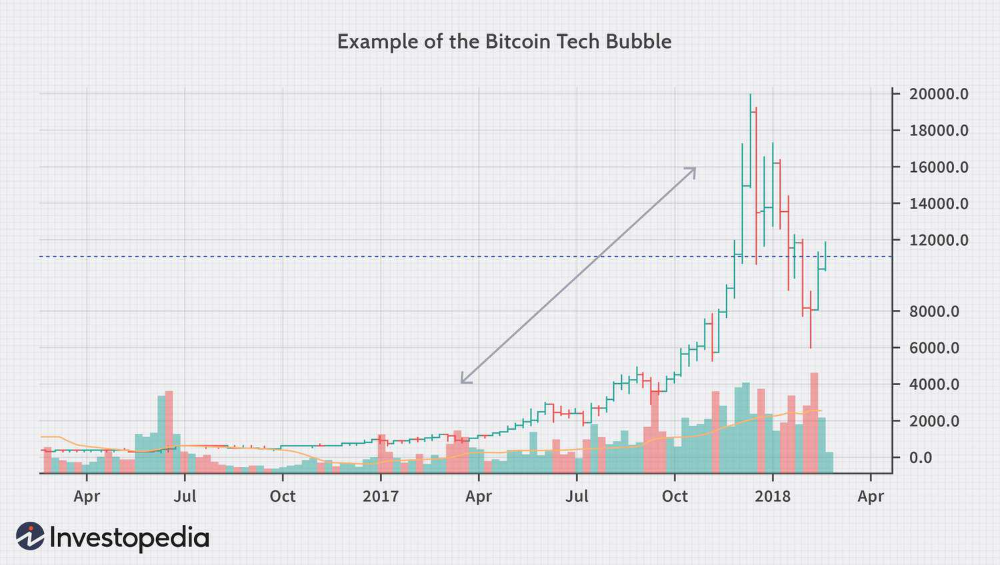

The rise and fall of economic bubbles have been subjects of keen interest in the study of financial markets. Among the most notable of these bubbles is the dot-com era, which is often referred to as the internet bubble. This period, spanning from the mid-to-late 1990s, was characterized by an extraordinary surge in technology stocks, culminating in a spectacular collapse. The dot-com bubble serves as a critical study of how speculative investing, propelled by the burgeoning popularity of the internet, led to unsustainable market valuations.

During this era, investors enthusiastically poured capital into internet-related firms, despite many such companies lacking viable business models or paths to profitability. The Nasdaq index, a barometer of technology stock performance, experienced unprecedented gains, building a sense of euphoria among market participants. However, the rapid inflation of asset prices was unsustainable. The bubble burst in the early 2000s, causing significant financial losses and leading to a broader market downturn.



In this article, we explore the dynamics of the dot-com bubble, examining its underlying causes, ramifications, and the emergence of algorithmic trading as a transformative force in modern financial markets. Understanding these aspects is crucial for gaining insights into present-day market trends and anticipating future developments within the financial ecosystem. As technology continues to reshape the marketplace, reflecting on the dot-com bubble provides valuable lessons for investors and policymakers alike in navigating complex economic environments.

## Table of Contents

## Understanding Economic Bubbles

An economic bubble occurs when the prices of assets rise significantly higher than their intrinsic values. This phenomenon is often fueled by speculative investing, wherein investors purchase assets with the expectation that they can sell them at a higher price, regardless of the assets' fundamental values. The initial phase of a bubble is characterized by rapidly increasing asset prices, driven by excessive optimism and speculative fervor. This is typically exacerbated by media hype, which amplifies the narrative of ever-increasing prices, attracting more investors hoping to capitalize on the perceived opportunities.

The lifecycle of a bubble can be described through several stages. In the beginning, there is a displacement, often resulting from a new technology or paradigm shift that transforms the market landscape. Early adopters recognize the potential for significant profits, leading to an influx of investment. As prices rise, widespread enthusiasm leads to a euphoric phase where valuations become disconnected from reality. During this period, an increasing number of investors, spurred on by the fear of missing out, pour money into the market, pushing prices to unsustainable levels.

This irrational exuberance cannot be maintained indefinitely. Eventually, doubts about the asset values begin to surface, marking the onset of the crisis or "burst" phase. As confidence wanes, investors start to sell off their overvalued assets, prompting a sharp decline in prices. The rapid sell-off can be exacerbated by panic, resulting in a dramatic fall in market values, often below their intrinsic value. This phase can lead to financial distress for both individual investors and broader financial systems, potentially resulting in economic recession if the bubble was widespread enough.

Understanding the dynamics of economic bubbles involves recognizing patterns of human behavior, such as herd mentality and overconfidence, which play a crucial role in their formation and burst. While economic bubbles have been a recurring feature of financial markets, they serve as an important reminder of the [volatility](/wiki/volatility-trading-strategies) inherent in speculative investments and the importance of aligning investment decisions with [fundamental analysis](/wiki/fundamental-analysis).

## The Dot-Com Era: A Brief Overview

The dot-com era, a distinctive period in financial history, was characterized by a rapid surge in stock valuations driven predominantly by investments in internet companies. This era spanned from approximately 1995 to 2000, during which the Nasdaq Composite Index experienced a meteoric rise, reflecting the heightened investor enthusiasm for technology-driven enterprises. The inclusion of "dot-com" in a company’s name became a hallmark of success and a magnet for investment, regardless of an actual profit-generating business model.

Throughout this period, venture capital flowed abundantly into nascent internet startups, resulting in an influx of Initial Public Offerings (IPOs). The high number of IPOs during this time contributed to valuations that were not necessarily tied to corporate fundamentals, such as revenue or long-term strategic plans, but rather to market sentiment and speculative appetite. This speculative investment environment led many companies to achieve astronomical market capitalizations without sustainable earnings.

Despite the initial enthusiasm, many of these internet companies lacked viable business models to sustain profitability and growth. The narrative of rapid technological advancement overshadowed the essential elements required for a business to thrive long-term, such as cash flow management and competitive positioning. As investor expectations soared, so too did the market valuations of these companies, until the inevitable reality check occurred.

By the year 2000, the excessive valuations could no longer be justified by the financial performances of the underlying businesses. A shift in investor sentiment ensued, with confidence eroding in the promised potential of internet companies. This shift triggered a rapid deflation of the bubble, leading to a drastic decline in stock prices and the Nasdaq index, in particular. Numerous dot-com companies went bankrupt as funding dried up, and the market recalibrated to reflect more realistic valuations.

The aftermath of the dot-com bubble resulted in a significant downturn, wiping out substantial amounts of investor wealth and prompting a reassessment of investment strategies and company valuations. This period serves as a cautionary tale of the perils associated with speculative investing in unproven sectors and highlights the importance of financial due diligence and sustainable business practices.

## Key Drivers of the Dot-Com Bubble

The dot-com bubble was substantially driven by the rapid expansion and widespread adoption of the World Wide Web during the 1990s, which created novel opportunities and attracted both individual and institutional investors. Key to this era was a significant surge in initial public offerings (IPOs) of internet companies. Many fledgling companies with minimal operational history and unproven business models went public to capitalize on investor interest. The excitement around these internet ventures often overshadowed traditional financial metrics such as profitability and cash flow, elevating stock prices to unsustainable levels.

A critical component contributing to the bubble was the prevalent media promotion of these technology companies. Media outlets frequently highlighted success stories and potential technological breakthroughs, further fueling investor optimism and speculative behavior. This created a feedback loop where soaring stock prices attracted more media attention, which in turn enticed additional investment.

Additionally, the pursuit of rapid market share by internet companies led them to prioritize growth over profitability. To attract more users quickly, these companies engaged in aggressive marketing strategies and competitive pricing, often neglecting the sustainability of their operations. This aggressive push for market dominance, while increasing revenue and user base, did not necessarily translate into tangible financial gains, ultimately contributing to the financial instability that precipitated the market downturn. As a result, many of these companies were unable to justify their valuations when the economic reality eventually set in.

## The Role of Algorithmic Trading

Algorithmic trading emerged as a transformative force in financial markets during the dot-com era. This period saw significant technological advancements that facilitated the development and adoption of [algorithmic trading](/wiki/algorithmic-trading) systems. These systems rely on algorithms—complex sets of mathematical instructions—to automate trading decisions, detecting and acting on market inefficiencies with remarkable speed. Leveraging high-frequency trading, these algorithms can execute transactions in microseconds, a pace unattainable for human traders.

### Algorithmic Trading Mechanics

At the core of algorithmic trading are algorithms programmed to execute trades based on predefined criteria such as timing, price, or quantity. These algorithms analyze historical data and apply quantitative models to predict market movements. For instance, a simple moving average crossover strategy could form the basis of an algorithm that buys when the short-term moving average crosses above the long-term moving average and sells in the opposite scenario.

```python
# Example of a simple algorithmic trading strategy in Python
def moving_average_crossover(prices, short_window=40, long_window=100):
    short_mavg = prices.rolling(window=short_window).mean()
    long_mavg = prices.rolling(window=long_window).mean()

    signals = (short_mavg > long_mavg).astype(int)
    return signals.diff()
```

Such strategies allow traders to capitalize on fleeting opportunities that arise in the market, contributing to increased market [liquidity](/wiki/liquidity-risk-premium) and efficiency. Studies have shown that algorithmic trading reduces spreads and enhances price discovery, providing a more accurate reflection of stock values.

### Market Efficiency vs. Volatility

While algorithmic trading improves market efficiency, it can also heighten volatility. During the dot-com era, markets experienced sudden price swings amplified by automated trading systems. High-frequency trading, a subset of algorithmic trading, has been particularly noted for contributing to market volatility. These high-speed trades can lead to events similar to the "flash crash" of 2010, where the Dow Jones Industrial Average dropped over 1,000 points momentarily, influenced by cascading sell orders triggered by algorithms.

### Regulatory Response and Evolution

In response to such events, regulatory bodies have intensified scrutiny over algorithmic trading activities. Measures like the implementation of circuit breakers, which halt trading during extreme market volatility, aim to curb excessive price fluctuations. Furthermore, regulatory requirements demand greater transparency and robustness in algorithm development and deployment, emphasizing risk management and compliance.

Today, algorithmic trading has evolved into a sophisticated framework that dominates large-scale financial trading operations. It continues to enhance market dynamics by offering strategic advantages but requires careful oversight to mitigate potential systemic risks. Understanding its dual impact is key to appreciating its role in contemporary and future financial ecosystems.

## Lessons Learned from the Dot-Com Bubble

The dot-com bubble of the late 1990s provided investors with a critical lesson: the primacy of solid business fundamentals over speculative enthusiasm. As technology stocks soared, driven by promises of boundless potential, many investors overlooked key indicators such as profitability, cash flow, and sustainable business models. This oversight became glaringly apparent when the bubble burst, leaving a trail of failed enterprises in its wake.

Companies that survived this turbulent period, such as Amazon, exemplified the importance of adaptability and strategic pivoting. Amazon initially invested heavily in growth but gradually shifted focus towards achieving profitability and efficient business operations. This strategic realignment enabled it to weather the storm and eventually emerge as a dominant player in the digital marketplace. The emphasis on building a robust infrastructure and scaling sustainably allowed Amazon to capitalize on the eventual maturation of online commerce.

The dot-com era also highlighted the dangers inherent in speculative investments spurred by unrealistic growth expectations. Many internet startups secured massive valuations despite lacking viable business operations or coherent paths to profitability. Investors, swayed by the allure of future profits and media hype, often engaged in excessive risk-taking. This speculative focus underscores the importance of careful due diligence and critical assessment of a company's potential, rather than being driven purely by market excitement.

In today's investment landscape, the lessons from the dot-com bubble resonate strongly. Investors are now more cautious, often demanding transparency and tangible performance metrics. Analytical approaches, combining data evaluation with market trends, have become integral to investment strategies. The bubble's aftermath has led to a more grounded perspective, reminding stakeholders of the cyclic nature of markets and the need for prudence in the face of euphoria.

## Impact on Modern Financial Markets

The dot-com bubble has left a lasting imprint on modern financial markets, continuing to shape investment strategies and regulatory approaches. One major development is the evolution of algorithmic trading, which has grown significantly more sophisticated since its nascent stages during the dot-com era. Today, algorithmic trading is integral to market operations, executing trades with unprecedented speed and precision. This technological advancement has improved market efficiency but also introduced challenges, such as increased volatility and the potential for flash crashes. As algorithms dictate a substantial portion of daily trading [volume](/wiki/volume-trading-strategy), they necessitate rigorous monitoring to prevent systemic risks.

Investors have adapted by prioritizing data-driven decision-making processes to navigate market complexities. The availability of extensive financial data and advanced analytical tools allows investors to assess risks more effectively and construct diversified portfolios. Diversification, in particular, is emphasized as a strategy to mitigate the formation and impact of future bubbles. By spreading investments across various asset classes and sectors, investors can reduce exposure to market downturns akin to those experienced during the dot-com collapse.

Furthermore, the regulatory landscape has evolved to address unsustainable market behaviors observed during the dot-com bubble. Regulatory bodies now enforce stricter disclosure requirements for companies, particularly concerning financial health and business models, to safeguard investor interests. These measures are designed to enhance transparency and restore confidence in the markets, deterring speculative excesses that contribute to bubble formations.

Overall, the memory of the dot-com bubble underscores the necessity of a balanced approach to investing, combining technological innovation with prudent risk management. As markets continue to integrate cutting-edge technologies, the lessons from this period remain central to maintaining orderly and efficient financial systems.

## Conclusion

The dot-com bubble remains a pivotal event in financial history, offering enduring lessons on market behavior and investor psychology. This financial phenomenon exemplifies how excessive speculation and unrealistic growth expectations can lead to inflated asset prices, eventually resulting in significant market corrections. Recognizing the signs of a bubble, such as rapid price increases unsupported by underlying fundamentals, is crucial for investors and regulators alike. 

As technology continues to evolve, understanding the interplay of economic bubbles and trading innovations is essential. The dot-com era demonstrated how technological advancements could drive market shifts, often accompanied by increased volatility. Today, algorithmic trading and high-frequency trading systems have become integral parts of financial markets, underscoring the importance of technology in shaping market dynamics. These systems, while enhancing market efficiency, can also exacerbate price swings in times of market stress.

Investors must remain vigilant, drawing on past experiences to navigate the complexities of modern financial landscapes. By focusing on fundamentals, maintaining diversification, and leveraging data-driven strategies, investors can mitigate risks and capitalize on opportunities. Regulatory frameworks have also evolved, aiming to prevent financial excesses and protect market stability. Historical insights from events like the dot-com bubble are invaluable for anticipating potential future bubbles and ensuring a robust, resilient investment environment.

## References & Further Reading

[1]: Cassidy, J. (2002). ["Dot.con: The Greatest Story Ever Sold"](https://archive.org/details/dotcongreatestst0000cass) HarperCollins.

[2]: Shiller, R. J. (2005). ["Irrational Exuberance"](https://press.princeton.edu/books/paperback/9780691173122/irrational-exuberance) Princeton University Press.

[3]: Ghemawat, P. (2001). ["Strategy and the Business Landscape: Core Concepts"](https://archive.org/details/strategybusiness00ghem) Prentice Hall.

[4]: Lewis, M. (2001). ["The New New Thing: A Silicon Valley Story"](https://www.amazon.com/New-Thing-Silicon-Valley-Story/dp/0393347818) W.W. Norton & Company.

[5]: McGowan, K. (2000). ["The Disruptors: Silicon Valley's New Heroes"](https://www.wired.com/story/alternative-history-of-silicon-valley-disruption/) Prima Lifestyles. 

[6]: Byrne, J. A. (2002). ["The Fatal Flaw In Corporate America: How The Internet Wealth Boom Overwhelmed The Nation's Business"](https://www.researchgate.net/publication/249735376_The_Fatal_Flaw_A_Narrative_of_the_Fragile_Body-Self) BusinessWeek.