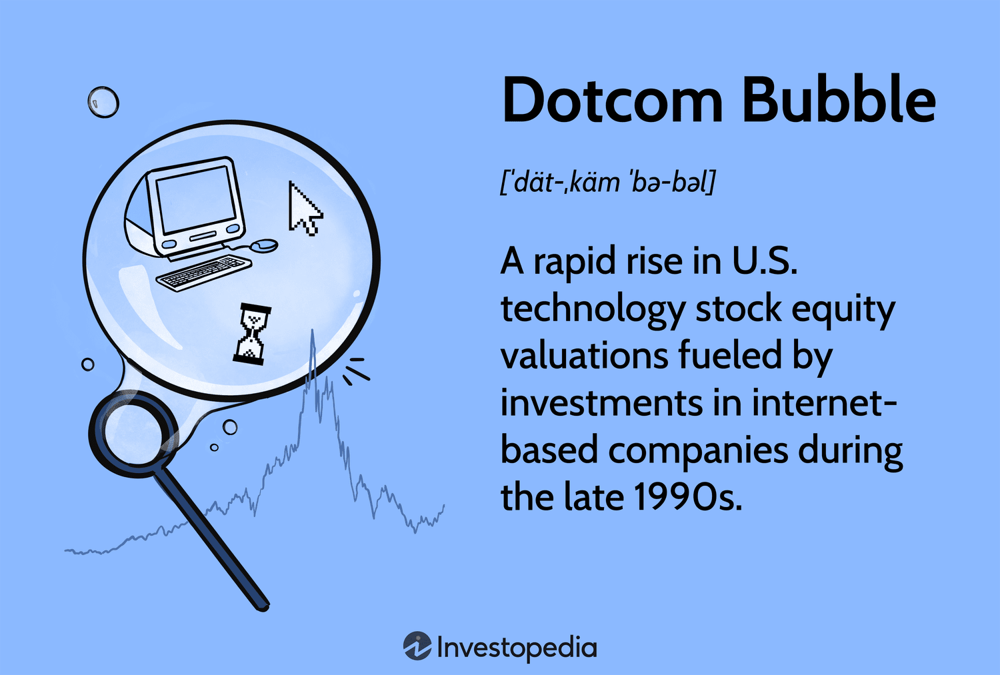

## Table of Contents

## What is the Internet Bubble?

The Internet Bubble, also known as the Dot-com Bubble, was a period in the late 1990s when many internet-based companies, or "dot-coms," were started. People were very excited about the internet and thought that these new companies would make a lot of money. As a result, investors poured a lot of money into these companies, even if they were not making profits yet. Stock prices for these companies went very high, creating a bubble of high expectations and overvalued stocks.

However, by the early 2000s, it became clear that many of these companies were not going to be successful. They were spending more money than they were making, and when investors realized this, they started selling their stocks. This caused the stock prices to fall quickly, and many companies went out of business. The bubble burst, leading to a lot of financial loss for investors and a slowdown in the economy. This event taught people to be more careful about investing in new technology companies.

## When did the Internet Bubble occur?

The Internet Bubble happened from about 1995 to 2000. During this time, many new companies that used the internet started up. People were very excited about the internet and thought these companies would make a lot of money. So, they invested a lot of money in these companies, even if they were not making profits yet. This made the stock prices of these companies go very high.

But by the year 2000, people realized that many of these companies were not going to be successful. They were spending more money than they were making. When investors saw this, they started selling their stocks. This made the stock prices fall quickly, and many companies went out of business. This event is called the bursting of the Internet Bubble.

## What were the main causes of the Internet Bubble?

The main cause of the Internet Bubble was the excitement about the internet. In the late 1990s, the internet was new and people thought it would change everything. They believed that any company that used the internet would make a lot of money. This excitement made investors want to put their money into these new internet companies, even if they were not making profits yet. This led to a lot of money flowing into these companies, making their stock prices go very high.

Another cause was easy access to money. Banks and investors were willing to lend money to these new companies because they thought they would be successful. This easy money helped start many new internet companies, even if they did not have a good plan to make money. When too many companies were started with this easy money, it created a bubble. The bubble burst when people realized that many of these companies were not going to be successful and started selling their stocks, causing the stock prices to fall.

## How did the Internet Bubble affect the economy?

The Internet Bubble had a big impact on the economy. When the bubble burst in 2000, many internet companies went out of business. This meant a lot of people lost their jobs. Investors also lost a lot of money because the value of their stocks went down quickly. This made people feel less confident about the economy. They were less likely to spend money or invest in new companies. This slowdown in spending and investing made the economy grow more slowly.

The effects of the Internet Bubble were felt around the world. In the United States, the stock market lost a lot of value, and this affected other countries too. Many countries had invested in American internet companies, so when these companies failed, it hurt their economies as well. It took several years for the economy to recover from the burst of the Internet Bubble. People learned to be more careful about investing in new technology companies, and this changed how people thought about the internet and its potential to make money.

## What industries were most impacted by the Internet Bubble?

The Internet Bubble mostly affected the technology and internet industries. Many new companies that were started during this time were focused on using the internet to sell things, provide information, or offer new services. These companies were called "dot-coms." When the bubble burst, a lot of these dot-com companies went out of business because they were not making enough money to stay open. This caused many people in the tech industry to lose their jobs, and it made it harder for new tech companies to get started.

The stock market was also hit hard by the Internet Bubble. Companies in the technology and internet sectors saw their stock prices go up very high during the bubble, but when it burst, their stock prices fell quickly. This meant that investors who had put their money into these companies lost a lot of money. The fall in stock prices affected not just the tech industry but the whole economy, as people felt less confident about investing and spending money. It took a while for the economy to recover from the effects of the Internet Bubble.

## What were the key events leading up to the burst of the Internet Bubble?

The Internet Bubble started growing in the mid-1990s when people got excited about the internet. They thought that any company that used the internet would make a lot of money. This excitement led investors to put a lot of money into new internet companies, even if they were not making profits yet. This made the stock prices of these companies go very high. In 1999, the excitement reached its peak. Many new companies were started, and their stock prices kept going up. People were investing more and more money into these companies, creating a big bubble of high expectations and overvalued stocks.

By early 2000, people started to realize that many of these internet companies were not going to be successful. They were spending more money than they were making, and their business plans were not working out. When investors saw this, they started selling their stocks. This caused the stock prices to fall quickly. On March 10, 2000, the Nasdaq Composite, which had many tech and internet companies, reached its highest point and then started to fall. This marked the beginning of the burst of the Internet Bubble. Many companies went out of business, and investors lost a lot of money. The effects of the burst were felt for years as the economy tried to recover.

## How did the burst of the Internet Bubble influence stock markets?

The burst of the Internet Bubble had a big impact on stock markets. In the late 1990s, the stock prices of many internet and tech companies went very high because people were excited about the internet. They thought these companies would make a lot of money. But by early 2000, people realized that many of these companies were not going to be successful. They were spending more money than they were making, and their business plans were not working out. When investors saw this, they started selling their stocks. This made the stock prices fall quickly.

The Nasdaq Composite, which had many tech and internet companies, reached its highest point on March 10, 2000, and then started to fall. This marked the beginning of the burst of the Internet Bubble. The fall in stock prices affected not just the tech industry but the whole economy. Investors who had put their money into these companies lost a lot of money. This made people feel less confident about the economy. They were less likely to spend money or invest in new companies. It took several years for the stock markets to recover from the burst of the Internet Bubble.

## What lessons were learned from the Internet Bubble?

One big lesson from the Internet Bubble was that people should be careful about investing in new technology companies. During the bubble, people got very excited about the internet and thought any company that used it would make a lot of money. They invested a lot of money in these companies, even if they were not making profits yet. But when the bubble burst, it showed that not all internet companies were going to be successful. Investors learned to look more closely at a company's business plan and profits before putting money into it.

Another lesson was about the dangers of a bubble in the stock market. When the Internet Bubble was growing, stock prices for internet companies went very high because of all the excitement. But when people realized that many of these companies were not going to be successful, they started selling their stocks, and the prices fell quickly. This taught people that when stock prices go up too fast because of excitement, it can create a bubble that will eventually burst. It's important to be careful and not get carried away by the excitement of new trends.

The Internet Bubble also showed how important it is to have a good plan for making money. Many of the companies that started during the bubble did not have a clear way to make profits. They were spending a lot of money on growing their business but were not making enough money to stay open. When the bubble burst, these companies went out of business. This taught people that a good business needs a solid plan to make money, not just excitement about a new technology.

## How did the Internet Bubble change investment strategies?

The Internet Bubble taught people to be more careful about investing in new technology companies. Before the bubble, people were very excited about the internet and thought any company that used it would make a lot of money. They put a lot of money into these companies without looking closely at whether they were making profits or had a good plan. But when the bubble burst, it showed that not all internet companies were going to be successful. Investors learned to look more carefully at a company's business plan and profits before investing. They also learned to be less influenced by the excitement around new trends and more focused on the actual performance of a company.

The burst of the Internet Bubble also made people think more about the risks of investing in the stock market. During the bubble, stock prices for internet companies went very high because of all the excitement. But when people realized that many of these companies were not going to be successful, they started selling their stocks, and the prices fell quickly. This taught investors that when stock prices go up too fast because of excitement, it can create a bubble that will eventually burst. As a result, people became more cautious and started to look for more stable investments. They also paid more attention to the overall health of the economy and not just the excitement around new technologies.

## What role did speculation play in the Internet Bubble?

Speculation played a big role in the Internet Bubble. During the late 1990s, people were very excited about the internet. They thought that any company that used the internet would make a lot of money. This excitement made investors want to put their money into these new internet companies, even if they were not making profits yet. They were speculating that these companies would become successful in the future. This speculation drove up the stock prices of these companies, creating a bubble of high expectations and overvalued stocks.

When the bubble burst in 2000, it showed that many of these speculations were wrong. A lot of the internet companies that people had invested in were not making enough money to stay open. They were spending more money than they were making, and their business plans were not working out. When investors realized this, they started selling their stocks, causing the stock prices to fall quickly. The burst of the Internet Bubble taught people to be more careful about speculating on new technology companies and to look more closely at a company's actual performance before investing.

## How did the Internet Bubble influence the development of the internet and technology sectors?

The Internet Bubble had a big impact on the development of the internet and technology sectors. During the bubble, a lot of money was invested in new internet companies. This money helped to build the internet and make it better. Many new websites and services were created, and the technology to run them improved. Even though many of these companies went out of business when the bubble burst, the money and effort put into them helped to grow the internet and make it more useful for everyone.

After the bubble burst, the internet and technology sectors had to change. People learned to be more careful about investing in new technology companies. They looked more closely at a company's business plan and profits before putting money into it. This made the internet and technology sectors more stable. Companies that survived the burst of the bubble had to focus on making money and providing good services. This helped to build a stronger and more reliable internet and technology industry in the long run.

## What are the differences between the Internet Bubble and other economic bubbles?

The Internet Bubble, or Dot-com Bubble, was different from other economic bubbles because it was driven by excitement about the internet. In the late 1990s, people thought any company that used the internet would make a lot of money. They invested a lot of money in these new companies, even if they were not making profits yet. This was different from other bubbles, like the housing bubble, where people were investing in real things like houses. The Internet Bubble was more about speculation and excitement about a new technology, not about investing in something you could touch.

Another difference is how quickly the Internet Bubble grew and burst. It started in the mid-1990s and burst by 2000, which is a short time compared to other bubbles. For example, the housing bubble took longer to grow and burst. The Internet Bubble also affected the stock market more directly. Many internet companies were listed on the stock market, and their stock prices went up very high during the bubble. When the bubble burst, the stock prices fell quickly, causing a big impact on the economy. Other bubbles might affect the economy in different ways, like through the banking system or real estate market.

## References & Further Reading

[1]: Cassidy, J. (2002). ["Dot.con: The Greatest Story Ever Sold"](https://archive.org/details/dotcongreatestst0000cass) HarperCollins.

[2]: Shiller, R. J. (2005). ["Irrational Exuberance"](https://press.princeton.edu/books/paperback/9780691173122/irrational-exuberance) Princeton University Press.

[3]: Ghemawat, P. (2001). ["Strategy and the Business Landscape: Core Concepts"](https://archive.org/details/strategybusiness00ghem) Prentice Hall.

[4]: Lewis, M. (2001). ["The New New Thing: A Silicon Valley Story"](https://www.amazon.com/New-Thing-Silicon-Valley-Story/dp/0393347818) W.W. Norton & Company.

[5]: McGowan, K. (2000). ["The Disruptors: Silicon Valley's New Heroes"](https://www.wired.com/story/alternative-history-of-silicon-valley-disruption/) Prima Lifestyles. 

[6]: Byrne, J. A. (2002). ["The Fatal Flaw In Corporate America: How The Internet Wealth Boom Overwhelmed The Nation's Business"](https://www.researchgate.net/publication/249735376_The_Fatal_Flaw_A_Narrative_of_the_Fragile_Body-Self) BusinessWeek.