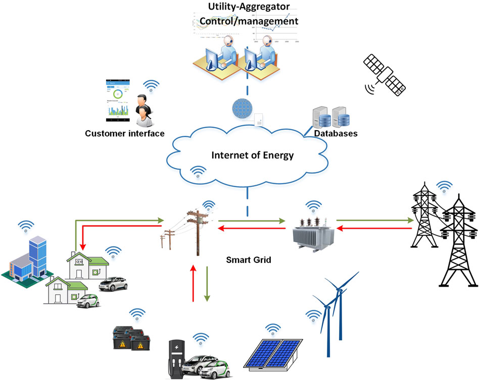

## Table of Contents

## What is the Internet of Energy (IoE)?

The Internet of Energy (IoE) is a concept that connects different parts of the energy system, like power plants and homes, using the internet. It helps to share information and control energy use more efficiently. Imagine being able to see how much energy your house is using and where it's coming from, all on your phone. That's what IoE can do.

IoE can make the energy system smarter and more reliable. For example, if there's a problem with the power supply, IoE can quickly find another source of energy to keep everything running smoothly. It also helps to use renewable energy sources like solar and wind power more effectively, which is good for the environment. By connecting everything, IoE makes it easier to manage and save energy.

## How does the Internet of Energy differ from the traditional energy grid?

The Internet of Energy (IoE) is different from the traditional energy grid because it uses the internet to connect all parts of the energy system. In a traditional grid, energy flows from power plants to homes and businesses through a fixed network of wires and cables. With IoE, devices like smart meters and sensors are connected online, allowing for real-time communication and control over energy use.

IoE makes the energy system smarter by allowing it to quickly respond to changes and problems. For example, if there's a power outage, the IoE can automatically find and switch to another energy source to keep the lights on. The traditional grid doesn't have this ability; it relies on manual adjustments and can take longer to fix issues. IoE also helps use renewable energy sources like solar and wind more effectively, which is better for the environment compared to the traditional grid that mainly uses fossil fuels.

## What are the key components of an IoE system?

The key components of an IoE system are smart devices, communication networks, and data management systems. Smart devices include things like smart meters, sensors, and appliances that can connect to the internet. They collect and send information about energy use in real time. Communication networks, like the internet or wireless connections, help these devices talk to each other and share data. This makes it possible for energy to be managed from anywhere.

Data management systems are also important in an IoE system. They store and analyze the information collected from smart devices. This helps to understand energy use patterns and make smart decisions about how to use energy more efficiently. For example, they can help decide when to use energy from solar panels or when to switch to another power source. Together, these components make the energy system smarter and more responsive to our needs.

## What technologies enable the Internet of Energy?

The Internet of Energy relies on several key technologies to work well. One important technology is the Internet of Things (IoT), which connects everyday devices like smart meters and sensors to the internet. These devices can then share information about how much energy is being used and where it's coming from. Another technology is advanced communication networks, like 5G, which help these devices talk to each other quickly and reliably. This is important because it lets the energy system respond fast to changes and problems.

Another technology that helps the Internet of Energy is data analytics. This means using computers to look at all the information collected from smart devices and figure out how to use energy better. For example, data analytics can help decide when to use energy from solar panels or when to switch to another power source. Finally, blockchain technology can also be used in IoE to make energy transactions secure and transparent. This means that when energy is bought or sold, everyone can trust that the process is fair and safe.

## What are the primary benefits of implementing IoE?

Implementing the Internet of Energy (IoE) brings many benefits. One big benefit is that it makes the energy system more efficient. With IoE, you can see how much energy you're using and where it's coming from, all in real time. This helps to use energy better and save money. For example, if you know when your solar panels are making the most energy, you can use more of that energy during those times.

Another benefit of IoE is that it makes the energy system more reliable. If there's a problem with the power supply, IoE can quickly find another source of energy to keep everything running smoothly. This means fewer power outages and less time without electricity. IoE also helps to use more renewable energy like solar and wind power, which is good for the environment. By connecting everything, IoE makes it easier to manage and save energy.

## How does IoE contribute to energy efficiency and sustainability?

The Internet of Energy (IoE) helps make energy use more efficient by connecting all parts of the energy system through the internet. With IoE, you can see how much energy you're using and where it's coming from in real time. This means you can use energy better and save money. For example, if you know when your solar panels are making the most energy, you can use more of that energy during those times. This helps to reduce waste and use energy more wisely.

IoE also helps make the energy system more sustainable by using more renewable energy sources like solar and wind power. Because IoE can quickly find and switch to different energy sources, it's easier to use clean energy when it's available. This is good for the environment because it reduces the need for fossil fuels, which can harm the planet. By making it easier to manage and use renewable energy, IoE helps to create a more sustainable future.

## What are some real-world applications of the Internet of Energy?

One real-world application of the Internet of Energy is in smart homes. In a smart home, devices like thermostats, lights, and appliances are connected to the internet. This means you can control them from your phone or computer. For example, you can turn off lights or adjust the temperature even when you're not at home. This helps save energy because you can make sure things are turned off when they're not needed. It also makes life easier because you don't have to worry about forgetting to turn things off.

Another application is in managing renewable energy sources like solar panels. With IoE, you can see how much energy your solar panels are making and use it when it's available. If there's extra energy, IoE can help sell it back to the grid or store it for later. This makes using renewable energy more efficient and helps reduce our reliance on fossil fuels. It's good for the environment and can save money on energy bills.

IoE is also used in big power grids to make them more reliable. If there's a problem with the power supply, IoE can quickly find another source of energy to keep everything running smoothly. This means fewer power outages and less time without electricity. By connecting everything, IoE helps manage energy better and makes the whole system work more efficiently.

## What challenges and barriers exist in the adoption of IoE?

One big challenge in adopting the Internet of Energy is the cost. Setting up all the smart devices, sensors, and communication networks needed for IoE can be expensive. Not everyone can afford to put solar panels on their roof or buy smart appliances. Also, the technology is still new, so it can be hard to find the money to pay for it. Governments and companies need to find ways to make IoE more affordable so more people can use it.

Another challenge is making sure all the different parts of the IoE system can work together. There are many different companies making smart devices and energy systems, and they don't always use the same technology. This can make it hard for everything to connect and share information. To fix this, we need to create standards that everyone follows. This way, all the devices can talk to each other and work together smoothly.

Security is also a big concern with IoE. When everything is connected to the internet, there's a risk that hackers could get into the system and cause problems. They could turn off the power or steal personal information. To keep IoE safe, we need strong security measures like encryption and firewalls. It's important to protect the energy system so people can trust it and use it without worry.

## How does IoE integrate with renewable energy sources?

The Internet of Energy helps use renewable energy sources like solar and wind power more effectively. With IoE, you can see how much energy your solar panels or wind turbines are making in real time. This means you can use that energy when it's available, instead of relying on other sources. For example, if your solar panels are making a lot of energy during the day, IoE can help you use that energy to power your home or even sell any extra energy back to the grid. This makes using renewable energy more efficient and helps reduce our reliance on fossil fuels, which is good for the environment.

IoE also helps manage the ups and downs of renewable energy. Sometimes the sun isn't shining or the wind isn't blowing, so the energy from solar and wind can be unpredictable. IoE can help by quickly switching to other energy sources when needed. It can also store extra energy in batteries for times when renewable energy isn't available. By making it easier to manage and use renewable energy, IoE helps create a more sustainable energy system. This is important for reducing our impact on the environment and moving towards a cleaner future.

## What are the cybersecurity concerns associated with IoE?

One big worry with the Internet of Energy is keeping it safe from hackers. When everything is connected to the internet, like smart meters and power grids, there's a chance that bad people could break in. They might turn off the power or steal personal information. To stop this, we need strong security measures like special codes to protect the information and firewalls to block hackers. It's really important to keep the energy system safe so people can trust it and use it without any worries.

Another concern is that if hackers get into the IoE system, they could cause big problems. They might mess up how energy is managed, which could lead to power outages or make it hard to use renewable energy. This could affect a lot of people and even cause harm to the environment. That's why it's so important to have good security. We need to keep working on ways to protect the IoE system so it can help us use energy better and more safely.

## What is the role of data analytics in optimizing IoE systems?

Data analytics plays a big role in making the Internet of Energy work better. It helps by looking at all the information that smart devices and sensors collect about energy use. This information can show when and where energy is being used the most. With data analytics, we can find patterns and figure out how to use energy more efficiently. For example, it can tell us the best times to use solar energy from our panels or when to switch to another power source to save money and energy.

By using data analytics, IoE systems can also predict when there might be problems with the energy supply. If it sees that energy use is going up a lot, it can warn us to get ready or switch to another source of energy before there's a power outage. This makes the whole energy system more reliable and helps us use more renewable energy, which is good for the environment. In short, data analytics helps make smart decisions about how to manage and use energy better in IoE systems.

## What future developments can we expect in the field of Internet of Energy?

In the future, we can expect the Internet of Energy to become even smarter and more connected. As more people use renewable energy like solar and wind power, IoE will help manage these sources better. It will use advanced technology like [artificial intelligence](/wiki/ai-artificial-intelligence) to predict when the sun will shine or the wind will blow, so we can use that energy at the right times. This will make our energy use more efficient and help us rely less on fossil fuels, which is good for the planet.

Another big change we might see is how IoE makes the whole energy system work together better. Right now, different parts of the energy system, like power plants and homes, don't always talk to each other easily. In the future, IoE will help them connect and share information more smoothly. This will make the energy system more reliable and help prevent power outages. It will also make it easier for people to control their energy use from their phones or computers, making life more convenient and helping save energy.

## References & Further Reading

[1]: Fang, X., Misra, S., Xue, G., & Yang, D. (2012). ["Smart Grid – The New and Improved Power Grid: A Survey."](https://ieeexplore.ieee.org/document/6099519) IEEE Communications Surveys & Tutorials, 14(4), 944–980.

[2]: Gungor, V. C., Sahin, D., Kocak, T., Ergut, S., Buccella, C., Cecati, C., & Hancke, G. P. (2011). ["Smart Grid Technologies: Communication Technologies and Standards."](https://ieeexplore.ieee.org/document/6011696) IEEE Transactions on Industrial Informatics, 7(4), 529–539.

[3]: Rivera, R., & Mesquida, A.-L. (2022). ["Cybersecurity in Smart Grids and the IoE: Analysis and Practical Recommendations."](https://www.researchgate.net/publication/355754453_An_Analysis_of_Cyber_Espionage_Process) Energies, 15(3), 645.

[4]: Zhang, C., Wu, J., Zhou, Y., Cheng, M., Long, C., & Wen, F. (2016). ["A Bidding System for Peer-to-Peer Energy Trading in a Grid-connected Microgrid."](https://www.sciencedirect.com/science/article/pii/S2095495624008672) Energy Procedia, 103, 147–152. 

[5]: Kiryushin, P. A., & Bogatyreva, A. E. (2019). ["Algorithmic Trading in a Portfolio of Energy Resources."](https://www.sciencedirect.com/science/article/abs/pii/S1387380698142938) Journal of Physics: Conference Series, 1425(1), 012111.