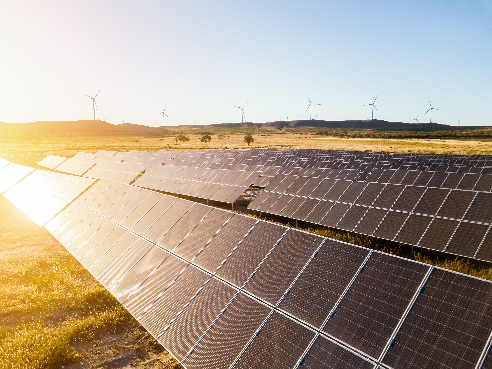

The energy sector is undergoing a profound transformation spurred by the advent of the Internet of Energy (IoE). The IoE encompasses the integration of advanced technologies and intelligent systems within energy infrastructures, aiming to improve efficiency and promote sustainability. This evolution is critical as it marks a transition towards cleaner and more efficient energy production methods, which prioritize the reduction of waste and the optimal utilization of resources.

Understanding the IoE involves recognizing its potential to revolutionize the energy grid. The IoE leverages the Internet of Things (IoT) technologies, smart grids, data analytics, and real-time communication systems to automate and enhance energy infrastructures. As a result, it presents opportunities to minimize energy loss and streamline energy distribution.



Another crucial facet of the IoE landscape involves the role of algorithmic trading in optimizing energy distribution and trading processes. Algorithmic trading utilizes computer algorithms to execute trades based on pre-set conditions, without human intervention. In the energy sector, this method facilitates the efficient management of energy flows, adapting trades to real-time market conditions and improving decision-making processes.

This article seeks to explore the concept of IoE in detail, examining its impact on the energy grid and the interplay between IoE and algorithmic trading. The discussion will focus on how these technologies work in concert to create a smarter, more resilient energy grid, poised to meet the demands of a rapidly changing global energy landscape.

## Table of Contents

## What is the Internet of Energy (IoE)?

The Internet of Energy (IoE) encompasses the integration and automation of energy infrastructure through the application of Internet of Things (IoT) technologies. This concept is a transformative approach aimed at enhancing the efficiency, reliability, and sustainability of energy systems. By embedding smart sensors and actuators within the energy grid, IoE facilitates the collection and analysis of vast amounts of data, enabling real-time monitoring and control of energy flows.

One of the primary objectives of IoE is to optimize energy production and distribution. Through the deployment of smart grids, IoE ensures that energy demand and supply are balanced accurately, minimizing energy waste. Smart grids, enhanced by IoT, enable two-way communication between energy producers and consumers, thus allowing for a more dynamic interaction and efficient energy management.

The integration of data analytics within IoE facilitates the identification of patterns and trends in energy usage, leading to more informed decision-making. For instance, algorithms can predict peak demand times, prompting adjustments in energy generation to maintain grid stability. This predictive capability not only enhances the reliability of power supply but also supports the incorporation of renewable energy sources into the energy mix.

Furthermore, IoE promotes cost efficiency by enabling energy producers to fine-tune operations to meet actual demands rather than projected ones, thus reducing operational expenses. This real-time adaptability helps in lowering the cost of energy production and distribution, benefiting both suppliers and consumers. By embracing the Internet of Energy, the energy sector can significantly reduce its carbon footprint while meeting the growing global energy demands more sustainably.

## The Role of Smart Grids in IoE

Smart grids constitute a pivotal element of the Internet of Energy (IoE), as they integrate sophisticated digital technologies into traditional power supply networks. This integration transforms conventional electricity distribution into an interactive and highly efficient system. A key feature of smart grids is their capacity for two-way communication between energy providers and consumers. This bi-directional communication facilitates improved energy management, allowing for more precise resource allocation, which is vital for meeting dynamic energy demands and optimizing consumption.

At the core of smart grid functionality is the utilization of data from Internet of Things (IoT) devices. These devices continually monitor various parameters of energy consumption and environmental conditions, transmitting real-time data that can be analyzed to forecast energy demand. Predictive analytics, often driven by [machine learning](/wiki/machine-learning) algorithms, enable smart grids to optimize the supply of electricity, particularly in relation to volatile renewable energy sources like wind and solar power. By balancing supply and demand dynamically, the grids can reduce energy loss, ultimately leading to cost savings and enhanced sustainability.

The integration of IoT devices into smart grids allows for enhanced efficiency through detailed insights into usage patterns, peak demand times, and other critical data points. With this data, grid operators can proactively adjust the distribution of electricity, minimizing wastage and improving overall operational efficiency. Moreover, the ability to incorporate renewable energy sources efficiently into the grid infrastructure is critical. By dynamically adjusting to changes in energy production and demand, smart grids can stabilize the integration process of these inherently unpredictable sources.

To illustrate the impact of smart grids operationally, consider this simplified Python function that represents the load forecasting based on IoT sensor data:

```python
import numpy as np
from sklearn.linear_model import LinearRegression

def forecast_energy_demand(sensor_data):
    # Assume sensor_data is a 2D numpy array where rows represent different sensors
    # and columns represent time-series data points (e.g., hourly data).

    time_steps = sensor_data.shape[1]
    energy_demand = []

    # Use a linear regression model for simplicity
    model = LinearRegression()

    # Train the model with historical sensor data
    X = np.arange(time_steps).reshape(-1, 1)  # Time steps as features
    y = sensor_data.mean(axis=0)  # Average demand per time step as target

    model.fit(X, y)

    # Forecast the next time step demand
    next_step = np.array([[time_steps]])
    forecasted_demand = model.predict(next_step)

    return forecasted_demand[0]

# Example usage:
sensor_data_example = np.random.rand(10, 24)  # Example with 10 sensors collecting 24 hours of data
predicted_demand = forecast_energy_demand(sensor_data_example)
print(f"Predicted energy demand for the next time step: {predicted_demand}")
```

This code provides a simplistic approach to predict future energy demand by using averages from IoT sensors, demonstrating how leveraging IoT data can optimize energy utilization in smart grids. As technology advances, the role of smart grids within the IoE will continue to grow, playing an essential role in the sustainable integration of renewable energy sources and the enhancement of grid resilience.

## Algorithmic Trading in the Energy Sector

Algorithmic trading in the energy sector employs sophisticated computer programs to execute trades based on pre-defined criteria, eliminating the need for human intervention. These algorithms are essential for the efficient management of energy flows, as they can quickly adapt to real-time market conditions to optimize trading decisions. This optimization is particularly crucial in the energy markets, where prices can be highly volatile.

By leveraging [algorithmic trading](/wiki/algorithmic-trading), energy companies can engage in price-optimized trading, improving their profit margins. The algorithms process copious amounts of market data, allowing them to make informed decisions swiftly. For instance, they can analyze historical data, current market trends, and external factors such as weather conditions to predict energy demand and supply accurately. This analysis reduces human errors in trading, which is particularly beneficial given the complexity and scale of the energy markets.

The implementation of algorithmic trading also enhances risk management within the energy sector. Algorithms are capable of executing trades in milliseconds, allowing for rapid adjustments in response to market fluctuations. This speed and efficiency help minimize potential losses and capitalize on favorable market conditions.

The profitability and efficiency of energy markets receive a boost from the use of algorithms, as they not only facilitate quick decision-making but also contribute to the stabilization of energy prices. By predicting market movements with greater accuracy, they enable energy providers to ensure their trading strategies are aligned with both current and forecasted market conditions. This capability is vital for maintaining a competitive edge in the fast-paced energy trading sector. Incorporating advanced technologies such as machine learning and [artificial intelligence](/wiki/ai-artificial-intelligence) can further enhance the adaptability and precision of these trading algorithms, ensuring they remain effective as market dynamics evolve.

## Benefits of Combining IoE and Algorithmic Trading

Integrating the Internet of Energy (IoE) with algorithmic trading significantly enhances the agility and responsiveness of energy markets. This integration empowers energy systems to achieve substantial cost savings by optimizing resource allocation and minimizing energy wastage. The combination of these technologies allows for a more dynamic and adaptive approach to energy management, effectively addressing the complexities of modern energy systems.

One of the primary benefits of combining IoE and algorithmic trading is the improved ability of energy systems to handle volatile renewable energy sources. As renewable energy generation, such as wind and solar, can be unpredictable due to weather conditions, the integration of IoE technologies provides real-time data analytics and predictive capabilities. This enables energy systems to adjust supply and demand dynamically, reducing the risk of energy crises. Algorithmic trading algorithms can quickly adapt to changes in energy supply, facilitating seamless integration of renewables into the grid.

Moreover, advanced algorithms used in algorithmic trading are equipped with sophisticated forecasting abilities. They analyze vast datasets generated by IoE systems to project future energy demands accurately. For example, machine learning models can be utilized to predict peak load times and patterns, allowing energy providers to prepare adequate resources in advance. This predictive capability ensures stability in energy supply and pricing by preemptively addressing potential shortages or surpluses.

The integration of IoE with algorithmic trading also offers financial advantages by enabling price-optimized trading strategies. Algorithms can assess real-time market conditions and execute trades at optimal moments, thus maximizing financial returns while maintaining supply-demand equilibrium. This process not only enhances profitability but also contributes to the overall efficiency of energy markets.

In conclusion, the confluence of IoE and algorithmic trading is pivotal in transforming energy management practices. By leveraging the strengths of both technologies, energy systems become more resilient, efficient, and sustainable, ultimately paving the way for a more dependable and environmentally friendly energy landscape.

## Challenges and Future Directions

Integrating the Internet of Energy (IoE) with algorithmic trading is fraught with several challenges, despite the potential benefits. One significant concern is cybersecurity. As energy systems become increasingly connected and automated, they become more susceptible to cyber threats. Intrusions into energy networks can have severe repercussions, from unauthorized access to data manipulation, potentially leading to power outages or compromised grid integrity. Ensuring robust cybersecurity measures is crucial to protect these interconnected systems from such threats.

Another challenge lies in data privacy and the management of large datasets generated by numerous Internet of Things (IoT) devices. IoE systems rely on extensive data collection to function effectively, but this data must be managed and stored in compliance with privacy regulations. Moreover, handling large-scale, real-time data requires sophisticated data processing capabilities and secure data storage solutions.

Infrastructure robustness is also a concern. IoE and algorithmic trading systems depend on reliable and high-speed networks to process vast amounts of data efficiently. The current infrastructure may need significant upgrades to support these requirements, including the deployment of advanced communication networks like 5G.

Future developments in the IoE sector should focus on enhancing interoperability and scalability to accommodate growing energy demands. As energy systems evolve, they must be able to integrate various devices and platforms seamlessly. Developing standardized communication protocols and interfaces is essential for ensuring compatibility across different systems and technologies.

Furthermore, continued innovation in artificial intelligence (AI) and machine learning (ML) will be pivotal in refining algorithmic trading strategies. These technologies can help systems adapt to changing market dynamics by learning from historical data and predicting future trends. For example, [reinforcement learning](/wiki/reinforcement-learning) algorithms could be employed to optimize trading decisions based on evolving market conditions.

To illustrate, a simple reinforcement learning algorithm could be formulated as follows in Python using TensorFlow:

```python
import tensorflow as tf
from tensorflow import keras

class DQNModel(keras.Model):
    def __init__(self, num_actions):
        super(DQNModel, self).__init__()
        self.dense1 = keras.layers.Dense(24, activation='relu')
        self.dense2 = keras.layers.Dense(24, activation='relu')
        self.logits = keras.layers.Dense(num_actions, activation='linear')

    def call(self, inputs):
        x = self.dense1(inputs)
        x = self.dense2(x)
        return self.logits(x)

# Example usage
num_actions = 4  # Example number of actions in the trading scenario
model = DQNModel(num_actions)
model.compile(optimizer='adam', loss='mse')
```

In this example, the model can be trained to predict the best trading actions based on real-time market inputs, thus enhancing decision-making processes and improving resilience to dynamic market conditions.

In conclusion, while integrating IoE with algorithmic trading presents formidable challenges, addressing these issues will pave the way for more advanced, efficient, and adaptive energy systems. Continued advancements and innovations will be key to overcoming current limitations and fully realizing the potential of IoE in the energy sector.

## Conclusion

The Internet of Energy (IoE) and algorithmic trading are pivotal in modernizing the energy sector, offering transformative solutions that drive the industry towards sustainability and efficiency. By effectively integrating these cutting-edge technologies, the energy sector can develop systems that are not only innovative but also highly efficient and reliable, ultimately striving to meet the growing global energy demands.

The IoE combines the Internet of Things (IoT) with energy infrastructure, enabling the seamless automation and optimization of energy networks. This technological fusion allows for real-time monitoring and management of energy resources, ensuring minimal waste and cost. When coupled with algorithmic trading, which leverages sophisticated algorithms to execute trades and optimize energy distribution in real-time, the potential for operational efficiency in energy markets increases significantly.

Overcoming the challenges associated with IoE and algorithmic trading, such as cybersecurity concerns and data privacy, will be crucial. Addressing these issues will facilitate a smoother transition to renewable energy sources. As these technologies mature, they can enhance energy systems' adaptability and robustness, enabling them to accommodate intermittent renewable energy more effectively.

Looking forward, the future of energy trading appears promising, with technology-driven solutions paving the way for smarter energy management. By embracing the synergies between IoE and algorithmic trading, the energy sector can achieve a more sustainable, secure, and efficient pathway, ultimately transitioning toward a cleaner and more resilient energy future.

## References & Further Reading

[1]: Fang, X., Misra, S., Xue, G., & Yang, D. (2012). ["Smart Grid – The New and Improved Power Grid: A Survey."](https://ieeexplore.ieee.org/document/6099519) IEEE Communications Surveys & Tutorials, 14(4), 944–980.

[2]: Gungor, V. C., Sahin, D., Kocak, T., Ergut, S., Buccella, C., Cecati, C., & Hancke, G. P. (2011). ["Smart Grid Technologies: Communication Technologies and Standards."](https://ieeexplore.ieee.org/document/6011696) IEEE Transactions on Industrial Informatics, 7(4), 529–539.

[3]: Rivera, R., & Mesquida, A.-L. (2022). ["Cybersecurity in Smart Grids and the IoE: Analysis and Practical Recommendations."](https://www.researchgate.net/publication/355754453_An_Analysis_of_Cyber_Espionage_Process) Energies, 15(3), 645.

[4]: Zhang, C., Wu, J., Zhou, Y., Cheng, M., Long, C., & Wen, F. (2016). ["A Bidding System for Peer-to-Peer Energy Trading in a Grid-connected Microgrid."](https://www.sciencedirect.com/science/article/pii/S2095495624008672) Energy Procedia, 103, 147–152. 

[5]: Kiryushin, P. A., & Bogatyreva, A. E. (2019). ["Algorithmic Trading in a Portfolio of Energy Resources."](https://www.sciencedirect.com/science/article/abs/pii/S1387380698142938) Journal of Physics: Conference Series, 1425(1), 012111.