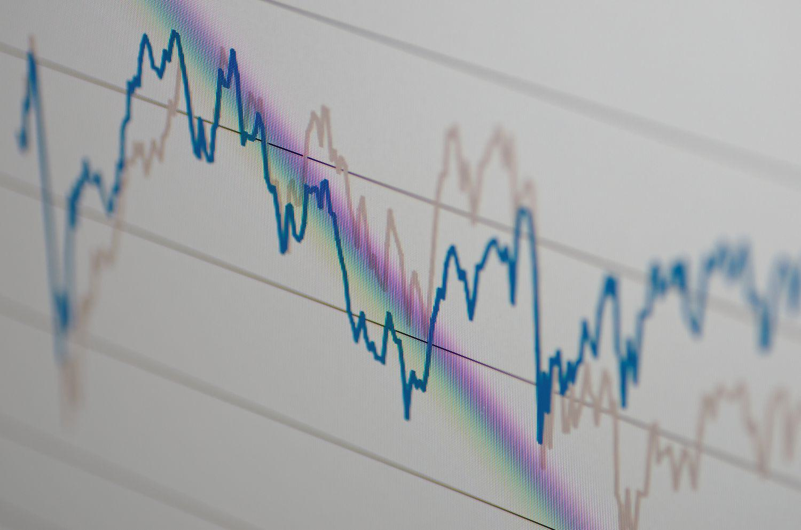

Yield curves are a fundamental tool in financial markets, representing the relationship between interest rates and the maturities of debt securities, typically government bonds. They are important because they help investors understand the potential return on investment over different time horizons, offering insights into economic expectations. Yield curves can take several forms—normal, inverted, or flat—each indicative of varying economic conditions, such as growth or recession, which significantly influence investment decisions and monetary policy.

In algorithmic trading, yield curves are essential because they assist in constructing and executing automated trading strategies that require precise financial data analysis. Algorithmic trading relies heavily on mathematical models and statistical techniques to forecast price movements and execute orders at optimal times. Here, yield curves serve as a crucial input, providing a framework for evaluating interest rate risks and opportunities.

The focus of financial analysis often shifts towards interpolated yield curves due to their ability to estimate interest rates for maturities that are not directly observed in the market. Interpolation is a mathematical technique used to derive unknown values within a range of known data points. In the context of yield curves, interpolation allows finance professionals to fill in the gaps between available discrete interest rate data points, giving a smoother and continuous curve that can be more effectively used in pricing and risk management.

Interpolation techniques such as linear interpolation, cubic spline, and bootstrapping are commonly used to construct yield curves. These methods enable the accurate estimation of bond prices and yields for maturities not observed in the market, facilitating sophisticated trading strategies and risk management solutions. For instance, interpolated yield curves are pivotal in calculating the duration and Value at Risk (VaR) of bond portfolios, assessing interest rate risks, and optimizing investment portfolios.

In summary, yield curves and their interpolated forms are essential tools in the financial markets, offering deep insights into economic expectations and guiding investment strategies. Their application in algorithmic trading and risk management highlights their importance in enabling precise and informed financial decision-making.

## Table of Contents

## Understanding Yield Curves

A yield curve is a graphical representation that depicts the relationship between interest rates and different maturities of debt instruments, such as bonds. It is a fundamental tool in the bond market, providing insights into investor expectations and helping to evaluate the economic environment. The curve typically represents yields on government bonds and other high-quality securities with varying maturities.

The yield curve is significant for several reasons. Primarily, it helps investors understand the cost of borrowing over different time horizons. Furthermore, it serves as a benchmark for pricing other interest rates and derivative instruments. Yield curve analysis is essential for financial professionals as it informs [interest rate](/wiki/interest-rate-trading-strategies) risk, guides monetary policy decisions, and helps in assessing the overall economic climate.

There are three primary types of yield curves: normal, inverted, and flat. A normal yield curve slopes upward, reflecting higher yields for longer maturities. This pattern indicates that investors require a premium for longer-term investments due to increased risks) such as inflation and uncertainty over time. The normal curve often suggests economic expansion, as rising interest rates typically correlate with a growing economy.

An inverted yield curve occurs when short-term interest rates are higher than long-term rates, resulting in a downward slope. This unusual phenomenon often signals investor expectations of a downturn, as it suggests that future interest rates are expected to be lower, possibly due to anticipated economic contraction or recession. Historically, inverted yield curves have been considered strong predictors of upcoming recessions.

A flat yield curve is characterized by similar yields for short and long-term maturities. This situation arises when the economy transitions between different phases, often suggesting uncertainty. It can indicate an impending change in economic conditions, where market participants are uncertain whether economic growth or contraction will follow.

The shape of the yield curve provides valuable information about future economic conditions. For example, a steepening curve may indicate rising inflation expectations or robust economic growth, while a flattening yield curve may suggest slower growth or potential recession. Thus, analyzing yield curves allows policymakers, investors, and economists to forecast economic trends and make informed financial decisions.

## Interpolation Techniques for Yield Curves

Interpolation is a crucial component in constructing yield curves, providing a method to estimate yields for maturities that are not directly observable in the market. This process is particularly important when creating a continuous curve that accurately reflects the term structure of interest rates. Three primary methods of interpolation are commonly used for yield curve construction: linear interpolation, cubic spline interpolation, and bootstrapping.

### Linear Interpolation

Linear interpolation is the simplest form of interpolation, where the yield for an unknown maturity is estimated as a straight line between two known yields. Mathematically, this can be represented as:

$$
y(t) = y_1 + \frac{y_2 - y_1}{t_2 - t_1} \times (t - t_1)
$$

where $y(t)$ is the interpolated yield at time $t$, and $(t_1, y_1)$ and $(t_2, y_2)$ are the known points. 

**Pros and Cons:**

- **Pros:** Simple to implement and computationally efficient. It is ideal for environments needing quick approximations.
- **Cons:** It may not capture the curvature or nuances in the yield curve, as it assumes a linear relationship between known points. This may lead to inaccuracies in estimating actual yields.

### Cubic Spline Interpolation

Cubic spline interpolation uses piecewise cubic polynomials to interpolate between known data points, ensuring a smooth transition. It ensures that the first and second derivatives of adjacent spline segments match at each data point, preventing abrupt changes in the slope and curvature.

The general form of a cubic spline for an interval $[t_i, t_{i+1}]$ is:

$$
S_i(t) = a_i + b_i(t - t_i) + c_i(t - t_i)^2 + d_i(t - t_i)^3
$$

where $S_i(t)$ is the spline function in the interval, and $a_i, b_i, c_i, d_i$ are the coefficients determined based on boundary conditions and the requirement that the spline passes through the known data points.

**Pros and Cons:**

- **Pros:** Provides a smoother and more flexible fit compared to linear interpolation. It can accurately capture the shape and nuances of the yield curve.
- **Cons:** More computationally intensive and complex to implement. It requires solving a system of equations to find the spline coefficients, which may be challenging for large datasets.

### Bootstrapping

Bootstrapping is a technique primarily used to construct a zero-coupon yield curve. It involves iteratively solving for yields on zero-coupon bonds by successively stripping out the coupon payments from existing bonds to estimate their implied zero rates.

The formula used in bootstrap involves discounting each bond’s cash flow at its appropriate time point. For a bond with cash flows $C_1, C_2, \ldots, C_n$ at times $t_1, t_2, \ldots, t_n$, the bootstrapping equation is:

$$
P = \sum_{i=1}^{n} \frac{C_i}{(1 + r_i)^{t_i}}
$$

where $P$ is the market price of the bond, and $r_i$ are the zero rates we are solving for.

**Pros and Cons:**

- **Pros:** Provides a precise way to derive a zero-coupon yield curve from bonds with coupon payments, useful for calculating present values and derivative pricing.
- **Cons:** Sensitive to pricing errors in the bonds used for constructing the curve. Requires a well-established bond market to obtain reliable data for bootstrapping.

In conclusion, each interpolation technique has its unique set of advantages and potential pitfalls. The choice of method will depend on the specific requirements of the financial analysis, including desired accuracy, computational resources, and the availability of market data. Understanding and selecting the appropriate method is critical for precise yield curve construction, enabling effective financial analysis and decision-making.

## Financial Analysis Using Interpolated Yield Curves

Yield curves play an integral role in financial analysis by allowing professionals to estimate bond prices and yields for maturities that are not directly observed in the market. This process is vital because bond markets typically provide yields for only a few specific maturities. To derive the yield for other maturities, interpolation techniques are employed, ensuring a smooth and accurate curve that reflects the underlying financial instruments.

### Estimation of Bond Prices and Yields

Interpolated yield curves provide estimates of the yield to maturity (YTM) and bond prices for unobserved maturities. The interpolation process allows finance experts to construct a complete yield curve from available data, making it possible to price bonds that do not have a directly observable market yield. This estimation is crucial for financial institutions that manage portfolios with bonds maturing across different time horizons.

The formula used to price a bond involves discounting future cash flows (coupons and principal) by the interpolated yields corresponding to each cash flow's maturity:

$$
P = \sum_{t=1}^{n} \frac{C_t}{(1 + i_t)^t} + \frac{F}{(1 + i_n)^n}
$$

where:
- $P$ is the bond price,
- $C_t$ is the coupon payment at time $t$,
- $i_t$ is the interpolated yield at time $t$,
- $F$ is the face value of the bond,
- $n$ is the number of periods until maturity.

### Role in Risk Management

Interpolated yield curves significantly aid in risk management, particularly in calculating duration and Value at Risk (VaR). Duration measures the sensitivity of a bond's price to changes in interest rates, and its calculation requires accurate yield curve data. Interpolated yields provide a detailed view of the relationship between different maturities, leading to more informed duration assessments.

Value at Risk (VaR) relies on yield curve analysis to estimate the potential loss in bond portfolios over a specified time frame and probability. Accurate interpolation helps in modeling interest rate scenarios and assessing the impact on portfolio value, thereby optimizing risk strategies.

### Case Studies

Yield curve interpolation has been pivotal in various instances of asset valuation and economic forecasting. For example, during economic downturns, accurately interpolated yield curves can signal changes in market [liquidity](/wiki/liquidity-risk-premium) and investor sentiment by observing subtle shifts in the curve's slope and shape.

In a well-documented case, during the 2008 financial crisis, financial institutions used interpolated yield curves to revalue mortgage-backed securities and other complex debt instruments. By doing so, they could better assess the potential impacts on their balance sheets and adjust their risk management strategies accordingly.

Another example is the use of interpolated yield curves in sovereign debt management. Countries have relied on this analytical approach to evaluate the cost-effectiveness of issuing new debt across various maturities, aiding in minimizing the cost of borrowing while maintaining fiscal stability.

In conclusion, interpolated yield curves are indispensable tools in financial analysis and risk management. By providing an essential link between observed data and theoretical maturities, they enable finance professionals to make informed decisions related to pricing, risk management, and economic forecasting.

## Algorithmic Trading and Yield Curves

Algorithmic trading leverages advanced mathematical models and computational algorithms to execute trades at speeds and frequencies that are impossible for human traders. A key component of many [algorithmic trading](/wiki/algorithmic-trading) strategies is the analysis and interpretation of yield curve data, which is vital for understanding interest rate movements and predicting economic conditions.

Yield curve analysis plays a critical role in creating sophisticated trading strategies, such as yield spread strategies and statistical [arbitrage](/wiki/arbitrage). Yield spread strategies typically involve capitalizing on the differences in interest rates between bonds of different maturities. By analyzing the shape and shifts in the yield curve, algorithmic traders can identify and exploit pricing inefficiencies. For example, a steepening yield curve might signify an expectation of faster economic growth, leading traders to anticipate potential rises in long-term interest rates relative to short-term rates. Conversely, a flattening yield curve might be interpreted as an indication of future economic slowdown or falling inflation expectations.

Statistical arbitrage strategies often use mathematical and statistical models to predict price movements and identify trading opportunities. Changes in the yield curve can directly affect the prices of fixed-income securities and related derivatives, thus impacting positions that rely on precise calculations of the instruments' fair value. By incorporating yield curve data into their models, algorithmic traders are better equipped to gauge market sentiment and make informed trading decisions.

An example of how changes in yield curves impact trading decisions can be seen when central banks alter their monetary policy stance. For instance, if a central bank signals an intention to raise interest rates, the yield curve may shift upwards as market participants adjust their expectations for future rates. Algorithmic trading systems, equipped with real-time data feeds and [machine learning](/wiki/machine-learning) models, can rapidly react to these changes, adjusting portfolios to hedge interest rate risk or capitalize on new opportunities such as anticipated movements in bond prices.

Additionally, consider the case of an abrupt economic event, such as a geopolitical crisis or unexpected economic data release. Such events can lead to instantaneous fluctuations in yield curves, which algorithmic trading platforms, integrated with sophisticated yield curve analysis tools, can quickly interpret and react to, executing trades based on updated forecasts and risk assessments.

The integration of yield curve analysis in algorithmic trading underscores its significance in enhancing trading decisions and market efficiency, allowing traders to manage risk better and optimize their strategies based on anticipated economic scenarios.

## Technologies Enabling Yield Curve Analysis

Technologies and computational tools play a crucial role in enhancing yield curve analysis, particularly in trading environments where precision and speed are of paramount importance. Yield curve analysis benefits significantly from advancements in mathematical modeling and computing power, allowing traders and financial analysts to derive insights with increased accuracy and efficiency.

Mathematical models underpin the construction and interpretation of yield curves. These models typically involve complex calculations for interpolating yield data, which is crucial for understanding the term structure of interest rates. Interpolation methods, such as cubic splines or bootstrapping, are used extensively to achieve smooth and continuous yield curves essential for accurate financial analysis. The efficacy of these mathematical models is enhanced by the computational capabilities offered by modern software tools.

Python has emerged as a vital tool in yield curve analysis due to its versatility and the vast ecosystem of libraries available. Libraries such as NumPy, SciPy, and pandas provide robust functionalities for numerical and data manipulation tasks, enabling practitioners to handle large datasets efficiently. For yield curve interpolation, the use of SciPy’s interpolation module facilitates the application of techniques like cubic splines. Additionally, libraries such as QuantLib offer more specialized functions for financial instruments, allowing more tailored yield curve modeling and analysis.

Machine learning is increasingly being integrated into yield curve analysis to improve the accuracy and predictive power of models. Techniques such as regression analysis, clustering, and neural networks can be applied to discern patterns within historical yield data, aiding in the derivation of more reliable forecasts and risk assessments. Machine learning models benefit from Python’s extensive libraries including scikit-learn and TensorFlow, which provide comprehensive machine learning capabilities.

Algorithmic trading platforms have embraced these technologies to enhance real-time analysis and decision-making processes. Such platforms often integrate advanced computational techniques to analyze yield curve data continually, facilitating the development of trading strategies that can capitalize on market movements. High-frequency trading algorithms, for instance, use real-time yield data processed through these platforms to execute trades within milliseconds, based on predefined criteria and predictions generated through yield curve analysis.

Moreover, these platforms often incorporate functionalities from machine learning to adapt strategies dynamically, responding to market changes more effectively than traditional models. Algorithmic strategies like yield spread and [carry](/wiki/carry-trading) trade rely heavily on accurate yield curve analysis to identify arbitrage opportunities and assess potential risks.

In conclusion, the integration of mathematical and computational tools such as Python libraries and machine learning techniques into yield curve analysis delivers significant advantages in speed and precision. These technologies empower financial professionals to conduct comprehensive analyses, ultimately shaping strategic decision-making in trading environments. As technology continues to advance, the capabilities and applications of yield curve analysis are expected to expand even further, introducing novel insights and efficiencies into the financial markets.

## Challenges and Future Directions

Yield curve interpolation faces several challenges that are crucial to address for accurate financial analysis. One significant challenge is data quality. Yield curves are constructed using available market data, yet this data may be incomplete or lack liquidity in certain maturities, leading to inaccuracies. Interpolating a yield curve requires filling these gaps, but the unreliable data can result in a distorted curve that does not accurately represent market realities.

Modeling risks also pose a challenge. Different interpolation methods can produce varying results, impacting the assessment of financial instruments and risks. For instance, linear interpolation, while simple, might not capture the nuances of a curve as effectively as more complex methods like cubic spline or bootstrapping. Each method has inherent biases and limitations that need to be understood and mitigated.

Unpredictable economic events add another layer of complexity. Events such as recessions, geopolitical tensions, or pandemics can lead to rapid shifts in interest rates, affecting the stability and predictive power of yield curves. These events can introduce [volatility](/wiki/volatility-trading-strategies) that is hard to model, leading to potential mispricing of assets and misjudgment of risk.

Looking to the future, big data, [artificial intelligence](/wiki/ai-artificial-intelligence) (AI), and blockchain technologies offer promising advancements in yield curve analysis. Big data can enhance the accuracy of yield curve models by incorporating larger volumes of market data, potentially uncovering patterns and trends that traditional datasets might overlook. AI, particularly machine learning algorithms, can improve the adaptability and precision of yield curve models by continuously learning from fresh data and adjusting to new market conditions.

Blockchain technology could further enhance transparency and data integrity, ensuring that yield curve models are built on reliable and tamper-proof data. This technology can create secure and decentralized data sources for more robust financial modeling.

Incorporating these technologies can lead to more resilient and precise yield curve models, transforming how financial markets respond to fast-paced changes and enhancing decision-making processes. Despite the current challenges, the integration of these advanced technologies represents a path forward that could address many limitations faced by traditional yield curve interpolation.

## Conclusion

Interpolated yield curves play a critical role in financial markets, offering significant insights for understanding bond pricing, economic indicators, and risk assessment. By bridging gaps in available data, these curves provide estimates for unobserved maturities, thereby enhancing the precision of financial models. The ability to generate accurate yield curves is not only foundational for valuing fixed-income securities but also crucial for managing risks associated with interest rate fluctuations.

Technological advancements have significantly transformed yield curve analysis. Tools such as Python libraries, including NumPy and SciPy, allow practitioners to apply sophisticated interpolation techniques such as cubic splines and bootstrapping. These tools enable real-time data processing and integration into algorithmic trading systems, where speed and accuracy are paramount.

As financial markets become increasingly complex, the integration of data analytics and machine learning presents new opportunities for yield curve analysis. Machine learning models can identify patterns and anomalies that traditional methods might miss, leading to more informed decision-making and enhanced predictive capabilities. Furthermore, technologies such as big data analytics and blockchain hold the potential to improve data quality and transparency, reducing modeling risks and enhancing forecasting reliability.

Ongoing research and development in this field are essential for continually improving trading outcomes and risk management strategies. By advancing interpolation methods and integrating cutting-edge technologies, finance professionals can achieve more robust and agile responses to market dynamics. Encouraging collaboration between data scientists and financial experts will be pivotal in driving innovations that refine yield curve analysis and bolster its utility in financial markets.

## References & Further Reading

[1]: Hull, J. C. (2018). ["Options, Futures, and Other Derivatives"](https://www.semanticscholar.org/paper/Options%2C-Futures%2C-and-Other-Derivatives-Hull/89bdee500c8623864fc9eb7a471546aa713acc44). Pearson Education.

[2]: Fabozzi, F. J., & Mann, S. V. (Eds.). (2010). ["Handbook of Fixed Income Securities,"](https://www.amazon.com/Handbook-Fixed-Income-Securities-Ninth/dp/1260473899) 8th Edition, McGraw-Hill Education.

[3]: J.P. Morgan Securities LLC (2015). ["Fixed Income Analysis,"](https://www.jpmorgan.com/insights/markets/top-market-takeaways/tmt-introducing-the-29th-edition-of-jp-morgan-asset-managements-long-term-capital-market-assumptions) CFA Institute.

[4]: Ametrano, F. M., & Bianchetti, M. (2013). ["Bootstrapping the LIBOR-Swap Curve,"](https://www.bianchetti.org/Finance/BootstrappingTheIlliquidity-v1.0.pdf) in Interest Rate Modelling: Post-Crisis Challenges and Approaches.

[5]: Nelsen, R. B. (2006). ["An Introduction to Copulas,"](https://link.springer.com/book/10.1007/0-387-28678-0) Springer Series in Statistics.