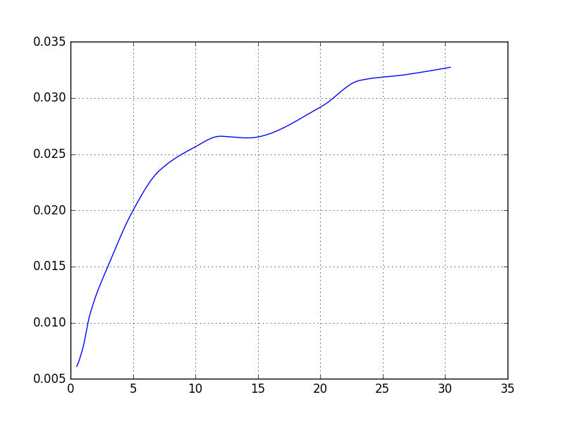

## Table of Contents

## What is an interpolated yield curve?

An interpolated yield curve is a way to show how interest rates change over time for different lengths of time that money is borrowed or invested. Imagine you have a graph where the x-axis shows the time until the money is paid back, and the y-axis shows the interest rate. The yield curve connects the dots between known interest rates for certain times, like 1 year, 5 years, and 10 years. When we don't know the interest rate for every single time in between, we use a method called interpolation to guess what those rates might be. This helps create a smooth line on the graph.

Interpolation is like filling in the blanks. If you know the interest rate for 1 year is 2% and for 2 years is 3%, you can guess what the rate might be for 1.5 years. There are different ways to do this, but the goal is always to make a best guess that makes the curve smooth and logical. This is important for investors and borrowers because it helps them understand what interest rates might be in the future, which can help them make better decisions about when to borrow or invest money.

## How is an interpolated yield curve constructed?

To construct an interpolated yield curve, you start with known interest rates for specific times, like 1 year, 5 years, and 10 years. These are called benchmark rates. You plot these rates on a graph where the x-axis shows the time until the money is paid back, and the y-axis shows the interest rate. The goal is to connect these points to create a smooth line that represents how interest rates change over time.

To fill in the gaps between the known rates, you use a method called interpolation. This is like guessing what the [interest rate](/wiki/interest-rate-trading-strategies) might be for times in between the benchmarks. There are different ways to do this, but a common one is linear interpolation, where you draw a straight line between two known points. For example, if the rate is 2% at 1 year and 3% at 2 years, you might guess the rate at 1.5 years is 2.5%. By doing this for all the gaps, you create a smooth curve that shows how interest rates change over time for different lengths of time.

## What are the common interpolation methods used for yield curves?

There are several common methods used to interpolate yield curves, and each has its own way of guessing the interest rates between known points. One simple method is linear interpolation. This is like drawing a straight line between two points on the graph. If you know the interest rate at 1 year is 2% and at 2 years is 3%, linear interpolation would guess the rate at 1.5 years is 2.5%. It's easy to understand and calculate, but it might not always be the most accurate because real interest rates don't always change in a straight line.

Another method is cubic spline interpolation. This method tries to make the curve smoother and more natural-looking. Instead of drawing straight lines, it uses a series of curves that connect the known points in a way that the whole curve looks smooth. This can be more accurate because it can better match how interest rates actually change over time. However, it's a bit more complicated to calculate.

A third method is the Nelson-Siegel model. This method uses a mathematical formula to fit a curve to the known points. It's more complex and can be adjusted to fit different shapes of yield curves. It's often used by financial experts because it can give a good overall picture of how interest rates might change in the future. Each of these methods has its own strengths and is chosen based on what kind of accuracy and complexity is needed.

## Why is interpolation important in the context of yield curves?

Interpolation is important in the context of yield curves because it helps fill in the gaps between known interest rates. When you look at a yield curve, you usually have interest rates for certain times like 1 year, 5 years, and 10 years. But what about the times in between? Interpolation lets you guess what those rates might be. This is helpful because it gives a complete picture of how interest rates change over time, which is important for making decisions about borrowing or investing money.

Using interpolation makes the yield curve smooth and easy to understand. Without it, the curve would just be a series of disconnected points, which wouldn't be very useful. By filling in the gaps, interpolation helps create a smooth line that shows how interest rates might change in the future. This can help investors and borrowers plan better, because they can see what rates might be at different times, even if those times aren't exactly where the known rates are.

## How does an interpolated yield curve differ from a spot yield curve?

An interpolated yield curve and a spot yield curve are both used to show how interest rates change over time, but they are built in different ways. A spot yield curve uses the actual interest rates that you can get right now for different times, like 1 year, 5 years, and 10 years. These rates are called spot rates because they are the rates you can get on the spot, today. The spot yield curve connects these known rates without guessing or filling in any gaps.

On the other hand, an interpolated yield curve starts with the same known spot rates but then uses a method called interpolation to guess what the rates might be for times in between the known points. For example, if you know the rate for 1 year and 2 years, interpolation helps you guess what the rate might be for 1.5 years. This makes the curve smooth and complete, which can be helpful for understanding how rates might change in the future. So, while a spot yield curve only shows the actual rates at specific times, an interpolated yield curve fills in the gaps to give a more detailed picture.

## What are the typical data sources for constructing an interpolated yield curve?

To build an interpolated yield curve, you need to start with data about interest rates. This data usually comes from government bonds or other safe investments. Governments sell bonds that pay back money after different amounts of time, like 1 year, 5 years, or 10 years. The interest rates on these bonds are called yields. These yields are the starting points for the yield curve. You can find this information from places like government websites, financial news services, or databases that track bond prices and yields.

Once you have the yields for the different times, you use a method called interpolation to guess what the yields might be for times in between. For example, if you know the yield for a 1-year bond and a 2-year bond, you can use interpolation to guess what the yield might be for a 1.5-year bond. This helps create a smooth line on the graph that shows how interest rates change over time. The data for this comes from the same sources as the initial yields, but the interpolation part is done by financial experts or computer programs to make the curve complete and useful for understanding future interest rates.

## How can an interpolated yield curve be used in financial analysis?

An interpolated yield curve is a useful tool in financial analysis because it helps people understand how interest rates might change in the future. By looking at the curve, investors and borrowers can see what interest rates are expected to be at different times. This can help them decide when to borrow money or invest. For example, if the curve shows that rates are expected to go up in the future, a borrower might want to borrow money now before rates get higher. An investor might also use the curve to guess what kind of return they might get if they buy a bond that will pay back money in the future.

The yield curve also helps in understanding the economy. When the curve is steep, with a big difference between short-term and long-term rates, it might mean that people expect the economy to grow. A flat or upside-down curve, where long-term rates are the same or lower than short-term rates, might mean that people are worried about the economy. By using the interpolated yield curve, financial analysts can make better guesses about what might happen with interest rates and the economy. This can help them give better advice to their clients about when to buy, sell, or hold onto investments.

## What are the limitations and potential errors in using interpolated yield curves?

Using interpolated yield curves can have some problems. One big issue is that the guesses made by interpolation might not be right. Interpolation is just a way to fill in the gaps between known interest rates, but the real rates might be different. If the method used for interpolation is too simple, like drawing straight lines between points, it might not show how interest rates really change. This can lead to mistakes in planning and decision-making. Also, if the data used to start the curve is not accurate or up-to-date, the whole curve can be off.

Another problem is that different ways of interpolating can give different results. For example, using a simple straight line might give a different curve than using a more complex method like a cubic spline. This means that the curve can change depending on who is making it and what method they choose. This can make it hard to compare different yield curves or use them to make decisions. It's important for people using these curves to know about these limitations and be careful when they rely on them for important financial choices.

## Can you explain how to apply an interpolated yield curve in bond pricing?

When you want to figure out the price of a bond, an interpolated yield curve can help you guess what the interest rates might be for the times when the bond pays back money. Imagine you have a bond that pays back money in 1 year, 2 years, and 3 years. You can use the yield curve to see what the interest rates are expected to be at those times. If you know the interest rate for 1 year is 2% and for 2 years is 3%, you can use interpolation to guess what the rate might be for 1.5 years. This helps you figure out the price of the bond by adding up the present value of each payment, using the guessed interest rates.

Using the interpolated yield curve makes bond pricing more accurate because it gives you a complete picture of how interest rates might change. If you only used the known rates without guessing the rates in between, you might miss important changes in the interest rates that affect the bond's price. By filling in the gaps, the interpolated yield curve helps you see a smoother and more detailed view of what the interest rates might be in the future. This way, you can make a better guess about how much the bond is worth today.

## How does the choice of interpolation method affect the resulting yield curve and its applications?

The choice of interpolation method can make a big difference in how the yield curve looks and how it's used. If you use a simple method like linear interpolation, where you draw straight lines between known points, the curve might not show how interest rates really change. It might be too simple and miss out on important ups and downs in the rates. This can lead to mistakes when you're trying to guess what interest rates will be in the future or when you're pricing bonds. On the other hand, if you use a more complex method like cubic spline interpolation, which makes the curve smoother and more natural, you might get a better picture of how rates change. This can help you make more accurate guesses and better decisions.

The method you choose can also affect how people use the yield curve in financial analysis. For example, if you're using the curve to decide when to borrow money or invest, a more accurate curve can help you make better choices. If the curve is off because of a bad interpolation method, you might borrow or invest at the wrong time. Also, different methods can lead to different curves, so it's important to know which method was used when you're comparing different yield curves or using them to make decisions. This way, you can understand why the curves might look different and make sure you're using the best one for your needs.

## What advanced techniques can be used to enhance the accuracy of interpolated yield curves?

To make interpolated yield curves more accurate, one advanced technique is to use more complex interpolation methods like cubic spline interpolation. This method creates a smoother curve by using a series of curves instead of straight lines between known points. It can better match how interest rates really change over time, making the guesses more accurate. Another technique is to use more data points. Instead of just using rates for 1 year, 5 years, and 10 years, you could use rates for more times in between. This gives the curve more information to work with, making the guesses more reliable.

Another way to improve accuracy is to use models like the Nelson-Siegel model. This model uses a special formula to fit a curve to the known points. It can be adjusted to fit different shapes of yield curves, which can give a better overall picture of how interest rates might change in the future. Also, using up-to-date and high-quality data is important. If the data you start with is accurate and current, the guesses made by interpolation will be more reliable. By using these advanced techniques, financial experts can create yield curves that give a more accurate and useful picture of future interest rates.

## How are interpolated yield curves utilized in risk management and portfolio optimization?

Interpolated yield curves are really helpful for managing risk and making investment portfolios better. In risk management, the curve helps people see how interest rates might change in the future. This is important because if rates go up or down, it can affect the value of bonds and other investments. By using the yield curve, people can guess what might happen to their investments and take steps to protect themselves. For example, if the curve shows that rates are going to go up, they might choose to invest in shorter-term bonds that won't be affected as much by the change.

In portfolio optimization, the interpolated yield curve helps investors decide where to put their money. By looking at the curve, they can see what kind of returns they might get from different investments at different times. This helps them choose the best mix of investments to get the highest return while keeping risk low. For example, if the curve shows that long-term rates are going to be higher than short-term rates, they might put more money into long-term bonds to get a better return. By using the yield curve, investors can make smarter choices and build a better investment portfolio.

## What are the interpolation techniques used for yield curves?

Interpolation is a crucial component in constructing yield curves, providing a method to estimate yields for maturities that are not directly observable in the market. This process is particularly important when creating a continuous curve that accurately reflects the term structure of interest rates. Three primary methods of interpolation are commonly used for yield curve construction: linear interpolation, cubic spline interpolation, and bootstrapping.

### Linear Interpolation

Linear interpolation is the simplest form of interpolation, where the yield for an unknown maturity is estimated as a straight line between two known yields. Mathematically, this can be represented as:

$$
y(t) = y_1 + \frac{y_2 - y_1}{t_2 - t_1} \times (t - t_1)
$$

where $y(t)$ is the interpolated yield at time $t$, and $(t_1, y_1)$ and $(t_2, y_2)$ are the known points. 

**Pros and Cons:**

- **Pros:** Simple to implement and computationally efficient. It is ideal for environments needing quick approximations.
- **Cons:** It may not capture the curvature or nuances in the yield curve, as it assumes a linear relationship between known points. This may lead to inaccuracies in estimating actual yields.

### Cubic Spline Interpolation

Cubic spline interpolation uses piecewise cubic polynomials to interpolate between known data points, ensuring a smooth transition. It ensures that the first and second derivatives of adjacent spline segments match at each data point, preventing abrupt changes in the slope and curvature.

The general form of a cubic spline for an interval $[t_i, t_{i+1}]$ is:

$$
S_i(t) = a_i + b_i(t - t_i) + c_i(t - t_i)^2 + d_i(t - t_i)^3
$$

where $S_i(t)$ is the spline function in the interval, and $a_i, b_i, c_i, d_i$ are the coefficients determined based on boundary conditions and the requirement that the spline passes through the known data points.

**Pros and Cons:**

- **Pros:** Provides a smoother and more flexible fit compared to linear interpolation. It can accurately capture the shape and nuances of the yield curve.
- **Cons:** More computationally intensive and complex to implement. It requires solving a system of equations to find the spline coefficients, which may be challenging for large datasets.

### Bootstrapping

Bootstrapping is a technique primarily used to construct a zero-coupon yield curve. It involves iteratively solving for yields on zero-coupon bonds by successively stripping out the coupon payments from existing bonds to estimate their implied zero rates.

The formula used in bootstrap involves discounting each bond’s cash flow at its appropriate time point. For a bond with cash flows $C_1, C_2, \ldots, C_n$ at times $t_1, t_2, \ldots, t_n$, the bootstrapping equation is:

$$
P = \sum_{i=1}^{n} \frac{C_i}{(1 + r_i)^{t_i}}
$$

where $P$ is the market price of the bond, and $r_i$ are the zero rates we are solving for.

**Pros and Cons:**

- **Pros:** Provides a precise way to derive a zero-coupon yield curve from bonds with coupon payments, useful for calculating present values and derivative pricing.
- **Cons:** Sensitive to pricing errors in the bonds used for constructing the curve. Requires a well-established bond market to obtain reliable data for bootstrapping.

In conclusion, each interpolation technique has its unique set of advantages and potential pitfalls. The choice of method will depend on the specific requirements of the financial analysis, including desired accuracy, computational resources, and the availability of market data. Understanding and selecting the appropriate method is critical for precise yield curve construction, enabling effective financial analysis and decision-making.

## How can financial analysis be conducted using interpolated yield curves?

Yield curves play an integral role in financial analysis by allowing professionals to estimate bond prices and yields for maturities that are not directly observed in the market. This process is vital because bond markets typically provide yields for only a few specific maturities. To derive the yield for other maturities, interpolation techniques are employed, ensuring a smooth and accurate curve that reflects the underlying financial instruments.

### Estimation of Bond Prices and Yields

Interpolated yield curves provide estimates of the yield to maturity (YTM) and bond prices for unobserved maturities. The interpolation process allows finance experts to construct a complete yield curve from available data, making it possible to price bonds that do not have a directly observable market yield. This estimation is crucial for financial institutions that manage portfolios with bonds maturing across different time horizons.

The formula used to price a bond involves discounting future cash flows (coupons and principal) by the interpolated yields corresponding to each cash flow's maturity:

$$
P = \sum_{t=1}^{n} \frac{C_t}{(1 + i_t)^t} + \frac{F}{(1 + i_n)^n}
$$

where:
- $P$ is the bond price,
- $C_t$ is the coupon payment at time $t$,
- $i_t$ is the interpolated yield at time $t$,
- $F$ is the face value of the bond,
- $n$ is the number of periods until maturity.

### Role in Risk Management

Interpolated yield curves significantly aid in risk management, particularly in calculating duration and Value at Risk (VaR). Duration measures the sensitivity of a bond's price to changes in interest rates, and its calculation requires accurate yield curve data. Interpolated yields provide a detailed view of the relationship between different maturities, leading to more informed duration assessments.

Value at Risk (VaR) relies on yield curve analysis to estimate the potential loss in bond portfolios over a specified time frame and probability. Accurate interpolation helps in modeling interest rate scenarios and assessing the impact on portfolio value, thereby optimizing risk strategies.

### Case Studies

Yield curve interpolation has been pivotal in various instances of asset valuation and economic forecasting. For example, during economic downturns, accurately interpolated yield curves can signal changes in market [liquidity](/wiki/liquidity-risk-premium) and investor sentiment by observing subtle shifts in the curve's slope and shape.

In a well-documented case, during the 2008 financial crisis, financial institutions used interpolated yield curves to revalue mortgage-backed securities and other complex debt instruments. By doing so, they could better assess the potential impacts on their balance sheets and adjust their risk management strategies accordingly.

Another example is the use of interpolated yield curves in sovereign debt management. Countries have relied on this analytical approach to evaluate the cost-effectiveness of issuing new debt across various maturities, aiding in minimizing the cost of borrowing while maintaining fiscal stability.

In conclusion, interpolated yield curves are indispensable tools in financial analysis and risk management. By providing an essential link between observed data and theoretical maturities, they enable finance professionals to make informed decisions related to pricing, risk management, and economic forecasting.

## References & Further Reading

[1]: Hull, J. C. (2018). ["Options, Futures, and Other Derivatives"](https://www.semanticscholar.org/paper/Options%2C-Futures%2C-and-Other-Derivatives-Hull/89bdee500c8623864fc9eb7a471546aa713acc44). Pearson Education.

[2]: Fabozzi, F. J., & Mann, S. V. (Eds.). (2010). ["Handbook of Fixed Income Securities,"](https://www.amazon.com/Handbook-Fixed-Income-Securities-Ninth/dp/1260473899) 8th Edition, McGraw-Hill Education.

[3]: J.P. Morgan Securities LLC (2015). ["Fixed Income Analysis,"](https://www.jpmorgan.com/insights/markets/top-market-takeaways/tmt-introducing-the-29th-edition-of-jp-morgan-asset-managements-long-term-capital-market-assumptions) CFA Institute.

[4]: Ametrano, F. M., & Bianchetti, M. (2013). ["Bootstrapping the LIBOR-Swap Curve,"](https://www.bianchetti.org/Finance/BootstrappingTheIlliquidity-v1.0.pdf) in Interest Rate Modelling: Post-Crisis Challenges and Approaches.

[5]: Nelsen, R. B. (2006). ["An Introduction to Copulas,"](https://link.springer.com/book/10.1007/0-387-28678-0) Springer Series in Statistics.