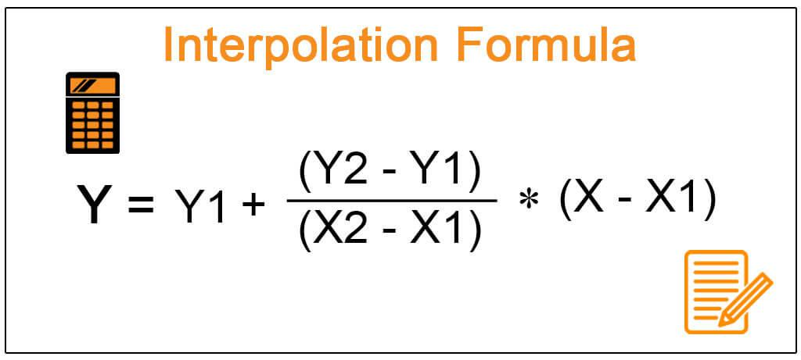

In the era of digital finance, the integration of technology into investment practices continues to advance at a rapid pace. This article addresses the significance of interpolation within the financial modeling, investment analysis, and algorithmic trading sectors. Interpolation is a crucial technique in financial mathematics. It aids in understanding and estimating values within investment scenarios, providing a framework for making more informed decisions. 

Financial analysts and traders rely on interpolation to improve decision-making processes by offering a means to estimate and fill gaps within a range of known data points. This method ensures more accurate financial modeling, enabling analysts to predict trends and evaluate potential future market behaviors. Algorithmic trading strategies have also benefited considerably from the application of interpolation, leveraging financial models to develop strategies that adapt to real-time market changes.



As we explore these concepts, we aim to uncover how mathematics and technology intersect with finance to enhance the effectiveness of investment strategies and trading systems. This intersection offers the possibility of refining predictive capabilities and investment decisions, nurturing an environment where finance professionals can thrive in the intricate landscape of modern markets.

## Table of Contents

## Understanding Interpolation in Financial Modeling

Interpolation is a mathematical method used to estimate unknown values that exist between distinct points of known data. In financial modeling, this technique is pivotal for making informed predictions about various financial metrics such as security prices and yields. By utilizing interpolation, financial analysts can derive more precise data points that enhance the depth and reliability of investment analysis.

Financial models often rely on interpolation to estimate potentially missing or sparse data. For instance, a stock price can be estimated on a particular date when historical data is unavailable, helping analysts better understand potential future price movements. Interpolation aids in crafting more robust models that track and predict financial trends, thereby enabling a higher level of accuracy in forecasting.

Several interpolation methods are employed in financial modeling, each with its strengths and limitations. Linear interpolation, one of the simplest methods, assumes a straight-line relationship between known data points. This method is effective when data points demonstrate a consistent trend over short intervals. However, for more complex and volatile markets, linear interpolation might not suffice.

Polynomial interpolation offers a more sophisticated approach, fitting a polynomial equation through the data points to estimate unknown values. This method can accommodate more intricate trends as observed in financial markets. The Lagrange polynomial interpolation and Newton's divided differences are popular techniques that fall under polynomial interpolation.

Moreover, other advanced interpolation techniques, such as spline interpolation, offer even finer levels of detail and accuracy. Splines involve piecewise polynomials that smoothly connect data points, an approach beneficial in modeling financial data that features abrupt changes or fluctuations.

By closing gaps in financial datasets, interpolation not only enhances the precision and reliability of financial models but also bolsters the accuracy of investment forecasts. Such methods allow analysts to make more informed projections, anticipate future market conditions better, and thereby contribute positively to strategic investment planning.

## Application of Interpolation in Investment Analysis

In investment analysis, interpolation is employed to facilitate the visualization of market data by estimating unknown values within a range of existing data points. This statistical technique allows analysts to illustrate trends and potential future developments, which is essential for advising investors on strategic decisions in volatile and uncertain markets. 

By providing a more detailed picture of historical and projected data, interpolation helps analysts construct scenarios that reflect possible financial environments and outcomes. For instance, when evaluating stock price movements, interpolation can help fill in gaps between data points, enabling the creation of a continuous curve that represents the trajectory of the prices over a particular period. This improved visualization aids investors in understanding potential market dynamics and the risks involved, allowing them to make more informed decisions.

Furthermore, interpolation plays a crucial role in the construction of interpolated yield curves, which are vital tools in bond market analysis. Yield curves depict the relationship between interest rates (or bond yields) and maturities, conveying essential information about future economic conditions. By applying interpolation techniques, analysts are able to estimate missing rates within the yield curve, smoothing the curve and providing a more accurate representation of expected [interest rate](/wiki/interest-rate-trading-strategies) movements. This enhanced precision supports the assessment of future economic scenarios and informs strategies regarding bond investments.

Interpolation's ability to simplify complex data into understandable patterns makes it a valuable asset in investment analysis, where minute details can significantly affect the outcome and performance of investment strategies. Through the careful application of interpolation methods, analysts can generate actionable insights that support more precise and strategic decision-making in the face of market unpredictability.

## Role of Interpolation in Algorithmic Trading

Algorithmic trading systems leverage interpolation as a crucial tool to address the inevitable data gaps and ensure continuous data flow essential for making swift and informed trading decisions. In the fast-paced world of finance, these systems require precise and timely data inputs to optimize trades and maximize profits. Interpolation techniques, such as linear, polynomial, and spline interpolation, are employed to predict unknown values in data sets, thereby smoothing data representation and facilitating rapid decision-making processes, which are particularly vital in high-frequency trading environments.

Linear interpolation is one of the simplest methods utilized in [algorithmic trading](/wiki/algorithmic-trading). It estimates values within two known data points through a linear approach, offering a straightforward solution with minimal computational overhead. The formula for linear interpolation between two points $(x_0, y_0)$ and $(x_1, y_1)$ is:

$$
y = y_0 + \frac{(x - x_0) \cdot (y_1 - y_0)}{(x_1 - x_0)}
$$

This technique, despite its simplicity, provides efficient data estimation conducive for fast-paced trading systems that require minimal latency.

Polynomial interpolation, on the other hand, involves higher-order equations to fit a polynomial through a given set of data points. This method allows for capturing more complex market behaviors by fitting curves that better represent historical data trends. The Lagrange polynomial is a common polynomial interpolation approach, defined as:

$$
P(x) = \sum_{i=0}^{n} y_i \prod_{\substack{0 \leq j \leq n \\ j \neq i}} \frac{(x - x_j)}{(x_i - x_j)}
$$

This type of interpolation is beneficial when modeling financial data that exhibit non-linear patterns, offering improved accuracy over linear methods, though at the cost of increased computational demand.

Spline interpolation, particularly cubic splines, is also popular in algorithmic trading due to its ability to produce smooth and visually appealing curves while retaining computational efficiency. A cubic spline constructs piecewise polynomials between data points and enforces smoothness at each point and its first and second derivatives. This reduces oscillations common in high-degree polynomial fits, making splines ideal for robust modeling in algorithmically driven trading platforms.

Python provides robust libraries such as NumPy and SciPy to implement these interpolation techniques effectively. For instance:

```python
import numpy as np
from scipy.interpolate import interp1d

# Sample data points
x = np.array([0, 1, 2, 3])
y = np.array([0, 1, 4, 9])

# Linear interpolation
linear_interpolator = interp1d(x, y)

# Polynomial interpolation
from numpy.polynomial.polynomial import Polynomial
p = Polynomial.fit(x, y, deg=2)

# Spline interpolation
from scipy.interpolate import CubicSpline
spline = CubicSpline(x, y)

# Interpolating a new point
new_x = 1.5
linear_result = linear_interpolator(new_x)
polynomial_result = p(new_x)
spline_result = spline(new_x)
```

By utilizing these techniques, algorithmic trading systems can enhance the reliability and speed of their decision-making processes, ultimately leading to more accurate predictions and improved trading performance. However, while interpolation offers powerful benefits, traders must also be aware of its limitations, particularly in highly volatile and unpredictable market conditions where models may struggle to capture rapid changes accurately.

## Criticism and Challenges of Using Interpolation in Finance

Despite the advantages of interpolation in financial applications, it encounters several criticisms and challenges, stemming primarily from its reliance on assumption-based estimations. This inherent characteristic can undermine precision, especially in markets characterized by high [volatility](/wiki/volatility-trading-strategies).

Interpolation methods, such as linear or polynomial interpolation, fundamentally assume continuity and smoothness between known data points. However, financial markets often exhibit discontinuities and abrupt changes that these methods cannot adequately capture. For instance, in periods of economic stress or market upheaval, prices may not follow predictable patterns, leading to potential misrepresentations when applying interpolation techniques. This limitation highlights a critical drawback—interpolation might not accurately reflect the stochastic and often chaotic nature of financial markets.

Another challenge lies in the risk of overfitting when using complex interpolation methods like polynomial or spline interpolation. Overfitting occurs when a model is excessively complex, capturing noise rather than the underlying signal, which could result in misleading predictions. For example, higher-degree polynomials might fit existing data points perfectly but fail to predict future values accurately.

Understanding these limitations is crucial for financial analysts, as it aids in mitigating the risks associated with interpolation. One approach to addressing these limitations is through cautious application and validation of interpolation models. By testing models against out-of-sample data or applying regularization techniques, analysts can reduce the risk of overfitting and improve predictive reliability.

Furthermore, diversification of interpolation techniques can enhance model robustness. For example, using a combination of linear, polynomial, and spline interpolation techniques may provide a more comprehensive view by balancing simplicity with the need for capturing complex market behaviors.

In conclusion, while interpolation remains a valuable tool in finance, awareness of its assumptions and limitations is essential. Analysts must carefully weigh its benefits against potential pitfalls to enhance the accuracy and efficacy of financial models. As market conditions evolve, so too must the methodologies employed, potentially integrating more sophisticated models and algorithms to address the dynamic nature of financial data.

## Conclusion

Interpolation remains an invaluable tool for financial analysts and traders, serving as a cornerstone for effective financial modeling and sophisticated investment strategies. By furnishing precise estimations and bridging gaps in data, interpolation allows professionals to construct reliable models and predictions, optimizing decision-making processes in dynamic markets.

Understanding the applications and inherent limitations of interpolation is crucial for finance professionals aiming to enhance their analytical capabilities. While it offers substantial benefits, reliance on interpolation requires careful consideration of the assumptions and potential inaccuracies. This understanding aids in navigating complex market landscapes and curbing the risks of over-reliance on modeled data.

Looking forward, advancements in algorithmic trading systems are likely to further incorporate interpolation techniques. The evolution of interpolation methodologies, such as [machine learning](/wiki/machine-learning)-driven interpolation or adaptive algorithms, may significantly boost the predictive accuracy of trading models. These improvements could yield more profound insights into market trends and enable more informed investment decisions, thereby advancing the integration of technology in financial practices.

## References & Further Reading

[1]: Diebold, F.X., & Rudebusch, G.D. (1996). ["Measuring Business Cycles: A Modern Perspective."](https://www.nber.org/papers/w4643) National Bureau of Economic Research Working Paper No. 4643.

[2]: Hull, J.C. (2014). ["Options, Futures, and Other Derivatives."](https://books.google.com/books/about/Options_Futures_and_Other_Derivatives.html?id=t6CSAgAAQBAJ) Pearson Education.

[3]: James, G., Witten, D., Hastie, T., & Tibshirani, R. (2013). ["An Introduction to Statistical Learning."](https://link.springer.com/book/10.1007/978-1-0716-1418-1) Springer Texts in Statistics.

[4]: Press, W.H., Teukolsky, S.A., Vetterling, W.T., & Flannery, B.P. (2007). ["Numerical Recipes: The Art of Scientific Computing."](https://assets.cambridge.org/97805218/80688/frontmatter/9780521880688_frontmatter.pdf) Cambridge University Press.

[5]: Ruppert, D. (2004). ["Statistics and Data Analysis for Financial Engineering."](https://link.springer.com/book/10.1007/978-1-4939-2614-5) Springer.