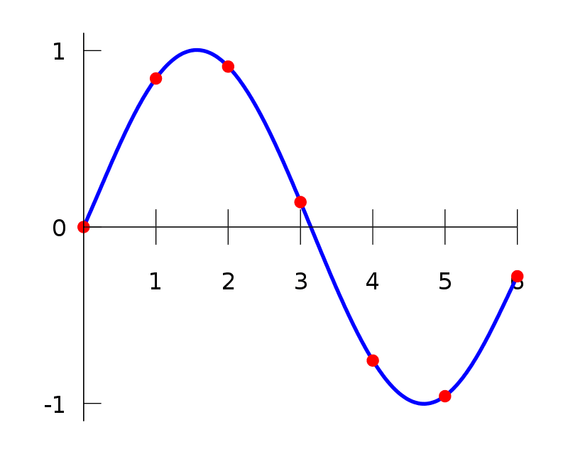

## Table of Contents

## What is interpolation in the context of investment analysis?

Interpolation in investment analysis is a method used to estimate values that fall between known data points. Imagine you have the price of a stock on two different dates, but you want to know what the price might have been on a date in between. Interpolation helps you guess that missing value by using the known prices before and after that date. It's like connecting the dots on a graph to fill in the gaps.

This technique is useful because it helps investors understand trends and make more informed decisions. For example, if you're looking at historical stock prices to predict future performance, interpolation can help you see the overall pattern more clearly. It's not perfect, and the estimates might not always be spot-on, but it gives you a better picture than just looking at the known data points alone.

## Why is interpolation important for financial analysts?

Interpolation is important for financial analysts because it helps them fill in missing information. When they look at data like stock prices or interest rates, there are often gaps where information is missing. By using interpolation, analysts can estimate what those missing values might have been. This makes their analysis more complete and helps them understand trends better.

For example, if an analyst wants to study the performance of a stock over time, but only has data for certain dates, interpolation can help fill in the days in between. This way, the analyst can see a smoother picture of how the stock price changed, instead of just seeing jumps from one known date to another. It's like connecting the dots to get a clearer view of the whole picture, which is crucial for making smart investment decisions.

## How does interpolation differ from extrapolation in investment analysis?

Interpolation and extrapolation are both methods used in investment analysis to estimate unknown values, but they work in different ways. Interpolation is used to guess the values that fall between known data points. For example, if you know the price of a stock on January 1st and February 1st, interpolation helps you estimate what the price might have been on January 15th. It's like filling in the gaps between what you already know.

On the other hand, extrapolation is used to predict values that are outside the range of your known data. If you know the price of a stock on January 1st and February 1st, extrapolation would help you guess what the price might be on March 1st. This method involves extending the trend you see in your data to make predictions about the future. While interpolation helps you see a clearer picture of what has already happened, extrapolation tries to look ahead.

## What are the common methods of interpolation used in finance?

In finance, one common method of interpolation is linear interpolation. This method works by drawing a straight line between two known points and using that line to guess the value in between. Imagine you know the price of a stock on two different dates. Linear interpolation assumes the price changed at a steady rate between those dates, so it's like connecting those two points with a straight line and reading off the value at the date you're interested in.

Another method is polynomial interpolation, which can be more complex. Instead of using a straight line, polynomial interpolation uses a curve that goes through all the known points. This can be useful when the data doesn't change in a straight line but follows a more wavy pattern. By fitting a curve to the data, you can get a more accurate guess of the values between the known points. However, this method can be trickier to use because it might overfit the data and create a curve that's too wiggly.

There's also spline interpolation, which is a bit like polynomial interpolation but tries to avoid the problem of overfitting. Spline interpolation uses different curves for different parts of the data, making sure each part fits smoothly with the next. This method can be really helpful when the data has a lot of ups and downs, as it gives a smooth and accurate way to fill in the gaps between known values.

## Can you explain linear interpolation and its application in investment analysis?

Linear interpolation is a simple way to guess the value of something between two known points. Imagine you know the price of a stock on January 1st and February 1st, but you want to know what it might have been on January 15th. Linear interpolation says the price changed at a steady rate between those two dates. So, you draw a straight line between the price on January 1st and the price on February 1st, and then you can read off the price on January 15th from that line. It's like connecting the dots with a straight line and using that line to fill in the gaps.

In investment analysis, linear interpolation is really useful because it helps analysts see a clearer picture of how prices or other financial data have changed over time. If an analyst only has data for certain dates, they can use linear interpolation to fill in the missing days. This makes it easier to spot trends and patterns, which is important for making smart investment decisions. For example, if an analyst is looking at the performance of a stock over a month but only has weekly data, linear interpolation can help them estimate the daily prices, giving them a smoother and more detailed view of the stock's behavior.

## How does polynomial interpolation work, and when might it be used in investment scenarios?

Polynomial interpolation is a bit more complex than linear interpolation. Instead of drawing a straight line between two points, it uses a curve that goes through all the known points. Imagine you have the price of a stock on several different dates, and you want to guess what the price might have been on a day in between. Polynomial interpolation fits a curve to all these points, which can be a wiggly line if the prices go up and down a lot. This method can give a more accurate guess of the in-between values, especially if the prices don't change in a straight line.

In investment scenarios, polynomial interpolation might be used when the data shows a lot of ups and downs. For example, if an analyst is looking at the monthly performance of a stock over a year, and the stock price has been very volatile, a simple straight line might not capture all the twists and turns. By using polynomial interpolation, the analyst can fit a curve that better matches the stock's ups and downs, giving a more detailed picture of how the stock price changed over time. This can help the analyst understand the stock's behavior more accurately, which is crucial for making informed investment decisions.

## What are the potential pitfalls of using interpolation in financial data analysis?

Using interpolation in financial data analysis can sometimes lead to problems. One big issue is that interpolation assumes the data changes smoothly between the known points. But in real life, stock prices and other financial data can jump around a lot. If you use interpolation to fill in the gaps, you might miss these sudden changes, which can lead to wrong guesses about what happened in between.

Another problem is that different methods of interpolation can give different results. For example, linear interpolation is simple but might not capture the ups and downs of the data well. Polynomial interpolation can fit a curve to the data, but if you use a high-degree polynomial, it might overfit and create a curve that's too wiggly. This can make the guesses between the known points less reliable. So, it's important to choose the right method and be careful about how you use it.

## How can interpolation be applied to estimate missing data points in financial time series?

Interpolation can help fill in the gaps in financial time series data, like stock prices, when some information is missing. Imagine you have the price of a stock on January 1st and February 1st, but you don't know what it was on January 15th. By using interpolation, you can guess what the price might have been on that missing date. The simplest way to do this is with linear interpolation, where you draw a straight line between the known prices and read off the value for January 15th from that line. This helps you see a smoother picture of how the stock price changed over time, even when some data is missing.

Another way to use interpolation is with polynomial interpolation, which is a bit more complex. Instead of a straight line, it fits a curve to all the known points. This can be useful if the stock price goes up and down a lot, because the curve can follow these changes more closely than a straight line. For example, if you have monthly stock prices and they're very volatile, polynomial interpolation can help you estimate the daily prices in a way that captures the ups and downs better. This gives you a more detailed view of the stock's behavior, which is important for making smart investment decisions.

## What role does interpolation play in the valuation of financial instruments?

Interpolation helps in the valuation of financial instruments by filling in missing data points. When you want to know the value of a stock or bond on a specific date but only have prices for other dates, interpolation lets you guess the missing value. For example, if you know the price of a stock on January 1st and February 1st, you can use interpolation to estimate what it might have been on January 15th. This helps analysts get a complete picture of how the price changed over time, even when some data is missing.

In practical terms, interpolation is useful because it helps analysts understand trends and make better decisions. If you're trying to value a financial instrument, like a bond, you might need to know its price on many different dates. By using interpolation to fill in the gaps, you can see a smoother and more accurate picture of how the price has changed. This can be important for deciding whether to buy or sell the instrument, or for predicting how its value might change in the future.

## How do advanced interpolation techniques, like spline interpolation, enhance investment analysis?

Spline interpolation is a fancy way to fill in missing data points in investment analysis. It's better than simple methods like drawing a straight line because it uses different curves to fit the data smoothly. Imagine you have the price of a stock on different days, but it goes up and down a lot. Spline interpolation can follow these ups and downs more closely than a straight line, so it gives a more accurate guess of what the price might have been on the days you're missing data for.

Using spline interpolation helps analysts see a clearer picture of how prices or other financial data change over time. When the data is really jumpy, this method can show the twists and turns better than other methods. This is important because it helps analysts understand trends and make smarter investment decisions. If you're trying to figure out if a stock is a good buy, knowing how its price has moved in the past can give you a better idea of what might happen next.

## What software tools are commonly used for interpolation in investment analysis?

In investment analysis, people often use software like Microsoft Excel for interpolation. Excel has built-in functions that can do simple linear interpolation easily. You just put in the known data points, and Excel can guess what the value might be in between. It's easy to use and many people already know how to work with Excel, so it's a popular choice.

For more advanced interpolation methods like polynomial or spline interpolation, analysts might use software like MATLAB or Python. These programs have special tools and libraries that can handle complex math better than Excel. They can fit curves to the data in a way that captures the ups and downs more accurately. This helps analysts get a better picture of how prices or other financial data change over time.

## Can you discuss a case study where interpolation significantly impacted investment decision-making?

Imagine a [hedge fund](/wiki/hedge-fund-trading-strategies) manager who was looking at the performance of a stock over the past year. They had monthly data but wanted to understand the daily movements to make a better investment decision. Using linear interpolation in Excel, they estimated the daily stock prices between the known monthly points. This helped them see a smoother trend and notice a pattern of small dips followed by sharp rises around the middle of each month. By recognizing this pattern, the manager decided to buy the stock just before these dips, expecting the price to rise soon after. This strategy, informed by the interpolated data, led to a significant profit for the fund.

In another case, a financial analyst was working on valuing a bond. They had the bond's price on specific dates but needed to know its value on other dates to calculate its yield accurately. The analyst used spline interpolation in Python to estimate the missing prices. This method was better because it could follow the bond's price movements more closely, even when they were very up and down. With the interpolated data, the analyst calculated a more precise yield, which showed the bond was undervalued. They recommended buying the bond, and when its price rose to match the true value, their clients made a good return on their investment.

## What is the Role of Interpolation in Algorithmic Trading?

Algorithmic trading systems leverage interpolation as a crucial tool to address the inevitable data gaps and ensure continuous data flow essential for making swift and informed trading decisions. In the fast-paced world of finance, these systems require precise and timely data inputs to optimize trades and maximize profits. Interpolation techniques, such as linear, polynomial, and spline interpolation, are employed to predict unknown values in data sets, thereby smoothing data representation and facilitating rapid decision-making processes, which are particularly vital in high-frequency trading environments.

Linear interpolation is one of the simplest methods utilized in [algorithmic trading](/wiki/algorithmic-trading). It estimates values within two known data points through a linear approach, offering a straightforward solution with minimal computational overhead. The formula for linear interpolation between two points $(x_0, y_0)$ and $(x_1, y_1)$ is:

$$
y = y_0 + \frac{(x - x_0) \cdot (y_1 - y_0)}{(x_1 - x_0)}
$$

This technique, despite its simplicity, provides efficient data estimation conducive for fast-paced trading systems that require minimal latency.

Polynomial interpolation, on the other hand, involves higher-order equations to fit a polynomial through a given set of data points. This method allows for capturing more complex market behaviors by fitting curves that better represent historical data trends. The Lagrange polynomial is a common polynomial interpolation approach, defined as:

$$
P(x) = \sum_{i=0}^{n} y_i \prod_{\substack{0 \leq j \leq n \\ j \neq i}} \frac{(x - x_j)}{(x_i - x_j)}
$$

This type of interpolation is beneficial when modeling financial data that exhibit non-linear patterns, offering improved accuracy over linear methods, though at the cost of increased computational demand.

Spline interpolation, particularly cubic splines, is also popular in algorithmic trading due to its ability to produce smooth and visually appealing curves while retaining computational efficiency. A cubic spline constructs piecewise polynomials between data points and enforces smoothness at each point and its first and second derivatives. This reduces oscillations common in high-degree polynomial fits, making splines ideal for robust modeling in algorithmically driven trading platforms.

Python provides robust libraries such as NumPy and SciPy to implement these interpolation techniques effectively. For instance:

```python
import numpy as np
from scipy.interpolate import interp1d

# Sample data points
x = np.array([0, 1, 2, 3])
y = np.array([0, 1, 4, 9])

# Linear interpolation
linear_interpolator = interp1d(x, y)

# Polynomial interpolation
from numpy.polynomial.polynomial import Polynomial
p = Polynomial.fit(x, y, deg=2)

# Spline interpolation
from scipy.interpolate import CubicSpline
spline = CubicSpline(x, y)

# Interpolating a new point
new_x = 1.5
linear_result = linear_interpolator(new_x)
polynomial_result = p(new_x)
spline_result = spline(new_x)
```

By utilizing these techniques, algorithmic trading systems can enhance the reliability and speed of their decision-making processes, ultimately leading to more accurate predictions and improved trading performance. However, while interpolation offers powerful benefits, traders must also be aware of its limitations, particularly in highly volatile and unpredictable market conditions where models may struggle to capture rapid changes accurately.

## References & Further Reading

[1]: Diebold, F.X., & Rudebusch, G.D. (1996). ["Measuring Business Cycles: A Modern Perspective."](https://www.nber.org/papers/w4643) National Bureau of Economic Research Working Paper No. 4643.

[2]: Hull, J.C. (2014). ["Options, Futures, and Other Derivatives."](https://books.google.com/books/about/Options_Futures_and_Other_Derivatives.html?id=t6CSAgAAQBAJ) Pearson Education.

[3]: James, G., Witten, D., Hastie, T., & Tibshirani, R. (2013). ["An Introduction to Statistical Learning."](https://link.springer.com/book/10.1007/978-1-0716-1418-1) Springer Texts in Statistics.

[4]: Press, W.H., Teukolsky, S.A., Vetterling, W.T., & Flannery, B.P. (2007). ["Numerical Recipes: The Art of Scientific Computing."](https://assets.cambridge.org/97805218/80688/frontmatter/9780521880688_frontmatter.pdf) Cambridge University Press.

[5]: Ruppert, D. (2004). ["Statistics and Data Analysis for Financial Engineering."](https://link.springer.com/book/10.1007/978-1-4939-2614-5) Springer.