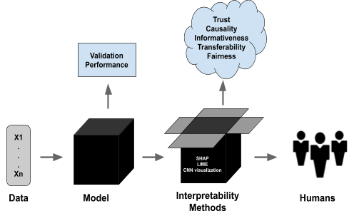

## Table of Contents

## What is interpretability in machine learning?

Interpretability in machine learning refers to how easily humans can understand and explain the decisions made by a machine learning model. When a model is interpretable, it's easier for people to trust and use it because they can see how it works and why it makes certain predictions. For example, if a model is used to decide whether to give someone a loan, interpretability helps explain why the loan was approved or denied based on factors like income, credit score, and employment history.

There are different ways to make models more interpretable. One common method is using simpler models, like decision trees, which are easy to understand because they break down decisions into a series of straightforward yes/no questions. Another approach is to use techniques like feature importance, which show which input variables have the biggest impact on the model's output. This helps people understand which factors are most influential in the model's decision-making process. While more complex models like deep neural networks can be very accurate, they are often less interpretable, making it harder to explain their decisions.

## Why is interpretability important in machine learning models?

Interpretability is important in machine learning because it helps people trust and understand the decisions made by a model. When a model's decisions can be explained easily, people are more likely to use it and feel confident about its predictions. For example, if a bank uses a machine learning model to approve or deny loans, customers and regulators want to know why certain decisions were made. If the model can show that it considered factors like income, credit score, and employment history, it becomes easier to trust and accept its decisions.

Additionally, interpretability helps in identifying and correcting biases or errors in the model. If a model's decision-making process is transparent, it's easier to spot if it's making unfair or incorrect predictions. For instance, if a model is found to be unfairly denying loans to certain groups of people, the reasons behind this can be investigated and corrected. This not only improves the model's fairness and accuracy but also ensures it complies with legal and ethical standards. Overall, interpretability makes machine learning models more reliable, accountable, and useful in real-world applications.

## What are the differences between interpretability and explainability?

Interpretability and explainability are related but different concepts in [machine learning](/wiki/machine-learning). Interpretability refers to how easy it is for a person to understand how a model works and makes decisions. A model is interpretable if you can look at it and see the logic behind its predictions. For example, a decision tree is very interpretable because you can follow the branches to see why a certain outcome was predicted. Interpretability is about the model's internal workings being clear and understandable.

Explainability, on the other hand, focuses on providing reasons or explanations for the model's outputs after the fact. It's about understanding the "why" behind a specific prediction. For example, if a model denies a loan, explainability would help provide a clear explanation like "the loan was denied because the applicant's credit score was too low." Explainability often involves techniques that are applied after the model has made a prediction, such as generating a report or a set of reasons that justify the outcome.

While both concepts aim to make machine learning more transparent and trustworthy, interpretability is about the inherent clarity of the model itself, whereas explainability is about providing post-hoc explanations for the model's decisions. In practice, a model can be interpretable but not very explainable if it's hard to articulate why a specific decision was made, and vice versa. Both are important for building trust and ensuring the ethical use of machine learning models.

## Can you explain some common techniques used to achieve model interpretability?

One common technique to achieve model interpretability is using simpler models like decision trees. A decision tree breaks down decisions into a series of yes/no questions, making it easy to follow the logic behind a prediction. For example, if a decision tree is used to approve loans, you can see the path taken to reach a decision: "Is the credit score above 700? If yes, is the income above $50,000? If yes, approve the loan." This clear structure makes decision trees highly interpretable. Another simple model is linear regression, which provides coefficients for each feature. These coefficients show how much each feature impacts the prediction, making it easy to understand the model's decision-making process.

Another technique is feature importance, which helps identify which input variables have the most influence on the model's output. For example, if a model is predicting house prices, feature importance can show that the number of bedrooms and the location have the biggest impact on the price. This helps explain why the model makes certain predictions. Techniques like SHAP (SHapley Additive exPlanations) values provide a way to assign a value to each feature for a specific prediction, showing how each feature contributes to the outcome. This method can be used with more complex models like random forests or neural networks, making them more interpretable by breaking down their decisions into understandable parts.

For more complex models like deep neural networks, techniques like LIME (Local Interpretable Model-agnostic Explanations) can be used. LIME works by creating a simpler, interpretable model around a specific instance to explain why the complex model made a certain prediction. For example, if a [neural network](/wiki/neural-network) is classifying images, LIME can show which parts of the image were most important for the classification. This helps make the decisions of complex models more understandable, even if the overall model remains a "black box." By using these techniques, we can make machine learning models more transparent and easier to trust.

## How does feature importance contribute to model interpretability?

Feature importance helps make machine learning models easier to understand by showing which input variables have the biggest impact on the model's predictions. For example, if a model is predicting house prices, feature importance can tell us that the number of bedrooms and the location are the most important factors. This makes it clear why the model thinks a certain house should be priced a certain way. By knowing which features matter most, people can trust the model more because they can see the logic behind its decisions.

In more complex models like random forests or neural networks, feature importance can be calculated using methods like SHAP (SHapley Additive exPlanations) values. SHAP values assign a score to each feature for a specific prediction, showing how each feature contributes to the outcome. For instance, if a model is deciding whether to approve a loan, SHAP values can show that the credit score had the biggest impact on the decision. This detailed breakdown helps explain the model's reasoning, making it more transparent and easier for people to understand and trust the model's predictions.

## What are Local Interpretable Model-agnostic Explanations (LIME) and how are they used?

Local Interpretable Model-agnostic Explanations (LIME) is a technique used to explain the predictions of complex machine learning models. LIME works by creating a simpler, easier-to-understand model around a specific prediction. It does this by changing the input a little bit many times and seeing how the complex model's prediction changes. This helps us understand which parts of the input are most important for the prediction. For example, if a neural network is classifying an image, LIME can show which parts of the image were most important for the classification.

LIME is very useful because it can be used with any type of model, not just simple ones. This means we can make even the most complicated models, like deep neural networks, more understandable. By using LIME, people can see why a model made a certain prediction, which helps build trust and makes the model more transparent. For instance, if a model is deciding whether to approve a loan, LIME can show that the applicant's credit score and income were the key factors in the decision. This makes it easier for people to understand and accept the model's decisions.

## How can SHAP (SHapley Additive exPlanations) values enhance model interpretability?

SHAP (SHapley Additive exPlanations) values help make machine learning models easier to understand by showing how much each feature contributes to a specific prediction. They do this by using a concept from game theory called Shapley values, which measure how much each player (or feature) contributes to the outcome of a game (or prediction). For example, if a model is deciding whether to approve a loan, SHAP values can show that the credit score had a big impact on the decision, while the applicant's age had a smaller impact. This makes it clear why the model made a certain prediction, helping people trust and understand the model better.

Using SHAP values, we can see not just which features are important overall, but how they affect a single prediction. This is very helpful for complex models like neural networks or random forests, where it's hard to see why a prediction was made. By breaking down each prediction into the contributions of different features, SHAP values make these models more transparent and easier to explain. For instance, if a model predicts a high house price, SHAP values can show that the number of bedrooms and the location were the key factors, making it easier for people to understand and accept the model's decisions.

## What role do partial dependence plots play in understanding model behavior?

Partial dependence plots help us see how changing one feature affects a model's predictions, while keeping all other features the same. Imagine you have a model that predicts house prices. A partial dependence plot can show how the price changes as the number of bedrooms increases, without changing things like location or size. This helps us understand the relationship between a single feature and the model's output, making the model's behavior clearer and easier to explain.

These plots are useful because they give a simple picture of how each feature impacts the model's predictions. For example, if the plot shows that house prices go up a lot with more bedrooms, it tells us that the number of bedrooms is a big [factor](/wiki/factor-investing) in the model's decision. By looking at these plots, people can get a better idea of how the model works and why it makes certain predictions, which helps build trust and makes the model more transparent.

## How can decision trees and rule-based models improve interpretability?

Decision trees and rule-based models help make machine learning models easier to understand. A decision tree works like a flowchart, where you ask yes/no questions and follow the branches to reach a decision. For example, if a model is deciding whether to approve a loan, it might ask, "Is the credit score above 700?" If yes, it might then ask, "Is the income above $50,000?" By following these questions, you can see exactly why the model made a certain decision. This clear and simple structure makes decision trees very interpretable because you can easily trace the path from the input to the output.

Rule-based models are similar but use sets of rules instead of a tree. These rules are like if-then statements that explain the model's logic. For instance, a rule might say, "If the credit score is above 700 and the income is above $50,000, then approve the loan." By looking at these rules, people can understand how the model works and why it makes certain predictions. Both decision trees and rule-based models make it easy for people to see the reasoning behind the model's decisions, which helps build trust and makes the model more transparent.

## What challenges are associated with achieving interpretability in deep learning models?

Deep learning models, like neural networks, can be really hard to understand because they have so many layers and connections. It's like trying to follow a very complicated recipe with lots of steps and ingredients. When these models make a prediction, it's not easy to see why they chose that answer. This is because the decisions are spread out over many layers, and each layer changes the data in small ways that add up to the final result. This makes it tough to explain the model's decisions in a way that people can easily understand.

To make [deep learning](/wiki/deep-learning) models more interpretable, people use special techniques like LIME and SHAP values. These methods help break down the model's decisions into simpler parts. For example, LIME can show which parts of an image were important for a prediction, and SHAP values can tell us how much each feature affected the outcome. But even with these tools, deep learning models can still be hard to fully understand because they are so complex. It's a bit like trying to explain a magic trick: you can see what happens, but figuring out how it all works together can be tricky.

## How do techniques like saliency maps help in interpreting neural networks?

Saliency maps help us understand neural networks by showing which parts of an input, like an image, are most important for the network's prediction. Imagine you're looking at a picture of a cat. A saliency map would highlight the cat's eyes, ears, and whiskers, showing that these parts were key for the network to identify it as a cat. By seeing these highlights, we can get a sense of what the neural network is focusing on when it makes a decision.

Using saliency maps makes complex neural networks easier to interpret because they give us a visual explanation of the model's reasoning. Instead of trying to understand the many layers and connections inside the network, we can look at the saliency map and see which features the network thinks are important. This helps build trust in the model because we can see that it's paying attention to the right things, making its decisions more transparent and easier to explain.

## What are some advanced methods for ensuring interpretability in complex models like ensemble methods?

Ensemble methods, like random forests or gradient boosting machines, combine many simpler models to make predictions. These models can be hard to understand because they use a lot of trees or other models together. To make them more interpretable, we can use techniques like feature importance and partial dependence plots. Feature importance helps us see which input variables are most important for the model's predictions. For example, if we're predicting house prices, feature importance can show that the number of bedrooms and the location matter a lot. Partial dependence plots show how changing one feature affects the prediction, keeping everything else the same. This helps us understand how each feature impacts the model's decisions, making the ensemble model easier to explain.

Another way to make ensemble methods more interpretable is by using techniques like SHAP (SHapley Additive exPlanations) values. SHAP values break down each prediction into the contributions of different features. For instance, if an ensemble model is deciding whether to approve a loan, SHAP values can show that the credit score had a big impact on the decision, while the applicant's age had a smaller impact. By understanding how each feature contributes to the final prediction, we can explain why the model made a certain decision. This makes ensemble methods more transparent and easier for people to trust and understand.