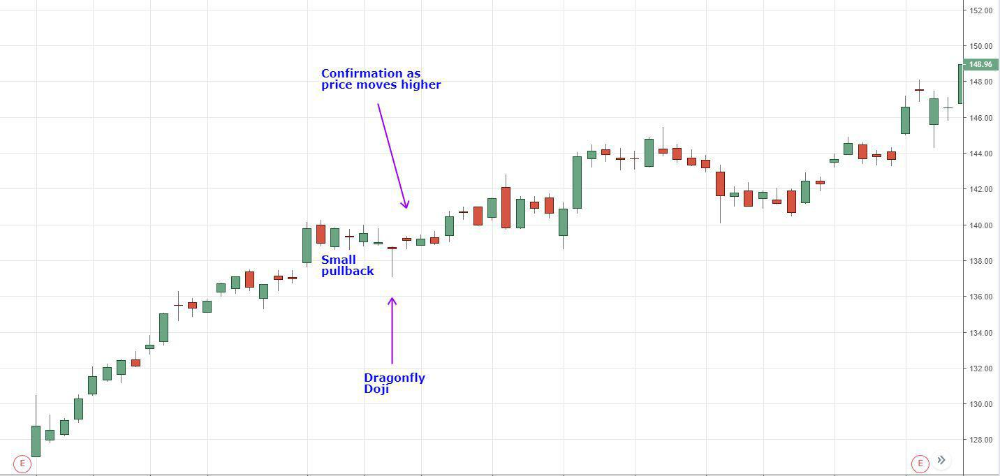

## Table of Contents

## What is a Dragonfly Doji pattern?

A Dragonfly Doji is a type of candlestick pattern seen in stock charts. It looks like a "T" and shows that the opening and closing prices of a stock are the same. The long lower shadow, or "tail," means that the stock price went down a lot during the day but then came back up to where it started.

This pattern is important because it can signal that the market might be getting ready to go up. When you see a Dragonfly Doji after a period where the stock price has been going down, it suggests that sellers are losing control and buyers might start pushing the price higher. Traders often watch for this pattern to help them decide when to buy a stock.

## How is a Dragonfly Doji pattern formed on a candlestick chart?

A Dragonfly Doji pattern forms on a candlestick chart when the opening and closing prices of a stock are the same, creating a horizontal line. This line is at the top of the candlestick, making it look like a "T". The long lower shadow, or tail, shows that during the trading day, the price dropped a lot but then came back up to the opening price by the end of the day.

This pattern is important because it can tell traders that the market might be ready to start going up. When you see a Dragonfly Doji after a time when the stock price has been going down, it means that the sellers are losing power. Buyers might start to take over and push the price higher. Traders look for this pattern to help them decide when it might be a good time to buy the stock.

## What does a Dragonfly Doji indicate about market sentiment?

A Dragonfly Doji shows that the market might be changing how it feels about a stock. When you see this pattern after the stock price has been going down, it means that sellers were in control at first. But by the end of the day, buyers stepped in and pushed the price back up to where it started. This tells us that the sellers are losing power and the buyers are starting to take over.

This change in market sentiment can be a sign that the stock price might start going up soon. Traders watch for a Dragonfly Doji because it can help them decide when to buy the stock. If they see this pattern, they might think it's a good time to buy because the market is showing that it's ready to move in a new direction.

## Can you explain the significance of a Dragonfly Doji in a downtrend?

A Dragonfly Doji in a downtrend is a big deal because it shows that the market might be ready to change direction. When you see this pattern after the stock price has been going down, it means that at first, sellers were in charge and pushed the price lower. But by the end of the day, buyers stepped in and brought the price back up to where it started. This tells us that the sellers are losing their power and the buyers are starting to take over.

This change in who's in control can be a sign that the stock price might start going up soon. Traders watch for a Dragonfly Doji because it can help them decide when to buy the stock. If they see this pattern, they might think it's a good time to buy because the market is showing that it's ready to move in a new direction. So, a Dragonfly Doji in a downtrend is like a signal that things might be about to get better for the stock.

## How should beginners interpret a Dragonfly Doji in their trading strategy?

For beginners, seeing a Dragonfly Doji on a chart can be a helpful sign. This pattern looks like a "T" and shows that the stock opened and closed at the same price after dropping a lot during the day. If you see this pattern after the stock has been going down for a while, it means that the people who were selling the stock are starting to lose control. The buyers are stepping in and pushing the price back up to where it started. This can be a good sign that the stock might start going up soon.

When you're new to trading, you can use the Dragonfly Doji to help decide when to buy a stock. If you see this pattern after a downtrend, it might be a good time to think about buying. But remember, it's not a guarantee that the stock will go up. You should always look at other things too, like the overall market and news about the company. Using the Dragonfly Doji along with other signs can help you make better choices about when to buy or sell.

## What are the key differences between a Dragonfly Doji and other Doji patterns?

A Dragonfly Doji is different from other Doji patterns because of its shape and what it tells us about the market. It looks like a "T" with a long lower shadow and no upper shadow. This means the stock opened, went down a lot during the day, but then came back up to close at the opening price. Other Doji patterns, like the Gravestone Doji, have different shapes. A Gravestone Doji looks like an upside-down "T" with a long upper shadow and no lower shadow. This shows the stock opened, went up a lot, but then came back down to close at the opening price.

The Dragonfly Doji and other Doji patterns also tell us different things about market sentiment. When you see a Dragonfly Doji after the stock has been going down, it suggests that sellers are losing power and buyers might start pushing the price up. On the other hand, a Gravestone Doji after the stock has been going up can mean that buyers are losing control and sellers might start pushing the price down. So, while all Doji patterns show a balance between buyers and sellers, the Dragonfly Doji specifically hints at a possible upward trend, while others like the Gravestone Doji hint at a possible downward trend.

## How reliable is the Dragonfly Doji as a reversal signal?

The Dragonfly Doji can be a good sign that a stock's price might start going up soon, but it's not always right. It's most useful when you see it after the stock has been going down for a while. This pattern shows that sellers were in control at first, but by the end of the day, buyers stepped in and pushed the price back up to where it started. This change can mean that the sellers are losing power and the buyers might take over, making the stock price go up. But, it's important to remember that this pattern doesn't work every time, and other things can affect the stock's price too.

To make the Dragonfly Doji a more reliable signal, you should look at other signs too. For example, if the stock's trading [volume](/wiki/volume-trading-strategy) is high on the day you see the Dragonfly Doji, it can make the signal stronger. Also, if other technical indicators, like the Relative Strength Index (RSI) or Moving Averages, show that the stock might be ready to go up, the Dragonfly Doji becomes more trustworthy. So, while the Dragonfly Doji can be a helpful sign, it's best to use it along with other information to make better trading choices.

## What are some common mistakes traders make when interpreting a Dragonfly Doji?

One common mistake traders make when interpreting a Dragonfly Doji is relying on it too much by itself. They see the pattern and think it's a sure sign that the stock price will go up, but they forget to look at other important things like the overall market trend, news about the company, and other technical indicators. The Dragonfly Doji is more reliable when it's part of a bigger picture, not just a single signal.

Another mistake is not paying attention to the volume of trades when the Dragonfly Doji appears. If the volume is low, the pattern might not be as strong a signal for a reversal. High volume can make the Dragonfly Doji more trustworthy because it shows that a lot of people are buying the stock at the end of the day, which supports the idea that the price might go up soon. So, traders should always check the volume along with the Dragonfly Doji to get a better sense of what might happen next.

## How can volume analysis enhance the interpretation of a Dragonfly Doji?

Volume analysis can make the Dragonfly Doji a better signal for traders. When you see a Dragonfly Doji, it means the stock opened, went down a lot during the day, but then came back up to close at the opening price. If this happens with a lot of trading going on, it's a stronger sign that the stock price might start going up soon. High volume shows that a lot of people are interested in the stock and are buying it at the end of the day, which supports the idea that the sellers are losing power and the buyers are taking over.

So, when you look at a Dragonfly Doji, always check the volume too. If the volume is low, the pattern might not be as strong a signal for a price reversal. But if the volume is high, it means more people are stepping in to buy the stock, making the Dragonfly Doji a more reliable sign that the stock's price could go up. Using volume along with the Dragonfly Doji helps traders make better decisions about when to buy or sell.

## What additional technical indicators should be used alongside a Dragonfly Doji for confirmation?

When you see a Dragonfly Doji, it's a good idea to use other technical indicators to make sure it's a strong signal. One helpful indicator is the Relative Strength Index (RSI). If the RSI is low, it means the stock might be oversold, which can support the idea that the stock price is ready to go up. Another useful indicator is the Moving Average Convergence Divergence (MACD). If the MACD line crosses above the signal line around the same time as the Dragonfly Doji, it can be a sign that the stock's price might start going up soon.

Another indicator to look at is the volume of trades. If the volume is high on the day you see the Dragonfly Doji, it makes the pattern more reliable. High volume shows that a lot of people are buying the stock at the end of the day, which supports the idea that the sellers are losing power. Also, checking the trend of the stock with Moving Averages can help. If the stock price is below a key Moving Average like the 50-day or 200-day average, and then you see a Dragonfly Doji, it can be a strong sign that the stock might start going up and cross above that average soon.

## How does the position of a Dragonfly Doji within a larger chart pattern affect its interpretation?

The position of a Dragonfly Doji within a larger chart pattern can change what it means for traders. If you see a Dragonfly Doji after the stock has been going down for a while, it's a good sign that the stock might start going up soon. This is because the pattern shows that sellers were in control at first, but by the end of the day, buyers stepped in and pushed the price back up to where it started. This change can mean that the sellers are losing power and the buyers might take over, making the stock price go up.

On the other hand, if a Dragonfly Doji appears during a time when the stock price is going up or staying the same, it might not be as strong a signal. In this case, the pattern might just show that the stock had a day with a lot of ups and downs but ended up where it started. So, it's important to look at where the Dragonfly Doji is on the chart and what the stock has been doing before you decide what it means.

## Can you discuss advanced strategies for trading based on the Dragonfly Doji pattern?

When using the Dragonfly Doji for advanced trading strategies, it's important to combine it with other technical indicators to increase its reliability. One strategy is to wait for confirmation from the next candlestick after the Dragonfly Doji. If the next candlestick shows a strong bullish move, it can confirm that the reversal is likely to happen. Traders might also look at the volume on the day of the Dragonfly Doji and the following day. High volume can make the pattern more trustworthy because it shows that many people are buying the stock, supporting the idea that the price might go up soon.

Another advanced strategy involves using the Dragonfly Doji in conjunction with trend lines and support levels. If the Dragonfly Doji forms right at a key support level or a trend line that has been holding the stock's price up, it can be a strong sign that the stock is about to reverse. Traders can set buy orders just above the high of the Dragonfly Doji, anticipating that the price will move up. Additionally, using other indicators like the Relative Strength Index (RSI) or Moving Average Convergence Divergence (MACD) can help confirm the reversal. If the RSI is in oversold territory or the MACD shows a bullish crossover around the same time as the Dragonfly Doji, it adds more weight to the signal that the stock's price might start going up.

## References & Further Reading

[1]: Nison, S. (1991). ["Japanese Candlestick Charting Techniques: A Contemporary Guide to the Ancient Investment Techniques of the Far East."](https://archive.org/details/japanesecandlest0000niso) New York Institute of Finance.

[2]: Jansen, S. (2020). ["Machine Learning for Algorithmic Trading: Second Edition"](https://www.amazon.com/Machine-Learning-Algorithmic-Trading-alternative/dp/1839217715) Packt Publishing.

[3]: Chan, E. (2009). ["Quantitative Trading: How to Build Your Own Algorithmic Trading Business"](https://github.com/ftvision/quant_trading_echan_book) Wiley.

[4]: Lopez de Prado, M. (2018). ["Advances in Financial Machine Learning"](https://www.amazon.com/Advances-Financial-Machine-Learning-Marcos/dp/1119482089) Wiley.

[5]: Aronson, D. R. (2007). ["Evidence-Based Technical Analysis: Applying the Scientific Method and Statistical Inference to Trading Signals"](https://onlinelibrary.wiley.com/doi/book/10.1002/9781118268315) Wiley.