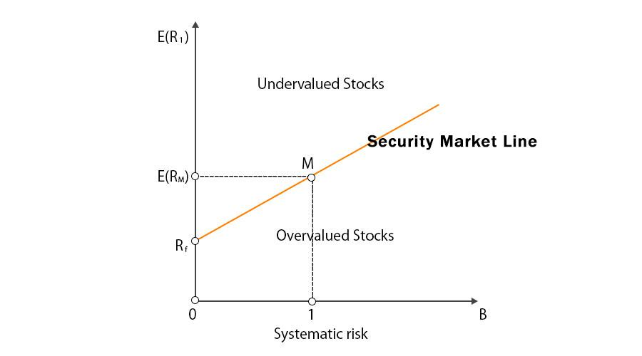

The concept of the Security Market Line (SML) is pivotal in understanding investment analysis and decision-making within the financial markets. Serving as a foundational element in the Capital Asset Pricing Model (CAPM), the SML visually represents the relationship between risk and expected return for securities. In its essence, the SML provides a benchmark for evaluating the performance of individual investments against market expectations, offering investors an invaluable tool to assess risk-adjusted returns.

The SML is instrumental in guiding investment strategies by bridging traditional financial theories with cutting-edge trading technologies. Its representation of systemic risk, captured through the beta coefficient, enables investors to identify securities that may offer favorable returns relative to their risk profiles. The mathematical underpinnings of the SML are ingrained in the CAPM formula:



$$
E(R_i) = R_f + \beta_i (E(R_m) - R_f)
$$

where $E(R_i)$ is the expected return of the investment, $R_f$ is the risk-free rate, $\beta_i$ is the beta of the investment, and $E(R_m)$ is the expected market return. This equation clarifies how securities are evaluated based on their systemic risk in relation to the overall market.

The evolving landscape of automated trading strategies also leverages the SML, with algorithmic trading systems utilizing its insights to refine investment decisions. These systems are capable of processing extensive market data, adjusting investment portfolios in response to shifts in risk-return dynamics as indicated by the SML. By automating the analysis of market conditions, algorithmic trading technologies can execute trades with speed and precision that surpass human capabilities.

In today's dynamic market environment, the practical applications of the SML remain relevant and crucial. While it provides a structured framework to understand the interplay between risk and return, the SML's insights are best utilized in conjunction with advanced technological tools and methods. Investments strategies integrating these principles can achieve enhanced outcomes by remaining adaptive to market changes while acknowledging the inherent assumptions and limitations of traditional financial models like the SML.

## Table of Contents

## Understanding the Security Market Line (SML)

The Security Market Line (SML) is an essential component of the Capital Asset Pricing Model (CAPM), offering investors insights into the relationship between risk and expected return. As a graphical representation, the SML aids in visualizing this tradeoff, providing a clear framework for assessing the value of individual securities. 

The SML graph plots beta values on the x-axis and expected returns on the y-axis. Beta is a measure of a security's systemic risk relative to the market as a whole. The intercept on the y-axis represents the risk-free rate, which is the theoretical return of an investment with zero risk, typically proxied by government Treasury bills. The SML's upward slope illustrates the principle that with higher systemic risk comes higher expected returns, in line with the risk-return tradeoff fundamental to CAPM.

This graphical representation functions as a benchmark for evaluating the expected return of securities. Specifically, it provides a straightforward means of determining whether a security is undervalued or overvalued. A security plotted above the SML is considered undervalued, as it offers a higher return at a specific level of systemic risk compared to the benchmark. Conversely, a security placed below the SML suggests it is overvalued, delivering lower returns for its level of risk.

The formula for the SML used in CAPM is:

$$
E(R_i) = R_f + \beta_i (E(R_m) - R_f)
$$

Where:
- $E(R_i)$ is the expected return of the investment
- $R_f$ is the risk-free rate
- $\beta_i$ is the beta of the investment
- $E(R_m)$ is the expected return of the market

This formula encapsulates the expected return as a function of the risk-free rate plus a risk premium, the latter being the product of the security's beta and the market risk premium $(E(R_m) - R_f)$. Thus, the SML not only provides a graphical tool for individual security assessment but also encapsulates the mathematical relationship between risk and return in the financial markets.

## SML Graph and Investment Decisions

The Security Market Line (SML) is an essential tool for investors aiming to understand the relationship between risk and expected return, aiding in the decision-making process for asset allocation. The SML is represented as a straight line on a graph where the x-axis denotes the beta ($\beta$) of a security, and the y-axis represents the expected return ($E(R)$). The line intercepts the y-axis at the risk-free rate of return ($R_f$), illustrating the additional return expected for an increase in risk, specifically measured as systematic risk.

The SML equation is given by:

$$
E(R_i) = R_f + \beta_i (E(R_m) - R_f)
$$

where:
- $E(R_i)$ is the expected return of the security,
- $R_f$ is the risk-free rate,
- $E(R_m)$ is the expected return of the market portfolio,
- $\beta_i$ is the beta of the security, representing its sensitivity to market movements.

Investment decisions are influenced by the location of securities relative to the SML. Securities situated above the SML are deemed undervalued, suggesting that they offer returns higher than required for their level of risk. Consequently, these securities present attractive opportunities as they potentially provide superior risk-adjusted returns. Conversely, securities below the SML are considered overvalued, implying that they yield returns lower than justified by their risk. Investors typically avoid such securities unless other qualitative factors justify their inclusion in a portfolio.

By analyzing a security's position on the SML, investors can make informed choices about incorporating specific assets into their portfolios. A security's risk-return profile, defined by its beta and expected return, assists in determining whether it aligns with the investor's return expectations for a given level of risk. Through this assessment, investors optimize their portfolios, balancing the trade-off between risk and return in line with their investment objectives.

## Differences Between SML and CML

While both the Security Market Line (SML) and the Capital Market Line (CML) stem from the Capital Asset Pricing Model (CAPM), they have distinct roles in financial analysis, focusing on different aspects of risk and return evaluation.

SML is primarily concerned with individual securities, examining the tradeoffs between systemic risk (represented by beta) and expected return. It captures the relationship through the CAPM equation:

$$

E(R_i) = R_f + \beta_i (E(R_m) - R_f) 
$$

where $E(R_i)$ is the expected return of the security, $R_f$ is the risk-free rate, $\beta_i$ is the beta of the security, and $E(R_m)$ is the expected market return. This formula helps pinpoint if a security is fairly valued by comparing its position on the SML: those above the line may be undervalued (offering better risk-adjusted returns), while those below could be overvalued.

Conversely, the CML evaluates entire portfolios, specifically focusing on efficient portfolios that include the optimal trade-off between risk and return when both risky and risk-free assets are considered. The CML represents portfolios combining the market portfolio with a risk-free asset, and its equation is:

$$

E(R_p) = R_f + \frac{E(R_m) - R_f}{\sigma_m} \sigma_p 
$$

where $E(R_p)$ is the expected return on the portfolio, $R_f$ is the risk-free rate, $E(R_m)$ is the expected return of the market, $\sigma_m$ is the standard deviation of the market return, and $\sigma_p$ is the standard deviation of the portfolio's return. The primary concern of CML is how to efficiently allocate resources between risky and risk-free assets, indicating that only systematic risk is rewarded with higher returns.

Understanding the differences between these lines is crucial for investors. The SML focuses on systemic (market) risk for individual securities, aiding investors in making decisions about specific stock investments based on their risk profiles. On the other hand, the CML is concerned with the overall risk-return profile of portfolios and emphasizes the benefits of diversification, assessing how investors can manage their portfolios to achieve optimal risk-return combinations. This distinct segmentation helps investors tailor strategies based on their risk tolerance and investment objectives, whether focusing on individual stock selection or broader portfolio construction.

## Algorithmic Trading and SML

Algorithmic trading incorporates the Security Market Line (SML) to improve the efficiency and effectiveness of trading strategies by identifying undervalued and overvalued securities systematically. This advanced trading approach uses computer algorithms to execute trades with minimal human intervention, relying on quantitative models to analyze market data and make trading decisions in real-time.

The application of SML within [algorithmic trading](/wiki/algorithmic-trading) is centered around its ability to delineate the expected return of an investment given its systematic risk, characterized by beta ($\beta$). The SML formula, derived from the Capital Asset Pricing Model (CAPM), is as follows:

$$
E(R_i) = R_f + \beta_i \times (E(R_m) - R_f)
$$

Where:
- $E(R_i)$ represents the expected return of the investment.
- $R_f$ is the risk-free rate.
- $\beta_i$ is the beta of the investment.
- $E(R_m)$ is the expected return of the market.

Algorithmic trading systems utilize this formula to determine whether a security is positioned above or below the SML. Securities positioned above the SML are considered to offer higher returns for their risk, thus potentially undervalued, while those below may be overvalued.

By processing vast amounts of market data swiftly, algorithms can evaluate shifts in the SML caused by changes in market conditions, including [interest rate](/wiki/interest-rate-trading-strategies) adjustments and economic indicators. The flexibility and speed of algorithmic systems allow them to recalibrate the risk-return profile of portfolios dynamically. Here's a basic Python example illustrating how such a system might identify a security's position relative to the SML and make a trading decision:

```python
def evaluate_security(beta, risk_free_rate, expected_market_return, actual_return):
    expected_return = risk_free_rate + beta * (expected_market_return - risk_free_rate)

    if actual_return > expected_return:
        return "Undervalued"
    elif actual_return < expected_return:
        return "Overvalued"
    else:
        return "Fairly Valued"

# Example usage
beta = 1.2
risk_free_rate = 0.02
expected_market_return = 0.08
actual_return = 0.10

status = evaluate_security(beta, risk_free_rate, expected_market_return, actual_return)
print(f"The security is {status}.")
```

This example system evaluates whether a security's actual return exceeds its expected return as calculated by the SML, thus qualifying it as undervalued, overvalued, or fairly valued. Rapid adjustments based on such assessments enable algorithmic trading platforms to optimize portfolios for enhanced returns aligned with SML insights.

This integration of SML into algorithmic trading thus empowers traders to harness sophisticated quantitative models, ensuring investment portfolios are aligned with strategic objectives while adapting to immediate market shifts.

## Challenges and Limitations of SML

While the Security Market Line (SML) provides a structured framework for evaluating the risk-return dynamics of individual securities, there are inherent challenges and limitations to its application.

Firstly, the SML relies on the assumption of market efficiency, suggesting that securities are priced at levels reflecting all available information. However, real-world markets often deviate from this ideal due to factors such as informational asymmetries, investor behavior, and market anomalies [Fama, E. F. (1970). Efficient Capital Markets: A Review of Theory and Empirical Work]. These deviations can lead to discrepancies in how accurately the SML reflects a security’s true expected return for a given risk level.

Another critical limitation is the SML’s dependence on beta ($\beta$), which is used as the sole measure of systematic risk. Beta measures a security's sensitivity to market movements but does not capture other risk factors that can impact returns. For example, factors like [liquidity](/wiki/liquidity-risk-premium) risk, interest rate risk, and specific industry risks are unaccounted for when using beta alone [Ross, S. A. (1976). The Arbitrage Theory of Capital Asset Pricing]. This narrow focus may result in an incomplete risk assessment, potentially leading to suboptimal investment decisions.

To address these limitations, investors should integrate SML analysis with other qualitative and quantitative assessments. A comprehensive investment analysis might involve multi-[factor](/wiki/factor-investing) models, such as the Fama-French three-factor model, which extends beyond beta to include size and value factors in explaining returns [Fama, E. F., & French, K. R. (1993). Common risk factors in the returns on stocks and bonds]. Additionally, more sophisticated statistical methods and [machine learning](/wiki/machine-learning) techniques can be used to account for a broader spectrum of risks and to improve the precision of risk-return estimations.

For instance, in Python, an extension of the CAPM using the Fama-French model can be illustrated as follows:

```python
import statsmodels.api as sm
import pandas as pd

# Assuming df contains columns 'excess_return', 'market_excess_return', 'SMB', and 'HML'
X = df[['market_excess_return', 'SMB', 'HML']]
X = sm.add_constant(X)
y = df['excess_return']

model = sm.OLS(y, X).fit()
print(model.summary())
```

This example shows how an investor might analyze stock returns using additional factors beyond beta, typically applied in the traditional SML context. Combining these insights can provide a more robust framework for investment decision-making, acknowledging securities' multifaceted risk-return nature.

Ultimately, while the SML offers valuable insights, investors should use it as part of a broader toolkit that incorporates other models and empirical assessments to mitigate its limitations and adapt to market realities.

## Conclusion

The Security Market Line (SML) remains a cornerstone in financial theory and practice, providing a clear framework for understanding the intricate dynamics of risk and return in financial markets. By representing the relationship between the expected return of a security and its beta, the SML illustrates the fundamental tradeoff, highlighting the potential rewards relative to inherent risks. This graphical tool not only elucidates the foundational principles of the Capital Asset Pricing Model (CAPM) but also serves as a critical guide for investment decisions.

In the modern era of finance, the integration of advanced technologies such as algorithmic trading has augmented the applicability and significance of the SML. These technologies leverage SML's insights to devise sophisticated trading strategies, enabling the rapid assessment of market conditions and adjustment of portfolios. Algorithmic systems can efficiently utilize the SML to identify undervalued or overvalued securities, optimizing the risk-adjusted returns of investment portfolios. For instance, automated algorithms can programmatically calculate expected returns using the CAPM formula:

$$
E(R_i) = R_f + \beta_i (E(R_m) - R_f)
$$

where $E(R_i)$ is the expected return on investment, $R_f$ is the risk-free rate, $\beta_i$ represents the beta of the investment, and $E(R_m)$ is the expected market return. This calculation is pivotal in algorithmic trading for determining if a security aligns with the desired risk-return profile.

Despite its utility, investors must remain cognizant of the SML's limitations. The model assumes market efficiency and relies on beta as the singular measure of risk, overlooking other potential risk factors. This singular focus might not capture the complexity of real-world financial markets, where numerous variables can influence security returns. As such, while the SML provides a structured approach, it should be complemented with other qualitative and quantitative metrics for a more comprehensive analysis. 

In conclusion, the Security Market Line continues to be an invaluable tool in both traditional and modern investment practices. As investors build and refine their strategies, it is crucial to harness the insights provided by the SML while exercising caution regarding its assumptions and potential oversights. By doing so, investors can better navigate the complexities of financial markets and enhance their decision-making processes.

## References & Further Reading

[1]: ["Capital Market Theory: CAPM and APT."](https://thisvsthat.io/apt-vs-capm) CFA Institute

[2]: Fama, E. F. (1970). ["Efficient Capital Markets: A Review of Theory and Empirical Work."](https://www.jstor.org/stable/2325486) The Journal of Finance, 25(2), 383-417.

[3]: Ross, S. A. (1976). ["The Arbitrage Theory of Capital Asset Pricing."](https://www.sciencedirect.com/science/article/pii/0022053176900466) Journal of Economic Theory, 13(3), 341-360.

[4]: Fama, E. F., & French, K. R. (1993). ["Common risk factors in the returns on stocks and bonds."](https://www.sciencedirect.com/science/article/pii/0304405X93900235) Journal of Financial Economics, 33(1), 3-56.

[5]: ["Quantitative Finance For Dummies"](https://www.amazon.com/Quantitative-Finance-Dummies-Steve-DPhil/dp/1118769465) by Steve Bell

[6]: ["Algorithmic Trading: Winning Strategies and Their Rationale"](https://books.google.com/books/about/Algorithmic_Trading.html?id=WAlFDwAAQBAJ) by Ernest P. Chan