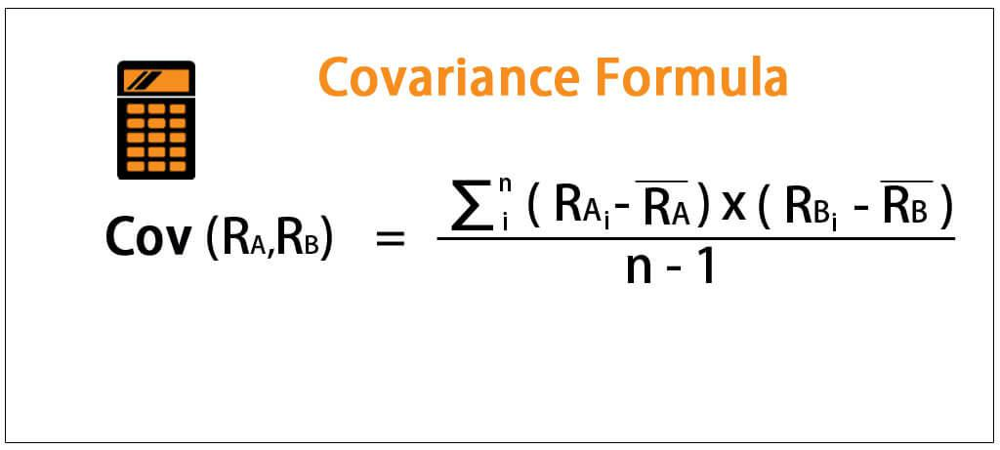

Algorithmic trading, often referred to as algo trading, has transformed financial markets by enabling more rapid and accurate trading strategies. Central to these strategies is the examination of the relationships between different variables through statistical measures like covariance and correlation. These tools are crucial for understanding and predicting the movement of asset prices, thus allowing traders to make informed decisions and optimize algorithmic trading performance.

Covariance and correlation are pivotal in quantifying how two variables, such as asset prices, move concerning each other. Covariance measures the directional relationship between variables, indicating whether they tend to move in the same direction or opposite. This measurement, while informative, does not provide the strength of the relationship. On the other hand, correlation offers a standardized gauge of both the direction and strength of the linear relationship between two variables. These insights assist traders in developing robust trading algorithms by revealing how different assets interact within the market.



Understanding and applying these statistical concepts allows traders to manage market risk effectively. By accurately analyzing covariance and correlation, traders can enhance their decision-making processes, particularly in managing portfolios where diversification is key. This knowledge aids in creating strategies that account for potential market changes and asset interactions, leading to more stable and profitable trading outcomes.

In summary, through the application of statistical analysis, particularly the calculation and interpretation of covariance and correlation, traders can build more reliable trading algorithms. This understanding contributes significantly to mitigating risks and maximizing returns, underscoring the importance of these statistical measures in algorithmic trading.

## Table of Contents

## Understanding Covariance and Correlation

Covariance and correlation are fundamental statistical measures that elucidate how two variables move in relation to each other, offering insights into their linear relationships. Covariance indicates the direction of these relationships, whether positive or negative, but it does not provide information about the strength of the relationship. Positive covariance suggests that two variables tend to increase or decrease together, while negative covariance indicates that one variable increases as the other decreases. However, the actual value of covariance is influenced by the units of measurement, which can make interpretation challenging.

Mathematically, the covariance between two variables $X$ and $Y$ is expressed as:

$$
\text{Cov}(X, Y) = \frac{\sum{(X_i - \mu_X)(Y_i - \mu_Y)}}{n}
$$

Here, $X_i$ and $Y_i$ are individual data points, $\mu_X$ and $\mu_Y$ are the means of $X$ and $Y$, respectively, and $n$ is the number of observations. This formula calculates the average product of the deviations of each pair from their respective means, highlighting covariance as an unstandardized measure.

On the other hand, correlation is a standardized form of covariance, providing both the strength and direction of a relationship on a dimensionless scale ranging from -1 to 1. This standardization is achieved by dividing covariance by the product of the standard deviations of the variables. The most commonly used measure of correlation is the Pearson correlation coefficient, defined as:

$$
r_{XY} = \frac{\text{Cov}(X, Y)}{\sigma_X \sigma_Y}
$$

where $\sigma_X$ and $\sigma_Y$ are the standard deviations of $X$ and $Y$. A correlation value closer to 1 implies a strong positive linear relationship, whereas a value closer to -1 denotes a strong negative linear relationship. A correlation around 0 suggests no linear relationship.

In trading, understanding the movement of assets relative to each other using covariance and correlation is crucial. These measures assist traders in gauging how assets may react to market events, supporting risk management and portfolio diversification. By determining whether assets move in tandem or show independent behaviors, investors can tailor strategies to mitigate risk or pursue potential returns. Portfolio construction often relies on correlation analysis to combine assets that do not exhibit significant correlation, thus reducing overall portfolio [volatility](/wiki/volatility-trading-strategies) and enhancing returns.

## Mathematical Formulations

Covariance and correlation are fundamental concepts in statistical analysis, particularly in finance and [algorithmic trading](/wiki/algorithmic-trading). Covariance measures how two variables change together. Mathematically, the covariance between two variables $X$ and $Y$ is calculated as follows:

$$
\text{Cov}(X, Y) = \frac{1}{n} \sum_{i=1}^{n} (X_i - \bar{X})(Y_i - \bar{Y})
$$

where $n$ is the number of data points, $X_i$ and $Y_i$ are the individual data points, and $\bar{X}$ and $\bar{Y}$ are the means of $X$ and $Y$ respectively. This equation highlights that covariance is the average of the product of the deviations of each data point from its mean.

While covariance provides an indication of the direction of the linear relationship between variables, it is scale-dependent, thus difficult to interpret without context. To overcome this limitation, correlation normalizes the covariance by the standard deviations of the variables, making it dimensionless. The formula for the correlation coefficient $r$ between two variables $X$ and $Y$ is:

$$
r = \frac{\text{Cov}(X, Y)}{\sigma_X \sigma_Y}
$$

where $\sigma_X$ and $\sigma_Y$ are the standard deviations of $X$ and $Y$ respectively. The resulting correlation coefficient ranges from -1 to 1, indicating both the strength and direction of a linear relationship. A correlation of 1 implies a perfect positive linear relationship, -1 a perfect negative linear relationship, and 0 suggests no linear relationship.

Pearson's correlation coefficient, derived as described, is the most widely used method for assessing linear relationships between variables. It is well-suited for capturing linear dependencies but may not effectively describe nonlinear relationships.

To automate these calculations in Python, common libraries like NumPy can be employed:

```python
import numpy as np

# Sample data points
X = np.array([1, 2, 3, 4, 5])
Y = np.array([2, 4, 6, 8, 10])

# Calculating covariance
cov_matrix = np.cov(X, Y, bias=True)  # `bias=True` for population covariance
covariance = cov_matrix[0, 1]

# Calculating Pearson's correlation coefficient
correlation = np.corrcoef(X, Y)[0, 1]

print("Covariance:", covariance)
print("Pearson's Correlation Coefficient:", correlation)
```

Understanding these mathematical foundations allows traders to accurately measure relationships between financial variables, facilitating better strategy development and risk management in algorithmic trading.

## Differences Between Covariance and Correlation

Covariance and correlation are fundamental statistical measures that provide insights into the nature of relationships between two variables. Covariance, at its core, measures the degree to which two variables change together. A positive covariance indicates that the variables tend to move in the same direction, whereas a negative covariance suggests they move in opposite directions. However, one significant limitation of covariance is its sensitivity to the units of measurement, making its interpretation more challenging. The value of covariance is expressed in the product of the units of the two variables, leading to difficulties when comparing covariances across different datasets or variables.

On the other hand, correlation provides a standardized measure of the relationship between two variables by normalizing covariance. This standardization is achieved by dividing the covariance by the product of the standard deviations of the variables, resulting in a dimensionless value that ranges from -1 to 1. This range facilitates easier interpretation, where:

- A correlation of +1 indicates a perfect positive linear relationship.
- A correlation of -1 indicates a perfect negative linear relationship.
- A correlation of 0 suggests no linear relationship between the variables.

The normalization process allows correlation to be invariant to the scale of the measurements, enabling it to provide a clearer picture of the strength and direction of the linear relationship regardless of the units used.

Understanding these differences is crucial for determining the appropriate measure to use in analysis. For instance, when comparing relationships across different datasets or contexts where variable scales differ, correlation is the preferred choice because of its standardized scale. In contrast, covariance might be useful in scenarios where the specific magnitude of joint variation is of interest, particularly when working within the same unit system or within a controlled framework where units are not a concern.

## Calculating Covariance and Correlation

Calculating covariance and correlation is fundamental in statistical analysis and algorithmic trading. The process begins with covariance, which measures the degree to which two variables change together. To calculate covariance, follow these steps:

1. **Compute the Mean of Each Variable**: For each of the two variables, determine their respective means. If you have two variables, $X$ and $Y$, with values $x_1, x_2, \ldots, x_n$ and $y_1, y_2, \ldots, y_n$, their means $\bar{X}$ and $\bar{Y}$ are given by:
$$
   \bar{X} = \frac{1}{n}\sum_{i=1}^{n} x_i, \quad \bar{Y} = \frac{1}{n}\sum_{i=1}^{n} y_i

$$

2. **Determine Deviations**: For each data point, calculate the deviation from the mean for both variables. This means obtaining $(x_i - \bar{X})$ and $(y_i - \bar{Y})$ for each pair.

3. **Average the Products of Deviations**: Multiply each pair of deviations and calculate the average:
$$
   \text{Cov}(X, Y) = \frac{1}{n-1} \sum_{i=1}^{n} (x_i - \bar{X})(y_i - \bar{Y})

$$

Once covariance is calculated, correlation can be determined to assess both the strength and direction of the linear relationship between the variables. Correlation standardizes covariance as follows:

1. **Compute the Standard Deviations**: Determine the standard deviations of both variables, $\sigma_X$ and $\sigma_Y$:
$$
   \sigma_X = \sqrt{\frac{1}{n-1} \sum_{i=1}^{n} (x_i - \bar{X})^2}, \quad \sigma_Y = \sqrt{\frac{1}{n-1} \sum_{i=1}^{n} (y_i - \bar{Y})^2}

$$

2. **Normalize Covariance**: Divide the covariance by the product of the standard deviations of the two variables to obtain the correlation coefficient $r$:
$$
   r = \frac{\text{Cov}(X, Y)}{\sigma_X \sigma_Y}

$$

   The value of $r$ ranges from -1 to 1, indicating the direction and strength of the correlation.

Modern computational tools significantly ease these calculations. Python, a popular programming language for data analysis, offers efficient libraries such as NumPy and pandas to perform these computations. Here is an example using Python:

```python
import numpy as np
import pandas as pd

# Example data
X = np.array([1, 2, 3, 4, 5])
Y = np.array([2, 4, 6, 8, 10])

# Calculating covariance
covariance = np.cov(X, Y, ddof=0)[0][1]

# Calculating correlation
correlation = np.corrcoef(X, Y)[0][1]

print(f"Covariance: {covariance}")
print(f"Correlation: {correlation}")
```

This Python code snippet demonstrates the use of NumPy to calculate covariance and correlation, showcasing the ease with which traders can implement data-driven strategies in algorithmic trading.

## Importance in Algorithmic Trading

Covariance and correlation are crucial tools for algorithmic trading as they provide insights into the interactions between different financial assets. By understanding these interactions, traders can develop robust risk management strategies. Covariance measures the directional relationship between asset returns, helping traders assess whether the returns on two assets tend to move in the same direction (positive covariance) or in opposite directions (negative covariance). However, it does not offer insights into the strength of this relationship. Correlation, on the other hand, provides both the direction and strength of the relationship between assets on a standardized scale. This makes it particularly valuable for assessing how tightly linked asset movements are, with values ranging from -1 (perfect negative correlation) to 1 (perfect positive correlation), and 0 indicating no correlation.

These statistical measures are instrumental in forming diversified portfolios. Diversification aims to reduce overall risk by combining assets that do not move in sync, thereby minimizing the impact of a negative move in any single asset. By analyzing correlation among assets, traders can construct portfolios that are optimized for minimizing risk while maximizing potential returns.

Algorithmic trading capitalizes on the insights provided by covariance and correlation through various strategies. One popular strategy is [pair trading](/wiki/pair-trading), which involves identifying two assets with a strong historical correlation. The trader expects that any divergence from this historical correlation will be temporary. Hence, they trade two correlated assets by going long on one and short on the other when their prices diverge, anticipating a reversion to the mean of the correlation.

Risk adjustment strategies in algorithmic trading also heavily rely on these measures. By continuously monitoring the correlation between different assets, traders can dynamically adjust their positions to account for changing market conditions and correlations. This adaptability is crucial for exploiting market inefficiencies, as historical correlations can change over time due to a plethora of factors including economic events, policy changes, or market sentiment.

In practice, implementing these strategies often involves using programming languages like Python, which provides powerful libraries such as NumPy and pandas for calculating covariance and correlation. For example, to compute the correlation matrix of asset returns in Python:

```python
import pandas as pd
import numpy as np

# Sample DataFrame 'df' containing asset returns
# 'df' columns could be asset names, and rows are individual time periods
correlation_matrix = df.corr()
```

This code snippet calculates the correlation matrix, which can be used to visualize and analyze the dependencies across multiple assets, facilitating informed decision-making in algorithmic trading. Through these approaches, covariance and correlation not only support the development of risk management strategies but also improve the efficacy of trading models by enabling swift responses to market changes.

## Applications in Trading Strategies

Portfolio diversification is a key strategy in managing financial risk, which is significantly enhanced by understanding asset correlations. When correlations among assets in a portfolio are low or negative, these assets tend not to move in tandem, thus reducing the portfolio's overall risk. This dissociation means that when one asset experiences a decline, others may remain stable or increase, smoothing out potential losses. For example, during a market downturn, an investor holding both equities and bonds might see their bond holdings rise in value even as stocks fall, thereby stabilizing returns. 

Pair trading, another strategy, relies on the historical correlation patterns between two securities. This approach involves identifying two assets that have historically moved together. When their prices diverge from this historical correlation, a pair trade exploits the expectation that their prices will revert to their long-term correlation pattern. An investor might take a long position in the undervalued asset while shorting the overvalued one, profiting from the anticipated reversion to mean price behavior. This technique is particularly advantageous in markets where asset prices temporarily deviate from historical norms due to market inefficiencies or psychological factors.

Risk assessment is fundamentally supported by an understanding of asset correlations as it helps forecast the potential impact of market fluctuations on a portfolio. By modeling these correlations, traders can better predict portfolio volatility and potential exposure to systemic risk. For instance, if two assets demonstrate a strong positive correlation, a simultaneous downturn could amplify losses, emphasizing the need for balanced diversification.

To apply these strategies, traders often employ statistical software and programming languages such as Python. Libraries such as NumPy and pandas are valuable for calculating correlations and performing statistical analyses across large datasets. For instance, calculating the Pearson correlation coefficient to understand the relationship between asset returns can be done efficiently:

```python
import numpy as np
import pandas as pd

# Sample data: daily returns of two assets
returns_data = pd.DataFrame({
    'Asset1': [0.01, 0.02, -0.01, 0.005, -0.02],
    'Asset2': [-0.01, 0.015, 0.02, -0.005, 0.01]
})

# Calculating the correlation matrix
correlation_matrix = returns_data.corr()
print(correlation_matrix)
```

This code outputs the correlation matrix, indicating how returns on different assets are related. Analyzing these relationships allows traders to craft strategies that capitalize on statistical dependencies, thereby optimizing for risk-adjusted returns. Overall, leveraging covariance and correlation metrics provides traders with powerful tools for constructing resilient trading strategies that can withstand market volatility.

## Practical Examples and Exercises

Applying covariance and correlation in practical scenarios is crucial for understanding their applications in trading strategies. This process involves analyzing historical asset data to compute these statistical measures and interpret their significance in algorithmic trading. Below are practical examples and exercises that can help solidify these concepts.

### Historical Asset Data Analysis

To begin with the computation of covariance and correlation, one can use historical asset data, such as stock prices or returns, over a given period. This analysis helps in identifying relationships between different financial assets, which can be instrumental in formulating trading strategies.

#### Example: Calculating Covariance and Correlation

Consider two assets, X and Y, with their historical daily returns over a month. We can use Python to calculate the covariance and correlation between these two asset returns. 

Here's an illustrative Python code using the libraries NumPy and pandas:

```python
import numpy as np
import pandas as pd

# Sample data: Daily returns of two assets
data = {
    'Asset_X': [0.01, 0.02, 0.03, 0.04, 0.05],
    'Asset_Y': [0.02, 0.03, 0.02, 0.05, 0.04]
}

# Creating a DataFrame
df = pd.DataFrame(data)

# Calculating covariance
covariance = np.cov(df['Asset_X'], df['Asset_Y'])[0, 1]
print(f"Covariance: {covariance}")

# Calculating correlation
correlation = np.corrcoef(df['Asset_X'], df['Asset_Y'])[0, 1]
print(f"Correlation: {correlation}")
```

This simple exercise allows traders to visualize and understand how the assets move together, informing decisions on portfolio construction and risk management.

### Implications in Algorithmic Strategies

Understanding the implications of these metrics in trading strategies is essential for the algorithmic approach. For example, using the correlation between two assets, traders can develop a pairs trading strategy, which involves taking long and short positions based on deviations from their historical correlation.

Code snippets like the one above demonstrate how Python aids in rapidly performing computations necessary for strategy development. By visualizing these relationships through plots and statistical summaries, traders can gain insights into potential market opportunities.

### Visualization and Large-Scale Data Analysis

Python's capabilities extend to data visualization and the analysis of large datasets, which is important when dealing with multiple assets or long timeframes. Visualization libraries like Matplotlib and Seaborn can plot the historical correlation, showing trends and shifts over time. 

To explore large datasets:

```python
import seaborn as sns
import matplotlib.pyplot as plt

# Example dataset with historical returns of multiple assets
large_data = pd.DataFrame({
    'Asset_A': np.random.normal(loc=0.01, scale=0.02, size=100),
    'Asset_B': np.random.normal(loc=0.02, scale=0.01, size=100),
    'Asset_C': np.random.normal(loc=-0.01, scale=0.015, size=100)
})

# Compute and plot correlation matrix
correlation_matrix = large_data.corr()
sns.heatmap(correlation_matrix, annot=True)
plt.title("Asset Correlation Matrix")
plt.show()
```

This exercise helps in identifying relationships and potential diversification benefits, reinforcing the role of covariance and correlation in enhancing algorithmic trading strategies. By executing and analyzing these exercises, traders enhance their comprehension and application of these statistical tools, enabling more informed and strategic trading decisions.

## Challenges and Considerations

Spurious correlations pose a significant challenge in algorithmic trading. They can lead to incorrect inferences about asset relationships, potentially resulting in flawed trading decisions. To combat this, traders must employ robust statistical validation techniques. These might include hypothesis testing to verify the statistical significance of observed correlations, ensuring that relationships are not merely coincidental but grounded in actual market mechanics.

The rapidly changing dynamics of financial markets further complicate the reliability of historical correlations. Due to economic events, regulatory changes, or technological advancements, the relationships between assets may shift over time. This necessitates the use of adaptive algorithmic models that can update and refine themselves as new data is acquired. Machine learning algorithms, for example, can be designed to retrain continuously and adapt to changing market conditions, thereby maintaining their relevance and accuracy.

Traders must also account for non-stationary data, where statistical properties such as mean and variance change over time. Non-stationarity can lead to misleading conclusions if models assume stationarity, which is often the case in traditional statistical methods. Techniques like moving averages or differencing can help in transforming non-stationary data into a stationary format suitable for analysis. Additionally, leveraging algorithms like ARIMA (AutoRegressive Integrated Moving Average) or incorporating time-varying parameters can address non-stationarity effectively.

External factors, such as geopolitical events, unexpected economic indicators, or natural disasters, can unpredictably influence asset correlations. These exogenous shocks can disrupt established trading patterns, emphasizing the importance of incorporating a level of uncertainty and risk allowances in algorithmic models. Stress testing and scenario analysis can be particularly useful in assessing how models might perform under various unforeseen circumstances, allowing traders to prepare for possible contingencies.

In Python, various libraries like NumPy, pandas, and statsmodels offer tools for performing statistical validation, handling non-stationary data, and conducting scenario analyses. For instance, a basic example of checking the stationarity of a time series using the Augmented Dickey-Fuller test can be executed as follows:

```python
from statsmodels.tsa.stattools import adfuller

# Sample time series data
data = [114, 118, 132, 129, 121, 135, 148, 148, 136, 119, 104, 118]
result = adfuller(data)
print('ADF Statistic:', result[0])
print('p-value:', result[1])
```

This script tests whether a sample time series is stationary, helping traders identify if further transformations are needed before proceeding with their analysis. Overall, a careful and adaptive approach, leveraging a mix of statistical techniques and computational tools, is critical when dealing with the inherent uncertainties of financial markets.

## Conclusion

Covariance and correlation are indispensable tools in algorithmic trading, facilitating the creation of more informed and strategic trading models. Covariance provides insight into how asset prices move together, making it crucial for understanding portfolio behavior. Although it indicates directional movement, its magnitude is affected by the units of measurement, which can complicate interpretation. On the other hand, correlation, derived from covariance, offers a standardized measure ranging from -1 to 1, simplifying the understanding of the strength and direction of asset relationships.

Despite challenges such as data reliability and changing market conditions, these measures continue to support traders in maximizing returns and minimizing risks. Financial markets are dynamic, and while historical data can indicate potential patterns, they do not guarantee future behavior. The non-stationary nature of market data means that traders must also account for the possibility of abrupt changes in asset correlations. Spurious correlations can arise, leading to misleading conclusions if not validated properly. Hence, rigorous statistical testing and validation techniques are vital to ensure the reliability of conclusions drawn from these measures.

For successful implementation, an ongoing analysis and adaptation to new data and market conditions are recommended. Traders should be prepared to adapt their models to reflect new information and market developments. Utilizing programming languages such as Python, traders can efficiently calculate covariance and correlation, analyze large datasets, and create adaptive algorithms. This flexibility allows for dynamic model adjustments that align with the latest market data, improving trading success and resilience in the face of market fluctuations.

## Further Reading and Resources

To enhance your understanding of covariance, correlation, and their applications in algorithmic trading, there are several key resources available that can be highly beneficial for traders and finance professionals seeking to refine their trading strategies. Among the recommended [books](/wiki/algo-trading-books) is "Quantitative Trading" by Ernest P. Chan, which provides practical insights into applying statistical measures in trading environments. This book is particularly useful for those looking to implement algorithmic strategies based on empirical data and quantitative analysis.

For those interested in more structured learning paths, online educational platforms such as Coursera and edX offer a variety of courses that delve into risk management and the use of statistical methods in financial contexts. These courses often comprise well-structured modules that cover fundamental concepts, including algorithmic trading strategies, statistical analysis, and risk management techniques, offering a thorough grounding in these areas.

Additionally, academic papers and journal articles serve as valuable resources for those seeking to explore advanced statistical methodologies and their implications in the financial markets. Exploring renowned journals such as the Journal of Finance or the Journal of Financial Economics can provide insights into the latest research and developments in the field.

Engaging with these resources can significantly bolster one's knowledge and proficiency in using statistical measures like covariance and correlation to optimize trading models and enhance market performance.

## References & Further Reading

[1]: Bergstra, J., Bardenet, R., Bengio, Y., & Kégl, B. (2011). ["Algorithms for Hyper-Parameter Optimization."](https://dl.acm.org/doi/10.5555/2986459.2986743) Advances in Neural Information Processing Systems 24.

[2]: ["Advances in Financial Machine Learning"](https://www.amazon.com/Advances-Financial-Machine-Learning-Marcos/dp/1119482089) by Marcos Lopez de Prado

[3]: ["Evidence-Based Technical Analysis: Applying the Scientific Method and Statistical Inference to Trading Signals"](https://www.amazon.com/Evidence-Based-Technical-Analysis-Scientific-Statistical/dp/0470008741) by David Aronson

[4]: ["Machine Learning for Algorithmic Trading"](https://github.com/stefan-jansen/machine-learning-for-trading) by Stefan Jansen

[5]: ["Quantitative Trading: How to Build Your Own Algorithmic Trading Business"](https://www.amazon.com/Quantitative-Trading-Build-Algorithmic-Business/dp/1119800064) by Ernest P. Chan