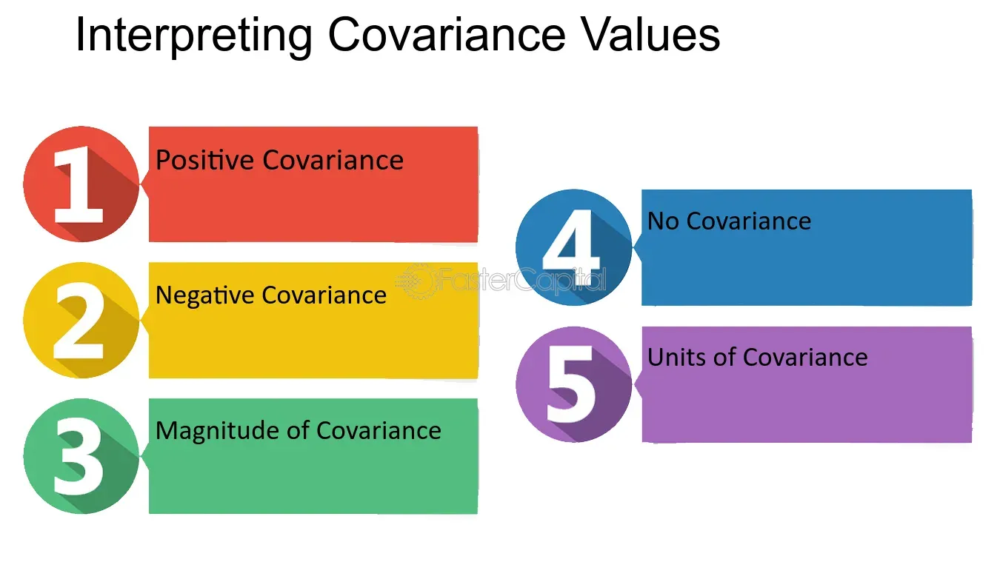

## Table of Contents

## What is covariance and how is it calculated?

Covariance is a measure that tells us how much two variables change together. If one variable tends to increase when the other increases, they have a positive covariance. If one tends to go up when the other goes down, they have a negative covariance. It's like seeing if two friends' moods go up and down together or in opposite ways.

To calculate covariance, you start by finding the mean (average) of each variable. Then, for each pair of data points, you subtract the mean of the first variable from the first data point and the mean of the second variable from the second data point. You multiply these differences together. After doing this for all pairs, you add up all these products and divide by the number of data points minus one. This gives you the covariance, which helps you understand how the variables move together.

## How does covariance differ from correlation?

Covariance and correlation both tell us about how two variables move together, but they do it in different ways. Covariance shows the direction of the relationship between two variables - if they tend to go up or down together, or if one goes up when the other goes down. But, the size of the covariance number doesn't tell us how strong the relationship is. It can be a big number or a small number, but that doesn't mean the relationship is strong or weak. It's like saying two friends' moods go up and down together, but not telling us how closely their moods match.

Correlation, on the other hand, not only tells us the direction of the relationship but also how strong it is. It's a number between -1 and 1. If the correlation is close to 1 or -1, it means the variables have a strong relationship. If it's close to 0, the relationship is weak. So, correlation is like saying not only do two friends' moods go up and down together, but also how much their moods match. This makes correlation easier to understand and compare across different pairs of variables.

## What does a positive covariance indicate about the relationship between two variables?

A positive covariance means that when one variable goes up, the other variable tends to go up too. It's like if you see more sunshine, you also see higher temperatures. They move together in the same direction.

This doesn't tell us how strong the relationship is, just that it's there and it's positive. If you're looking at the number of ice creams sold and the temperature outside, a positive covariance would show that as the temperature gets hotter, more ice creams are sold. But, the size of the covariance number itself doesn't tell you if this relationship is strong or weak, just that it's going the same way.

## What does a negative covariance indicate about the relationship between two variables?

A negative covariance means that when one variable goes up, the other variable tends to go down. It's like if you see more rain, you see fewer people at the beach. They move in opposite directions.

This tells us the relationship is negative, but it doesn't tell us how strong it is. If you're looking at the number of umbrellas sold and the amount of sunshine, a negative covariance would show that as the sunshine increases, fewer umbrellas are sold. But, the size of the covariance number itself doesn't tell you if this relationship is strong or weak, just that it's going the opposite way.

## How can the magnitude of covariance be interpreted in simple terms?

The magnitude of covariance tells us how much two things change together, but it's tricky to understand just by looking at the number. If the covariance is a big number, it means the two things are changing a lot together, either going up or down at the same time. But if it's a small number, it means they're not changing much together. The problem is, the size of the number depends on the scale of the things you're measuring. So, a big covariance number might not mean the same thing if you're looking at different kinds of data.

Because of this, it's hard to say if a covariance number is big or small just by itself. You can't really compare the covariance of height and weight to the covariance of temperature and ice cream sales, because they're measured in different units. That's why people often use correlation instead, which takes the scale out of the equation and gives you a number between -1 and 1 that's easier to understand and compare.

## What are the limitations of using covariance to understand the relationship between variables?

One big problem with using covariance to understand how two things relate to each other is that the size of the number can be hard to understand. If the covariance is big, it means the two things are changing a lot together, but what's "big" can change depending on what you're measuring. For example, the covariance between height and weight might be a large number, but that doesn't mean it's the same kind of big as the covariance between temperature and ice cream sales. Because of this, you can't easily compare the covariance of different pairs of things.

Another issue is that covariance only tells you if things are moving in the same direction or opposite directions, but it doesn't tell you how strong that relationship is. If you have a covariance of 5 for one pair of things and 50 for another pair, you might think the second pair has a stronger relationship, but that's not necessarily true. The strength of the relationship depends on the scale of what you're measuring, and covariance doesn't take that into account. This is why people often use correlation instead, which gives you a number between -1 and 1 that's easier to understand and compare.

## How does the scale of variables affect the covariance value?

The scale of the variables you're looking at can really change the covariance number. Imagine you're measuring the height of people in centimeters and their weight in kilograms. If you switch to measuring height in inches and weight in pounds, the covariance number will be different even though the relationship between height and weight hasn't changed. This happens because covariance depends on the units you use. So, a big covariance number might look big just because you're using big numbers, not because the relationship between the variables is strong.

Because of this, it's hard to know if a covariance number is big or small just by looking at it. You can't really compare the covariance between different pairs of things if they're measured in different units. For example, the covariance between temperature in Celsius and ice cream sales might be a different number than the covariance between temperature in Fahrenheit and ice cream sales, even though it's the same relationship. That's why people often use correlation instead, which doesn't depend on the scale of the variables and gives you a number between -1 and 1 that's easier to understand and compare.

## Can covariance be used to infer causation between variables?

Covariance can show if two things tend to move together, but it can't tell you if one thing is causing the other to happen. For example, if you find a positive covariance between the number of ice creams sold and the temperature outside, it might look like the hot weather is making people buy more ice cream. But, it could also be that more people are buying ice cream because it's summer, and summer brings both heat and more ice cream sales. Covariance alone doesn't tell you which way the relationship works.

To figure out if one thing causes another, you need more than just covariance. You have to look at other things like experiments, time order, and other possible reasons for the relationship. Covariance is just a first step to see if there might be a relationship worth looking into more deeply, but it's not enough to say for sure that one thing causes another.

## What statistical techniques can be used to normalize covariance for better interpretation?

One way to make covariance easier to understand is by turning it into a correlation. Correlation is a number between -1 and 1 that shows not just if two things move together, but also how strong that relationship is. To get the correlation, you take the covariance and divide it by the product of the standard deviations of the two variables. This process takes away the effect of the scale of the variables, so you can compare how strongly different pairs of things are related to each other.

Another technique is to use standardized variables before calculating covariance. This means you change the numbers so that they have a mean of zero and a standard deviation of one. When you calculate covariance with these standardized variables, you get what's called the correlation coefficient. This is the same as the correlation we talked about before, and it makes it easier to see how strong the relationship is between the variables, no matter what scale they were originally measured in.

## How does the concept of variance influence the interpretation of covariance?

Variance is a measure of how spread out a set of numbers is. If the numbers are all close together, the variance is small. If they're spread out a lot, the variance is big. When you're looking at covariance, which tells you how two things change together, the variance of each thing can make a big difference in how you understand the covariance number. If one of the things has a big variance, it can make the covariance number look bigger, even if the relationship between the two things isn't that strong.

Because of this, just looking at the covariance number can be tricky. You might think a big covariance means a strong relationship, but it could just be because one of the things you're looking at has a lot of variance. That's why people often use correlation instead. Correlation takes into account the variance of both things and gives you a number between -1 and 1 that's easier to understand. It tells you not just if the two things move together, but also how strong that relationship is, no matter how spread out the numbers are.

## In what scenarios might a high covariance value be misleading?

A high covariance value might be misleading if the variables you're looking at have very different scales. For example, if you're measuring the height of people in centimeters and their weight in kilograms, the covariance might look big just because the numbers are big. But, if you switch to measuring height in inches and weight in pounds, the covariance number will change even though the relationship between height and weight hasn't changed. So, a high covariance might not mean the relationship is strong; it could just be because you're using big numbers.

Another scenario where a high covariance can be misleading is when one of the variables has a lot of variance. If one thing you're looking at has numbers that are spread out a lot, it can make the covariance number look bigger. For instance, if you're looking at the relationship between the number of hours people study and their test scores, and the test scores have a lot of variance, the covariance might look high. But this doesn't necessarily mean studying has a strong effect on test scores; it could just be because the test scores are spread out a lot.

## How can advanced statistical models incorporate covariance for predictive analytics?

Advanced statistical models use covariance to help make better predictions. Imagine you're trying to guess how many ice creams will be sold tomorrow. You might look at the temperature because you know there's a relationship between temperature and ice cream sales. Covariance helps you understand how strong this relationship is. By including covariance in your model, you can make more accurate guesses because you know how much the temperature affects ice cream sales. This is especially useful in models like regression analysis, where you're trying to predict one thing based on several other things.

In more complex models like [machine learning](/wiki/machine-learning), covariance can be used to find patterns in big sets of data. For example, if you're trying to predict stock prices, you might look at the covariance between different stocks to see how they move together. This helps you build a model that takes into account not just one stock, but how all the stocks in your data set interact with each other. By understanding these relationships, your model can make smarter predictions, like knowing that if one stock goes up, others might go up too. This makes your predictions more reliable and useful for making decisions.

## What is the understanding of Covariance and Correlation?

Covariance and correlation are fundamental statistical measures that elucidate how two variables move in relation to each other, offering insights into their linear relationships. Covariance indicates the direction of these relationships, whether positive or negative, but it does not provide information about the strength of the relationship. Positive covariance suggests that two variables tend to increase or decrease together, while negative covariance indicates that one variable increases as the other decreases. However, the actual value of covariance is influenced by the units of measurement, which can make interpretation challenging.

Mathematically, the covariance between two variables $X$ and $Y$ is expressed as:

$$
\text{Cov}(X, Y) = \frac{\sum{(X_i - \mu_X)(Y_i - \mu_Y)}}{n}
$$

Here, $X_i$ and $Y_i$ are individual data points, $\mu_X$ and $\mu_Y$ are the means of $X$ and $Y$, respectively, and $n$ is the number of observations. This formula calculates the average product of the deviations of each pair from their respective means, highlighting covariance as an unstandardized measure.

On the other hand, correlation is a standardized form of covariance, providing both the strength and direction of a relationship on a dimensionless scale ranging from -1 to 1. This standardization is achieved by dividing covariance by the product of the standard deviations of the variables. The most commonly used measure of correlation is the Pearson correlation coefficient, defined as:

$$
r_{XY} = \frac{\text{Cov}(X, Y)}{\sigma_X \sigma_Y}
$$

where $\sigma_X$ and $\sigma_Y$ are the standard deviations of $X$ and $Y$. A correlation value closer to 1 implies a strong positive linear relationship, whereas a value closer to -1 denotes a strong negative linear relationship. A correlation around 0 suggests no linear relationship.

In trading, understanding the movement of assets relative to each other using covariance and correlation is crucial. These measures assist traders in gauging how assets may react to market events, supporting risk management and portfolio diversification. By determining whether assets move in tandem or show independent behaviors, investors can tailor strategies to mitigate risk or pursue potential returns. Portfolio construction often relies on correlation analysis to combine assets that do not exhibit significant correlation, thus reducing overall portfolio [volatility](/wiki/volatility-trading-strategies) and enhancing returns.

## What are Mathematical Formulations?

Covariance and correlation are fundamental concepts in statistical analysis, particularly in finance and [algorithmic trading](/wiki/algorithmic-trading). Covariance measures how two variables change together. Mathematically, the covariance between two variables $X$ and $Y$ is calculated as follows:

$$
\text{Cov}(X, Y) = \frac{1}{n} \sum_{i=1}^{n} (X_i - \bar{X})(Y_i - \bar{Y})
$$

where $n$ is the number of data points, $X_i$ and $Y_i$ are the individual data points, and $\bar{X}$ and $\bar{Y}$ are the means of $X$ and $Y$ respectively. This equation highlights that covariance is the average of the product of the deviations of each data point from its mean.

While covariance provides an indication of the direction of the linear relationship between variables, it is scale-dependent, thus difficult to interpret without context. To overcome this limitation, correlation normalizes the covariance by the standard deviations of the variables, making it dimensionless. The formula for the correlation coefficient $r$ between two variables $X$ and $Y$ is:

$$
r = \frac{\text{Cov}(X, Y)}{\sigma_X \sigma_Y}
$$

where $\sigma_X$ and $\sigma_Y$ are the standard deviations of $X$ and $Y$ respectively. The resulting correlation coefficient ranges from -1 to 1, indicating both the strength and direction of a linear relationship. A correlation of 1 implies a perfect positive linear relationship, -1 a perfect negative linear relationship, and 0 suggests no linear relationship.

Pearson's correlation coefficient, derived as described, is the most widely used method for assessing linear relationships between variables. It is well-suited for capturing linear dependencies but may not effectively describe nonlinear relationships.

To automate these calculations in Python, common libraries like NumPy can be employed:

```python
import numpy as np

# Sample data points
X = np.array([1, 2, 3, 4, 5])
Y = np.array([2, 4, 6, 8, 10])

# Calculating covariance
cov_matrix = np.cov(X, Y, bias=True)  # `bias=True` for population covariance
covariance = cov_matrix[0, 1]

# Calculating Pearson's correlation coefficient
correlation = np.corrcoef(X, Y)[0, 1]

print("Covariance:", covariance)
print("Pearson's Correlation Coefficient:", correlation)
```

Understanding these mathematical foundations allows traders to accurately measure relationships between financial variables, facilitating better strategy development and risk management in algorithmic trading.

## How do you calculate covariance and correlation?

Calculating covariance and correlation is fundamental in statistical analysis and algorithmic trading. The process begins with covariance, which measures the degree to which two variables change together. To calculate covariance, follow these steps:

1. **Compute the Mean of Each Variable**: For each of the two variables, determine their respective means. If you have two variables, $X$ and $Y$, with values $x_1, x_2, \ldots, x_n$ and $y_1, y_2, \ldots, y_n$, their means $\bar{X}$ and $\bar{Y}$ are given by:
$$
   \bar{X} = \frac{1}{n}\sum_{i=1}^{n} x_i, \quad \bar{Y} = \frac{1}{n}\sum_{i=1}^{n} y_i

$$

2. **Determine Deviations**: For each data point, calculate the deviation from the mean for both variables. This means obtaining $(x_i - \bar{X})$ and $(y_i - \bar{Y})$ for each pair.

3. **Average the Products of Deviations**: Multiply each pair of deviations and calculate the average:
$$
   \text{Cov}(X, Y) = \frac{1}{n-1} \sum_{i=1}^{n} (x_i - \bar{X})(y_i - \bar{Y})

$$

Once covariance is calculated, correlation can be determined to assess both the strength and direction of the linear relationship between the variables. Correlation standardizes covariance as follows:

1. **Compute the Standard Deviations**: Determine the standard deviations of both variables, $\sigma_X$ and $\sigma_Y$:
$$
   \sigma_X = \sqrt{\frac{1}{n-1} \sum_{i=1}^{n} (x_i - \bar{X})^2}, \quad \sigma_Y = \sqrt{\frac{1}{n-1} \sum_{i=1}^{n} (y_i - \bar{Y})^2}

$$

2. **Normalize Covariance**: Divide the covariance by the product of the standard deviations of the two variables to obtain the correlation coefficient $r$:
$$
   r = \frac{\text{Cov}(X, Y)}{\sigma_X \sigma_Y}

$$

   The value of $r$ ranges from -1 to 1, indicating the direction and strength of the correlation.

Modern computational tools significantly ease these calculations. Python, a popular programming language for data analysis, offers efficient libraries such as NumPy and pandas to perform these computations. Here is an example using Python:

```python
import numpy as np
import pandas as pd

# Example data
X = np.array([1, 2, 3, 4, 5])
Y = np.array([2, 4, 6, 8, 10])

# Calculating covariance
covariance = np.cov(X, Y, ddof=0)[0][1]

# Calculating correlation
correlation = np.corrcoef(X, Y)[0][1]

print(f"Covariance: {covariance}")
print(f"Correlation: {correlation}")
```

This Python code snippet demonstrates the use of NumPy to calculate covariance and correlation, showcasing the ease with which traders can implement data-driven strategies in algorithmic trading.

## References & Further Reading

[1]: Bergstra, J., Bardenet, R., Bengio, Y., & Kégl, B. (2011). ["Algorithms for Hyper-Parameter Optimization."](https://dl.acm.org/doi/10.5555/2986459.2986743) Advances in Neural Information Processing Systems 24.

[2]: ["Advances in Financial Machine Learning"](https://www.amazon.com/Advances-Financial-Machine-Learning-Marcos/dp/1119482089) by Marcos Lopez de Prado

[3]: ["Evidence-Based Technical Analysis: Applying the Scientific Method and Statistical Inference to Trading Signals"](https://www.amazon.com/Evidence-Based-Technical-Analysis-Scientific-Statistical/dp/0470008741) by David Aronson

[4]: ["Machine Learning for Algorithmic Trading"](https://github.com/stefan-jansen/machine-learning-for-trading) by Stefan Jansen

[5]: ["Quantitative Trading: How to Build Your Own Algorithmic Trading Business"](https://www.amazon.com/Quantitative-Trading-Build-Algorithmic-Business/dp/1119800064) by Ernest P. Chan