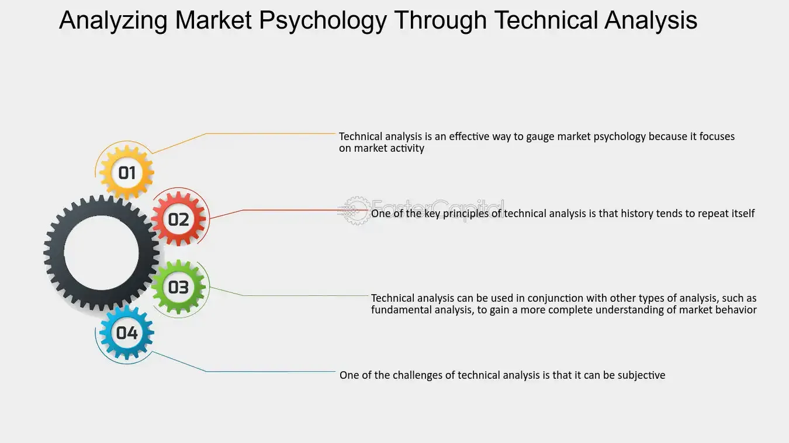

## Table of Contents

## What is market psychology and why is it important in trading?

Market psychology refers to the overall sentiment and emotions of investors and traders in the financial markets. It's about how people feel about buying and selling, and these feelings can make prices go up or down. For example, if everyone is feeling happy and confident, they might buy more, pushing prices higher. But if people are scared or unsure, they might sell, which can make prices drop.

Understanding market psychology is really important for trading because it helps traders guess what might happen next in the market. If traders can figure out how others are feeling, they can make smarter choices about when to buy or sell. For instance, if a trader notices that everyone is starting to feel worried, they might decide to sell before prices fall too much. By paying attention to the mood of the market, traders can do better and make more money.

## What are technical indicators and how do they relate to market psychology?

Technical indicators are tools that traders use to help them understand what's happening in the market. They look at past prices and trading volumes to make guesses about what might happen next. These indicators can be shown on charts and help traders see patterns or trends. Some common ones are moving averages, which smooth out price data to show a clearer trend, and the Relative Strength Index (RSI), which tells if a stock is overbought or oversold.

These technical indicators are closely linked to market psychology because they often reflect what traders are feeling. For example, if the RSI shows that a stock is overbought, it might mean that traders are getting too excited and buying a lot, which could lead to a price drop soon. On the other hand, if the RSI shows a stock is oversold, it might mean that traders are too scared and selling a lot, which could mean the price might go up soon. By using these indicators, traders can get a better sense of the overall mood of the market and make smarter trading decisions.

## Can you explain some common technical indicators used to gauge market sentiment?

One common technical indicator used to gauge market sentiment is the Relative Strength Index (RSI). The RSI measures how fast and how much a stock's price is changing. It gives a number between 0 and 100. If the RSI is above 70, it means the stock might be overbought, which can show that traders are feeling too excited and might start selling soon. If the RSI is below 30, it means the stock might be oversold, which can show that traders are feeling too scared and might start buying soon. By looking at the RSI, traders can get a sense of whether the market is feeling too happy or too worried.

Another useful indicator is the Moving Average Convergence Divergence (MACD). The MACD looks at the difference between two moving averages of a stock's price. It helps traders see if the market's trend is getting stronger or weaker. When the MACD line crosses above the signal line, it can mean that traders are starting to feel more positive and the market might be turning bullish. When the MACD line crosses below the signal line, it can mean that traders are starting to feel more negative and the market might be turning bearish. By watching the MACD, traders can guess how the market's mood might be changing.

The Bollinger Bands are also used to understand market sentiment. These bands are lines drawn above and below a stock's moving average. They show how much the stock's price is moving around. When the price touches the upper band, it can mean the market is feeling too confident and might be ready for a price drop. When the price touches the lower band, it can mean the market is feeling too worried and might be ready for a price rise. By using Bollinger Bands, traders can see if the market's feelings are getting too extreme in one direction or the other.

## How does the Relative Strength Index (RSI) reflect market psychology?

The Relative Strength Index (RSI) is a tool that helps traders understand how the market is feeling. It does this by looking at how fast and how much a stock's price is changing. The RSI gives a number between 0 and 100. When the RSI is above 70, it means the stock might be overbought. This can show that traders are feeling too excited and might start selling soon. On the other hand, when the RSI is below 30, it means the stock might be oversold. This can show that traders are feeling too scared and might start buying soon.

By using the RSI, traders can get a sense of whether the market is feeling too happy or too worried. If the RSI stays high for a long time, it might mean that the market's excitement is about to end, and a price drop could be coming. If the RSI stays low for a long time, it might mean that the market's fear is about to end, and a price rise could be coming. In this way, the RSI helps traders understand the mood of the market and make better decisions about when to buy or sell.

## What insights can the Moving Average Convergence Divergence (MACD) provide about market sentiment?

The Moving Average Convergence Divergence (MACD) is a tool that helps traders understand how the market is feeling by looking at the difference between two moving averages of a stock's price. When the MACD line crosses above the signal line, it can mean that traders are starting to feel more positive about the market. This is called a bullish signal, and it suggests that the market might be turning in a good direction. Traders might see this as a sign to buy, thinking that prices could go up.

On the other hand, when the MACD line crosses below the signal line, it can mean that traders are starting to feel more negative about the market. This is called a bearish signal, and it suggests that the market might be turning in a bad direction. Traders might see this as a sign to sell, thinking that prices could go down. By watching the MACD, traders can get a sense of how the market's mood might be changing and make better decisions about when to buy or sell.

## How can volume-based indicators like On-Balance Volume (OBV) indicate market psychology?

Volume-based indicators like On-Balance Volume (OBV) help traders understand how people feel about the market by looking at how many shares are being bought and sold. OBV adds up the volume on days when the price goes up and subtracts it on days when the price goes down. If the OBV line is going up, it means more people are buying than selling, which can show that traders are feeling good about the market. They might think prices will keep going up because more people want to buy.

On the other hand, if the OBV line is going down, it means more people are selling than buying, which can show that traders are feeling worried about the market. They might think prices will go down because more people want to sell. By watching the OBV, traders can get a sense of whether the market is feeling happy or scared and make better choices about when to buy or sell.

## What role do candlestick patterns play in interpreting market psychology?

Candlestick patterns are shapes made by price movements on a chart that help traders understand how people feel about the market. Each candlestick shows the opening, closing, high, and low prices for a certain time. When many candlesticks form a pattern, it can tell traders if the market is feeling happy or worried. For example, a "bullish engulfing" pattern, where a small red candle is followed by a bigger green candle, can mean that buyers are taking over and the market might be feeling more hopeful. This can be a sign that prices might go up soon.

On the other hand, a "bearish engulfing" pattern, where a small green candle is followed by a bigger red candle, can mean that sellers are taking over and the market might be feeling more scared. This can be a sign that prices might go down soon. By looking at these patterns, traders can get a quick idea of what the market is thinking and make better choices about when to buy or sell. Candlestick patterns help traders see the mood of the market in a simple and clear way.

## How can the Bollinger Bands help in understanding market sentiment and volatility?

Bollinger Bands are lines drawn above and below a stock's moving average that help traders understand how the market is feeling and how much prices are moving around. The middle line is the moving average, and the top and bottom lines are set a certain number of standard deviations away from it. When the price of a stock touches the top band, it can mean that the market is feeling too confident and might be ready for a price drop. This is because the price has moved a lot and might be too high. When the price touches the bottom band, it can mean that the market is feeling too worried and might be ready for a price rise. This is because the price has moved a lot and might be too low.

The width of the Bollinger Bands also tells traders about how much the market is moving around, which is called [volatility](/wiki/volatility-trading-strategies). When the bands are far apart, it means the market is moving a lot and prices are changing quickly. This can show that traders are feeling strong emotions, either excitement or fear. When the bands are close together, it means the market is not moving much and prices are staying pretty steady. This can show that traders are feeling calm and not making big moves. By looking at where the price is compared to the bands and how wide the bands are, traders can get a good idea of the market's mood and how much it might change soon.

## What advanced technical indicators are used by expert traders to assess market psychology?

Expert traders often use the Average Directional Index (ADX) to assess market psychology. The ADX helps them understand if the market is moving in a strong direction or just staying the same. When the ADX number is high, it means the market is moving strongly, and traders might feel more sure about where prices are going. This could mean they are feeling excited if the trend is going up or worried if the trend is going down. When the ADX number is low, it means the market is not moving much, and traders might feel unsure or calm because prices are not changing a lot.

Another advanced indicator is the Ichimoku Cloud, which gives traders a lot of information about the market's mood. The cloud shows areas where the price might find support or resistance, helping traders see if the market is feeling strong or weak. If the price is above the cloud, it can mean traders are feeling positive and expect prices to keep going up. If the price is below the cloud, it can mean traders are feeling negative and expect prices to keep going down. The thickness of the cloud also tells traders about how strong the market's feelings are, with a thicker cloud meaning stronger feelings and more resistance to price changes.

## How can traders use sentiment indicators like the Fear and Greed Index to make informed decisions?

The Fear and Greed Index is a tool that helps traders understand how people feel about the market. It uses numbers to show if the market is feeling scared (fear) or excited (greed). When the index shows high fear, it means that many people are worried and might be selling their stocks. This could be a good time for traders to buy because prices might be low. On the other hand, when the index shows high greed, it means that many people are feeling excited and buying a lot. This could be a sign for traders to be careful because prices might be too high and could drop soon.

By looking at the Fear and Greed Index, traders can make better choices about when to buy or sell. If the index is showing a lot of fear, traders might decide to buy stocks because they think the market's worry is overdone and prices will go up soon. If the index is showing a lot of greed, traders might decide to sell because they think the market's excitement is too much and prices might fall. Using this tool helps traders see the overall mood of the market and make smart decisions based on how others are feeling.

## Can you discuss the limitations and potential pitfalls of using technical indicators to interpret market psychology?

Using technical indicators to understand how the market feels can be tricky because they are not always right. Sometimes, the signals from these indicators can be wrong or come too late. For example, an indicator might say the market is feeling scared and prices will go down, but instead, prices keep going up. This can happen because other things, like big news or what the government does, can change how people feel about the market quickly. Also, if too many people use the same indicators, their actions can make the signals less useful. If everyone sees the same signal and buys or sells at the same time, it can push prices in a way that makes the indicator wrong.

Another problem is that technical indicators only look at past prices and volumes. They do not think about why the market is feeling a certain way. For example, the market might be feeling scared because of a big world event, but the indicators might not show this. This means traders might miss important reasons for how people are feeling. Also, some indicators can give too many signals, which can make it hard to know which ones to trust. Traders need to be careful and use other ways to check what the indicators are saying to make the best choices.

## How can traders combine multiple technical indicators to develop a robust market psychology analysis strategy?

Traders can make a good plan to understand how the market feels by using more than one technical indicator together. For example, they might use the Relative Strength Index (RSI) to see if the market is feeling too excited or too worried, and the Moving Average Convergence Divergence (MACD) to see if the market's mood is changing. If the RSI shows the market is overbought and the MACD shows a bearish signal, it can mean that the market might be ready for a price drop. By looking at different indicators, traders can get a clearer picture of what the market is thinking.

Another way to make a strong plan is to use volume-based indicators like On-Balance Volume (OBV) along with price-based indicators like Bollinger Bands. If the OBV is going up while the price is touching the upper Bollinger Band, it can mean that the market is feeling very confident and might keep going up. But if the OBV is going down while the price is touching the lower Bollinger Band, it can mean that the market is feeling very scared and might keep going down. By combining these indicators, traders can see both how people feel and how much they are buying or selling, which helps them make better choices about when to buy or sell.

## What role do Technical Indicators play as a Bridge to Market Psychology?

Technical indicators are vital tools that quantify market psychology by converting emotional and psychological factors into actionable data. These indicators are designed to measure diverse aspects of market behavior, which, in turn, can reflect the emotional states of market participants, such as fear, greed, optimism, and pessimism. The effectiveness of these indicators lies in their ability to translate subjective sentiments into objective, numerical information that can be analyzed and used to make informed trading decisions.

Commonly used technical indicators include On-balance Volume (OBV), Accumulation/Distribution (A/D), and Open Interest, each offering unique insights into market psychology. 

On-balance Volume (OBV) combines price and [volume](/wiki/volume-trading-strategy) data to show how much money is flowing into or out of a security. The OBV is calculated as follows:

$$
\text{OBV} = 
\begin{cases} 
\text{previous OBV} + \text{Volume}, & \text{if the current closing price is higher than the previous closing price}\\
\text{previous OBV} - \text{Volume}, & \text{if the current closing price is lower than the previous closing price}\\
\text{previous OBV}, & \text{if the closing prices are equal}
\end{cases}
$$

The strength of OBV lies in its ability to identify potential reversals or the continuation of current trends based on volume shifts, which can imply changes in sentiment.

The Accumulation/Distribution (A/D) line evaluates the flow of money into or out of a stock, providing insights into buying and selling pressure. It is calculated using the formula:

$$
\text{A/D} = \sum \left( \frac{(\text{Close} - \text{Low}) - (\text{High} - \text{Close})}{\text{High} - \text{Low}} \times \text{Volume} \right)
$$

This indicator helps identify potential reversals or continuations by comparing price trends with money flow trends, thereby reflecting underlying market sentiment.

Open Interest is another valuable indicator, primarily used in the futures and options markets, shedding light on the strength of prevailing trends. It represents the total number of outstanding derivative contracts, such as futures or options, that have not been settled. A rising Open Interest in a trending market often confirms the strength of the trend, while a declining Open Interest indicates weakening interest and possible reversals.

Together, these indicators provide a graphical representation of collective emotions, offering traders insights into how participants perceive market conditions. By analyzing trends, reversals, and the confirmation of market sentiment through these indicators, traders can better understand and predict market movements. This approach not only allows for a structured assessment of market psychology but also aids in developing strategic responses to anticipated shifts in sentiment, thereby bridging the gap between complex human emotions and analytical decision-making in trading.

## What are Popular Technical Indicators and How Are They Explained?

On-balance Volume (OBV), Accumulation/Distribution (A/D), and Open Interest are pivotal technical indicators widely used by traders to gain a better understanding of market dynamics and psychology.

**On-balance Volume (OBV):** OBV is a momentum indicator that correlates price and volume to measure buying and selling pressure. It is based on the theory that volume precedes price, and thus changes in OBV can predict upcoming price movements. The OBV line is calculated by adding the day's volume to a cumulative total when the closing price is higher than the previous day's, and subtracting it when the closing price is lower. The formula for OBV can be expressed as:

$$

\text{OBV}_t = 
\begin{cases} 
\text{OBV}_{t-1} + \text{Volume}_t, & \text{if } \text{Close}_t > \text{Close}_{t-1} \\
\text{OBV}_{t-1} - \text{Volume}_t, & \text{if } \text{Close}_t < \text{Close}_{t-1} \\
\text{OBV}_{t-1}, & \text{otherwise}
\end{cases}
$$

A rising OBV suggests an increase in volume accompanying a price rise (buy signal), while a falling OBV suggests a decrease in volume with a price decline (sell signal).

**Accumulation/Distribution (A/D):** A/D is a volume-based indicator designed to link changes in price with volume to assess the overall strength or weakness of a price trend. It calculates a running total of the money flow volume, which determines whether an asset is being accumulated or distributed. The formula involves multiplying volume by a multiplier termed the "Money Flow Multiplier," which varies based on the closing and opening price:

$$

\text{MFM} = \frac{(\text{Close} - \text{Low}) - (\text{High} - \text{Close})}{\text{High} - \text{Low}} 
$$

$$

\text{MFV} = \text{MFM} \times \text{Volume} 
$$

$$

\text{A/D} = \text{A/D}_{\text{previous}} + \text{MFV} 
$$

An upward trend in A/D may suggest accumulation, while a downward trend implies distribution.

**Open Interest:** Open Interest refers to the total number of outstanding contracts in the futures market and provides insights into market participation and sentiment. Unlike other indicators that can be applied to multiple security types, Open Interest is specific to futures and options markets. A rising Open Interest along with rising prices indicates strong bullish sentiment, whereas rising Open Interest with falling prices suggests bearish sentiment. A decline in Open Interest indicates position liquidation or closing of positions.

Each of these indicators provides unique insights into market psychology and assists traders in identifying trends, reversals, and confirming market sentiment. Understanding and interpreting these indicators can enhance trading decisions, aiding in the execution of effective and informed trades.

## References & Further Reading

[1]: Bergstra, J., Bardenet, R., Bengio, Y., & Kégl, B. (2011). ["Algorithms for Hyper-Parameter Optimization."](https://dl.acm.org/doi/10.5555/2986459.2986743) Advances in Neural Information Processing Systems 24.

[2]: ["Advances in Financial Machine Learning"](https://www.amazon.com/Advances-Financial-Machine-Learning-Marcos/dp/1119482089) by Marcos Lopez de Prado

[3]: ["Evidence-Based Technical Analysis: Applying the Scientific Method and Statistical Inference to Trading Signals"](https://www.amazon.com/Evidence-Based-Technical-Analysis-Scientific-Statistical/dp/0470008741) by David Aronson

[4]: ["Machine Learning for Algorithmic Trading"](https://github.com/stefan-jansen/machine-learning-for-trading) by Stefan Jansen

[5]: ["Quantitative Trading: How to Build Your Own Algorithmic Trading Business"](https://www.amazon.com/Quantitative-Trading-Build-Algorithmic-Business/dp/1119800064) by Ernest P. Chan