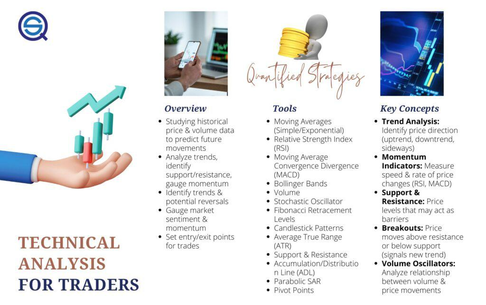

Market psychology, technical analysis, and algorithmic trading are interconnected disciplines within the financial markets, each playing a crucial role in shaping trading strategies. Market psychology examines how emotions and psychological factors such as fear, greed, and optimism influence market movements. These emotional states are not merely theoretical observations; they manifest in quantifiable market trends and patterns that traders seek to understand and exploit. 

Technical indicators serve as tools to interpret the psychological impacts on market behavior. These indicators transform qualitative emotional insights into quantitative data, aiding traders in predicting future price movements. Well-known examples include the Relative Strength Index (RSI), Moving Averages, and Bollinger Bands. By evaluating these indicators, traders aim to identify trends, reversals, and market sentiments that reflect underlying psychological influences.



Algorithmic trading automates the analysis of market psychology and technical indicators, providing traders with the ability to execute trades with increased precision and speed. Algorithms can operate based on predefined criteria, including specific technical indicators, to make swift trading decisions without the delay of manual intervention. This automation allows traders to harness the power of technology to analyze large volumes of data and react to market changes in real time.

This article explores the synergistic relationship among market psychology, technical analysis, and algorithmic trading. By understanding how these elements work together, traders can develop and implement effective trading strategies that capitalize on the emotional and psychological dynamics of financial markets.

## Table of Contents

## Understanding Market Psychology

Market psychology reflects the emotional states and behaviors of market participants, which range from fear to greed. These emotions are potent forces that can influence asset pricing and market dynamics. The study of market psychology aims to decode how these psychological elements impact financial decision-making and market movements.

Cognitive and emotional biases are central to the development of market trends. For instance, investors may exhibit overconfidence by overestimating their skill in predicting market conditions, leading to riskier investments. Similarly, loss aversion can cause traders to react disproportionately to losses compared to gains, potentially resulting in panic selling. These biases form recognizable patterns in market behavior that can be systematically analyzed.

Understanding crowd behavior is pivotal for forecasting market movements. The collective actions of traders can lead to the emergence of trends, which savvy traders can capitalize on. During a bull market, for example, the euphoria and optimism among traders can drive asset prices even higher. Conversely, in a bear market, fear and pessimism can lead to precipitous price drops. Identifying these collective sentiments enables traders to anticipate shifts and adapt their strategies accordingly.

Market psychology plays a significant role in influencing market efficiency. It can lead to anomalies where market prices deviate from their intrinsic values, creating lucrative opportunities for traders who can identify and exploit these discrepancies. Such inefficiencies often arise from exaggerated emotional reactions to news events or economic indicators, providing tactical entry and [exit](/wiki/exit-strategy) points for traders who understand these psychological dynamics.

In conclusion, market psychology presents both challenges and opportunities. While emotions can make markets unpredictable, a comprehensive understanding of these psychological factors can enable traders to develop strategies that optimize their decision-making processes in the financial markets.

## Technical Indicators: A Bridge to Market Psychology

Technical indicators are vital tools that quantify market psychology by converting emotional and psychological factors into actionable data. These indicators are designed to measure diverse aspects of market behavior, which, in turn, can reflect the emotional states of market participants, such as fear, greed, optimism, and pessimism. The effectiveness of these indicators lies in their ability to translate subjective sentiments into objective, numerical information that can be analyzed and used to make informed trading decisions.

Commonly used technical indicators include On-balance Volume (OBV), Accumulation/Distribution (A/D), and Open Interest, each offering unique insights into market psychology. 

On-balance Volume (OBV) combines price and [volume](/wiki/volume-trading-strategy) data to show how much money is flowing into or out of a security. The OBV is calculated as follows:

$$
\text{OBV} = 
\begin{cases} 
\text{previous OBV} + \text{Volume}, & \text{if the current closing price is higher than the previous closing price}\\
\text{previous OBV} - \text{Volume}, & \text{if the current closing price is lower than the previous closing price}\\
\text{previous OBV}, & \text{if the closing prices are equal}
\end{cases}
$$

The strength of OBV lies in its ability to identify potential reversals or the continuation of current trends based on volume shifts, which can imply changes in sentiment.

The Accumulation/Distribution (A/D) line evaluates the flow of money into or out of a stock, providing insights into buying and selling pressure. It is calculated using the formula:

$$
\text{A/D} = \sum \left( \frac{(\text{Close} - \text{Low}) - (\text{High} - \text{Close})}{\text{High} - \text{Low}} \times \text{Volume} \right)
$$

This indicator helps identify potential reversals or continuations by comparing price trends with money flow trends, thereby reflecting underlying market sentiment.

Open Interest is another valuable indicator, primarily used in the futures and options markets, shedding light on the strength of prevailing trends. It represents the total number of outstanding derivative contracts, such as futures or options, that have not been settled. A rising Open Interest in a trending market often confirms the strength of the trend, while a declining Open Interest indicates weakening interest and possible reversals.

Together, these indicators provide a graphical representation of collective emotions, offering traders insights into how participants perceive market conditions. By analyzing trends, reversals, and the confirmation of market sentiment through these indicators, traders can better understand and predict market movements. This approach not only allows for a structured assessment of market psychology but also aids in developing strategic responses to anticipated shifts in sentiment, thereby bridging the gap between complex human emotions and analytical decision-making in trading.

## Popular Technical Indicators Explained

On-balance Volume (OBV), Accumulation/Distribution (A/D), and Open Interest are pivotal technical indicators widely used by traders to gain a better understanding of market dynamics and psychology.

**On-balance Volume (OBV):** OBV is a momentum indicator that correlates price and volume to measure buying and selling pressure. It is based on the theory that volume precedes price, and thus changes in OBV can predict upcoming price movements. The OBV line is calculated by adding the day's volume to a cumulative total when the closing price is higher than the previous day's, and subtracting it when the closing price is lower. The formula for OBV can be expressed as:

$$

\text{OBV}_t = 
\begin{cases} 
\text{OBV}_{t-1} + \text{Volume}_t, & \text{if } \text{Close}_t > \text{Close}_{t-1} \\
\text{OBV}_{t-1} - \text{Volume}_t, & \text{if } \text{Close}_t < \text{Close}_{t-1} \\
\text{OBV}_{t-1}, & \text{otherwise}
\end{cases}
$$

A rising OBV suggests an increase in volume accompanying a price rise (buy signal), while a falling OBV suggests a decrease in volume with a price decline (sell signal).

**Accumulation/Distribution (A/D):** A/D is a volume-based indicator designed to link changes in price with volume to assess the overall strength or weakness of a price trend. It calculates a running total of the money flow volume, which determines whether an asset is being accumulated or distributed. The formula involves multiplying volume by a multiplier termed the "Money Flow Multiplier," which varies based on the closing and opening price:

$$

\text{MFM} = \frac{(\text{Close} - \text{Low}) - (\text{High} - \text{Close})}{\text{High} - \text{Low}} 
$$

$$

\text{MFV} = \text{MFM} \times \text{Volume} 
$$

$$

\text{A/D} = \text{A/D}_{\text{previous}} + \text{MFV} 
$$

An upward trend in A/D may suggest accumulation, while a downward trend implies distribution.

**Open Interest:** Open Interest refers to the total number of outstanding contracts in the futures market and provides insights into market participation and sentiment. Unlike other indicators that can be applied to multiple security types, Open Interest is specific to futures and options markets. A rising Open Interest along with rising prices indicates strong bullish sentiment, whereas rising Open Interest with falling prices suggests bearish sentiment. A decline in Open Interest indicates position liquidation or closing of positions.

Each of these indicators provides unique insights into market psychology and assists traders in identifying trends, reversals, and confirming market sentiment. Understanding and interpreting these indicators can enhance trading decisions, aiding in the execution of effective and informed trades.

## Algorithmic Trading: Leveraging Technical Indicators

Algorithmic trading utilizes predefined rules to automate trade execution, significantly enhancing the efficiency and accuracy of transactions within financial markets. At the heart of these rules are technical indicators, which provide the quantitative data necessary for formulating objective, rule-based trading strategies. By incorporating these indicators, algorithms are designed to automate decision-making processes that traditionally relied on manual analysis.

Technical indicators, such as Moving Averages, Relative Strength Index (RSI), and Bollinger Bands, provide the framework for these algorithms. For example, moving averages can help identify trend directions, enabling algorithms to execute trades aligned with the prevailing market trend. The RSI, a [momentum](/wiki/momentum) oscillator, can trigger trades when an asset is deemed overbought or oversold, thus capitalizing on potential price reversals.

One of the significant advantages of [algorithmic trading](/wiki/algorithmic-trading) is its ability to swiftly adapt to changing market conditions. As market psychology shifts, often in reaction to news or economic events, these algorithms can reassess and adjust their strategies almost instantaneously. This adaptability is critical, particularly in volatile market environments where speed is paramount.

For instance, consider a simple moving average crossover strategy, where a shorter moving average crossing above a longer moving average may indicate a buy signal:

```python
def moving_average_crossover(short_window, long_window, data):
    short_mavg = data['Close'].rolling(window=short_window, min_periods=1).mean()
    long_mavg = data['Close'].rolling(window=long_window, min_periods=1).mean()

    buy_signals = (short_mavg > long_mavg) & (short_mavg.shift(1) <= long_mavg.shift(1))
    sell_signals = (short_mavg < long_mavg) & (short_mavg.shift(1) >= long_mavg.shift(1))

    return buy_signals, sell_signals
```

This simplistic algorithm illustrates how technical indicators can be operationalized within algorithmic trading systems to generate actionable trade signals, enhancing the decision-making process.

Popular algorithmic trading strategies often employ these indicators for both trend-following and mean-reversion strategies. Trend-following strategies capitalize on ongoing market trends by identifying consistent directional movements, while mean-reversion strategies exploit the tendency of financial markets to revert to historical averages.

The combination of technical indicators and rapid computational power enables algorithms to execute trades with precision and consistency, reducing human error and emotional biases. This leads to more efficient trading operations, as algorithms can process vast amounts of data to refine and optimize trading strategies continuously. As financial markets evolve, the integration of advanced [machine learning](/wiki/machine-learning) techniques and [artificial intelligence](/wiki/ai-artificial-intelligence) into algorithmic trading systems holds the potential for even greater sophistication and adaptability in the future.

## Combining Indicators for Algo Trading

Combining multiple technical indicators in algorithmic trading enhances the accuracy and reliability of trading signals. By using a combination of Moving Averages and Relative Strength Index (RSI), traders can better confirm trend directions. The Moving Average is a trend-following indicator which smooths price data, creating a single flowing line that represents the average price over a specific period. This can be useful for identifying bullish or bearish trends. The RSI, on the other hand, is an oscillator that measures the speed and change of price movements. It helps identify overbought or oversold market conditions.

For instance, a typical strategy involves using a Simple Moving Average (SMA) crossover with the RSI. A buy signal may be generated when the short-term SMA crosses above the long-term SMA, while the RSI is below 30, indicating an oversold condition. Conversely, a sell signal might occur when the short-term SMA crosses below the long-term SMA, with the RSI above 70, suggesting an overbought state.

Volume and momentum indicators, when paired, offer a comprehensive view of market dynamics. Volume indicators, such as the On-balance Volume (OBV), reflect the cumulative buying and selling pressure, suggesting strength or weakness in a price movement. Momentum indicators like the Moving Average Convergence Divergence (MACD) provide insights into the speed and change of price movements. Together, they enable traders to discern whether price trends are supported by adequate volume, hence more likely to sustain.

The integration of these indicators into algorithmic trading systems often employs statistical or machine learning techniques to adaptively optimize parameters based on historical performance. This process minimizes false signals and enhances decision-making. For example, a Python-based trading algorithm might look like this:

```python
import pandas as pd
import numpy as np

def calculate_SMA(data, window):
    return data.rolling(window=window).mean()

def calculate_RSI(data, window=14):
    delta = data.diff(1)
    gain = (delta.where(delta > 0, 0)).rolling(window).mean()
    loss = (-delta.where(delta < 0, 0)).rolling(window).mean()
    rs = gain / loss
    rsi = 100 - (100 / (1 + rs))
    return rsi

def generate_trading_signals(price_data, short_window, long_window):
    signals = pd.DataFrame(index=price_data.index)
    signals['price'] = price_data
    signals['short_sma'] = calculate_SMA(price_data, short_window)
    signals['long_sma'] = calculate_SMA(price_data, long_window)
    signals['rsi'] = calculate_RSI(price_data)

    signals['signal'] = 0
    signals['signal'] = np.where(
        (signals['short_sma'] > signals['long_sma']) & (signals['rsi'] < 30), 1, 
        np.where(
            (signals['short_sma'] < signals['long_sma']) & (signals['rsi'] > 70), -1, 
            0
        )
    )

    return signals

# Example usage
# price_data is a pandas Series with DateTimeIndex
# short_window and long_window are integers representing days

# signals = generate_trading_signals(price_data, short_window=50, long_window=200)
```

Proper integration and tuning of multiple indicators help traders avoid false signals, thereby increasing the success rate of trades. By understanding and leveraging these multifaceted tools, traders can improve their strategic approaches and potentially increase profitability.

## The Role of Sentiment Indicators

Sentiment indicators are essential tools in understanding the collective mood of investors and gauging market psychology. These indicators help identify the general sentiment prevailing in the market, whether it be optimistic or pessimistic, and are crucial for traders aiming to predict future market movements. By reflecting the emotional state of market participants, sentiment indicators serve as a vital complement to technical analysis in crafting informed trading strategies.

One of the widely recognized sentiment indicators is the Fear and Greed Index, which measures two of the primary emotions that influence how much investors are willing to pay for stocks. This index comprises multiple factors such as market [volatility](/wiki/volatility-trading-strategies), momentum, and demand, providing a comprehensive view of market sentiment. Another critical sentiment indicator is the Volatility Index (VIX), often referred to as the "fear gauge." The VIX measures market expectations of near-term volatility conveyed by S&P 500 stock index option prices. Higher VIX values generally indicate increased volatility and fear within the market, whereas lower values suggest complacency or confidence.

In recent years, the availability of sentiment data from social media platforms has opened new avenues for gaining real-time insights into investor sentiment. Traders and analysts harness algorithms and natural language processing (NLP) techniques to analyze social media content and news headlines. This analysis captures the prevailing mood and anticipates potential market movements. For example, a significant surge in positive mentions of a particular stock on Twitter could foreshadow a potential price increase.

Sentiment indicators provide advantages in identifying market extremes and potential reversal points. When the market exhibits extreme fear, it is often a sign that a rebound may be near, as overly pessimistic sentiment can exaggerate declines. Conversely, extreme greed can lead to overheated markets susceptible to correction. Therefore, sentiment indicators help traders recognize potential turning points, offering them opportunities to make strategic decisions either to enter or exit the market.

In conclusion, sentiment indicators complement traditional technical indicators by offering deeper insights into the psychological dynamics that drive market movements. These tools not only quantify emotions like fear and greed but also provide actionable data that can be leveraged to make more balanced trading decisions. By integrating sentiment analysis with other trading strategies, traders can better navigate the complexities of modern financial markets.

## Challenges in Trading with Market Psychology

Over-reliance on single indicators poses substantial risks in trading decisions. While these tools provide valuable insights, they are not infallible. Market emotions fluctuate rapidly, often influenced by unforeseen events, leading to sudden shifts in psychological trends. Consequently, traders relying on a singular indicator may miss critical changes in market sentiment, leading to erroneous conclusions and potential financial losses.

Incorporating sentiment data along with technical indicators is essential for a comprehensive trading strategy. Sentiment indicators, like the Fear and Greed Index or VIX, offer a broader perspective on the psychological state of the market. These tools can help identify extremes in market sentiment, which technical indicators alone may not detect. By integrating sentiment analysis, traders can better anticipate potential market reversals or trend continuations, thus making informed decisions.

Nevertheless, risk management remains paramount, regardless of the insights gained through psychological analysis or technical evaluation. The volatility and unpredictability of market sentiment necessitate strategies for mitigating risks. Diversification of the portfolio, setting stop-loss orders, and maintaining a balanced risk-reward ratio are fundamental practices that safeguard traders against unforeseen market movements. This structured approach ensures financial stability and endurance in the constantly evolving market landscape.

Overall, trading with market psychology requires a balanced and adaptive strategy, blending various forms of analysis with prudent risk management to navigate the uncertainties inherent in financial markets.

## Conclusion

Understanding market psychology is crucial for effective trading in today's markets. This discipline, along with technical analysis and the automation provided by algorithmic trading, forms a robust foundation for making informed decisions. Market psychology focuses on how collective emotions, such as fear and greed, can drive price movements. Recognizing these psychological factors can be a significant advantage for traders seeking to predict market trends and reversals.

Technical indicators and sentiment tools are essential in translating market psychology into actionable data. Indicators such as On-balance Volume (OBV), Accumulation/Distribution (A/D), and Open Interest offer a quantitative view of the emotional state of the market. By providing a graphical representation of collective sentiments, these tools enable traders to gauge optimism or pessimism within the trading environment. Sentiment indicators, including the Fear and Greed Index and the VIX, offer additional context by reflecting the emotional extremes of the market, thus providing traders with foresight into potential turning points.

The integration of these insights into algorithmic trading results in the creation of sophisticated, objective, and rule-based trading strategies. Algorithms that incorporate technical and sentiment indicators allow traders to execute trades with speed and precision, adapting quickly to evolving market conditions and psychological trends. This combination facilitates the development of strategies that can effectively navigate both orderly and volatile market phases.

Continuously learning and adapting are crucial as market dynamics and psychological patterns are never static. Traders must remain vigilant, incorporating new data and tools to maintain an edge in the market. As psychological factors and market conditions shift, evolving with them ensures sustained success in trading. This adaptability, backed by a thorough understanding of market psychology, positions traders to capitalize on opportunities in a rapidly changing financial landscape.

## References & Further Reading

[1]: Bergstra, J., Bardenet, R., Bengio, Y., & Kégl, B. (2011). ["Algorithms for Hyper-Parameter Optimization."](https://dl.acm.org/doi/10.5555/2986459.2986743) Advances in Neural Information Processing Systems 24.

[2]: ["Advances in Financial Machine Learning"](https://www.amazon.com/Advances-Financial-Machine-Learning-Marcos/dp/1119482089) by Marcos Lopez de Prado

[3]: ["Evidence-Based Technical Analysis: Applying the Scientific Method and Statistical Inference to Trading Signals"](https://www.amazon.com/Evidence-Based-Technical-Analysis-Scientific-Statistical/dp/0470008741) by David Aronson

[4]: ["Machine Learning for Algorithmic Trading"](https://github.com/stefan-jansen/machine-learning-for-trading) by Stefan Jansen

[5]: ["Quantitative Trading: How to Build Your Own Algorithmic Trading Business"](https://www.amazon.com/Quantitative-Trading-Build-Algorithmic-Business/dp/1119800064) by Ernest P. Chan