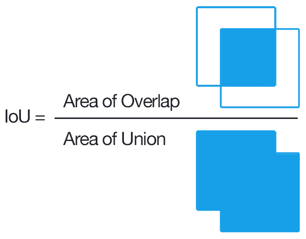

## Table of Contents

## What is Intersection Over Union (IoU) in the context of machine learning?

Intersection Over Union (IoU) is a measure used in machine learning, especially in tasks like object detection and image segmentation. It helps to evaluate how well a predicted bounding box or segmentation mask matches the actual, or ground truth, object. IoU is calculated by dividing the area of overlap between the predicted and actual shapes by the area of their union. If the predicted shape perfectly matches the actual shape, the IoU value will be 1. If there is no overlap at all, the IoU will be 0. 

In practice, IoU is a crucial metric because it gives a clear picture of the accuracy of an object detection model. For example, if a model is trying to detect cars in an image, a high IoU score means the model's predicted bounding boxes around the cars closely match the actual locations and sizes of the cars. This makes IoU a valuable tool for fine-tuning and improving machine learning models, as it directly reflects how well the model is performing in real-world scenarios.

## How is IoU calculated?

IoU, or Intersection Over Union, is a way to see how well a computer's guess matches the real thing in pictures. Imagine you have a picture with a car in it. The computer tries to draw a box around the car, and there's also a correct box that shows where the car really is. IoU checks how much these two boxes overlap and compares it to how much space they take up together.

To calculate IoU, you first find the area where the computer's box and the correct box overlap. This is called the intersection. Then, you find the total area covered by both boxes, which is the union. The IoU is the size of the intersection divided by the size of the union. If the computer's box perfectly matches the correct box, the IoU will be 1. If they don't overlap at all, the IoU will be 0. The formula for IoU is:

$$ \text{IoU} = \frac{\text{Area of Intersection}}{\text{Area of Union}} $$

Here's how you might calculate IoU in code:

```python
def calculate_iou(boxA, boxB):
    # Calculate the coordinates of the intersection rectangle
    xA = max(boxA[0], boxB[0])
    yA = max(boxA[1], boxB[1])
    xB = min(boxA[2], boxB[2])
    yB = min(boxA[3], boxB[3])

    # Calculate the area of intersection rectangle
    intersection_area = max(0, xB - xA) * max(0, yB - yA)

    # Calculate the area of both boxes
    boxA_area = (boxA[2] - boxA[0]) * (boxA[3] - boxA[1])
    boxB_area = (boxB[2] - boxB[0]) * (boxB[3] - boxB[1])

    # Calculate the area of union
    union_area = boxA_area + boxB_area - intersection_area

    # Calculate IoU
    iou = intersection_area / union_area if union_area != 0 else 0

    return iou
```

## Why is IoU important in object detection tasks?

IoU, or Intersection Over Union, is really important in object detection because it tells us how well a computer's guess matches the real thing in a picture. Imagine you're trying to find a cat in a photo. The computer draws a box around where it thinks the cat is, and there's another box showing where the cat really is. IoU helps us see how much these two boxes overlap. If the computer's box is spot on, the IoU will be 1, meaning it guessed perfectly. If the boxes don't overlap at all, the IoU will be 0, showing the computer's guess was way off.

This measure is crucial because it helps us improve the computer's ability to find objects in pictures. By using IoU, we can see which parts of the computer's guesses need to be better. For example, if the IoU is low, we know the computer needs to adjust how it draws its boxes. This way, we can make the computer smarter and better at finding things in photos, which is super helpful in many real-world situations like self-driving cars or security cameras.

## What is considered a good IoU threshold for object detection?

In object detection, a good IoU threshold often depends on what you're trying to do, but generally, an IoU of 0.5 or higher is considered good. This means that if the computer's box around an object overlaps with the real box by at least half, it's usually seen as a successful detection. Many competitions and benchmarks use this threshold because it balances between being strict enough to ensure accuracy and lenient enough to account for small errors.

For more precise tasks, like in medical imaging or autonomous driving, you might want a higher IoU threshold, like 0.7 or even 0.9. These higher thresholds make sure the computer's guesses are very close to the real thing, which is important when accuracy is critical. So, the right IoU threshold can change based on how important it is for the computer to be exactly right in your specific situation.

## How does IoU help in evaluating the performance of a model?

IoU, or Intersection Over Union, is a key tool that helps us see how well a computer's guess matches the real thing in a picture. Imagine the computer is trying to find a dog in a photo. It draws a box around where it thinks the dog is, and there's another box showing where the dog really is. IoU measures how much these two boxes overlap. If the computer's box is spot on, the IoU will be 1, meaning it guessed perfectly. If the boxes don't overlap at all, the IoU will be 0, showing the computer's guess was way off. By using IoU, we can tell if the computer is getting better at finding things in pictures.

This measure is really important because it helps us improve the computer's ability to find objects. If the IoU is low, we know the computer needs to adjust how it draws its boxes. For example, if the IoU is often around 0.3, we might need to tweak the computer's settings to make its guesses more accurate. By looking at IoU scores over time, we can see if our changes are making the computer better at its job. This way, we can make the computer smarter and better at finding things in photos, which is super helpful in many real-world situations like self-driving cars or security cameras.

## Can IoU be used for tasks other than object detection?

Yes, IoU can be used for tasks other than object detection, like image segmentation. In image segmentation, the computer tries to color different parts of a picture to show what they are, like coloring all the grass green and all the sky blue. IoU helps us see how well the computer's colored areas match the real areas in the picture. Just like with boxes, if the computer's colored areas perfectly match the real areas, the IoU will be 1. If they don't match at all, the IoU will be 0.

IoU is also useful in tracking objects over time in videos. Imagine you're watching a video of a car moving. The computer needs to draw a box around the car in each frame. IoU can tell us how well the computer keeps the box on the car as it moves from one frame to the next. A high IoU means the computer is doing a good job keeping up with the car's movement. This is important for things like sports analysis or surveillance, where tracking objects accurately is key.

## What are the limitations of using IoU as a metric?

IoU has some limitations when used as a metric. One big problem is that it can be too strict. If a computer's guess is just a little off, even if it's very close to the real thing, the IoU score might be low. This can make it hard to see that the computer is doing a good job. For example, if a computer's box around a dog is just a tiny bit too big or too small, the IoU might not show how close the guess really was.

Another limitation is that IoU doesn't tell us anything about how confident the computer is in its guess. A computer might draw a box around an object with high IoU, but if it's not sure about its guess, that's important information that IoU doesn't give us. This can be a problem in situations where knowing the computer's confidence level matters, like in medical imaging where accuracy is super important.

## How does IoU relate to other metrics like precision and recall?

IoU is different from precision and recall, but they can work together to give a fuller picture of how well a computer is doing at finding things in pictures. Precision tells us how many of the computer's guesses were right. If the computer thinks it found 10 dogs, and 8 of them were really dogs, the precision is 80%. Recall tells us how many of the real dogs the computer found. If there were 10 real dogs and the computer found 8 of them, the recall is 80%. IoU, on the other hand, measures how well the computer's box around an object matches the real box. A high IoU means the computer's box is very close to the real box.

When we use IoU with precision and recall, we get a better understanding of the computer's performance. For example, we might have high precision and recall, but if the IoU is low, it means the computer's boxes around the objects are not very accurate. By looking at all three metrics together, we can see if the computer is good at finding the right things (precision and recall) and also if it's drawing the boxes correctly (IoU). This helps us make the computer better at its job by focusing on the areas that need improvement.

## What are some advanced techniques to improve IoU in object detection?

One way to improve IoU in object detection is by using techniques like [data augmentation](/wiki/data-augmentation). This means we take the pictures we have and change them a bit, like flipping them, rotating them, or changing their brightness. By doing this, we give the computer more examples to learn from, which can help it draw better boxes around objects. Another technique is to use more advanced [neural network](/wiki/neural-network) architectures, like those with attention mechanisms. These help the computer focus on the important parts of the picture, which can lead to more accurate boxes and higher IoU scores.

Another advanced technique is to use ensemble methods, where we combine the guesses from several different models. If one model draws a box that's a bit off, another model might get it right, and by combining their guesses, we can get a better overall IoU. We can also use techniques like non-maximum suppression to clean up the computer's guesses. This means if the computer draws several boxes around the same object, we keep the best one and throw away the others, which can improve the IoU by making sure we only have the most accurate boxes.

## How can IoU be used in training deep learning models?

IoU can be used in training [deep learning](/wiki/deep-learning) models by helping the model learn to draw better boxes around objects. When we train a model, we show it lots of pictures with boxes around objects and tell it to guess where the boxes should be. We use IoU to see how well the model's guesses match the real boxes. If the IoU is high, it means the model is doing a good job. If it's low, we can adjust the model's settings to make it better. This way, IoU helps the model get better at finding objects by giving it feedback on how accurate its guesses are.

We can also use IoU as part of the model's loss function. The loss function tells the model how far off its guesses are, and we want to make this number as small as possible. By including IoU in the loss function, we can make the model focus on drawing boxes that overlap well with the real boxes. For example, if the model's guess has a low IoU, the loss function will give it a higher score, telling the model it needs to improve. This helps the model learn to make more accurate guesses over time, leading to better performance in object detection tasks.

## What are the challenges in optimizing IoU directly as a loss function?

Optimizing IoU directly as a loss function can be tricky because IoU is not smooth. When we train a model, we want the loss function to be smooth so the model can learn smoothly. But IoU can jump around a lot. For example, if the computer's box moves just a tiny bit and suddenly doesn't overlap with the real box at all, the IoU can go from a high number to zero. This makes it hard for the model to learn because it's like trying to follow a bumpy road instead of a smooth one.

Another challenge is that IoU can be hard to work with when the boxes don't overlap at all. If the IoU is zero, it's like dividing by zero, which doesn't make sense. To fix this, people sometimes use a different version of IoU, like the IoU loss, which is smoother and easier for the model to learn from. For example, instead of using IoU directly, we might use a formula like $$ \text{IoU Loss} = 1 - \text{IoU} $$. This way, the model can still learn to make better guesses, but it's easier to handle during training.

## How does IoU perform in scenarios with overlapping objects or complex scenes?

IoU can face challenges in scenarios with overlapping objects or complex scenes. When objects in a picture are close together or overlapping, it's harder for the computer to draw accurate boxes around each one. If the computer's box around one object overlaps with another object, the IoU might not show how well it did on each individual object. This can make it tricky to evaluate the computer's performance accurately because the IoU score might be lower even if the computer's guesses are close to the real thing.

To handle these complex situations, people sometimes use other techniques alongside IoU. For example, they might use a method called "non-maximum suppression" to clean up the computer's guesses. This means if the computer draws several boxes around the same object, we keep the best one and throw away the others. This can help improve the IoU by making sure we only have the most accurate boxes. Another approach is to use more advanced neural network architectures that are better at handling complex scenes, which can lead to better IoU scores overall.

## References & Further Reading

[1]: Padilla, R., Netto, S. L., & da Silva, E. A. B. (2020). ["A survey on performance metrics for object-detection algorithms."](https://ieeexplore.ieee.org/document/9145130) In 2020 International Conference on Systems, Signals and Image Processing (IWSSIP).

[2]: Everingham, M., Van Gool, L., Williams, C. K. I., Winn, J., & Zisserman, A. (2010). ["The Pascal Visual Object Classes (VOC) Challenge."](https://link.springer.com/article/10.1007/s11263-009-0275-4) International Journal of Computer Vision.

[3]: Huang, J., et al. (2017). ["Speed/accuracy trade-offs for modern convolutional object detectors."](https://arxiv.org/abs/1611.10012) In Proceedings of the IEEE Conference on Computer Vision and Pattern Recognition (CVPR). 

[4]: Rezatofighi, H., et al. (2019). ["Generalized Intersection over Union: A Metric and A Loss for Bounding Box Regression."](https://ieeexplore.ieee.org/document/8953982) In Proceedings of the IEEE/CVF Conference on Computer Vision and Pattern Recognition (CVPR). 

[5]: Lin, T. Y., et al. (2014). ["Microsoft COCO: Common Objects in Context."](https://arxiv.org/abs/1405.0312) In European Conference on Computer Vision (ECCV).

[6]: Redmon, J., & Farhadi, A. (2018). ["YOLOv3: An Incremental Improvement."](https://arxiv.org/abs/1804.02767) arXiv preprint arXiv:1804.02767.